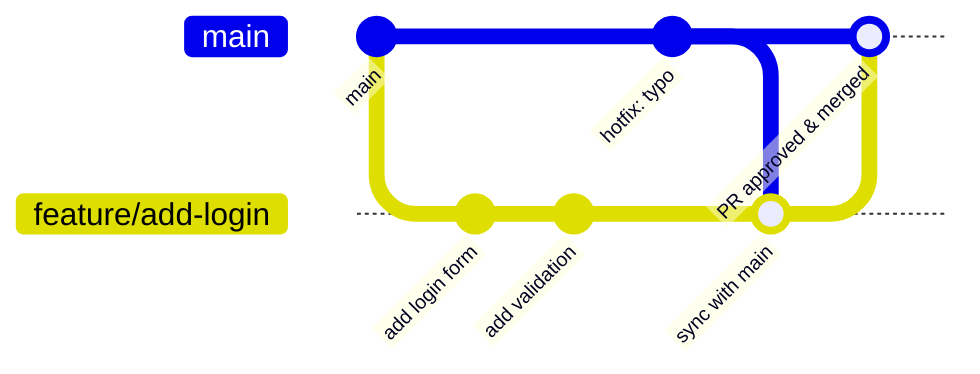
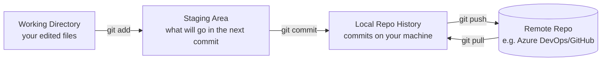

## Git & Version Control Basics

Git tracks every change ever made to the codebase, who made it, and why — it's what makes it possible for many engineers to work on the same code at once without overwriting each other.

## Core vocabulary

| Term | Plain-English meaning |
|---|---|
| **Repository (repo)** | The full project folder, plus its entire history of changes |
| **Commit** | A saved snapshot of changes, with a message describing what changed |
| **Branch** | An independent line of work, so you can build a feature without touching the working version of the code |
| **Merge** | Combining changes from one branch into another |
| **Pull Request (PR)** | A request to merge your branch into a shared branch, opened for teammates to review before it happens |
| **Merge conflict** | What happens when two branches changed the same lines and Git can't automatically decide which version wins — a human has to choose |

## A typical feature branch flow



## The three areas Git thinks in

Before the commands make sense, it helps to see the three places a change passes through:



## A day in the life, as commands

```bash
# Start a new feature from an up-to-date main
git checkout main
git pull origin main
git checkout -b feat/JIRA-123-add-login-form

# ... edit files ...
git status                        # see what changed
git add src/components/Login.tsx  # stage a specific file
git commit -m "feat: add login form"

# Keep your branch current with main as it moves
git fetch origin
git merge origin/main              # or: git rebase origin/main

# Push and open a PR
git push -u origin feat/JIRA-123-add-login-form
```

## What a merge conflict actually looks like

If your branch and `main` both changed the same line, Git stops and marks it in the file instead of guessing:

```text
<<<<<<< HEAD
const MAX_ITEMS = 10;
=======
const MAX_ITEMS = 25;
>>>>>>> origin/main
```

You edit the file to keep the correct value (deleting the `<<<<<<<`/`=======`/`>>>>>>>` markers), then:

```bash
git add path/to/file
git commit   # completes the merge
```

## Why branches and PRs matter here

- **`main` is always deployable.** This org uses [Trunk-Based Development](/engineering/git-branching) — `main` is the only long-lived branch, nobody commits to it directly, and there is no persistent `develop` branch. See the [CI/CD Pipeline](/coding-standards/ci-cd) for what runs automatically on every PR.
- **A PR is the review checkpoint.** This is where [Quality Gates](/quality-gates/code-quality) (test coverage, linting, security scans) are enforced before code can merge.
- **Small commits and small PRs are easier to review and safer to roll back** — this is principle #1 in [Vision & Principles](/vision-principles).

## Where this leads next

- [Git Hooks & Commits](/coding-standards/code-quality/git-hooks) — commit message conventions and pre-commit checks used in this org
- [CI/CD 101](/basics/ci-cd) — what happens automatically once you open a PR
