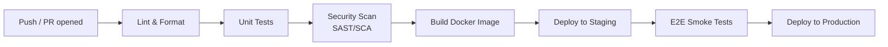

## CI/CD 101

**CI (Continuous Integration)** means every change is automatically built and tested as soon as it's pushed, so problems are caught in minutes, not weeks later. **CD (Continuous Delivery/Deployment)** extends that automation to actually releasing the change.

## Why this replaces manual steps

Before CI/CD, a person would manually run tests, build the app, and copy files to a server — slow and error-prone. A **pipeline** is a scripted, automatic sequence of these steps that runs the same way every time.

## A typical pipeline, stage by stage



| Stage | What it's checking |
|---|---|
| Lint & Format | Is the code style-consistent and free of obvious mistakes? |
| Unit Tests | Do individual functions/components behave correctly in isolation? |
| Security Scan | Any known-vulnerable dependencies or hardcoded secrets? |
| Build | Does the app actually compile/build into a deployable artifact? |
| Deploy to Staging | Can this run successfully in a production-like environment? |
| E2E Smoke Tests | Do the critical user flows still work end-to-end? |
| Deploy to Production | Ship it — to real users |

If any stage fails, the pipeline stops and the change does not move forward — this is what "quality gate" means in this playbook.

## What this looks like as actual pipeline config

```yaml
# .github/workflows/ci.yml (simplified)
name: CI
on: [pull_request]
jobs:
  build-and-test:
    runs-on: ubuntu-latest
    steps:
      - uses: actions/checkout@v4
      - uses: actions/setup-node@v4
        with: { node-version: 20, cache: 'npm' }
      - run: npm ci
      - run: npm run lint
      - run: npm run test:ci -- --coverage
      - run: npm audit --audit-level=high   # dependency (SCA) scan
      - run: docker build -t myapp:${{ github.sha }} .
```

Every line here is one of the boxes in the diagram above — this file *is* the pipeline, version-controlled alongside the application code it builds.

## Reading a pipeline run

When a PR is opened, you'll see something like this in the CI UI:

```text
✓ Lint & Format        (12s)
✓ Unit Tests           (48s)  — 87% coverage (min 80%)
✓ Security Scan        (22s)  — 0 critical, 1 moderate
✓ Build Docker Image   (35s)
✗ E2E Smoke Tests       (1m 04s) — 1 failed: "checkout flow"
```

A single red step blocks the merge — the PR cannot be approved-and-merged until "checkout flow" is fixed or confirmed as a flaky test to quarantine (see [Testing 101](/basics/testing)).

## Where this leads next

- [CI/CD Pipeline](/coding-standards/ci-cd) — the exact pipeline configuration and tooling used in this org
- [Quality Gates](/quality-gates/overview) — what specifically must pass at each stage
- [Deployment & Operations Overview](/operations/overview) — what happens after the pipeline succeeds
