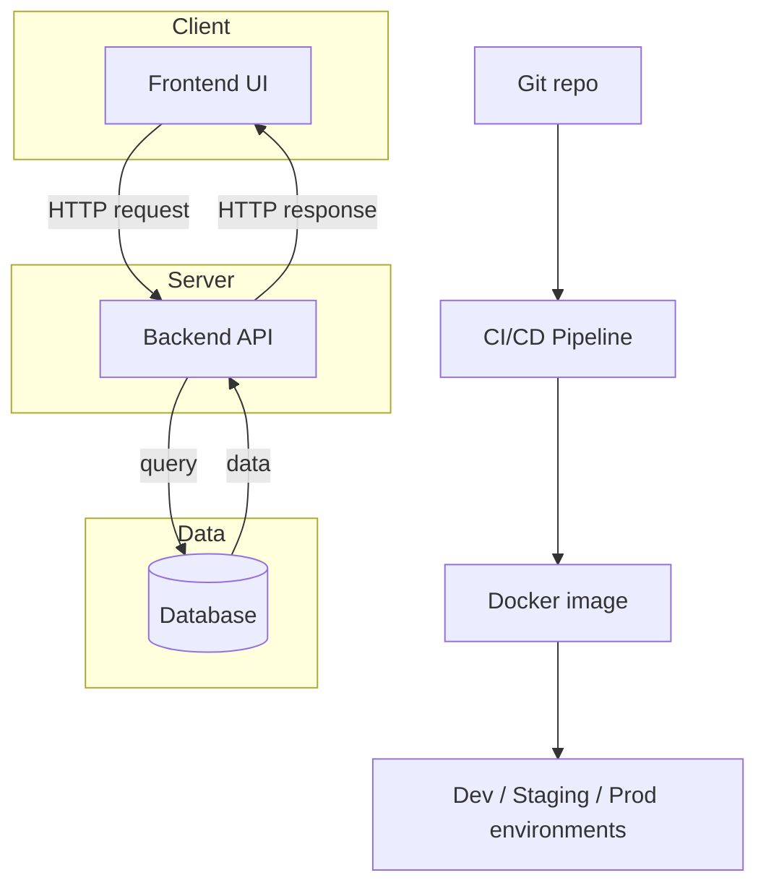

## Foundations

This section explains the foundational concepts referenced throughout the rest of the playbook — written for someone who is a capable programmer but new to full-stack delivery, cloud environments, or this org's tooling. Every other section in this playbook assumes you know this material; if a term ever feels unexplained elsewhere, it's probably explained here.

Each page is short, has at least one diagram or table, and ends with links to the "professional-level" pages that build on it.

## Pages in this section

| Page | What it covers |
|---|---|
| [Full-Stack Architecture 101](/basics/full-stack-architecture) | Client, server, database — how a web request actually flows |
| [Git & Version Control](/basics/git-version-control) | Commits, branches, pull requests, merge conflicts |
| [APIs & HTTP](/basics/apis-http) | REST, HTTP methods, status codes, authentication |
| [Databases 101](/basics/databases) | SQL vs NoSQL, schemas, migrations, ORMs |
| [Containers & Docker](/basics/docker) | Why containers exist, images vs containers |
| [CI/CD 101](/basics/ci-cd) | What a pipeline is and why builds are automated |
| [Environments & Cloud Basics](/basics/environments-cloud) | Dev/staging/production, environment variables, the cloud in plain terms |
| [Testing 101](/basics/testing) | The testing pyramid — unit, integration, E2E |
| [Security 101](/basics/security) | OWASP Top 10, SAST/SCA, CVEs — in plain language |
| [Glossary](/basics/glossary) | Every acronym used elsewhere in this playbook, defined in one place |

## How the pieces fit together

Read the pages above roughly in order — each one builds a little on the last — then head to [Delivery Lifecycle](/delivery-lifecycle/overview) to see how these pieces come together on a real project.
