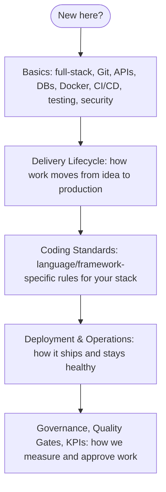

## Getting Started

## What is the Full Stack Delivery Playbook?

This is the single reference for how our engineering organization designs, builds, tests, secures, ships, and operates software. It exists so that no two teams have to independently reinvent the same decisions — which database to use, how a PR gets reviewed, what "done" means, how a production incident gets handled. Where a normal onboarding doc tells you *what* to click, this playbook tells you *why* we do things a certain way and *what the rule is* when you're not sure.

It is not a tutorial on programming in general — it assumes you already know how to write code in some language. What it *does* assume you might not know yet is how **our** delivery process, tooling, and standards fit together, which is what the [Basics](/basics/overview) section is for.

## Who is this for?

| You are... | Start here |
|---|---|
| **A fresher / new engineer** | [Basics](/basics/overview) first, then [Delivery Lifecycle](/delivery-lifecycle/overview) to see how a feature actually moves from idea to production |
| **An experienced engineer new to this org** | [Coding Standards](/coding-standards/overview) for your stack, then [Delivery Lifecycle](/delivery-lifecycle/overview) |
| **A tech lead / architect** | [Architecture Standards](/architecture/standards), [Governance](/governance/overview), [Quality Gates](/quality-gates/overview) |
| **A delivery manager / PM** | [Delivery Lifecycle](/delivery-lifecycle/overview), [KPIs & Metrics](/kpis/engineering-metrics), [Governance](/governance/overview) |
| **On-call / operating a live service** | [Deployment & Operations](/operations/overview), specifically [Incident Management](/operations/incident-management) and [Observability](/operations/observability) |

## How to navigate

The sidebar on the left is organized in roughly the order you'd encounter these concerns on a real project:

1. **Basics** — foundational concepts, written for zero prior context on *this org's* way of working.
2. **Delivery Lifecycle** — the end-to-end path a piece of work takes, from requirement intake through hypercare.
3. **Coding Standards** — the concrete, stack-specific rules (React, NestJS, PostgreSQL, etc.) you follow while building.
4. **Architecture** — cross-cutting structural decisions (monorepo vs polyrepo, event-driven patterns, API conventions).
5. **Deployment & Operations** — how code ships, and how we keep it running.
6. **Security Guardrails** — what must be true for a system to be considered secure.
7. **Quality Gates**, **Governance**, **KPIs** — how we measure and approve work at each stage.
8. **Project Onboarding**, **Documentation**, **Checklists** — practical templates and step-by-step references you'll come back to repeatedly.

If you only read one page beyond this one, read [Vision & Principles](/vision-principles) — it explains the "why" behind every rule in this playbook.
