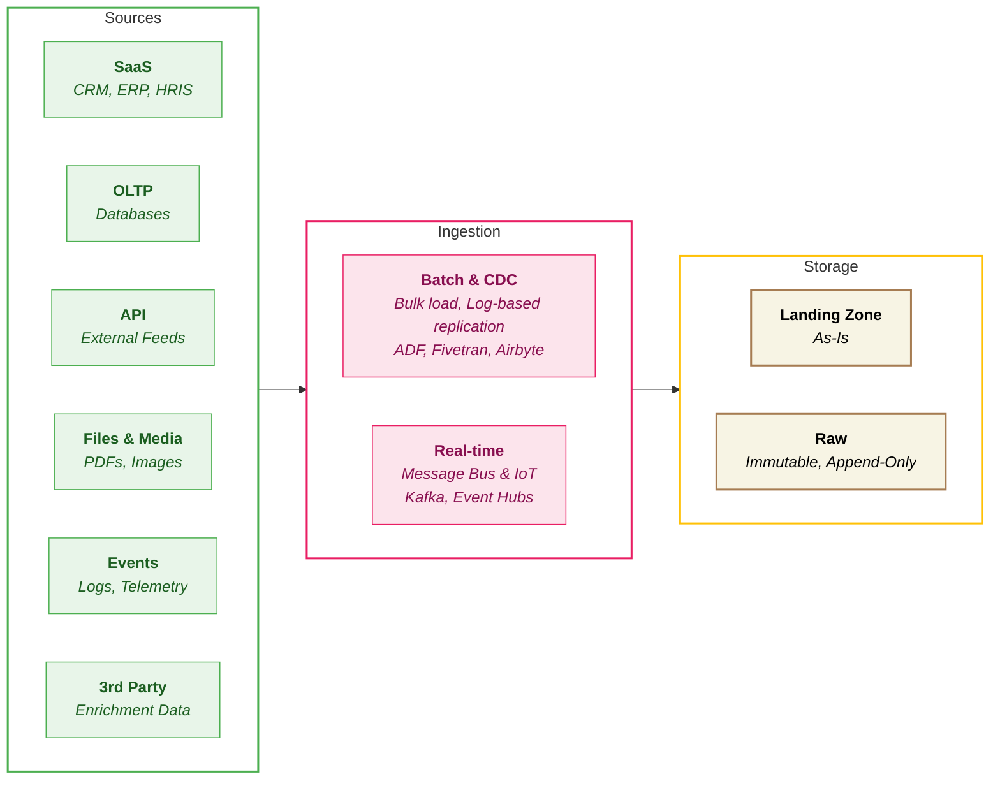

## Ingestion

**Data Ingestion** is the process of collecting and importing data from various source systems into your data platform. It's the "front door" of your data warehouse - how raw information from CRMs, databases, APIs, files, and event streams first enters the platform. Without reliable ingestion, nothing downstream works.

In simple terms: **ingestion answers the question, "How do we get the data in?"**

### Overview

**The Data Entry Point** - Ingestion is where data enters your platform. Get it wrong, and every downstream process inherits the problems. Get it right, and you've built a foundation for reliable analytics.

The ingestion layer captures data from source systems and lands it reliably in the platform. This includes batch extracts, real-time streams, change data capture, and handling of schema evolution.

<Callout type="question">How do we capture data from sources efficiently, reliably, and at the right latency?</Callout>

### Key Capabilities

| Capability | What it measures? | Why it matters? |
|------------|-----------------|----------------|
| **Batch Ingestion** | Ability to ingest large volumes of data on a scheduled or triggered basis | • Workhorse of most data platforms   • Even "real-time" platforms have 80%+ batch workloads |
| **Native Connectors** | Breadth and quality of pre-built connectors to common sources (i.e., Salesforce, NetSuite) | • Reduces development time and maintenance burden   • Missing connectors mean custom code |
| **Change Data Capture (CDC)** | Ability to capture row-level changes efficiently from transactional systems | • Enables efficient incremental processing   • Avoids full table scans   • Critical for large transactional sources |
| **Schema Evolution** | Mechanisms to detect, manage, and apply schema changes without breaking pipelines | • Source systems change frequently   • Broken pipelines create operational burden |
| **Error Handling & Retry** | Built-in support for detecting failures, retrying safely, and isolating bad records | • Ingestion failures are inevitable   • Graceful handling prevents data loss |
| **Streaming Ingestion** | Support for near real-time ingestion with low latency | • Fraud detection, live dashboards, operational alerts   • Requires sub-minute latency |

### Scoring Template

#### Capability Matrix

<CapabilityMatrix component="ingestion" />

#### Adjusting Weights for Client Context

| Client Profile | Adjust Weights |
|----------------|----------------|
| **Real-time focus** | Streaming + 30% |
| **Many SaaS sources** | Connectors + 30% |
| **Large transactional DBs** | CDC + 25% |
| **Simple file-based** | Batch + 35% |
| **High reliability needs** | Error Handling + 20% |

### Platform Comparison

<PlatformTabs>

<PlatformTabsFabric>

**Tools:** Data Factory pipelines, Dataflows Gen2, Notebooks, Event Streams

| Strengths | Limitations |
|-----------|-------------|
| Excellent connector coverage (~170+) in ADF, especially Microsoft ecosystem (Dynamics, SharePoint, SQL Server) | Streaming less flexible than Spark-based approaches |
| Low-code Dataflows Gen2 for simple ingestion | Complex CDC scenarios require more configuration |
| Event Streams for Kafka-compatible streaming | Event Streams is newer, less mature than competitors |

**Best for:** Microsoft-centric sources, low-code ingestion, Power Platform integration

| Sub-Capability | Score | Rationale |
|----------------|-------|-----------|
| Batch Ingestion | 5 | Dataflows Gen2 and Data Factory provide robust batch ingestion with low setup effort |
| Native Connectors | 5 | Excellent coverage across Microsoft SaaS, SQL, files, and cloud services |
| CDC Support | 4 | Supported via Data Factory; complex scenarios require configuration |
| Schema Evolution | 4 | Handles additive changes well; complex changes need manual handling |
| Error Handling | 4 | Good retry and monitoring through pipelines and logging |
| Streaming Ingestion | 4 | Event Streams and Event Hub integration are strong but less flexible than Spark |

</PlatformTabsFabric>

<PlatformTabsDatabricks>

**Tools:** Auto Loader, Lakeflow Connect (latest product), Structured Streaming, Fabric ADF (applicable for only if cloud is Azure)

| Strengths | Limitations |
|-----------|-------------|
| Auto Loader provides scalable file ingestion with automatic schema inference from Cloud Storage | Requires Spark expertise for optimal configuration |
| Lakeflow provides connectors to well-known SaaS, Databases, still evolving | Connector ecosystem relies more on partners (Fivetran, Airbyte) |
| Best-in-class CDC with Delta Lake merge capabilities | Higher complexity for simple batch scenarios |
| Schema evolution built into Delta format | |
| Structured Streaming for production-grade stream processing | |

**Best for:** High-volume streaming, complex CDC, data engineering teams with Spark skills

| Sub-Capability | Score | Rationale |
|----------------|-------|-----------|
| Batch Ingestion | 5 | Auto Loader handles file ingestion at scale with schema inference |
| Native Connectors | 3 | Good coverage; Lakeflow connect supports ~20 connectors and still evolving, often augmented with Fivetran/Airbyte |
| CDC Support | 4 | Delta Lake merge operations provide best-in-class CDC handling |
| Schema Evolution | 5 | Delta format natively supports schema evolution |
| Error Handling | 4 | Configurable through Spark; requires engineering |
| Streaming Ingestion | 5 | Structured Streaming is production-grade with exactly-once semantics |

</PlatformTabsDatabricks>

<PlatformTabsSnowflake>

**Tools:** Snowpipe, OpenFlow, Snowpipe Streaming, partner integrations (Fivetran, Airbyte), Fabric ADF (applicable for only if cloud is Azure)

| Strengths | Limitations |
|-----------|-------------|
| Snowpipe provides simple, serverless file ingestion | Native streaming is newer and less mature |
| Excellent partner ecosystem for managed connectors | Heavy reliance on partners for connector breadth |
| OpenFlow provides ~20 connectors, requires BYOC setup and still evolving | Log-based CDC typically requires external tooling |

**Best for:** SQL-centric teams, partner-managed ingestion, simpler streaming needs

| Sub-Capability | Score | Rationale |
|----------------|-------|-----------|
| Batch Ingestion | 3 | Snowpipe is simple and effective; less flexible than Spark-based |
| Native Connectors | 2 | Partner ecosystem (Fivetran, Airbyte) provides excellent coverage |
| CDC Support | 2 | Supported through partners; native CDC less developed |
| Schema Evolution | 4 | Handled well but requires more manual intervention |
| Error Handling | 2 | Good error logging and retry capabilities |
| Streaming Ingestion | 3 | Snowpipe Streaming is improving but less mature than alternatives |

</PlatformTabsSnowflake>

</PlatformTabs>

### Key Considerations

#### Ingestion Complexity vs Operational Overhead

| Platform | Complexity | Overhead | Trade-off |
|----------|------------|----------|-----------|
| **Fabric** | <RatingBadge rating="Low" /> | <RatingBadge rating="Low" /> | Less flexible but simpler to operate |
| **Databricks** | <RatingBadge rating="High" /> | <RatingBadge rating="Medium" /> | Maximum flexibility requires engineering |
| **Snowflake** | <RatingBadge rating="Low" /> | <RatingBadge rating="Low" /> | Partner dependency for complex scenarios **with additional cost** |

#### Cost at Scale

| Platform | Batch Cost | Streaming Cost | Notes |
|----------|------------|----------------|-------|
| **Fabric** | <RatingBadge rating="Medium" /> Capacity-based | <RatingBadge rating="Medium" /> Capacity-based | Predictable but requires capacity planning |
| **Databricks** | <RatingBadge rating="High" /> Usage-based | <RatingBadge rating="High" /> Usage-based | Can spike; requires monitoring |
| **Snowflake** | <RatingBadge rating="Low" /> Credits | <RatingBadge rating="Medium" /> Credits + Partner | Snowpipe is efficient; partners add cost |

#### Integration with Orchestration and Lineage

| Platform | Orchestration Integration | Lineage Visibility |
|----------|--------------------------|-------------------|
| **Fabric** | <RatingBadge rating="Easy" /> Native Data Factory | <RatingBadge rating="Easy" /> Purview integration |
| **Databricks** | <RatingBadge rating="Medium" /> Workflows, external | <RatingBadge rating="Easy" /> Unity Catalog |
| **Snowflake** | <RatingBadge rating="Hard" /> External (Airflow, Dagster etc.) | <RatingBadge rating="Medium" /> Horizon, partner tools |
