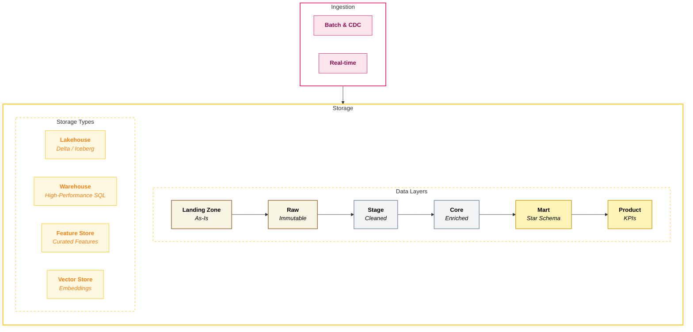

## Storage

**Storage** is where your data physically lives - the databases, data lakes, and warehouses that hold everything from raw source extracts to polished business-ready tables. Storage decisions have long-lasting implications: data format choices affect portability, versioning affects audit capability, and architecture affects cost at scale.

In simple terms: **storage answers the question, "Where does the data live?"**

### Overview

**The Foundation Layer** - Storage decisions have long-lasting implications. Data format choices affect portability, versioning affects audit capability, and architecture affects cost at scale.

The storage layer persists data with reliability, efficiency, and appropriate governance. Modern platforms have evolved beyond simple file storage to include ACID transactions, time travel, and zero-copy cloning.

<Callout type="question">How do we store data efficiently, reliably, and in a way that supports future flexibility?</Callout>

### Key Capabilities

| Capability | What it measures? | Why it matters? |
|------------|-----------------|----------------|
| **Data Format Support** | Breadth of support for structured, semi-structured, and unstructured data formats | • Structured data is the foundation of analytics and reporting   • Semi-structured (JSON, XML, Avro) is critical for modern APIs and event data   • Unstructured (images, PDFs, audio) enables AI/ML and GenAI use cases |
| **Separation of Storage and Compute** | Architectural separation allowing independent scaling | • Enables cost optimisation   • Flexible scaling strategies   • Pay for compute only when processing |
| **Versioning & Time Travel** | Native support for accessing historical versions of data | • Enables debugging and root cause analysis   • Supports audit compliance   • Recovery from errors without backups |
| **Cloning & Data Sharing** | Ability to create zero-copy or low-cost copies of datasets | • Efficient dev/test environments   • Experimentation without storage cost multiplication |
| **ACID Transactions** | Ability to support concurrent reads and writes with transactional guarantees | • Prevents data corruption from concurrent operations   • Critical for multi-user, multi-workload environments |

### Scoring Template

#### Capability Matrix

<CapabilityMatrix component="storage" />

#### Adjusting Weights for Client Context

| Client Profile | Adjust Weights |
|----------------|----------------|
| **AI/ML & unstructured data** | Data Format Support + 35% |
| **Heavy dev/test needs / Data Sharing** | Cloning & Data Sharing + 25% |
| **Regulatory / Audit** | Time Travel + 30% |
| **Cost-sensitive** | Storage/Compute Separation + 30% |
### Platform Comparison

<PlatformTabs>

<PlatformTabsFabric>

**Tools:** OneLake, Delta format, BLOB Storage

| Strengths | Limitations |
|-----------|-------------|
| OneLake provides unified storage across all Fabric workloads | OneLake is Azure-only (multi-cloud limited) |
| Delta format enables ACID and time travel | Versioning retention tied to capacity |
| Automatic data discovery and cataloging | External sharing capabilities still maturing |
| Shortcuts enable access to external data without copying | |

**Best for:** Microsoft-unified analytics, Power BI integration, Azure-first organisations

| Sub-Capability | Score | Rationale |
|----------------|-------|-----------|
| Data Format Support | 5 | Strong structured and semi-structured support; unstructured via OneLake + Azure services |
| ACID Transactions | 5 | Full ACID support through Delta |
| Time Travel | 4 | Supported via Delta; retention tied to capacity |
| Cloning | 4 | Supported; less mature than competitors |
| Storage/Compute Separation | 5 | OneLake separates storage; compute tied to capacity |

</PlatformTabsFabric>

<PlatformTabsDatabricks>

**Tools:** Delta Lake on ADLS/S3/GCS

| Strengths | Limitations |
|-----------|-------------|
| Delta Lake is open source and portable | More complex architecture to configure |
| Best-in-class time travel with configurable retention | |
| Zero-copy clones for efficient dev/test | |
| Multi-cloud support (Azure, AWS, GCP) | |

**Best for:** Open data lakehouse, multi-cloud, maximum portability

| Sub-Capability | Score | Rationale |
|----------------|-------|-----------|
| Data Format Support | 5 | Excellent across all formats; native support for structured, semi-structured, and unstructured in Unity Catalog volumes |
| ACID Transactions | 5 | Full ACID with Delta Lake |
| Time Travel | 5 | Configurable retention, efficient versioning |
| Cloning | 5 | Zero-copy clones, shallow clones for dev/test |
| Storage/Compute Separation | 5 | True separation; data on cloud storage, compute on clusters |

</PlatformTabsDatabricks>

<PlatformTabsSnowflake>

**Tools:** Snowflake-managed storage

| Strengths | Limitations |
|-----------|-------------|
| Fully managed storage with no infrastructure concerns | Proprietary storage format (not directly portable) |
| Excellent time travel (up to 90 days on Enterprise) | Data must be loaded into Snowflake (no external tables until recently) |
| Zero-copy cloning built-in | Cross-cloud data sharing has limitations |
| Native data sharing with Snowflake Marketplace | |
| Automatic clustering and optimisation | |

**Best for:** Managed simplicity, data sharing use cases, SQL-centric workloads

| Sub-Capability | Score | Rationale |
|----------------|-------|-----------|
| Data Format Support | 4 | Strong structured and semi-structured (VARIANT type); unstructured support via directory tables and file URLs |
| ACID Transactions | 5 | Full ACID, production-proven |
| Time Travel | 5 | Up to 90 days; Fail-safe adds 7 days |
| Cloning | 5 | Zero-copy cloning is best-in-class |
| Storage/Compute Separation | 5 | True separation; virtual warehouses scale independently |

</PlatformTabsSnowflake>

</PlatformTabs>

### Key Considerations

#### Lock-in vs Portability

| Platform | Lock-in Risk | Portability Path |
|----------|--------------|------------------|
| **Fabric** | <RatingBadge rating="Medium" /> | Data in Delta on ADLS; tooling is Microsoft-specific |
| **Databricks** | <RatingBadge rating="Low" /> | Delta Lake is open; data portable to any Parquet reader |
| **Snowflake** | <RatingBadge rating="High" /> | Data must be exported; internal format not directly readable |

#### Cost of Data Versioning

| Platform | Time Travel Storage | Cost Implication |
|----------|---------------------|------------------|
| **Fabric** | <RatingBadge rating="Low" /> Included in capacity | Predictable but capacity-limited |
| **Databricks** | <RatingBadge rating="Medium" /> Configurable | Pay for storage; can optimise retention |
| **Snowflake** | <RatingBadge rating="Medium" /> Automatic (1-90 days) | Included but adds to storage cost |

#### Cross-Workspace / Cross-Tenant Access

| Platform | Internal Sharing | External Sharing |
|----------|------------------|------------------|
| **Fabric** | <RatingBadge rating="Medium" /> OneLake shortcuts | <RatingBadge rating="Hard" /> Maturing |
| **Databricks** | <RatingBadge rating="Easy" /> Unity Catalog | <RatingBadge rating="Easy" /> Delta Sharing (open protocol) |
| **Snowflake** | <RatingBadge rating="Easy" /> Native sharing | <RatingBadge rating="Easy" /> Snowflake Marketplace, secure sharing |
