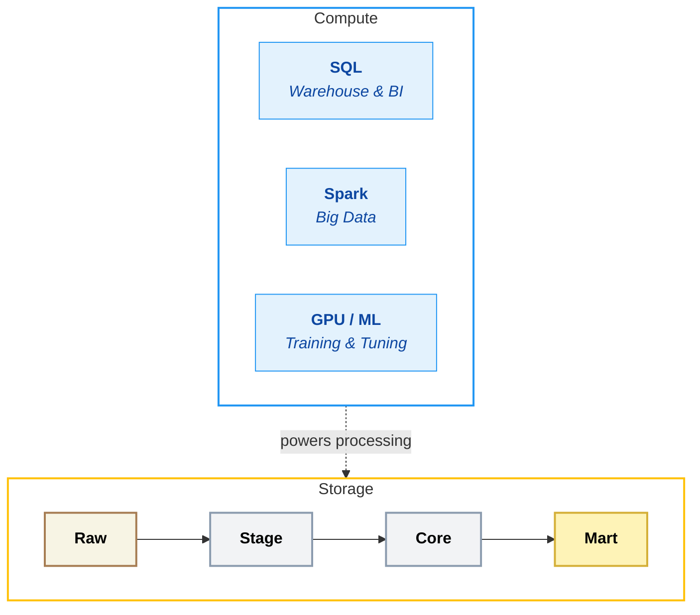

## Compute

**Compute** is the processing power used to query, transform, and analyse data. It's where work actually happens on your platform - from running SQL queries and Spark jobs to training ML models. Together with storage, compute forms the engine room of your data platform.

In simple terms: **compute answers the question, "What power do we use to process it?"**

### Overview

**The Engine of Your Platform** - Compute is where work happens. Get it right, and workloads run fast at reasonable cost. Get it wrong, and you're either overpaying for idle resources or watching jobs timeout during critical windows.

The compute layer executes workloads with appropriate performance and cost. This includes elastic scaling, workload isolation, and the ability to control and attribute costs across teams and use cases.

<Callout type="question">How do we execute workloads efficiently, at the right scale, with predictable and controllable cost?</Callout>

### Key Capabilities

| Capability | What it measures? | Why it matters? |
|------------|-----------------|----------------|
| **Elastic Scaling** | Ability to dynamically scale compute resources based on workload demand | • Avoids paying for idle capacity   • Prevents resource exhaustion during peaks   • Optimises both cost and performance |
| **Workload Isolation** | Ability to separate different workloads to prevent resource contention | • Dev workload won't impact production environment • Runaway queries can't bring down the platform   • One team's experiment won't impact another's production |
| **Job vs Interactive Compute** | Distinction between scheduled, repeatable workloads and ad-hoc interactive analysis | • Interactive clusters for batch = wasted money   • Job clusters for exploration = frustrated users   • Right-sizing requires workload awareness |
| **Cold Start Performance** | Time taken to provision compute resources when workloads start | • Long cold starts frustrate interactive users   • Can cause orchestration timeouts   • Serverless and warm pools mitigate at cost |
| **Cost Attribution & Control** | Granularity of cost tracking and control across teams, workloads, and environments | • Without attribution, nobody owns spend   • Without controls, costs spiral   • Finance and engineering need shared visibility |

### Scoring Template

#### Capability Matrix

<CapabilityMatrix component="compute" />

#### Adjusting Weights for Client Context

| Client Profile | Adjust Weights |
|----------------|----------------|
| **Highly variable workloads** | Elastic Scaling + 35% |
| **Multiple teams sharing** | Workload Isolation + 35% |
| **Interactive users critical** | Cold Start + 25% |
| **PE/Finance pressure** | Cost Attribution + 30% |
| **Batch-dominant** | Job vs Interactive + 25% |

### Platform Comparison

<PlatformTabs>

<PlatformTabsFabric>

**Tools:** Capacity Units (CU), Spark pools, SQL endpoint

| Strengths | Limitations |
|-----------|-------------|
| Predictable capacity-based pricing | Less flexibility than usage-based |
| No cluster management | Capacity limits can constrain burst workloads |
| Automatic optimisation within capacity | Workloads share capacity (contention possible) |
| Power BI included in capacity | Scaling means changing capacity tier |
| Pause/resume for dev capacities | |

**Best for:** Predictable workloads, Power BI-heavy, cost predictability required

| Sub-Capability | Score | Rationale |
|----------------|-------|-----------|
| Elastic Scaling | 4 | Within capacity; tier changes for more |
| Workload Isolation | 4 | Capacity allocation, some sharing |
| Job vs Interactive | 4 | Both supported, capacity shared |
| Cold Start | 4 | Generally fast within capacity |
| Cost Attribution | 4 | Capacity-based tracking, workspace visibility |

</PlatformTabsFabric>

<PlatformTabsDatabricks>

**Tools:** Job clusters, Interactive clusters, SQL Warehouses, Serverless

| Strengths | Limitations |
|-----------|-------------|
| Maximum flexibility in cluster configuration | Complexity in cluster configuration |
| Job clusters for cost-efficient batch | Cold start for non-serverless (mitigated by pools) |
| SQL Warehouses for BI workloads | Cost can spike without monitoring |
| Serverless options reducing cold start | Requires understanding of cluster sizing |
| Spot instances for significant savings | |
| Granular DBU tracking | |

**Best for:** Variable workloads, maximum flexibility, cost-conscious with expertise

| Sub-Capability | Score | Rationale |
|----------------|-------|-----------|
| Elastic Scaling | 5 | Auto-scaling clusters, serverless |
| Workload Isolation | 5 | Separate clusters per workload type |
| Job vs Interactive | 5 | Clear separation, optimised for each |
| Cold Start | 4 | Pools help; serverless near-instant |
| Cost Attribution | 5 | Per-cluster, per-job DBU tracking |

</PlatformTabsDatabricks>

<PlatformTabsSnowflake>

**Tools:** Virtual Warehouses (XS to 6XL), Multi-cluster warehouses

| Strengths | Limitations |
|-----------|-------------|
| Instant scaling (seconds) | Warehouse sizing requires tuning |
| True storage/compute separation | Less flexibility than Spark clusters |
| Per-warehouse cost control | Credit-based can be hard to forecast initially |
| Auto-suspend/resume | |
| Multi-cluster for concurrency | |
| No cluster management | |

**Best for:** SQL workloads, instant scaling needs, operational simplicity

| Sub-Capability | Score | Rationale |
|----------------|-------|-----------|
| Elastic Scaling | 5 | Instant scaling, multi-cluster |
| Workload Isolation | 5 | Separate warehouses, complete isolation |
| Job vs Interactive | 5 | Different warehouses for different uses |
| Cold Start | 5 | Near-instant warehouse startup |
| Cost Attribution | 5 | Per-warehouse, per-query attribution |

</PlatformTabsSnowflake>

</PlatformTabs>

### Key Considerations

#### Capacity Planning

| Platform | Approach |
|----------|----------|
| **Fabric** | <RatingBadge rating="Easy" /> Forecast peak capacity needs, select tier |
| **Databricks** | <RatingBadge rating="Medium" /> Estimate DBU consumption, set budgets |
| **Snowflake** | <RatingBadge rating="Medium" /> Estimate credit usage, set resource monitors |

#### Burst Handling

| Platform | Burst Capability |
|----------|------------------|
| **Fabric** | <RatingBadge rating="Hard" /> Limited by capacity tier |
| **Databricks** | <RatingBadge rating="Easy" /> Auto-scaling up to max workers |
| **Snowflake** | <RatingBadge rating="Easy" /> Instant scaling, multi-cluster |

#### Multi-Team Environments

| Platform | Isolation Approach |
|----------|-------------------|
| **Fabric** | <RatingBadge rating="Medium" /> Workspaces share capacity |
| **Databricks** | <RatingBadge rating="Easy" /> Separate clusters/warehouses per team |
| **Snowflake** | <RatingBadge rating="Easy" /> Separate warehouses per team |
