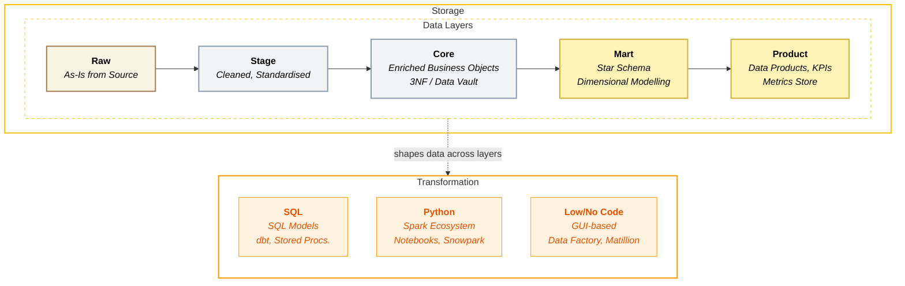

## Transformation

**Data Transformation** is the process of converting raw, messy data into clean, structured, and meaningful information that the business can actually use. It's where raw numbers and text from source systems get cleaned, combined, enriched, and shaped into tables that answer real business questions.

In simple terms: **transformation answers the question, "How do we turn raw data into useful insights?"**

### Overview

**Where Data Becomes Insight** - Transformation is where raw data becomes business value. The right platform makes transformations readable, testable, and maintainable. The wrong platform creates a maze of unmaintainable code.

The transformation layer models and refines data for analytical consumption. This includes SQL-based transformations, incremental processing patterns, dependency management, and data quality enforcement.

<Callout type="question">How do we model and refine data efficiently, maintainably, and with confidence in quality?</Callout>

### Key Capabilities

| Capability | What it measures? | Why it matters? |
|------------|-----------------|----------------|
| **SQL-First Transformation** | Ability to express the majority of transformations in SQL, optimised for readability and collaboration | • SQL is the lingua franca of data   • Readable by analysts, reviewable by business   • Maintainable long-term |
| **Non-SQL Processing** | Support for Python, Spark, or other languages for complex transformations | • ML feature engineering, complex parsing, API calls require code   • Should support without abandoning SQL-first principles |
| **dbt Integration** | Quality of dbt adapter, dbt Cloud support, and maturity of the dbt ecosystem on the platform | • dbt is the industry standard for SQL transformation   • Mature adapters reduce friction and bugs   • dbt Cloud enables managed orchestration and CI |
| **Performance Optimisation** | Platform capabilities for query acceleration, caching, clustering, and materialized views | • Transformation performance directly impacts pipeline SLAs   • Good optimisation reduces compute cost at scale   • Automatic tuning reduces engineering burden |
| **Testing & Data Quality** | Native or integrated support for data validation and business rule enforcement | • Untested transformations produce untrusted data   • Catches issues before they reach dashboards and decisions |

### Scoring Template

#### Capability Matrix

<CapabilityMatrix component="transformation" />

#### Adjusting Weights for Client Context

| Client Profile | Adjust Weights |
|----------------|----------------|
| **SQL-only team** | SQL-First + 45%, Non-SQL - 5% |
| **Complex ML features** | Non-SQL + 30%, SQL-First - 20% |
| **Large data volumes** | Performance Optimisation + 35% |
| **dbt-heavy workflows** | dbt Integration + 25% |
| **Quality-critical** | Testing + 25% |

### Platform Comparison

<PlatformTabs>

<PlatformTabsFabric>

**Tools:** Warehouse (T-SQL), Lakehouse (Spark SQL), Notebooks, dbt (supported)

| Strengths | Limitations |
|-----------|-------------|
| T-SQL Warehouse familiar to SQL Server teams | Spark less mature than Databricks |
| Spark SQL in Lakehouse for complex transformations | dbt integration newer than competitors |
| dbt Core integration supported | Some T-SQL differences from SQL Server |
| V-Order optimisation for efficient reads | Materialized views limited compared to competitors |
| Direct Lake mode eliminates data duplication for Power BI | No automatic clustering or search optimisation |

**Best for:** SQL Server teams, Power BI-centric analytics, Microsoft ecosystem

| Sub-Capability | Score | Rationale |
|----------------|-------|-----------|
| SQL-First | 5 | T-SQL Warehouse excellent, Spark SQL in Lakehouse |
| Non-SQL Processing | 4 | PySpark in notebooks, less mature than Databricks |
| Performance Optimisation | 4 | V-Order optimisation, Direct Lake mode; materialized views limited |
| dbt Core Integration | 4 | Supported adapter, newer and developing |
| Testing & Quality | 4 | dbt tests, native validation improving |

</PlatformTabsFabric>

<PlatformTabsDatabricks>

**Tools:** Spark SQL, PySpark, Delta Live Tables, dbt

| Strengths | Limitations |
|-----------|-------------|
| Best-in-class Spark implementation | Full capability requires Python/Spark skills |
| Delta Live Tables for declarative pipelines | More complex than pure SQL platforms |
| Excellent dbt Core integration | Over-powered for simple transformations |
| Adaptive query execution optimises at runtime | Tuning (Z-order, liquid clustering) requires engineering knowledge |
| Liquid clustering and Z-ordering for data layout optimisation | |

**Best for:** Complex transformations, large-scale processing, data engineering teams

| Sub-Capability | Score | Rationale |
|----------------|-------|-----------|
| SQL-First | 4 | Spark SQL strong but Python often needed for full value |
| Non-SQL Processing | 5 | Native PySpark, Scala, best-in-class |
| Performance Optimisation | 5 | Adaptive query execution, Z-ordering, liquid clustering, materialized views |
| dbt Core Integration | 5 | Mature adapter, excellent dbt Cloud support |
| Testing & Quality | 5 | DLT expectations, dbt tests, quality gates |

</PlatformTabsDatabricks>

<PlatformTabsSnowflake>

**Tools:** Snowflake SQL, Snowpark (Python/Java/Scala), dbt

| Strengths | Limitations |
|-----------|-------------|
| Best-in-class SQL experience | Snowpark less mature than PySpark |
| Excellent dbt Core integration (most mature) | Non-SQL requires Snowpark learning |
| Automatic clustering reduces manual tuning | Tasks limited for complex orchestration |
| Materialized views and result caching built-in | Clustering costs can be significant on large tables |
| Search optimisation for point lookups | |

**Best for:** SQL-centric teams, dbt-heavy workflows, moderate complexity

| Sub-Capability | Score | Rationale |
|----------------|-------|-----------|
| SQL-First | 5 | Best-in-class SQL, highly optimised |
| Non-SQL Processing | 4 | Snowpark capable but less mature than Spark |
| Performance Optimisation | 5 | Automatic clustering, materialized views, result caching, search optimisation |
| dbt Core Integration | 5 | Most mature adapter, best-in-class dbt integration |
| Testing & Quality | 5 | dbt tests, constraints, quality mature |

</PlatformTabsSnowflake>

</PlatformTabs>

### dbt Core Integration Comparison

dbt is the standard transformation framework. Here's how each platform supports it:

| Aspect | Fabric | Databricks | Snowflake |
|--------|--------|------------|-----------|
| **Adapter Maturity** | Developing | Most Mature | Most mature |
| **Incremental Models** | Supported | Excellent | Excellent |
| **Snapshots** | Supported | Supported | Supported |
| **Testing** | Full support | Full support | Full support |
| **Orchestration** | Data Factory  (preview) | Workflows | Tasks |
| **Documentation** | Supported | Supported | Supported |
| **dbt Cloud** | Supported | Supported | Supported |

**dbt Core** is the preferred option, unless the client is already using **dbt Cloud**

### Key Considerations

#### Readability & Maintainability

| Platform | Approach | Trade-off |
|----------|----------|-----------|
| **Fabric** | <RatingBadge rating="Easy" /> T-SQL familiar to many | Some differences from SQL Server |
| **Databricks** | <RatingBadge rating="Medium" /> Powerful but complex | Requires Spark knowledge |
| **Snowflake** | <RatingBadge rating="Easy" /> Clean SQL | Snowpark learning curve for Python |

#### Collaboration Between Engineers and Analysts

| Platform | Engineer Experience | Analyst Experience |
|----------|--------------------|--------------------|
| **Fabric** | <RatingBadge rating="Medium" /> Good (familiar tools) | <RatingBadge rating="Medium" /> Good (T-SQL, Power Query) |
| **Databricks** | <RatingBadge rating="Easy" /> Excellent (full control) | <RatingBadge rating="Medium" /> Moderate (SQL Warehouses) |
| **Snowflake** | <RatingBadge rating="Medium" /> Good (SQL + Snowpark) | <RatingBadge rating="Easy" /> Excellent (pure SQL) |

### Decision Guidance

| Fabric | Databricks | Snowflake |
|--------|------------|-----------|
| Team is SQL Server experienced | Complex transformations requiring Spark | SQL-centric team, minimal Python |
| Power BI is primary consumption layer | Large data volumes needing distributed processing | dbt is or will be the transformation standard |
| Transformation complexity is moderate | Team has Python/Spark skills | Transformation patterns are well-established |
| Microsoft ecosystem alignment | ML feature engineering integrated with transforms | Query performance is critical |
