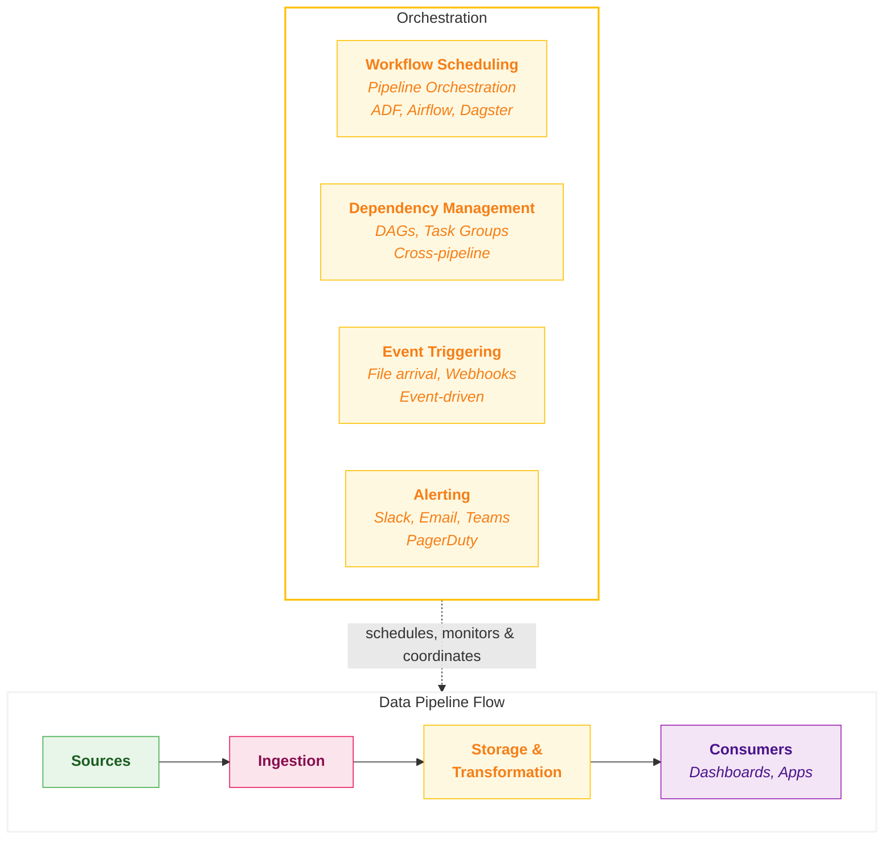

## Orchestration

**Orchestration** is the coordination layer that ensures all parts of your data platform run in the right order, at the right time, and recover gracefully when something goes wrong. It's like a conductor in an orchestra - it doesn't play any instrument itself, but ensures every section comes in at the right moment.

In simple terms: **orchestration answers the question, "When does each pipeline run, in what order, and what happens when something fails?"**

### Overview

**The Conductor of Data** - Orchestration ensures the right data flows to the right place at the right time. Without it, pipelines are fragile, failures cascade, and nobody knows what's running or why it failed.

The orchestration layer coordinates, schedules, and monitors data workflows. This includes defining dependencies, handling failures, and providing operational visibility into pipeline health.

<Callout type="question">How do we ensure pipelines run reliably, recover from failures gracefully, and provide visibility into data freshness?</Callout>

### Key Capabilities

| Capability | What it measures? | Why it matters? |
|------------|-----------------|----------------|
| **DAG Definition & Visualisation** | Ability to define pipelines as directed acyclic graphs and visualise dependencies | • Prevents pipelines running in wrong order   • Avoids stale data and unpredictable failures   • Visual DAGs make debugging intuitive |
| **End-to-End Pipeline** | Ability to orchestrate across ingestion, transformation, and downstream BI refresh in a single workflow | • Real pipelines span ingestion → transformation → BI refresh   • Gaps require glue code or external tools   • Native coverage reduces operational burden |
| **Scheduling & Triggers** | Support for time-based, event-based, and dependency-based execution | • Batch runs on schedule   • Real-time on events   • Downstream on dependency |
| **Operational Observability** | Visibility into pipeline execution, runtimes, failures, and bottlenecks | • "Is the data fresh?" is asked daily   • Good observability answers it instantly |
| **Retry & Failure Handling** | Configurable retry logic, backoff strategies, and failure notifications | • Failures are inevitable   • Good orchestration recovers automatically   • Alerts humans when recovery fails |

### Scoring Template

#### Capability Matrix

<CapabilityMatrix component="orchestration" />

#### Adjusting Weights for Client Context

| Client Profile | Adjust Weights |
|----------------|----------------|
| **Complex dependencies** | DAG Definition + 40% |
| **Real-time triggers** | Scheduling + 30% |
| **High reliability needs** | Retry & Failure + 35% |
| **Ops-heavy team** | Observability + 30% |
| **Full pipeline coverage** | End-to-End Pipeline + 20% |

### Platform Comparison

<PlatformTabs>

<PlatformTabsFabric>

**Tools:** Data Factory pipelines (native)

| Strengths | Limitations |
|-----------|-------------|
| Visual pipeline designer | Less flexible than code-based orchestrators |
| Familiar to Azure Data Factory users | Complex branching can be cumbersome |
| Single pipeline spans ingestion, transformation, and Power BI refresh | Cross-workspace orchestration requires care |
| Copy activities, dataflows, notebooks, and dataset refresh in same pipeline | |
| Built-in monitoring and alerting | |

**Best for:** Microsoft ecosystem, visual pipeline design, moderate complexity

| Sub-Capability | Score | Rationale |
|----------------|-------|-----------|
| DAG Definition | 4 | Visual DAG, good for moderate complexity |
| End-to-End Pipeline | 5 | Single pipeline spans ingestion, transformation, and Power BI dataset refresh natively |
| Scheduling | 5 | Time, tumbling window, event triggers |
| Observability | 4 | Pipeline monitoring, run history |
| Retry & Failure | 4 | Configurable retry, failure paths |

</PlatformTabsFabric>

<PlatformTabsDatabricks>

**Tools:** Workflows (native), integrates with Airflow, Dagster

| Strengths | Limitations |
|-----------|-------------|
| Native Workflows sufficient for most cases | Native orchestration less feature-rich than dedicated tools |
| Excellent external orchestrator integration | BI refresh requires API calls or external triggers |
| Job clusters for cost-efficient scheduled runs | UI less intuitive than visual designers |
| Multi-task jobs chain ingestion and transformation | No native BI tool refresh (Power BI, Tableau) |
| API-driven for automation | |

**Best for:** Data engineering teams, complex workflows, external orchestrator integration

| Sub-Capability | Score | Rationale |
|----------------|-------|-----------|
| DAG Definition | 4 | Multi-task jobs, dependencies, API-driven |
| End-to-End Pipeline | 4 | Workflows chain ingestion and transformation; BI refresh requires API calls or external triggers |
| Scheduling | 4 | Cron, file triggers, continuous |
| Observability | 4 | Run history, metrics, logs |
| Retry & Failure | 4 | Configurable, task-level retry |

</PlatformTabsDatabricks>

<PlatformTabsSnowflake>

**Tools:** Tasks (native), Streams for triggers, external orchestrators (Airflow, Dagster)

| Strengths | Limitations |
|-----------|-------------|
| Tasks work for simple sequential workflows | Native Tasks limited for complex DAGs |
| Stream-triggered tasks for CDC patterns | Most production deployments use external orchestrator |
| Serverless task execution | No native ingestion or BI refresh orchestration |
| External orchestrator integration mature | Ingestion and BI refresh require external tools |

**Best for:** Simple workflows native, complex workflows with external orchestrator

| Sub-Capability | Score | Rationale |
|----------------|-------|-----------|
| DAG Definition | 3 | Tasks are basic, complex needs external |
| End-to-End Pipeline | 3 | Tasks handle SQL chains; ingestion and BI refresh typically require external orchestration |
| Scheduling | 3 | Cron, stream-triggered |
| Observability | 3 | Task history available, less rich than others |
| Retry & Failure | 3 | Basic retry, manual intervention often needed |

</PlatformTabsSnowflake>

</PlatformTabs>

### Native vs External Orchestration

A critical decision is whether to use native platform orchestration or an external tool.

#### Comparison

| Aspect | Native Orchestration | External Orchestrator |
|--------|---------------------|----------------------|
| **Setup** | Included, minimal config | Separate deployment |
| **Integration** | Tight with platform | Requires connectors |
| **Flexibility** | Platform-limited | Highly flexible |
| **Cross-platform** | Limited | Excellent |
| **Cost** | Included | Additional infrastructure |
| **Skills** | Platform skills | Orchestrator skills |

| When to use Native? | When to use External? |
|--------------------|----------------------|
| Single platform (no cross-platform workflows) | Cross-platform workflows (e.g., Snowflake → dbt → Salesforce) |
| Moderate complexity | Complex dependencies and branching |
| Team lacks orchestrator expertise | Team has Airflow/Dagster/Prefect experience |
| Quick time-to-value | Advanced monitoring requirements |
| Cost-sensitive | Existing orchestrator investment |

#### External Orchestrator Options

| Tool | Strengths | Considerations |
|------|-----------|----------------|
| **Airflow** | Mature, flexible, large community | Operational overhead, learning curve |
| **Dagster** | Modern, asset-centric, good DX | Newer, smaller community |
| **Prefect** | Easy to use, hybrid execution | Commercial model |
| **Orchestra** | Unified observability, multi-tool orchestration | Newer entrant, growing ecosystem |

### Key Considerations

#### Operational Complexity

| Platform | Native Complexity | With External |
|----------|-------------------|---------------|
| **Fabric** | <RatingBadge rating="Low" /> Visual, managed | <RatingBadge rating="Medium" /> |
| **Databricks** | <RatingBadge rating="Medium" /> API-driven | <RatingBadge rating="Medium" /> |
| **Snowflake** | <RatingBadge rating="Low" /> Tasks simple | <RatingBadge rating="Medium" /> Often needed |

#### Cost Implications

| Platform | Native Cost | External Cost |
|----------|-------------|---------------|
| **Fabric** | <RatingBadge rating="Low" /> Included in capacity | <RatingBadge rating="Medium" /> Additional if used |
| **Databricks** | <RatingBadge rating="Medium" /> Job cluster DBUs | <RatingBadge rating="Medium" /> Additional infra |
| **Snowflake** | <RatingBadge rating="Low" /> Task credits minimal | <RatingBadge rating="Medium" /> Additional infra |

#### Cross-Platform Workflow Support

| Platform | Native Cross-Platform | External Integration |
|----------|----------------------|----------------------|
| **Fabric** | <RatingBadge rating="Hard" /> Azure services only | <RatingBadge rating="Medium" /> ADF can call external |
| **Databricks** | <RatingBadge rating="Hard" /> Limited | <RatingBadge rating="Easy" /> Excellent (APIs) |
| **Snowflake** | <RatingBadge rating="Hard" /> Very limited | <RatingBadge rating="Easy" /> Excellent (APIs) |

