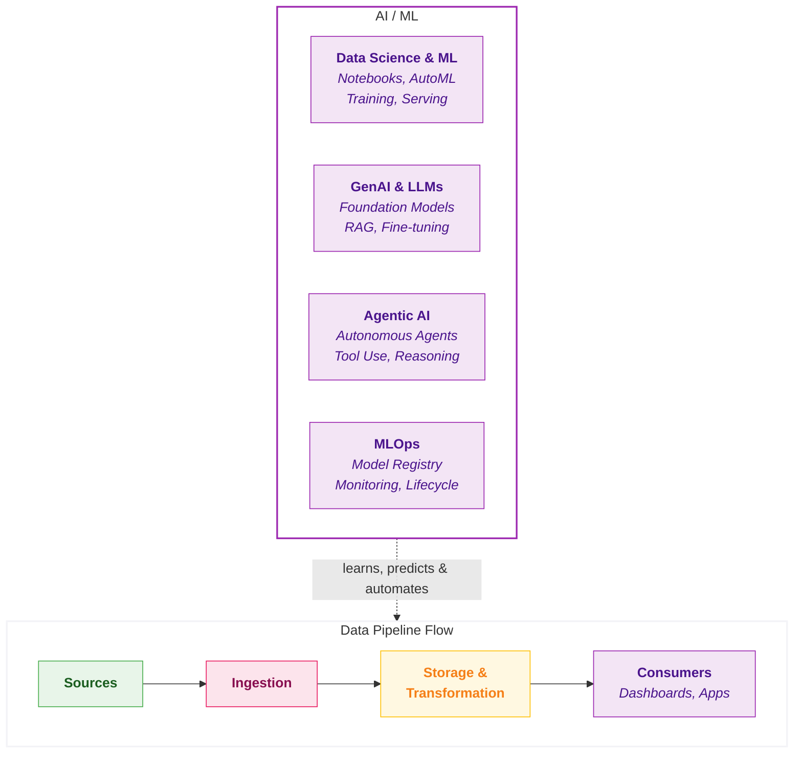
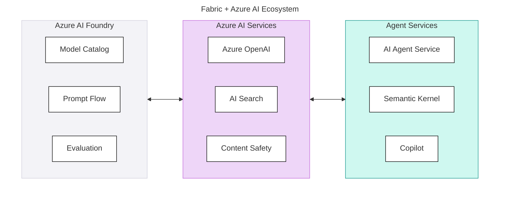
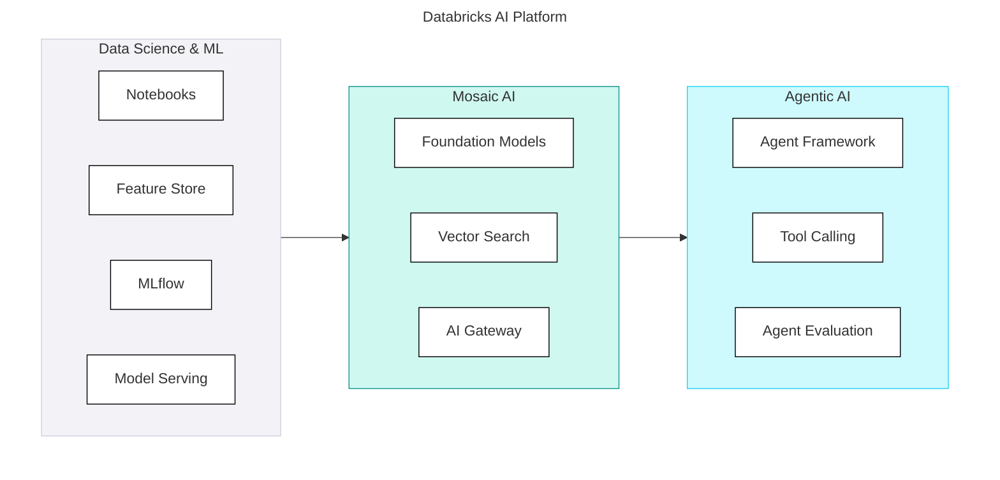
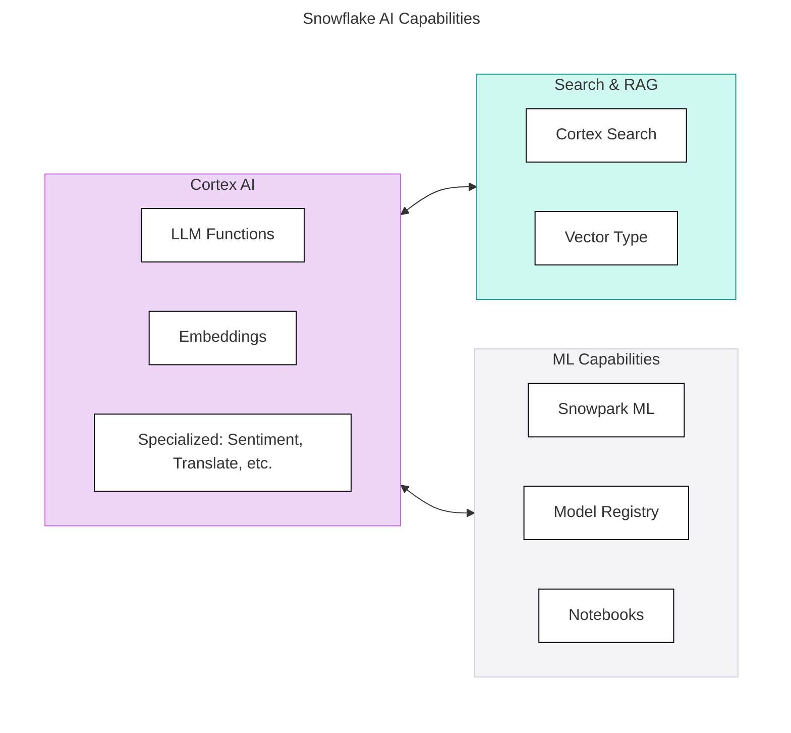

## AI/ML

**AI/ML** encompasses the capabilities that allow your data platform to go beyond reporting and into prediction, automation, and intelligence. This spans traditional data science and machine learning, generative AI and LLM integration, and the emerging world of agentic AI - autonomous systems that can reason and act.

In simple terms: **AI/ML answers the question, "How do we turn data into predictions, automation, and intelligent applications?"**



### Overview

**Where Data Becomes Intelligence** - AI/ML capabilities determine whether your platform can support the journey from experimentation to production ML. The gap between "we can build models" and "we can deploy and maintain models at scale" is where most organisations struggle.

The AI/ML layer supports data science, machine learning, and artificial intelligence workloads. This spans the full lifecycle from experimentation through production deployment, including the emerging GenAI capabilities that are reshaping what's possible.

The AI landscape on data platforms now spans three distinct capabilities:

| Wave | What It Does | Example Use Cases |
|------|--------------|-------------------|
| **Data Science & ML** | Predictions, classifications, forecasting | Churn prediction, demand forecasting, fraud detection |
| **Generative AI** | Content creation, summarisation, understanding | Document summarisation, sentiment analysis, chatbots |
| **Agentic AI** | Autonomous actions, multi-step reasoning | Automated data quality remediation, self-healing pipelines, research agents |

<Callout type="question">Can the platform support our AI/ML ambitions - from today's analytics to tomorrow's production ML and GenAI use cases?</Callout>

### The Three Pillars

**Three Waves of AI** - Data Science & ML optimises predictions. Generative AI creates content. Agentic AI takes actions. Your platform choice determines which waves you can ride-and how easily your team can surf them.

```mermaid
flowchart LR
    subgraph DS["<b>Data Science</b>"]
        direction TB
        DS_IO["<b>Numbers In<br/>→ Numbers Out</b>"]
        DS_DESC["Predicts outcomes"]
    end

    subgraph GAI["<b>Generative AI</b>"]
        direction TB
        GAI_IO["<b>Language In<br/>→ Language Out</b>"]
        GAI_DESC["Consolidates knowledge"]
    end

    subgraph AAI["<b>Autonomous AI</b>"]
        direction TB
        AAI_IO["<b>Signal In<br/>→ Action Out</b>"]
        AAI_DESC["Automates operations"]
    end

    DS ~~~ GAI ~~~ AAI

    classDef dsStyle fill:#EEEAF7,stroke:#6B5B9A,stroke-width:3px,color:#3B2D6B
    classDef gaiStyle fill:#FCE4F0,stroke:#E88CB8,stroke-width:3px,color:#C05A8C
    classDef aaiStyle fill:#E4F7F5,stroke:#9AD5CD,stroke-width:3px,color:#4A9B91
    classDef dsText fill:none,stroke:none,color:#3B2D6B
    classDef gaiText fill:none,stroke:none,color:#C05A8C
    classDef aaiText fill:none,stroke:none,color:#4A9B91

    class DS_IO,DS_DESC dsText
    class GAI_IO,GAI_DESC gaiText
    class AAI_IO,AAI_DESC aaiText

    style DS fill:#EEEAF7,stroke:#6B5B9A,stroke-width:3px,rx:200,ry:200
    style GAI fill:#FCE4F0,stroke:#E88CB8,stroke-width:3px,rx:200,ry:200
    style AAI fill:#E4F7F5,stroke:#9AD5CD,stroke-width:3px,rx:200,ry:200
```



#### 1. Data Science & ML

The foundation. Supervised/unsupervised learning, model training, deployment.

| Capability | What Matters |
|------------|--------------|
| **Notebook Development** | Interactive experimentation (table stakes now) |
| **Feature Engineering** | Create, store, serve features consistently |
| **Model Training** | Distributed training, GPU access, experiment tracking |
| **Model Registry** | Version, stage, approve, deploy models |
| **MLOps** | CI/CD for ML, monitoring, drift detection |

#### 2. Generative AI

LLMs, embeddings, and AI-powered content generation.

| Capability | What Matters |
|------------|--------------|
| **LLM Access** | Which models? How accessed? (API, hosted, fine-tuned) |
| **Embedding Models** | Generate vectors for semantic search |
| **Vector Storage & Search** | Store and query embeddings efficiently |
| **RAG Infrastructure** | Retrieval-augmented generation patterns |
| **Fine-Tuning** | Customise models on your data |
| **Prompt Management** | Version and test prompts |

#### 3. Agentic AI

Autonomous systems that reason, plan, and act.

| Capability | What Matters |
|------------|--------------|
| **Agent Frameworks** | Support for LangChain, AutoGen, CrewAI, etc. |
| **Tool Calling** | LLMs invoking functions/APIs |
| **Multi-Step Orchestration** | Chain reasoning across multiple steps |
| **Memory & Context** | Maintain state across interactions |
| **Guardrails** | Safety controls, output validation |
| **Human-in-the-Loop** | Approval gates for critical actions |

### Scoring Template

#### 1. Data Science & ML

<CapabilityMatrix component="aiMlTraditional" />

#### 2. Generative AI

<CapabilityMatrix component="aiMlGenAi" />

#### 3. Agentic AI

<CapabilityMatrix component="aiMlAgentic" />

#### Adjusting Weights for Client Context

| Client Profile | Adjust Weights |
|----------------|----------------|
| **Data Science & ML focus** | Model Training + 30%, MLOps + 25% |
| **GenAI priority** | LLM Access + 30%, Vector Search + 25%, RAG Support + 20% |
| **Building agents** | Agent Frameworks + 30%, Tool Calling + 25% |
| **SQL-centric team** | LLM Access + 20%, Embedding Models + 20% |
| **No AI plans** | Reduce entire component weight |

### Platform Comparison

<PlatformTabs>

<PlatformTabsFabric>

**Approach:** Azure AI Foundry, Azure OpenAI, Copilot, Semantic Kernel, Azure AI Agent Service



| Category | Capability | Assessment | Notes |
|----------|------------|------------|-------|
| **Data Science & ML** | Notebooks | 4 | Spark notebooks, VS Code, Azure AI Foundry notebooks |
| | Feature Store | 4 | Azure ML managed feature store, integrated with AI Foundry |
| | Training | 4 | Azure AI Foundry training, Spark ML, GPU via Azure ML compute |
| | Registry | 4 | AI Foundry model catalog (1,800+ models), Azure ML registry |
| | MLOps | 4 | Azure ML pipelines, Prompt Flow, managed endpoints, A/B deployment |
| **Generative AI** | LLM Access | 5 | Azure OpenAI (GPT-4o, o1, o3), AI Foundry catalog (Meta, Mistral, Cohere) |
| | Embedding Models | 5 | Azure OpenAI text-embedding-3, AI Foundry open-source models |
| | Vector Search | 4 | Azure AI Search (enterprise-grade, hybrid search, semantic ranking) |
| | RAG Support | 4 | Azure AI Search + Prompt Flow RAG templates |
| | Fine-Tuning | 4 | Azure OpenAI fine-tuning (GPT-4o), AI Foundry for open models |
| **Agentic AI** | Agent Frameworks | 4 | Azure AI Agent Service, Semantic Kernel, AutoGen |
| | Tool Calling | 5 | Azure OpenAI function calling, Semantic Kernel plugins |
| | Orchestration | 4 | Prompt Flow multi-step orchestration, Logic Apps integration |
| | Guardrails | 5 | Azure AI Content Safety, Prompt Shields, responsible AI dashboard |

**Available Models (via Azure AI Foundry):** GPT-4o, o1, o3-mini, Llama 3.1, Mistral Large, Phi-3, Cohere, text-embedding-3, DALL-E 3, Whisper - 1,800+ models in catalog

**Key Differentiator:** Fabric is not standalone - it provides native access to the entire Azure AI ecosystem. Azure AI Foundry offers model catalog, Prompt Flow for orchestration, and evaluation tools. Azure AI Agent Service provides managed agent hosting.

</PlatformTabsFabric>

<PlatformTabsDatabricks>

**Approach:** Mosaic AI, MLflow, Foundation Model APIs, Agent Framework



| Category | Capability | Assessment | Notes |
|----------|------------|------------|-------|
| **Data Science & ML** | Notebooks | 5 | Best-in-class, collaborative, Git-native |
| | Feature Store | 5 | Native, online/offline, Unity Catalog integrated |
| | Training | 5 | Distributed, GPU clusters, experiment tracking |
| | Registry | 5 | MLflow registry, stages, lineage |
| | MLOps | 5 | Full lifecycle, monitoring, A/B testing |
| **Generative AI** | LLM Access | 5 | Foundation Model APIs, external model gateway |
| | Embedding Models | 5 | BGE, GTE, custom models |
| | Vector Search | 5 | Native Vector Search, Delta Sync |
| | RAG Support | 5 | End-to-end RAG with retrieval, chunking |
| | Fine-Tuning | 5 | Fine-tune open models (Llama, Mistral, etc.) |
| **Agentic AI** | Agent Framework | 4 | Mosaic AI Agent Framework, LangChain, LlamaIndex; platform-specific |
| | Tool Calling | 5 | Unity Catalog functions as tools |
| | Orchestration | 4 | Multi-step chains, agent loops via Mosaic AI |
| | Guardrails | 4 | AI Gateway, Lakehouse Monitoring, guardrail APIs |
| | Agent Evaluation | 5 | MLflow for agent testing |

**Available Models:**
- **Provisioned:** DBRX, Llama 3.1 (8B, 70B, 405B), Mixtral, MPT
- **External Gateway:** OpenAI, Anthropic, Google, Cohere, AWS Bedrock
- **Embeddings:** BGE, GTE, E5, custom
- **Fine-Tuning:** Llama, Mistral, and other open models

**Agent Development Pattern:**

```python
# Databricks Agent Framework example
from databricks.agents import Agent, Tool

# Define tools from Unity Catalog functions
@tool
def get_customer_data(customer_id: str) -> dict:
    """Retrieve customer information from the data warehouse."""
    return spark.sql(f"SELECT * FROM gold.dim_customer WHERE id = '{customer_id}'").first().asDict()

@tool
def create_support_ticket(customer_id: str, issue: str) -> str:
    """Create a support ticket for a customer."""
    # Implementation
    return ticket_id

# Create agent with tools
agent = Agent(
    model="databricks-dbrx-instruct",
    tools=[get_customer_data, create_support_ticket],
    system_prompt="You are a customer service agent..."
)
```

</PlatformTabsDatabricks>

<PlatformTabsSnowflake>

**Approach:** Cortex AI, Snowpark ML, Cortex Search, native SQL functions



| Category | Capability | Assessment | Notes |
|----------|------------|------------|-------|
| **Data Science & ML** | Notebooks | 4 | Snowflake Notebooks, improving rapidly |
| | Feature Store | 4 | Feature Store (recently GA) |
| | Training | 4 | Snowpark ML, container services |
| | Registry | 4 | Model Registry available |
| | MLOps | 3 | Less mature than Databricks |
| **Generative AI** | LLM Access | 4 | Cortex LLM functions (SQL-accessible); fewer model options |
| | Embedding Models | 5 | Cortex embed functions, arctic-embed, multiple models |
| | Vector Search | 4 | VECTOR type, Cortex Search |
| | RAG Support | 4 | Cortex Search for RAG, simple SQL interface |
| | Fine-Tuning | 3 | Limited fine-tuning options |
| **Agentic AI** | Agent Framework | 3 | Via Snowpark + external frameworks; no native agent service |
| | Tool Calling | 4 | Cortex Analyst, Snowflake functions |
| | Orchestration | 3 | Manual implementation; no native agent orchestration |
| | Guardrails | 4 | Cortex Guard for content safety |

**Available Models (Cortex):**
- **LLMs:** Llama 3.1 (8B, 70B, 405B), Mistral Large, Mixtral 8x7B, Gemma, Snowflake Arctic
- **Embeddings:** snowflake-arctic-embed, e5-base-v2, multilingual-e5-large
- **Specialized:** Sentiment, Summarize, Translate, Extract Answer - SQL-accessible, no infrastructure needed

**Key Differentiator:** Cortex makes AI accessible to SQL users without Python or infrastructure. Built-in functions like `SUMMARIZE()`, `SENTIMENT()`, `TRANSLATE()` work directly in SQL queries - ideal for teams building AI-powered applications without ML engineering.

</PlatformTabsSnowflake>

</PlatformTabs>

### Key Considerations

#### Build vs Buy vs Integrate

| Approach | When to Use | Platform Fit |
|----------|-------------|--------------|
| **Platform-native AI** | Standard use cases, quick wins | All (Cortex, Copilot) |
| **Integrate external LLMs** | Need specific models (GPT-4, Claude) | Databricks (Gateway), Fabric (Azure) |
| **Build custom agents** | Competitive advantage, unique workflows | Databricks |
| **Fine-tune models** | Domain-specific language/tasks | Databricks, Azure OpenAI |

#### Team Skill Requirements

| Capability | SQL Analysts | Python Engineers | ML Engineers |
|------------|--------------|------------------|--------------|
| Cortex functions | ✓ Can use | ✓ Can use | ✓ Can use |
| Copilot | ✓ Can use | ✓ Can use | ✓ Can use |
| RAG applications | ✗ | ✓ With guidance | ✓ |
| Custom agents | ✗ | ✓ With frameworks | ✓ |
| Fine-tuning | ✗ | ✗ | ✓ |

#### Cost Considerations

| Platform | Cost Model | Watch Out For |
|----------|------------|---------------|
| **Fabric** | Azure OpenAI tokens | Token costs add up quickly |
| **Databricks** | Provisioned throughput or tokens | Foundation Model costs |
| **Snowflake** | Cortex credits | Per-function costs |

### Decision Guidance

| Fabric | Databricks | Snowflake |
|--------|------------|-----------|
| Azure AI Foundry for full AI lifecycle | Building production ML systems | SQL-accessible AI is priority |
| Need broadest model catalog (1,800+ models) | Need full MLOps lifecycle (MLflow) | Team is SQL-centric |
| Azure AI Agent Service for managed agents | Fine-tuning open models on own compute | Cortex built-in functions (Summarize, Sentiment) |
| Copilot for business users + Power BI | Want flexibility across LLM providers | Conversational BI (Cortex Analyst) |
| Enterprise AI governance (Content Safety, Prompt Shields) | Team has ML engineering skills | Simple AI without infrastructure overhead |

