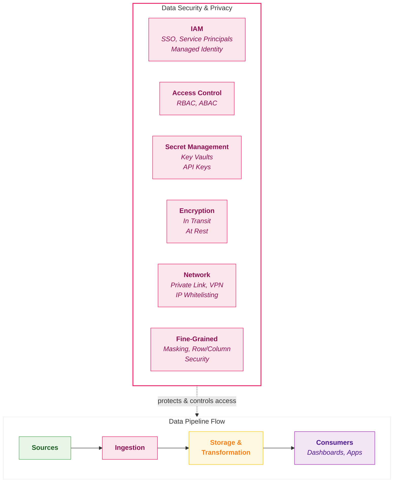

## Security

**Data Security & Privacy** is about protecting data from unauthorised access, ensuring it's encrypted in transit and at rest, and managing who can see what. It covers identity management, access controls, secret management, network security, and fine-grained protections like data masking and row-level security.

In simple terms: **data security answers the question, "How do we keep our data safe and ensure only the right people can access the right information?"**

### Overview

**The Protection Layer** - Security isn't a feature you add later - it's a foundation you build on. Without it, every dataset is a breach waiting to happen, every API is an attack surface, and compliance audits become existential crises.

The security layer controls who can access the platform, how data is protected at rest and in transit, how network boundaries are enforced, and how compliance requirements are met. This is distinct from data governance (catalog, lineage, quality) - security is about protecting your data and infrastructure.

<Callout type="question">Can we control who accesses what, protect data at every layer, and prove compliance to regulators?</Callout>

### Key Capabilities

| Capability | What it measures? | Why it matters? |
|------------|-----------------|----------------|
| **IAM & SSO Integration** | Integration with enterprise identity providers, SSO, SCIM provisioning, and MFA | • Without proper IAM, access control is manual and error-prone   • Enterprise identity handles joiners/leavers automatically   • SSO reduces credential sprawl |
| **Fine-Grained Access Control** | Support for row-level security, column masking, dynamic data policies | • Not all users should see all data   • PII requires masking for non-authorised users   • Regulatory requirements demand granular control |
| **Network Security** | Private connectivity, VNet integration, IP restrictions, and network isolation | • Data platforms must not be exposed to public internet   • Private Link eliminates data exfiltration risk   • Network isolation is a compliance requirement |
| **Secret Management & Encryption** | Secure storage of credentials, customer-managed keys, and encryption at rest/in transit | • Hardcoded secrets are the #1 security anti-pattern   • Customer-managed keys enable data sovereignty   • Encryption is non-negotiable |
| **Compliance & Audit** | Logging, access history, compliance certifications, and audit trail retention | • Regulators ask "who had access to PII?"   • Auditors ask "can you prove data wasn't modified?"   • Without audit trails, these questions create crises |

### Scoring Template

#### Capability Matrix

<CapabilityMatrix component="security" />

#### Adjusting Weights for Client Context

| Client Profile | Adjust Weights |
|----------------|----------------|
| **Highly regulated (FSI, healthcare)** | Compliance + 30%, Fine-Grained Access + 25% |
| **PII-heavy** | Fine-Grained Access + 35%, Encryption + 20% |
| **Zero-trust architecture** | Network Security + 30%, IAM + 25% |
| **Multi-tenant platform** | Fine-Grained Access + 30%, IAM + 20% |
| **Startup / minimal regulation** | Reduce Compliance weight, focus on IAM |

### Platform Comparison

<PlatformTabs>

<PlatformTabsFabric>

**Tools:** Entra ID, Azure Private Link, Key Vault, Information Protection, Conditional Access

| Strengths | Limitations |
|-----------|-------------|
| Native Entra ID with SSO and conditional access | Fine-grained lakehouse-level access still maturing |
| Azure Private Link and managed VNet | Column masking requires Purview integration |
| Key Vault integration for customer-managed keys | Network configuration inherits Azure complexity |
| M365 Information Protection labels | Some security features require additional Azure licensing |
| Familiar Azure security model | |

**Best for:** Microsoft ecosystem, existing Azure security investment, Entra ID organisations

| Sub-Capability | Score | Rationale |
|----------------|-------|-----------|
| IAM & SSO Integration | 5 | Native Entra ID with SSO, SCIM provisioning, conditional access policies |
| Fine-Grained Access Control | 4 | RLS in Power BI, workspace roles; column masking via Purview; less granular at lakehouse level |
| Network Security | 5 | Azure Private Link, managed VNet, service tags; familiar Azure networking model |
| Secret Management & Encryption | 5 | Azure Key Vault integration; encryption at rest and in transit; customer-managed keys |
| Compliance & Audit | 4 | Microsoft compliance portfolio (SOC, ISO, HIPAA); audit logs via Purview and Monitor |

</PlatformTabsFabric>

<PlatformTabsDatabricks>

**Tools:** Cloud IAM (Entra ID / Okta), Unity Catalog Access Control, Private Link, Secret Scopes

| Strengths | Limitations |
|-----------|-------------|
| Unity Catalog provides unified fine-grained access (row filters, column masks) | Requires Unity Catalog adoption for full security value |
| Cloud IAM integration with SCIM user/group sync | Network configuration varies by cloud provider |
| Private Link and VNet injection for network isolation | Secret scopes require setup |
| System tables provide comprehensive audit trail | Security model can be complex for small teams |
| Attribute-based access control | |

**Best for:** Fine-grained data protection, multi-cloud security, enterprise security teams

| Sub-Capability | Score | Rationale |
|----------------|-------|-----------|
| IAM & SSO Integration | 5 | Cloud IAM integration (Entra ID, Okta), SCIM for user/group sync, SSO native |
| Fine-Grained Access Control | 5 | Row filters, column masks in Unity Catalog; dynamic views; attribute-based access |
| Network Security | 5 | Private Link, VNet injection, IP access lists; comprehensive network isolation |
| Secret Management & Encryption | 5 | Secret scopes (Databricks or Key Vault backed); customer-managed keys; encryption everywhere |
| Compliance & Audit | 5 | System tables for comprehensive audit; SOC 2, ISO, HIPAA, FedRAMP; access history |

</PlatformTabsDatabricks>

<PlatformTabsSnowflake>

**Tools:** RBAC, SCIM, Row Access Policies, Dynamic Data Masking, PrivateLink, Tri-Secret Secure

| Strengths | Limitations |
|-----------|-------------|
| Best-in-class SQL-based row access policies and column masking | PrivateLink less flexible than VNet injection models |
| Tri-Secret Secure for customer-managed encryption | Some security features require Enterprise or Business Critical edition |
| Comprehensive access history and query history | Network policies less granular than Azure/AWS native |
| SCIM, OAuth, SAML for enterprise identity | Tag-based security policies require setup |
| Strong compliance certifications across all editions | |

**Best for:** SQL-centric security policies, managed security, compliance-heavy environments

| Sub-Capability | Score | Rationale |
|----------------|-------|-----------|
| IAM & SSO Integration | 5 | SCIM, OAuth, SSO via SAML/OAuth; multi-factor authentication; key-pair auth |
| Fine-Grained Access Control | 5 | Row access policies, dynamic data masking, column-level security; best-in-class SQL-based policies |
| Network Security | 4 | AWS PrivateLink / Azure Private Link; network policies; less flexible than VNet models |
| Secret Management & Encryption | 5 | Tri-Secret Secure (customer + Snowflake keys); automatic encryption; key rotation |
| Compliance & Audit | 5 | Access history, query history, login history; SOC 2, ISO, HIPAA, FedRAMP; extensive retention |

</PlatformTabsSnowflake>

</PlatformTabs>

### Compliance Certification Comparison

| Certification | Fabric | Databricks | Snowflake |
|---------------|--------|------------|-----------|
| **SOC 1 Type II** | ✓ | ✓ | ✓ |
| **SOC 2 Type II** | ✓ | ✓ | ✓ |
| **ISO 27001** | ✓ | ✓ | ✓ |
| **ISO 27017** | ✓ | ✓ | ✓ |
| **ISO 27018** | ✓ | ✓ | ✓ |
| **HIPAA** | ✓ (BAA) | ✓ (BAA) | ✓ (BAA) |
| **GDPR** | ✓ | ✓ | ✓ |
| **PCI DSS** | ✓ | ✓ | ✓ |
| **FedRAMP** | ✓ (Moderate) | ✓ (Moderate) | ✓ (Moderate) |
| **HITRUST** | ✓ | ✓ | ✓ |
| **StateRAMP** | ✓ | ✓ | ✓ |

All three platforms have comprehensive compliance certifications. Specific requirements should be validated against current certification status.

### Key Considerations

#### Security Complexity vs Usability

| Platform | Security Model | Trade-off |
|----------|---------------|-----------|
| **Fabric** | <RatingBadge rating="Easy" /> Azure-integrated | Leverages existing Azure security but less granular at data level |
| **Databricks** | <RatingBadge rating="Hard" /> Comprehensive Unity Catalog | Most powerful but requires security engineering |
| **Snowflake** | <RatingBadge rating="Medium" /> SQL-based policies | Accessible to SQL teams but some features are premium |

#### Network Architecture

| Platform | Private Connectivity | IP Restrictions | VNet Integration |
|----------|---------------------|-----------------|------------------|
| **Fabric** | Azure Private Link | Service tags | Managed VNet |
| **Databricks** | Private Link | IP access lists | VNet injection (full control) |
| **Snowflake** | PrivateLink (AWS/Azure) | Network policies | No VNet injection |

#### Regulatory Requirements by Industry

| Industry | Key Requirements | Platform Considerations |
|----------|------------------|------------------------|
| **Financial Services** | SOX, Basel, data residency | All capable; residency varies by cloud region |
| **Healthcare** | HIPAA, data encryption | All offer BAA; encryption at rest standard |
| **Government** | FedRAMP, ITAR | Check specific authorisation level required |
| **Retail** | PCI DSS, GDPR | All compliant; masking policies critical for PII |
