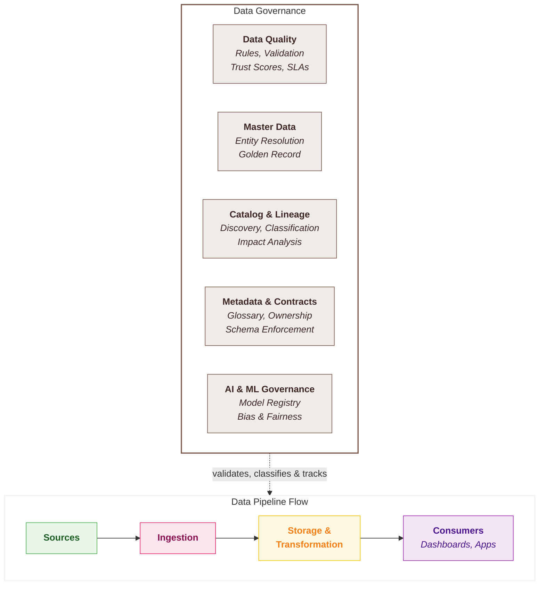

## Data Governance

**Data Governance** is the set of rules, processes, and responsibilities that ensure your data is accurate, consistent, trustworthy, and used appropriately. It covers everything from data quality checks and master data management to data cataloguing and lineage tracking. Without governance, data becomes unreliable - people stop trusting dashboards, duplicate records multiply, and nobody knows where a number came from.

In simple terms: **data governance answers the question, "How do we make sure our data is correct, discoverable, and used responsibly?"**

### Overview

**The Knowledge Foundation** - Data governance determines whether your organisation knows what data it has, where it came from, whether it's trustworthy, and who's responsible for it. Without governance, data is a liability. With it, data becomes an asset.

The data governance layer provides catalog and discovery, lineage tracking, data quality enforcement, business glossary management, and governance controls for AI/ML assets. This is distinct from security (access control, networking, encryption) - governance is about understanding and trusting your data.

<Callout type="question">Do we know what data we have, where it came from, whether it's correct, and who owns it?</Callout>

### Key Capabilities

| Capability | What it measures? | Why it matters? |
|------------|-----------------|----------------|
| **Data Catalog & Discovery** | Ability to discover, search, and understand datasets across the platform | • Teams can't use data they can't find   • Catalog reduces duplication and shadow data   • Enables self-service data access |
| **Data Lineage & Impact Analysis** | End-to-end visibility into how data flows, transforms, and is consumed | • "Where did this number come from?" is asked daily   • Impact analysis prevents breaking changes   • Enables confident refactoring |
| **Data Quality Framework** | Native or integrated support for defining, monitoring, and enforcing data quality rules | • Bad data leads to bad decisions   • Quality issues caught early cost less to fix   • Builds trust in the platform |
| **Business Glossary & Classification** | Ability to define business terms, tag data assets, and classify by sensitivity | • Common vocabulary prevents miscommunication   • Classification enables right-sized governance   • Tags drive automated policy enforcement |
| **AI/ML Governance** | Controls for model lineage, experiment tracking, feature store governance, and AI guardrails | • "Which model is in production?" must be answerable   • Model drift without governance is invisible risk   • GenAI requires guardrails for cost and safety |

### Scoring Template

#### Capability Matrix

<CapabilityMatrix component="governance" />

#### Adjusting Weights for Client Context

| Client Profile | Adjust Weights |
|----------------|----------------|
| **Data mesh / federated** | Catalog + 30%, Glossary + 25% |
| **Regulatory / audit-heavy** | Lineage + 30%, Quality + 20% |
| **AI/ML production** | AI/ML Governance + 35% |
| **Self-service analytics** | Catalog + 35%, Glossary + 20% |
| **Data quality critical** | Quality + 35% |

### Platform Comparison

<PlatformTabs>

<PlatformTabsFabric>

**Tools:** Purview integration, OneLake catalog, Sensitivity Labels, Data Factory lineage

| Strengths | Limitations |
|-----------|-------------|
| Purview provides enterprise-wide catalog across Microsoft estate | Purview integration still evolving within Fabric |
| Sensitivity labels from M365 apply automatically | Column-level lineage less granular than Unity Catalog |
| OneLake provides unified data discovery | Data quality framework limited natively |
| Familiar Microsoft governance model | AI/ML governance via Azure ML, not unified in Fabric |

**Best for:** Microsoft ecosystem, existing Purview investment, M365 sensitivity labels

| Sub-Capability | Score | Rationale |
|----------------|-------|-----------|
| Data Catalog & Discovery | 4 | Purview catalog integration, OneLake discovery; cross-workspace search improving |
| Data Lineage & Impact Analysis | 4 | Purview lineage integration; column-level lineage less granular than competitors |
| Data Quality Framework | 3 | Native DQ rules limited; relies on dbt tests or partner tools |
| Business Glossary & Classification | 4 | Purview glossary and sensitivity labels from M365 |
| AI/ML Governance | 3 | Azure ML governance separate; no unified model lineage within Fabric |

</PlatformTabsFabric>

<PlatformTabsDatabricks>

**Tools:** Unity Catalog, Lakehouse Monitoring, MLflow, System Tables

| Strengths | Limitations |
|-----------|-------------|
| Unity Catalog is the most comprehensive governance solution | Requires Unity Catalog adoption and setup |
| Column-level lineage automatic and visual | Can be complex for simple use cases |
| Lakehouse Monitoring for data quality dashboards | Full value requires proper configuration |
| MLflow provides complete model lineage and experiment tracking | Learning curve for administrators |
| AI guardrails and governance built into Mosaic AI | |

**Best for:** Data mesh, comprehensive governance, AI/ML-heavy organisations

| Sub-Capability | Score | Rationale |
|----------------|-------|-----------|
| Data Catalog & Discovery | 5 | Unity Catalog provides unified catalog with search, tags, and AI-generated documentation |
| Data Lineage & Impact Analysis | 5 | Column-level lineage automatic and visual; impact analysis built into Unity Catalog |
| Data Quality Framework | 4 | Lakehouse monitoring, DLT expectations, quality dashboards via system tables |
| Business Glossary & Classification | 5 | Unity Catalog tags, policies, inheritance; comprehensive classification framework |
| AI/ML Governance | 5 | MLflow tracking, model lineage in Unity Catalog, feature store governance, AI guardrails |

</PlatformTabsDatabricks>

<PlatformTabsSnowflake>

**Tools:** Horizon, Snowflake Catalog, Data Quality Monitoring, Model Registry

| Strengths | Limitations |
|-----------|-------------|
| Horizon unifies governance features under a single umbrella | Column-level lineage less mature than Unity Catalog |
| Access history provides comprehensive audit trail | Glossary capabilities less developed |
| Object tagging drives automated policy enforcement | Data quality monitoring still emerging |
| Model registry with governance controls | AI/ML governance less comprehensive than Databricks |
| Snowflake Marketplace for governed data sharing | |

**Best for:** SQL-centric governance, data sharing use cases, moderate governance complexity

| Sub-Capability | Score | Rationale |
|----------------|-------|-----------|
| Data Catalog & Discovery | 5 | Horizon catalog with search, tags, and object-level discoverability |
| Data Lineage & Impact Analysis | 5 | Horizon lineage with access history; column-level lineage improving |
| Data Quality Framework | 4 | Constraints, dbt tests, partner tools; data quality monitoring emerging |
| Business Glossary & Classification | 4 | Object tagging, tag-based policies; glossary capabilities less mature |
| AI/ML Governance | 4 | Model registry with governance; Cortex usage tracking; less comprehensive than Databricks |

</PlatformTabsSnowflake>

</PlatformTabs>

### Key Considerations

#### Governance Maturity

| Platform | Governance Style | Trade-off |
|----------|------------------|-----------|
| **Fabric** | <RatingBadge rating="Easy" /> Microsoft-integrated | Leverages existing M365 but less granular |
| **Databricks** | <RatingBadge rating="Hard" /> Comprehensive Unity Catalog | Powerful but requires setup investment |
| **Snowflake** | <RatingBadge rating="Medium" /> SQL-centric Horizon | Accessible but some features still emerging |

#### Data Quality Approach

| Platform | Native DQ | dbt Integration | Partner Tools |
|----------|-----------|-----------------|---------------|
| **Fabric** | Limited native rules | dbt tests supported | Great Expectations, Soda |
| **Databricks** | Lakehouse Monitoring, DLT expectations | Excellent dbt integration | Monte Carlo, Soda |
| **Snowflake** | Constraints, emerging monitoring | Best-in-class dbt integration | Monte Carlo, Soda, Great Expectations |

#### Multi-Platform Governance

| Scenario | Challenge | Approach |
|----------|-----------|----------|
| **Fabric + Power BI** | Unified within Microsoft | Native Purview integration |
| **Databricks + BI tools** | Cross-platform lineage | Unity Catalog + partner catalogs |
| **Snowflake + dbt** | Transform lineage | Horizon + dbt docs |