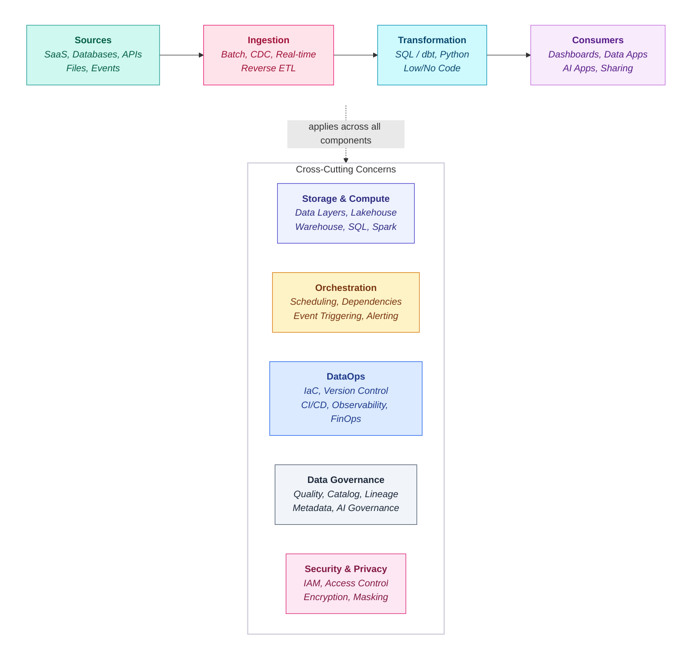

{/* ============================================================
   Platform Components Overview
   The building blocks of a modern data platform
   ============================================================ */}

export const metadata = {
  title: "Platform Components",
  description: "Core components that make up a modern data platform",
  section: "Platform Selection",
  order: 1,
  version: "1.0",
  maturity: "Standard"
}

## Platform Components

<Callout type="info">
  **Component-Based Evaluation** - Every data platform is a composition of components. Understanding each component's role and evaluating platform capabilities at this level enables precise, defensible recommendations.
</Callout>

### Overview

A modern data platform consists of ten core components, each serving a distinct purpose in the data lifecycle:

### Component Summary

| Component | Purpose | Key Question |
|-----------|---------|--------------|
| **Ingestion** | Capture data from source systems and land it reliably in the platform | How do we bring data in from all sources? |
| **Storage** | Persist data with reliability, efficiency, and appropriate governance | How do we store data efficiently and safely? |
| **Compute** | Execute workloads with appropriate performance and cost | How do we run workloads at scale? |
| **Transformation** | Model and refine data for analytical consumption | How do we shape data for downstream use? |
| **Orchestration** | Coordinate, schedule, and monitor data workflows | How do we schedule and monitor pipelines? |
| **BI & Semantic** | Enable business users to access and analyse data | How do we serve data to business users? |
| **ML, AI & Agentic** | Support data science, ML, GenAI, and agentic workloads | How do we enable experimentation, production ML, and AI systems? |
| **Data Governance** | Understand, catalog, and trust data assets | How do we catalog, track lineage, and ensure quality? |
| **Security** | Protect data, control access, and prove compliance | How do we control access, encrypt data, and prove compliance? |
| **Operations** | Deploy, monitor, and optimise the platform | How do we run and improve the platform reliably? |

### Platform Comparison by Component

#### High-Level Capability Comparison

<HighLevelComparison />

### Component Details

#### Ingestion

**Purpose:** The ingestion layer captures data from source systems and lands it reliably in the platform. This includes batch extracts, real-time streams, change data capture, and handling of schema evolution.

| Capability | Description |
|------------|-------------|
| Batch Ingestion | Scheduled/triggered ingestion of files, databases, and APIs |
| Native Connectors | Pre-built integrations to common source systems |
| Change Data Capture (CDC) | Capture row-level changes from transactional systems |
| Schema Evolution | Handle schema changes without breaking pipelines |
| Error Handling & Retry | Retry logic, dead-letter queues, and alerting |
| Streaming Ingestion | Near real-time event data with low latency |

#### Storage

**Purpose:** The storage layer persists data with reliability, efficiency, and appropriate governance. Modern platforms have evolved beyond simple file storage to include ACID transactions, time travel, and zero-copy cloning.

| Capability | Description |
|------------|-------------|
| Data Format Support | Support for open formats (Parquet, Delta, Iceberg) |
| ACID Transactions | Concurrent reads/writes with consistency guarantees |
| Versioning & Time Travel | Access historical data versions for audit and recovery |
| Cloning & Data Sharing | Zero-copy dataset replication and cross-platform sharing |
| Separation of Storage and Compute | Independent scaling of storage and compute tiers |

#### Compute

**Purpose:** The compute layer executes workloads with appropriate performance and cost. This includes elastic scaling, workload isolation, and the ability to control and attribute costs across teams and use cases.

| Capability | Description |
|------------|-------------|
| Elastic Scaling | Dynamic resource allocation based on demand |
| Workload Isolation | Separate ETL, BI, and ML workloads independently |
| Job vs Interactive Compute | Scheduled batch vs ad-hoc interactive patterns |
| Cold Start Performance | Time to provision and warm up resources |
| Cost Attribution & Control | Granular tracking and charge-back by team or workload |

#### Transformation

**Purpose:** The transformation layer models and refines data for analytical consumption. This includes SQL-based transformations, incremental processing patterns, dependency management, and data quality enforcement.

| Capability | Description |
|------------|-------------|
| SQL-First Transformation | Express transformations declaratively in SQL |
| Non-SQL Processing | Python and Spark for complex, programmatic logic |
| dbt Integration | Modular, versioned transformation using dbt |
| Performance Optimisation | Materialisation strategies and incremental processing |
| Testing & Data Quality | Schema validation and business rule enforcement |

#### Orchestration

**Purpose:** The orchestration layer coordinates, schedules, and monitors data workflows. This includes defining dependencies, handling failures, and providing operational visibility into pipeline health.

| Capability | Description |
|------------|-------------|
| DAG Definition & Visualisation | Define and visualise pipeline dependencies |
| End-to-End Pipeline | Coordinate cross-system workflows from source to serve |
| Scheduling & Triggers | Time, event, and dependency-based triggers |
| Operational Observability | Execution visibility, logging, and alerting |
| Retry & Failure Handling | Resilience patterns and recovery strategies |

#### BI & Semantic Layer

**Purpose:** Enable business users to access and analyse data with consistent, governed metrics and performant queries.

| Capability | Description |
|------------|-------------|
| Semantic Layer | Centralised business entity and metric definitions |
| Metric Consistency | Single source of truth for KPIs across tools |
| Query Performance | Aggregations, caching, and pre-computation |
| Fine-Grained Security | Row and column level access control |
| Self-Service | Business user exploration without engineering intervention |

#### ML, AI & Agentic

**Purpose:** The AI/ML layer supports data science, machine learning, and artificial intelligence workloads. This spans three waves of capability: traditional ML lifecycle, generative AI infrastructure, and agentic AI systems.

##### Data Science & ML

| Capability | Description |
|------------|-------------|
| Notebook Development | Interactive experimentation environments |
| Feature Engineering | Feature creation, transformation, and reuse |
| Model Training | Scalable distributed training workloads |
| Model Registry | Version, stage, and manage model artefacts |
| MLOps | Production deployment, monitoring, and drift detection |

##### Generative AI

| Capability | Description |
|------------|-------------|
| LLM Access | Hosted or API-based large language model integration |
| Embedding Models | Text, image, and multimodal embeddings |
| Vector Storage & Search | Native vector indices and similarity search |
| RAG Infrastructure | Retrieval-augmented generation pipelines |
| Fine-Tuning | Adapt foundation models on proprietary data |
| Prompt Management | Template versioning and prompt engineering tooling |

##### Agentic AI

| Capability | Description |
|------------|-------------|
| Agent Frameworks | Native support for building autonomous AI agents |
| Tool Calling | LLM access to platform APIs and data sources |
| Multi-Step Orchestration | Long-running, stateful agent execution |
| Memory & Context | Persistent context across agent sessions |
| Guardrails | Safety controls and hallucination mitigation |
| Human-in-the-Loop | Approval workflows and escalation paths |

#### Data Governance

**Purpose:** The data governance layer provides catalog and discovery, lineage tracking, data quality enforcement, business glossary management, and governance controls for AI/ML assets. Governance is about understanding and trusting your data.

| Capability | Description |
|------------|-------------|
| Data Catalog & Discovery | Find and understand datasets across the platform |
| Data Lineage & Impact Analysis | End-to-end data flow visibility and change impact |
| Data Quality Framework | Define, monitor, and enforce data quality rules |
| Business Glossary & Classification | Shared vocabulary and sensitivity tagging |
| AI/ML Governance | Model lineage, experiment tracking, and AI guardrails |

#### Security

**Purpose:** The security layer controls who can access the platform, how data is protected at rest and in transit, how network boundaries are enforced, and how compliance requirements are met. Security is about protecting your data and infrastructure.

| Capability | Description |
|------------|-------------|
| IAM & SSO Integration | Enterprise identity, SSO, and SCIM provisioning |
| Fine-Grained Access Control | Row-level security, column masking, and dynamic policies |
| Network Security | Private Link, VNet integration, and IP restrictions |
| Secret Management & Encryption | Key Vault, customer-managed keys, and encryption at rest |
| Compliance & Audit | Audit logging, access history, and certification evidence |

#### Operations

**Purpose:** Deploy, monitor, and optimise the platform in production. This includes CI/CD pipelines, infrastructure management, environment strategy, and cost governance.

| Capability | Description |
|------------|-------------|
| CI/CD | Automated deployment pipelines for platform changes |
| Infrastructure as Code | Declarative resource management (Terraform, Bicep) |
| Environment Strategy | Dev/Test/Prod separation and promotion patterns |
| Monitoring & Alerting | Platform health visibility and incident response |
| Cost Management | Spend tracking, budgets, and optimisation |

### Scoring Components

Each component is scored across its sub-capabilities:

#### Scoring Scale

| Score | Meaning | Guidance |
|-------|---------|----------|
| **1** | Weak | Unsuitable without heavy augmentation or workarounds |
| **2** | Limited | Possible but significant limitations affect usability |
| **3** | Adequate | Functional with trade-offs; meets basic requirements |
| **4** | Strong | Production-ready; meets most enterprise requirements |
| **5** | Best-in-class | Industry-leading capability; competitive advantage |

#### Weighting by Client Priority

Not all components matter equally for every client. Weight based on workload priorities:

| Client Profile | High Weight | Medium Weight | Lower Weight |
|----------------|-------------|---------------|--------------|
| **Analytics-Heavy** | BI & Semantic, Transformation | Storage, Compute | ML, AI & Agentic |
| **ML/AI-Focused** | ML, AI & Agentic, Compute | Storage, Data Governance | BI & Semantic |
| **Real-Time** | Ingestion (streaming), Compute | Orchestration | BI & Semantic |
| **Compliance-Driven** | Security, Data Governance | Storage, Operations | ML, AI & Agentic |
