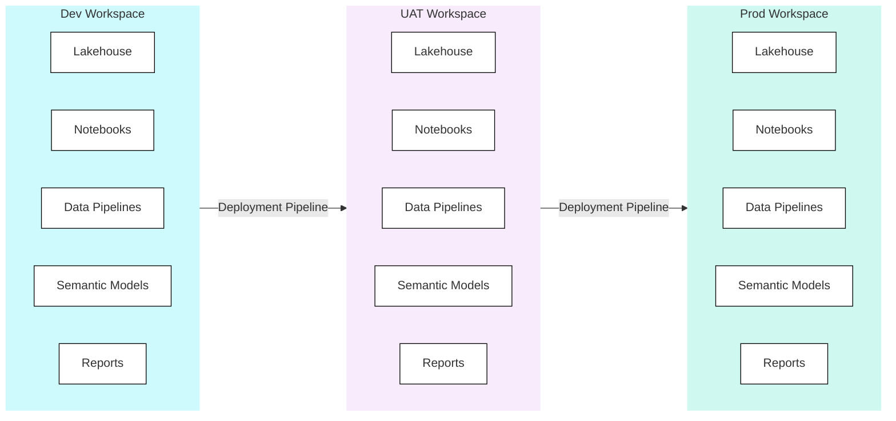
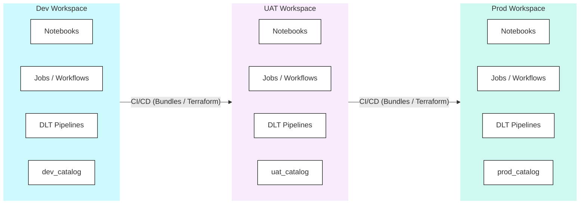
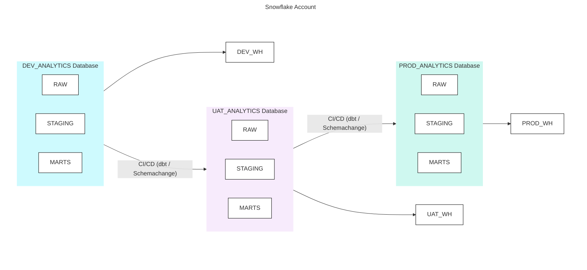
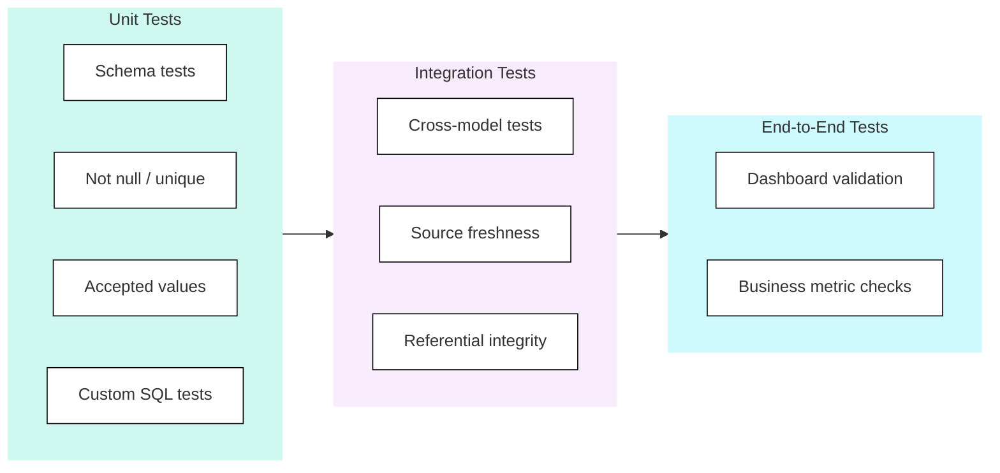
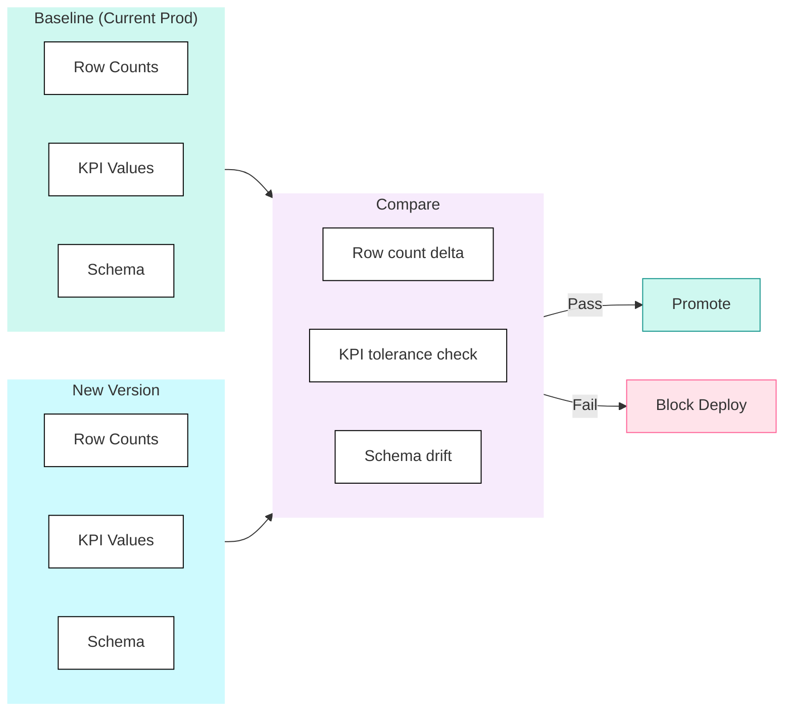
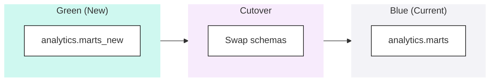
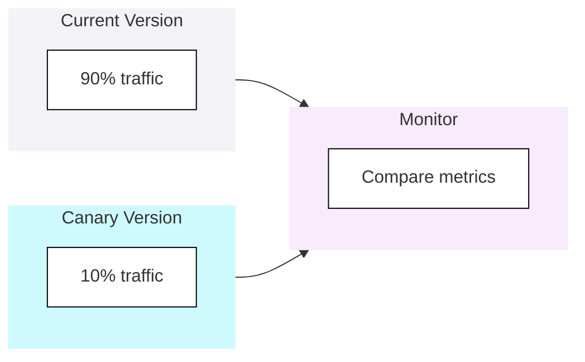

## CI/CD

**Automated Confidence** - CI & CD isn't about speed-it's about confidence. Every change tested, validated, and deployed the same way, every time. No "it worked on my machine" surprises.

CI/CD (Continuous Integration / Continuous Deployment) automates the process of validating and deploying changes to your data platform. This encompasses code validation, testing, environment promotion, and production deployment.

<Callout type="question">Can we deploy changes to production safely, quickly, and repeatedly without manual intervention?</Callout>

### Scoring Template

#### Capability Matrix

<CapabilityMatrix component="opsCicd" />

#### Adjusting Weights for Client Context

| Client Profile | Adjust Weights |
|----------------|----------------|
| **Rapid release cadence** | Pipeline Automation + 30%, Deployment Strategy + 20% |
| **Regulated environment** | Testing Integration + 30%, Rollback & Recovery + 25% |
| **Small team, simple pipelines** | Pipeline Automation - 15%, Rollback & Recovery + 20% |
| **Complex multi-environment** | Deployment Strategy + 30% |
| **Quality-critical data** | Testing Integration + 35% |

### Platform Comparison

| Aspect | Fabric | Databricks | Snowflake |
|--------|--------|------------|-----------|
| **Native CI/CD** | Deployment Pipelines | Workflows + APIs | Limited (Tasks) |
| **Git Integration** | Native (workspace) | Repos | Partner tools |
| **Testing** | Limited native | dbt, notebooks | dbt |
| **External CI/CD** | Azure DevOps, GitHub | Full support | Full support |
| **IaC Deployment** | Limited | Terraform, Bundles | Terraform, Schemachange |

### CI/CD Pipeline Structure

#### Standard Pipeline

```mermaid
flowchart LR
    subgraph CI[Continuous Integration]
        A[Commit] --> B[Lint]
        B --> C[Unit Tests]
        C --> D[Build]
    end
    
    subgraph CD_DEV[Deploy to Dev]
        D --> E[Deploy Dev]
        E --> F[Integration Tests]
    end
    
    subgraph CD_UAT[Deploy to UAT]
        F --> G[Deploy UAT]
        G --> H[Regression Tests]
        H --> I[Business Validation]
    end
    
    subgraph CD_PROD[Deploy to Prod]
        I --> J[Approval]
        J --> K[Deploy Prod]
        K --> L[Smoke Tests]
    end
    
    style CI fill:#F3F3F7,stroke:#F3F3F7
    style CD_DEV fill:#CEFAFE,stroke:#CEFAFE
    style CD_UAT fill:#F7EBFC,stroke:#F7EBFC
    style CD_PROD fill:#CFF8F0,stroke:#CFF8F0
    style A fill:#fff,stroke:#000
    style B fill:#fff,stroke:#000
    style C fill:#fff,stroke:#000
    style D fill:#fff,stroke:#000
    style E fill:#fff,stroke:#000
    style F fill:#fff,stroke:#000
    style G fill:#fff,stroke:#000
    style H fill:#fff,stroke:#000
    style I fill:#fff,stroke:#000
    style J fill:#fff,stroke:#000
    style K fill:#fff,stroke:#000
    style L fill:#fff,stroke:#000
```

#### CI Checks

| Check | Purpose | Fail Criteria |
|-------|---------|---------------|
| **Linting** | Code style consistency | Style violations |
| **SQL Validation** | Syntax correctness | Parse errors |
| **dbt Compile** | Model validity | Compilation errors |
| **Unit Tests** | Logic correctness | Test failures |
| **Security Scan** | Vulnerability detection | Critical findings |

#### CD Gates

| Gate | Environment | Requirement |
|------|-------------|-------------|
| **CI Pass** | Dev | All CI checks green |
| **Integration Tests** | UAT | Data quality tests pass |
| **Regression Tests** | Pre-Prod | KPIs within tolerance |
| **Manual Approval** | Prod | Stakeholder sign-off |

<PlatformTabs>

<PlatformTabsFabric>

#### Deployment Model: Workspace Promotion

Fabric deploys by promoting **items between workspaces**. Each workspace represents an environment (Dev, UAT, Prod), and Fabric's native Deployment Pipelines handle the promotion.

**What gets deployed:** Lakehouses, notebooks, data pipelines, semantic models, reports - all Fabric items within a workspace move together through stages.

| Aspect | Detail |
|--------|--------|
| **Deployment unit** | Workspace items (selective or full) |
| **Promotion mechanism** | Native Deployment Pipelines (UI or REST API) |
| **Git integration** | Workspace ↔ Git branch sync (feature → release → main) |
| **Data handling** | Items are deployed, data stays in each environment's lakehouse |
| **Rollback** | Redeploy previous version from Git; no native one-click rollback |
| **External CI/CD** | Azure DevOps or GitHub Actions triggering Deployment Pipeline API |

<Callout type="info">Fabric Deployment Pipelines deploy **definitions**, not data. Each workspace maintains its own lakehouse data independently.</Callout>

</PlatformTabsFabric>

<PlatformTabsDatabricks>

#### Deployment Model: Workspace + Catalog Promotion

Databricks deploys by pushing **code and configuration across workspaces**, with Unity Catalog providing a shared data governance layer. Each workspace maps to an environment, and each environment uses a separate catalog.

**What gets deployed:** Notebooks, job definitions, DLT pipeline configs, and cluster policies are pushed via CI/CD. Unity Catalog catalogs provide data isolation per environment.

| Aspect | Detail |
|--------|--------|
| **Deployment unit** | Asset Bundles (notebooks, jobs, DLT configs) or Terraform resources |
| **Promotion mechanism** | GitHub Actions / Azure DevOps deploying bundles or Terraform |
| **Git integration** | Databricks Repos synced to Git; CI/CD deploys from branch |
| **Data handling** | Each environment writes to its own catalog (dev → uat → prod) |
| **Rollback** | Redeploy previous Git commit; DLT supports pipeline versioning |
| **Catalog isolation** | Unity Catalog governs access - dev catalog has broad access, prod is locked down |

<Callout type="info">Databricks Asset Bundles package notebooks, jobs, and DLT pipelines into a deployable unit - similar to application deployment artifacts.</Callout>

</PlatformTabsDatabricks>

<PlatformTabsSnowflake>

#### Deployment Model: Database + Warehouse Promotion

Snowflake deploys by running **migration scripts against target databases**. Each environment is a separate database (or account for high-security setups), with dedicated warehouses for cost isolation.

**What gets deployed:** dbt models compiled and run against each target database, plus DDL migrations via Schemachange. Zero-copy clones create instant UAT/CI environments from production data.

| Aspect | Detail |
|--------|--------|
| **Deployment unit** | dbt models (target swap) + Schemachange migrations (DDL versioning) |
| **Promotion mechanism** | GitHub Actions / Azure DevOps running dbt or Schemachange per target |
| **Git integration** | External - Git drives CI/CD, Snowflake has no native Git sync |
| **Data handling** | Zero-copy clones for UAT; CI databases cloned and dropped per run |
| **Rollback** | Time Travel (up to 90 days), redeploy previous dbt version |
| **Compute isolation** | Separate warehouses per environment for cost attribution |

<Callout type="info">Snowflake's zero-copy clones are a deployment superpower - create a full production-like CI environment instantly with no storage cost, test, then drop it.</Callout>

</PlatformTabsSnowflake>

</PlatformTabs>

### Testing Strategies

#### Test Pyramid for Data

#### Regression Testing

Regression testing compares new outputs against a known baseline to catch unintended changes. Even a "safe" refactor can silently alter row counts, aggregations, or join behaviour - regression tests are your safety net before promoting to production.

### Deployment Patterns

#### Blue-Green Deployment

#### Canary Deployment

### Anti-Patterns

<AntiPatterns patterns={[
  {
    title: "The Manual Deploy",
    problem: "\"I'll just run this in prod real quick.\" No testing. No rollback plan. Production breaks at 5pm Friday.",
    example: "A senior engineer \"quickly\" updated a transformation in production to fix a customer issue. The change worked for that customer but broke a join for everyone else. Dashboards failed Friday evening. The engineer was unreachable all weekend. Monday morning was chaos.",
    prevention: "No manual production access. All changes through CI/CD. Emergency process requires approval."
  },
  {
    title: "The Snowflake Test",
    problem: "Tests pass in CI but fail in production because test data doesn't represent production.",
    example: "A team tested with 1000 rows of clean sample data. Tests passed. In production, with 50M rows including nulls, special characters, and edge cases, queries timed out and data quality checks failed on 30% of records.",
    prevention: "Test against production-like data. Use zero-copy clones. Include edge cases."
  },
  {
    title: "The Blocked Pipeline",
    problem: "Flaky test blocks all deployments. Team disables test. Bug reaches production.",
    example: "A data quality test failed randomly 20% of the time due to timing issues. It blocked urgent deployments. The team disabled it \"temporarily.\" Six months later, the validation it tested was broken and nobody noticed until a customer complaint.",
    prevention: "Fix flaky tests immediately. Quarantine with timeout. Never disable without replacement."
  }
]} />