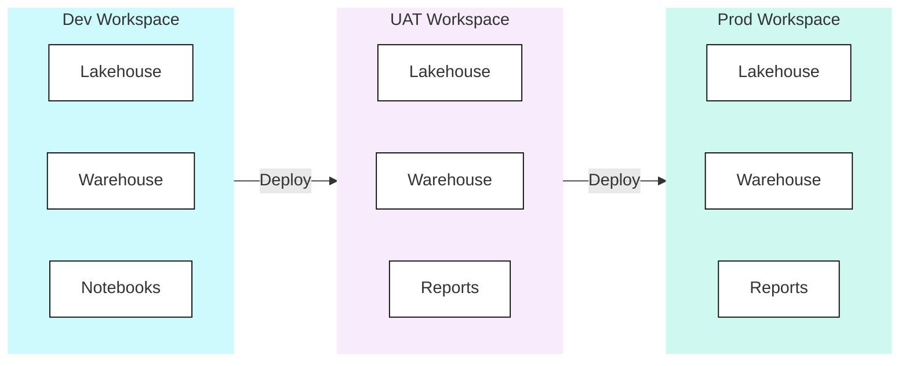
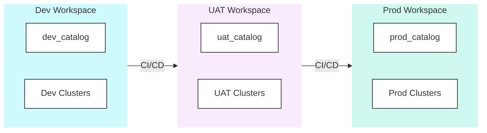
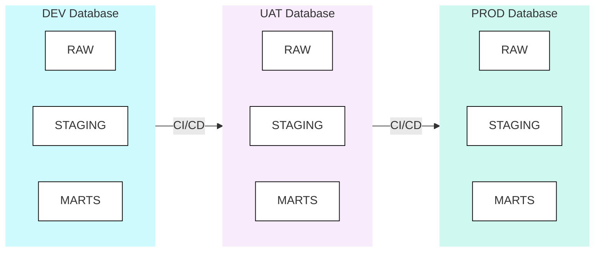
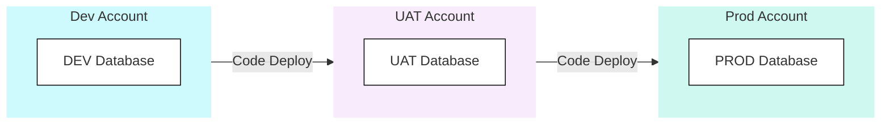
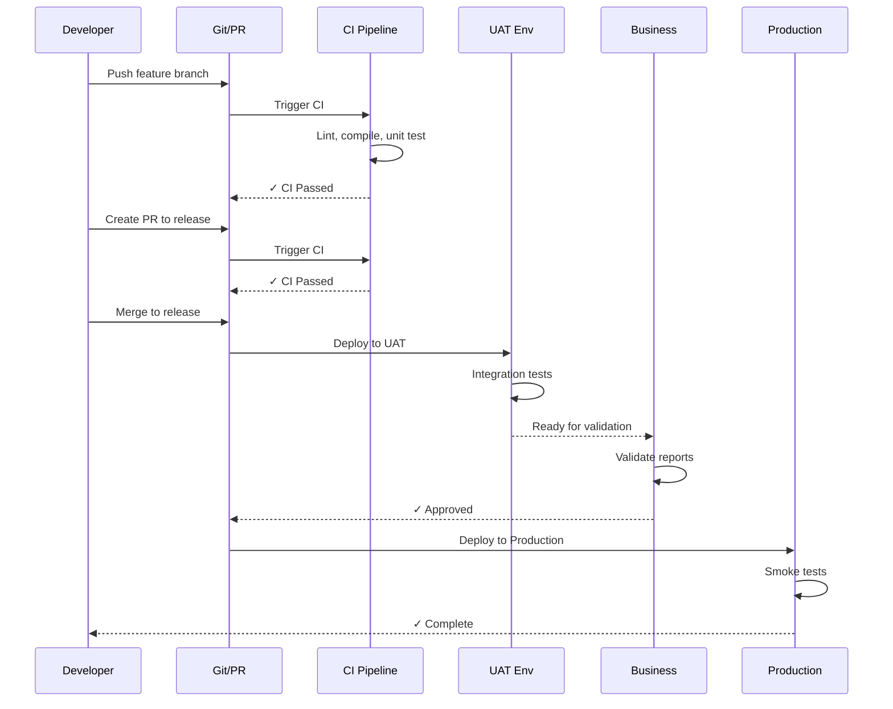
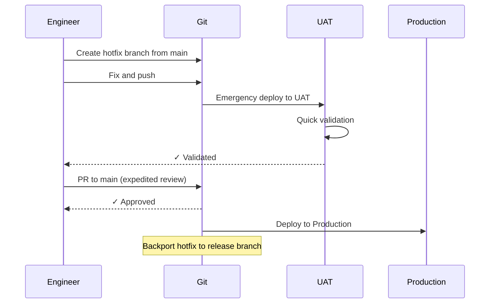

## Environment Strategy

**Safe Experimentation** - Environment strategy is about creating space for experimentation without risking production. The right strategy depends on team size, release cadence, and regulatory requirements.

Environment strategy defines how you separate development, testing, and production workloads. This encompasses isolation mechanisms, data strategies, and promotion paths between environments.

<Callout type="question">How do we enable rapid development while protecting production from untested changes?</Callout>

### Scoring Template

#### Capability Matrix

<CapabilityMatrix component="opsEnvironment" />

#### Adjusting Weights for Client Context

| Client Profile | Adjust Weights |
|----------------|----------------|
| **Regulated industry** | Environment Isolation + 30%, Environment Parity + 20% |
| **Rapid iteration / startup** | Promotion Paths + 25%, Data Strategy + 20% |
| **Large datasets** | Data Strategy + 30% |
| **Multi-team platform** | Environment Isolation + 25%, Environment Parity + 20% |
| **Simple dev/prod only** | Promotion Paths - 15%, Environment Parity - 10% |

### Environment Purposes

| Environment | Purpose | Users | Data |
|-------------|---------|-------|------|
| **Development** | Active development, experimentation | Engineers | Synthetic or sampled |
| **CI** | Automated testing, ephemeral | CI/CD pipelines | Minimal test data |
| **UAT** | Integration testing, validation | Engineers + Business | Production-like |
| **Pre-Prod** | Final validation, regression | Automated tests | Production clone |
| **Production** | Live business operations | End users | Real data |

### Platform Comparison

| Aspect | Fabric | Databricks | Snowflake |
|--------|--------|------------|-----------|
| **Isolation Unit** | Workspace | Workspace | Database/Account |
| **Data Isolation** | Workspace-level | Catalog-level | Database-level |
| **Promotion Path** | Deployment Pipelines | Terraform/API | dbt/Scripts |
| **Cost Isolation** | Shared capacity | Separate clusters | Separate warehouses |
| **Clone Support** | Limited | Zero-copy | Zero-copy |

<PlatformTabs>

<PlatformTabsFabric>

#### Workspace-Based Isolation

#### Configuration

| Aspect | Dev | UAT | Prod |
|--------|-----|-----|------|
| **Capacity** | F8 (shared) | F16 (shared) | F64 |
| **Git Branch** | `feature/*` | `release/*` | `main` |
| **Access** | Engineers | Engineers + Business | Controlled |
| **Data** | Sampled | Production-like | Production |

#### Fabric Deployment Pipeline Setup

1. **Create Pipeline:** Admin Portal → Deployment Pipelines → Create
2. **Assign Workspaces:** Assign Dev, UAT, Prod workspaces to stages
3. **Configure Rules:** Set deployment rules for different item types
4. **Deploy:** UI or API-triggered promotion

</PlatformTabsFabric>

<PlatformTabsDatabricks>

#### Workspace-Based Isolation

Each catalog follows a medallion structure (bronze → silver → gold) managed by Unity Catalog. Terraform or Asset Bundles handle the promotion of code and configuration between workspaces.

#### Data Strategy

| Environment | Data Source | Refresh |
|-------------|-------------|---------|
| **Dev** | Sampled from prod | On-demand |
| **UAT** | Clone from prod | Before testing |
| **Prod** | Live data | Continuous |

</PlatformTabsDatabricks>

<PlatformTabsSnowflake>

#### Database-Based Isolation

Each database has dedicated warehouses (DEV_WH, UAT_WH, PROD_WH) for cost isolation and workload separation.

#### Account-Level Isolation (High Security)

For regulated environments, separate accounts provide stronger isolation:

#### Zero-Copy Clone Strategy

Snowflake's zero-copy clones create instant, storage-free copies of production databases - ideal for UAT refresh and ephemeral CI environments that are cloned before each run and dropped after.

</PlatformTabsSnowflake>

</PlatformTabs>

### Data Strategies

| Strategy | Best For | Pros | Cons |
|----------|----------|------|------|
| **Sampled Data** | Dev environments, large datasets | Fast, cheap, safe if anonymised | May miss edge cases |
| **Zero-Copy Clone** | UAT, Pre-prod, testing | Production-realistic, instant, no storage cost initially | Diverges over time, may contain PII |
| **Synthetic Data** | Dev, demos, GDPR compliance | No PII risk, controllable edge cases | May not represent production patterns |
| **Masked Production** | UAT with compliance requirements | Realistic patterns, PII protected | Complex to maintain, may impact testing |

### Promotion Workflow

#### Standard Promotion Flow

#### Emergency Hotfix Flow

### Anti-Patterns

<AntiPatterns patterns={[
  {
    title: "The Perpetual Dev",
    problem: "Code stays in dev for months. Massive merge to UAT. Integration nightmare.",
    example: "A team worked on a \"big refactor\" in dev for 4 months. When they finally merged to UAT, 87 conflicts. Testing took 3 weeks. Rollback risk was massive. The release was delayed 2 months while they untangled dependencies.",
    prevention: "Continuous integration. Small, frequent merges. Feature flags for incomplete work."
  },
  {
    title: "The Production Shortcut",
    problem: "\"Just this once\" change made directly in prod. Works. Later change in dev overwrites it.",
    example: "An analyst made a \"quick fix\" directly in production SQL. It worked. A week later, a deployment from dev overwrote it. The fix was lost. Nobody knew why dashboards broke again. It took 2 days to rediscover the issue.",
    prevention: "No direct prod access. All changes through CI/CD. Audit logging."
  },
  {
    title: "The Stale UAT",
    problem: "UAT data is 6 months old. Tests pass. Production fails on new data patterns.",
    example: "UAT was refreshed once at project start. Six months later, testing a new feature worked perfectly in UAT. In production, it failed on a new product category that didn't exist when UAT was last refreshed. Emergency rollback required.",
    prevention: "Regular UAT refresh. Clone before major testing. Freshness checks."
  },
  {
    title: "The Snowflake Environment",
    problem: "Each environment configured differently. \"Works in UAT\" doesn't mean \"works in prod.\"",
    example: "Dev used Python 3.9, UAT used 3.10, production used 3.11. Different datetime parsing behaviour. A transformation tested perfectly through UAT, failed in production with cryptic errors. Took 8 hours to identify the environment discrepancy.",
    prevention: "Configuration as code. Environment parity. Automated drift detection."
  }
]} />

### Checklist: Environment Setup

#### Initial Setup
- [ ] Define environment purposes and users
- [ ] Choose isolation mechanism (workspace/database/account)
- [ ] Configure access control per environment
- [ ] Set up CI/CD pipelines for each environment
- [ ] Establish data strategy (sample/clone/synthetic)

#### Ongoing Operations
- [ ] Regular UAT data refresh
- [ ] Environment parity checks
- [ ] Access review quarterly
- [ ] Cost monitoring per environment
- [ ] Cleanup of stale CI environments
