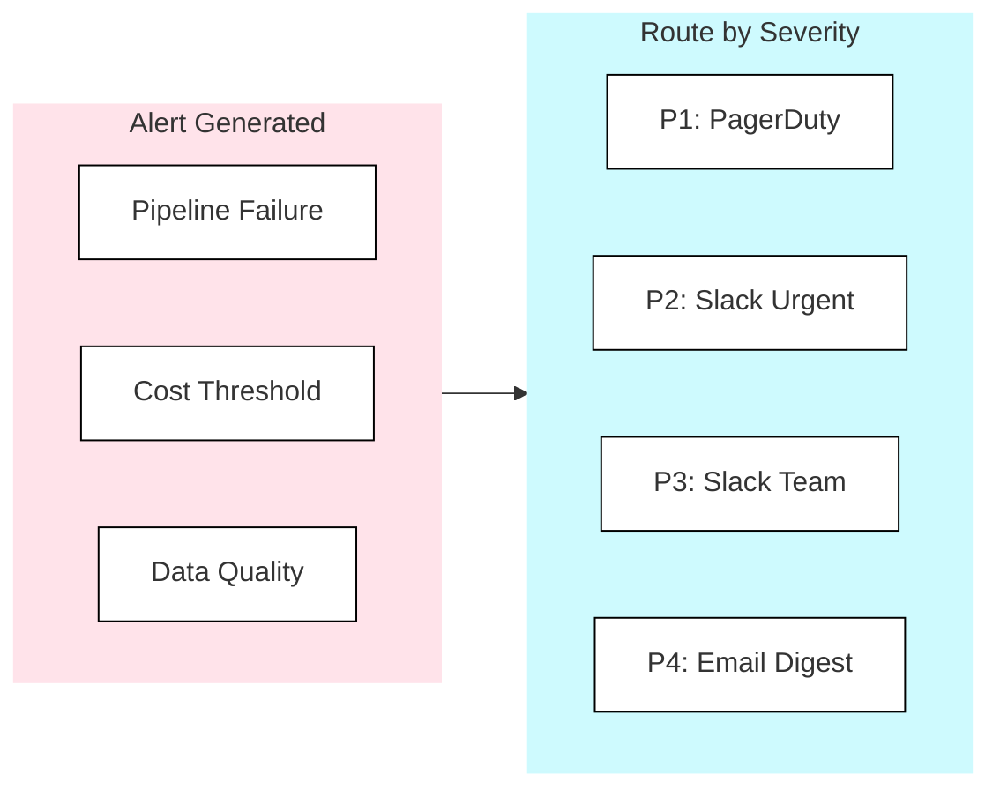

## Observability

**Know Before They Ask** - Good observability means you know about problems before users do. Great observability means you understand not just what broke, but why-and how to prevent it next time.

Observability provides visibility into platform health, performance, and failures. This encompasses monitoring, alerting, logging, and the tools needed to debug issues when they occur.

<Callout type="question">Can we detect problems quickly, understand their root cause, and resolve them before business impact?</Callout>

### Scoring Template

#### Capability Matrix

<CapabilityMatrix component="opsObservability" />

#### Adjusting Weights for Client Context

| Client Profile | Adjust Weights |
|----------------|----------------|
| **SLA-critical workloads** | Alerting + 30%, Native Monitoring + 20% |
| **Existing Datadog/Prometheus stack** | External Integration + 35% |
| **Debugging-heavy team** | Query & Job History + 30% |
| **Simple batch pipelines** | Alerting - 15%, Native Monitoring + 20% |
| **Audit / compliance** | Query & Job History + 25%, Native Monitoring + 15% |

### The Three Pillars

| Pillar | Purpose | Examples |
|--------|---------|----------|
| **Metrics** | Quantitative measurements over time | Query duration, success rate, cost |
| **Logs** | Detailed event records | Query text, error messages, audit trail |
| **Traces** | Request flow across components | Pipeline lineage, job dependencies |

### Platform Comparison

| Capability | Fabric | Databricks | Snowflake |
|------------|--------|------------|-----------|
| **Native Dashboards** | Admin Portal | Cluster Metrics | Account Usage |
| **Query History** | Limited | SQL Warehouse History | Query History (90d) |
| **Job Monitoring** | Pipeline Runs | Workflow Runs | Task History |
| **Alerting** | Email, Teams | Webhooks, PagerDuty | Email, Webhooks |
| **External Integration** | Azure Monitor | Datadog, Prometheus | Datadog, Prometheus |

### What to Monitor

#### Performance Metrics

| Metric | Description | Alert Threshold |
|--------|-------------|-----------------|
| **Query Duration** | Time to complete queries | P95 > 2x baseline |
| **Job Runtime** | Pipeline execution time | > expected + 50% |
| **Queue Time** | Time waiting for resources | > 30 seconds |
| **Rows Processed** | Data volume | < 50% expected |
| **Error Rate** | Failed queries/jobs | > 1% |

#### Reliability Metrics

| Metric | Description | Alert Threshold |
|--------|-------------|-----------------|
| **Success Rate** | % of successful runs | < 99% |
| **Data Freshness** | Time since last update | > SLA |
| **Pipeline Completion** | Jobs completing on time | Miss SLA |
| **Test Pass Rate** | % of data tests passing | < 100% |

#### Cost Metrics

| Metric | Description | Alert Threshold |
|--------|-------------|-----------------|
| **Daily Spend** | Compute cost per day | > budget + 20% |
| **Cost per Pipeline** | Attribution to workload | Anomaly detection |
| **Storage Growth** | Data volume increase | > expected + 50% |
| **Idle Compute** | Unused resources | > 30% capacity |

<PlatformTabs>

<PlatformTabsFabric>

#### Monitoring Capabilities

Fabric provides monitoring through the Admin Portal and Azure Monitor integration.

| Metric Area | Available Metrics |
|-------------|-------------------|
| **Capacity** | Utilization %, throttling, queued operations |
| **Workspace** | Item counts, sizes, activity |
| **Refresh** | Refresh history, duration, success/failure |
| **Gateway** | Connection status, performance |

#### Alerting & Integration

| Aspect | Detail |
|--------|--------|
| **Native alerting** | Capacity utilization alerts via Admin Portal |
| **Azure Monitor** | Full integration - custom alert rules, Log Analytics, dashboards |
| **Action groups** | Email, Teams, PagerDuty, Logic Apps, webhooks |
| **Key metrics** | Capacity utilization, throttling %, refresh failures |

<Callout type="info">Azure Monitor provides the most comprehensive alerting for Fabric - set multi-condition rules on capacity utilization, refresh failures, and gateway health with configurable action groups.</Callout>

</PlatformTabsFabric>

<PlatformTabsDatabricks>

#### Monitoring Capabilities

Databricks provides system tables for comprehensive self-service monitoring.

| System Table | What It Tracks |
|--------------|----------------|
| **system.query.history** | Query text, duration, user, rows produced (30d) |
| **system.lakeflow.job_runs** | Job name, result state, duration |
| **system.compute.cluster_metrics** | CPU, memory, worker count per cluster |
| **system.billing.usage** | DBU consumption by workspace, SKU, job |

#### Alerting & Integration

| Aspect | Detail |
|--------|--------|
| **SQL Alerts** | Schedule SQL queries, alert on thresholds (e.g., long-running queries > 30 min) |
| **Webhook destinations** | PagerDuty, Slack, email, custom endpoints |
| **External integration** | Datadog, Prometheus, Grafana - native exporters |
| **Cost monitoring** | System billing tables for per-job, per-workspace cost attribution |

<Callout type="info">Databricks system tables are queryable with SQL - build custom monitoring dashboards, trend analysis, and anomaly detection directly within the platform.</Callout>

</PlatformTabsDatabricks>

<PlatformTabsSnowflake>

#### Monitoring Capabilities

Snowflake provides Account Usage views and Information Schema for monitoring.

| View / Feature | What It Tracks |
|----------------|----------------|
| **query_history** | Query text, duration, bytes scanned, user (90d) |
| **warehouse_load_history** | Queries running, queued, credits used |
| **task_history** | Task runs, success/failure, duration |
| **resource_monitors** | Credit consumption with alert thresholds |

#### Alerting & Integration

| Aspect | Detail |
|--------|--------|
| **Resource Monitors** | Credit quotas with notify at 75%, suspend at 100% |
| **Alerts (SQL)** | Schedule condition checks, trigger notifications |
| **Email notifications** | Native email for resource monitors and task failures |
| **External integration** | Datadog, Prometheus via partner connectors |

<Callout type="info">Snowflake Resource Monitors are the primary cost guardrail - set credit quotas per warehouse with automatic notification and suspension thresholds.</Callout>

</PlatformTabsSnowflake>

</PlatformTabs>

### Data Quality Monitoring

Data quality monitoring ensures the data itself - not just the infrastructure - is healthy. Tools like dbt tests and Elementary provide automated validation of schema, freshness, volume, and business rules.

| Tool | What It Does | Key Benefit |
|------|--------------|-------------|
| **dbt tests** | Schema validation, uniqueness, not-null, accepted values, freshness | Built into the transformation layer |
| **Elementary** | Automated anomaly detection, volume monitoring, freshness tracking | Zero-config observability on top of dbt |
| **Great Expectations** | Flexible data validation framework | Platform-agnostic, rich assertion library |
| **Monte Carlo / Atlan** | End-to-end data observability SaaS | Automated lineage, anomaly detection, incident management |

### Alerting Strategy

#### Alert Tiers

| Tier | Severity | Response Time | Examples |
|------|----------|---------------|----------|
| **P1 Critical** | Page immediately | 15 min | Production down, SLA breach |
| **P2 High** | Alert + Slack | 1 hour | Pipeline failed, data delayed |
| **P3 Medium** | Slack | 4 hours | Warning thresholds, non-critical failure |
| **P4 Low** | Daily digest | Next day | Informational, trends |

#### Alert Routing

#### Reducing Alert Fatigue

| Practice | Implementation |
|----------|----------------|
| **Alert on symptoms, not causes** | Alert on "dashboard stale" not "job failed" |
| **Use multi-condition alerts** | Fail + retry fail + retry fail |
| **Set appropriate thresholds** | Based on baseline, not arbitrary |
| **Group related alerts** | One alert for pipeline, not per-task |
| **Include runbook links** | Every alert has a response guide |

### Dashboards

Every data platform should have two core dashboards:

| Dashboard | Purpose | Key Metrics |
|-----------|---------|-------------|
| **Platform Health** | Operational overview for daily standup | Pipeline success rate, query P95, daily cost, recent failures |
| **Data Freshness** | SLA compliance for business stakeholders | Table last-updated time, SLA status, freshness trends |

<Callout type="info">If nobody looks at a dashboard, delete it. Dashboards should drive daily standups or trigger investigations - not exist for decoration.</Callout>

### Incident Response

#### Runbook Template

Every alert should link to a runbook with the following structure:

| Section | Content |
|---------|---------|
| **Symptoms** | What the alert means, what users will see |
| **Impact** | Which downstream tables/dashboards are affected |
| **Diagnosis Steps** | Ordered checklist: check logs → verify connectivity → compare schemas → review recent changes |
| **Resolution Steps** | Fix per root cause: connection issue, schema change, data issue, code bug |
| **Escalation** | P1: page on-call, P2: Slack #data-incidents, P3: ticket for next business day |
