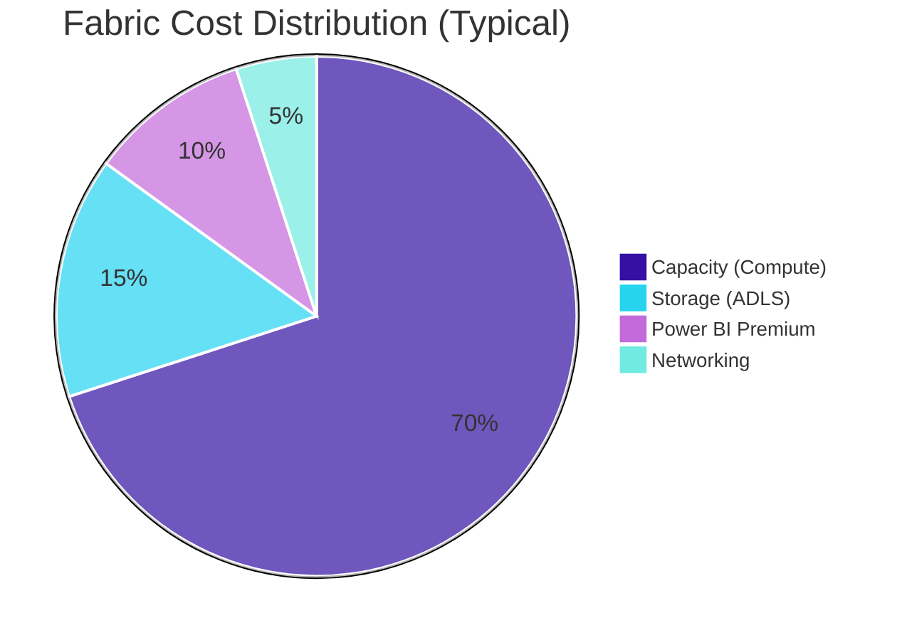
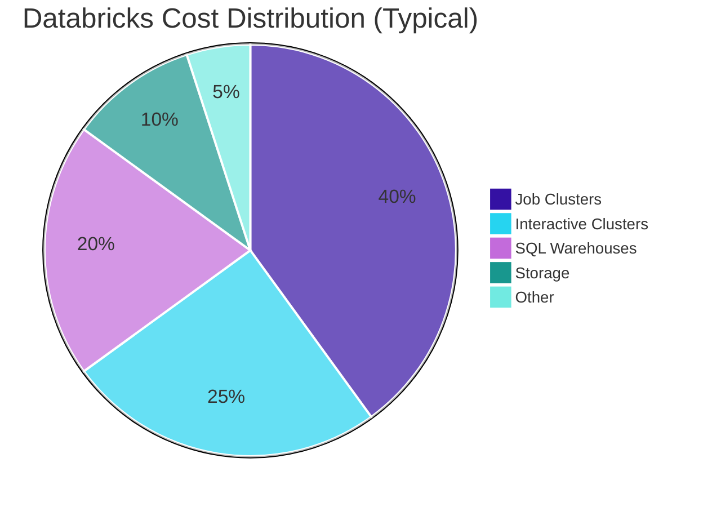
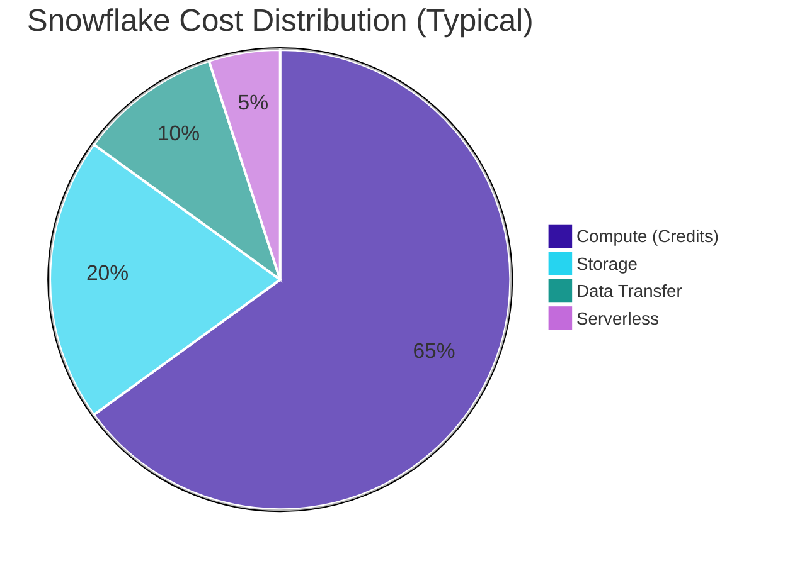

## Cost Management

**Sustainable Platforms** - A platform that delivers value but breaks the budget isn't sustainable. Cost management isn't about cutting spend-it's about maximising value per dollar and preventing surprises.

Cost management encompasses monitoring, forecasting, and optimising platform spend. This includes understanding cost drivers, implementing controls, and creating accountability through attribution and chargeback.

<Callout type="question">Do we know what we're spending, why, and how to optimise it without sacrificing value?</Callout>

### Scoring Template

#### Capability Matrix

<CapabilityMatrix component="opsCost" />

#### Adjusting Weights for Client Context

| Client Profile | Adjust Weights |
|----------------|----------------|
| **Budget-constrained** | Budget Controls + 30%, Optimisation Tools + 25% |
| **Multi-team chargeback** | Cost Attribution + 35%, Cost Visibility + 20% |
| **Predictable spend priority** | Budget Controls + 30% |
| **Large-scale platform** | Cost Visibility + 25%, Cost Attribution + 20% |
| **Startup / lean operations** | Optimisation Tools + 25%, Cost Attribution - 15% |

### Cost Model Comparison

| Aspect | Fabric | Databricks | Snowflake |
|--------|--------|------------|-----------|
| **Model** | Capacity-based | Usage-based (DBU) | Usage-based (Credits) |
| **Billing Unit** | Capacity Units (CU) | Databricks Units | Credits |
| **Compute** | Included in capacity | Per-second | Per-second |
| **Storage** | ADLS rates (separate) | Cloud storage (separate) | Per TB/month |
| **Predictability** | <RatingBadge rating="Easy" /> | <RatingBadge rating="Hard" /> | <RatingBadge rating="Medium" /> |
| **Burst Handling** | Limited by tier | Elastic | Elastic |
| **Idle Cost** | Full capacity cost | None (if terminated) | None (if suspended) |

### Understanding Cost Drivers

<PlatformTabs>

<PlatformTabsFabric>

| Driver | Description | Control Lever |
|--------|-------------|---------------|
| **Capacity Tier** | F2 to F2048 | Right-size based on utilisation |
| **Capacity Hours** | 24/7 vs business hours | Pause dev capacities |
| **Storage** | OneLake + ADLS | Data lifecycle, compression |
| **Networking** | Cross-region, egress | Architecture decisions |

#### Cost Control

| Strategy | Detail |
|----------|--------|
| **Pause dev capacity** | Suspend non-prod capacities outside business hours (save 50-70%) |
| **Right-size tiers** | Start at F2-F4 for dev, F8-F16 for small teams, scale when >70% sustained |
| **Capacity scheduling** | Use Azure Automation to pause/resume on a schedule |
| **Monitor throttling** | Admin Portal shows throttling % - scale up if consistently throttled |

##### Capacity Sizing Guide

| Workload Profile | Recommended Start | Scale Trigger |
|------------------|-------------------|---------------|
| **Dev/Test** | F2-F4 | >70% sustained |
| **Small Team** | F8-F16 | >70% sustained |
| **Department** | F32-F64 | >70% sustained |
| **Enterprise** | F128+ | >70% sustained |

</PlatformTabsFabric>

<PlatformTabsDatabricks>

| Driver | Description | Control Lever |
|--------|-------------|---------------|
| **Cluster Size** | Node count x hours | Auto-scaling, right-sizing |
| **Cluster Type** | Interactive vs Job | Use job clusters for batch |
| **Instance Type** | VM selection | Match to workload needs |
| **Spot Instances** | Preemptible VMs | Use for fault-tolerant jobs (save 60-90%) |
| **Storage** | Delta tables, cloud storage | Lifecycle, OPTIMIZE, VACUUM |

#### Cost Control

| Strategy | Detail |
|----------|--------|
| **Auto-terminate** | Enforce 30-min auto-terminate via cluster policies (save 20-40%) |
| **Job clusters** | Use ephemeral job clusters instead of interactive for batch workloads |
| **Spot instances** | Use SPOT_WITH_FALLBACK for fault-tolerant jobs (save 60-90% on compute) |
| **Cluster policies** | Restrict node types, max workers, enforce tags via Terraform-managed policies |
| **System billing tables** | Query `system.billing.usage` for per-job, per-workspace cost attribution |

</PlatformTabsDatabricks>

<PlatformTabsSnowflake>

| Driver | Description | Control Lever |
|--------|-------------|---------------|
| **Warehouse Size** | XS to 6XL | Match to workload |
| **Warehouse Hours** | Active time | Auto-suspend |
| **Concurrency** | Multi-cluster scaling | Max cluster limits |
| **Storage** | Compressed TB | Data lifecycle |
| **Time Travel** | Historical data | Retention settings |

#### Cost Control

| Strategy | Detail |
|----------|--------|
| **Auto-suspend** | Set aggressive auto-suspend: 1 min (dev), 2 min (BI), 5 min (ETL) - save 20-40% |
| **Resource Monitors** | Credit quotas with notify at 50/75/90% and suspend at 100% |
| **Right-size warehouses** | Start small - most queries run fine on Small; review P95 query times monthly |
| **Query tagging** | Tag queries with team/project for cost attribution and chargeback |
| **Storage lifecycle** | Monitor tables >1GB not modified in 90+ days; adjust Time Travel retention |

</PlatformTabsSnowflake>

</PlatformTabs>

### Cost Attribution & Chargeback

#### Tagging Strategy

| Tag | Purpose | Example Values |
|-----|---------|----------------|
| `CostCenter` | Finance allocation | `cc-1234`, `engineering` |
| `Team` | Team ownership | `data-eng`, `analytics` |
| `Project` | Project attribution | `customer-360`, `revenue-dash` |
| `Environment` | Env identification | `dev`, `uat`, `prod` |

#### Implementation by Platform

| Platform | Tagging Mechanism | Attribution Source |
|----------|-------------------|--------------------|
| **Fabric** | Azure resource tags, workspace naming | Azure Cost Management |
| **Databricks** | Cluster tags, job tags, custom Spark conf | `system.billing.usage` table |
| **Snowflake** | Query tags (`ALTER SESSION SET QUERY_TAG`), warehouse per team | `account_usage.query_history` |

### Cost Optimization Strategies

#### Quick Wins

| Strategy | Platform | Savings Potential |
|----------|----------|-------------------|
| **Auto-suspend** | Snowflake | 20-40% |
| **Auto-terminate** | Databricks | 20-40% |
| **Pause dev capacity** | Fabric | 50-70% |
| **Spot instances** | Databricks | 60-90% on compute |
| **Right-size warehouses** | Snowflake | 10-30% |
| **Reserved capacity** | All | 20-40% |

#### Medium-Term Optimization

| Strategy | Implementation |
|----------|----------------|
| **Query optimization** | Review top 10 expensive queries monthly |
| **Materialization strategy** | Balance compute vs storage costs |
| **Partition pruning** | Ensure queries filter on partition columns |
| **Incremental models** | Avoid full refresh where possible |
| **Data lifecycle** | Archive/delete unused data |

### Budgeting & Forecasting

#### Budget Structure

| Budget Type | Scope | Review Cadence |
|-------------|-------|----------------|
| **Annual** | Platform total | Quarterly |
| **Quarterly** | By team/project | Monthly |
| **Monthly** | By workload | Weekly |
| **Daily** | Anomaly detection | Real-time |

#### Alert Thresholds

| Threshold | Action |
|-----------|--------|
| **50% of monthly budget** | Informational notification |
| **75% of monthly budget** | Warning, review spending |
| **90% of monthly budget** | Alert, identify cause |
| **100% of monthly budget** | Critical, immediate action |
| **Daily anomaly (>2x)** | Investigate spike |

### Cost Dashboard

Every platform should have a cost dashboard covering these key areas:

| Section | Key Metrics |
|---------|-------------|
| **Month-to-Date** | Current spend, % of budget used, projected end-of-month |
| **Daily Trend** | Spend per day with trendline, anomaly highlighting |
| **Cost by Team** | Attribution breakdown by team/project tags |
| **Cost by Workload** | ETL, BI, ML, ad-hoc - identify where money goes |
| **Top Cost Items** | Top 5 most expensive jobs/warehouses/clusters with week-over-week change |

<Callout type="info">The cost dashboard should be reviewed weekly in team standups. If nobody looks at it, costs will drift. Tie budget adherence to team OKRs for accountability.</Callout>
