## Microsoft Fabric

**The Unified Analytics Platform** - Fabric brings together Power BI, Data Factory, Synapse, and more into a single SaaS experience. Best suited for Microsoft-centric organisations seeking integrated analytics with minimal operational overhead.

Microsoft Fabric is a unified analytics platform that integrates data engineering, data science, real-time analytics, and business intelligence into a single SaaS offering built on OneLake.

#### Key Characteristics

| Aspect | Description |
|--------|-------------|
| **Architecture** | Unified SaaS on OneLake (Delta Lake) |
| **Primary Languages** | SQL, Power Query M, Python, Spark |
| **Pricing Model** | Capacity-based (CU) |
| **Target Audience** | Microsoft-native organisations, BI-centric teams |
| **Maturity** | GA (2023), rapidly evolving |

#### Platform Components

```mermaid
flowchart TB
    subgraph FABRIC[Microsoft Fabric]
        subgraph INGEST[Ingestion]
            DF[Data Factory]
            DFG2[Dataflows Gen2]
            ES[Event Streams]
        end

        subgraph STORE[Storage]
            OL[OneLake]
            LH[Lakehouse]
            WH[Warehouse]
        end

        subgraph PROCESS[Processing]
            SP[Spark]
            SQL[SQL Analytics]
            NB[Notebooks]
        end

        subgraph SERVE[Serving]
            PBI[Power BI]
            SM[Semantic Models]
            RT[Real-Time Dashboards]
        end

        subgraph GOVERN[Governance]
            PV[Purview Integration]
            EN[Entra ID]
        end
    end

    INGEST --> STORE
    STORE --> PROCESS
    PROCESS --> SERVE
    GOVERN -.-> INGEST
    GOVERN -.-> STORE
    GOVERN -.-> PROCESS
    GOVERN -.-> SERVE

    style FABRIC fill:#FFF,stroke:#FFF
    style INGEST fill:#F3F3F7,stroke:#D1D0DC
    style STORE fill:#CFF8F0,stroke:#18978E
    style PROCESS fill:#EED6F8,stroke:#C36BDB
    style SERVE fill:#F7EBFC,stroke:#C36BDB
    style GOVERN fill:#FFE3EA,stroke:#FF6196
    style DF fill:#fff,stroke:#000
    style DFG2 fill:#fff,stroke:#000
    style ES fill:#fff,stroke:#000
    style OL fill:#fff,stroke:#000
    style LH fill:#fff,stroke:#000
    style WH fill:#fff,stroke:#000
    style SP fill:#fff,stroke:#000
    style SQL fill:#fff,stroke:#000
    style NB fill:#fff,stroke:#000
    style PBI fill:#fff,stroke:#000
    style SM fill:#fff,stroke:#000
    style RT fill:#fff,stroke:#000
    style PV fill:#fff,stroke:#000
    style EN fill:#fff,stroke:#000
```

### When to Choose Fabric

#### Strong Fit ✓

| Scenario | Why Fabric Works |
|----------|------------------|
| **Deep Microsoft ecosystem** | Native integration with M365, Dynamics, Azure AD |
| **Power BI is primary BI tool** | Direct Lake, semantic models, native experience |
| **SQL-focused team** | T-SQL warehouse, familiar tooling |
| **Cost predictability required** | Capacity-based pricing, fixed monthly cost |
| **Unified platform preference** | Single vendor, integrated experience |
| **Low operational overhead** | SaaS, Microsoft-managed infrastructure |

#### Weak Fit ✗

| Scenario | Why Fabric Struggles |
|----------|---------------------|
| **Advanced ML/MLOps** | AI capabilities still maturing |
| **Multi-cloud requirement** | Azure-only platform |
| **Open format priority** | OneLake is Delta, but ecosystem is Microsoft-centric |
| **Heavy streaming workloads** | Event Streams less mature than Spark Streaming |
| **Non-Power BI standardisation** | Other BI tools don't get native benefits |

### Component Scores

#### Summary

| Component | Score | Assessment |
|-----------|-------|------------|
| Ingestion | 4.7 | Excellent batch connectors, strong Dataflows Gen2, good streaming |
| Storage | 4.6 | OneLake unified storage, Delta format, full ACID |
| Compute | 4.0 | Capacity-based, predictable but less flexible than usage-based |
| Transformation | 4.3 | T-SQL Warehouse, Spark SQL, dbt supported |
| Orchestration | 4.4 | Data Factory pipelines, end-to-end coverage |
| BI & Semantic | 5.0 | Best-in-class Power BI, Direct Lake, semantic models |
| Data Science & ML | 4.0 | Azure AI Foundry, Azure ML integration, improving rapidly |
| Generative AI | 4.5 | Azure OpenAI, AI Foundry model catalog, strong embeddings |
| Agentic AI | 4.5 | Azure AI Agent Service, Semantic Kernel, Content Safety |
| Governance | 3.7 | Purview catalog, sensitivity labels, DQ framework maturing |
| Security | 4.6 | Entra ID native, Private Link, Key Vault, strong compliance |
| Operations | 3.8 | Git integration, deployment pipelines, limited IaC |

**Overall Component Score: 4.3**

<PlatformRadarChart
    title="Microsoft Fabric — Component Scores"
    data='[{"component":"Ingestion","score":4.7},{"component":"Storage","score":4.6},{"component":"Compute","score":4.0},{"component":"Transformation","score":4.3},{"component":"Orchestration","score":4.4},{"component":"BI & Semantic","score":5.0},{"component":"DS & ML","score":4.0},{"component":"GenAI","score":4.5},{"component":"Agentic AI","score":4.5},{"component":"Governance","score":3.7},{"component":"Security","score":4.6},{"component":"Operations","score":3.8}]'
    color="#3411A3"
    strokeColor="#19105B"
/>

#### Detailed Component Assessment

##### Ingestion (4.7)

| Capability | Score | Notes |
|------------|-------|-------|
| Batch Ingestion | <ScoreBadge value={5} showLabel={false} size="sm" /> | Dataflows Gen2, Data Factory pipelines |
| Native Connectors | <ScoreBadge value={5} showLabel={false} size="sm" /> | Excellent Microsoft ecosystem coverage (150+) |
| CDC Support | <ScoreBadge value={4} showLabel={false} size="sm" /> | Supported via Data Factory, Mirroring |
| Schema Evolution | <ScoreBadge value={5} showLabel={false} size="sm" /> | Handles additive changes well via Delta |
| Error Handling | <ScoreBadge value={4} showLabel={false} size="sm" /> | Good retry and monitoring through pipelines |
| Streaming Ingestion | <ScoreBadge value={4} showLabel={false} size="sm" /> | Event Streams, Event Hub integration |

**Tools:** Dataflows Gen2, Data Factory, Event Streams, Mirroring

<DosAndDonts dosLabel="Strengths" dontsLabel="Limitations"
  dos={[
    {text: "150+ native connectors across Microsoft and third-party sources"},
    {text: "Low-code Dataflows Gen2 for simple ingestion scenarios"},
    {text: "Mirroring for database replication without pipelines"}
  ]}
  donts={[
    {text: "Streaming less flexible than Spark Structured Streaming"},
    {text: "Complex CDC requires additional configuration"}
  ]}
/>

##### Storage (4.6)

| Capability | Score | Notes |
|------------|-------|-------|
| Data Format Support | <ScoreBadge value={5} showLabel={false} size="sm" /> | Strong structured, semi-structured; unstructured via OneLake + Azure |
| Storage/Compute Separation | <ScoreBadge value={5} showLabel={false} size="sm" /> | OneLake separates storage from compute |
| Time Travel | <ScoreBadge value={4} showLabel={false} size="sm" /> | Supported via Delta; retention tied to capacity |
| Cloning & Data Sharing | <ScoreBadge value={4} showLabel={false} size="sm" /> | Supported, maturing; OneLake shortcuts |
| ACID Transactions | <ScoreBadge value={5} showLabel={false} size="sm" /> | Full ACID via Delta |

**Tools:** OneLake, Lakehouse, Warehouse

<DosAndDonts dosLabel="Strengths" dontsLabel="Limitations"
  dos={[
    {text: "Unified storage across all Fabric workloads via OneLake"},
    {text: "Shortcuts to external data without copying"},
    {text: "Automatic Delta V-Order optimisation"}
  ]}
  donts={[
    {text: "Azure-only - no multi-cloud portability"},
    {text: "Cloning less mature than Snowflake zero-copy or Delta shallow clones"}
  ]}
/>

##### Compute (4.0)

| Capability | Score | Notes |
|------------|-------|-------|
| Elastic Scaling | <ScoreBadge value={4} showLabel={false} size="sm" /> | Within capacity limits |
| Workload Isolation | <ScoreBadge value={4} showLabel={false} size="sm" /> | Capacity allocation per workspace |
| Job vs Interactive | <ScoreBadge value={4} showLabel={false} size="sm" /> | Both supported, capacity shared |
| Cold Start | <ScoreBadge value={4} showLabel={false} size="sm" /> | Generally fast within capacity |
| Cost Attribution | <ScoreBadge value={4} showLabel={false} size="sm" /> | Capacity-based tracking, workspace visibility |

**Tools:** Spark pools, SQL endpoint, capacity units

<DosAndDonts dosLabel="Strengths" dontsLabel="Limitations"
  dos={[
    {text: "Predictable cost model - no unexpected spikes"},
    {text: "No cluster management; Microsoft-managed infrastructure"},
    {text: "Automatic compute optimisation"}
  ]}
  donts={[
    {text: "Less flexibility than usage-based cluster models"},
    {text: "Burst workloads are constrained by capacity tier"}
  ]}
/>

##### Transformation (4.3)

| Capability | Score | Notes |
|------------|-------|-------|
| SQL-First | <ScoreBadge value={5} showLabel={false} size="sm" /> | T-SQL Warehouse, Spark SQL in Lakehouse |
| Non-SQL Processing | <ScoreBadge value={4} showLabel={false} size="sm" /> | PySpark in notebooks, less mature than Databricks |
| dbt Integration | <ScoreBadge value={4} showLabel={false} size="sm" /> | Supported adapter, newer and developing |
| Performance Optimisation | <ScoreBadge value={4} showLabel={false} size="sm" /> | V-Order optimisation, Direct Lake mode |
| Testing & Quality | <ScoreBadge value={4} showLabel={false} size="sm" /> | dbt tests, native validation improving |

**Tools:** Warehouse (T-SQL), Lakehouse (Spark SQL), Notebooks, dbt

<DosAndDonts dosLabel="Strengths" dontsLabel="Limitations"
  dos={[
    {text: "Familiar T-SQL for SQL Server and Synapse teams"},
    {text: "dbt adapter available for modern transformation workflows"},
    {text: "Visual lineage in Data Factory pipelines"}
  ]}
  donts={[
    {text: "Complex Spark transformations less mature than Databricks"},
    {text: "dbt adapter newer - some advanced features still developing"}
  ]}
/>

##### Orchestration (4.4)

| Capability | Score | Notes |
|------------|-------|-------|
| DAG Definition | <ScoreBadge value={4} showLabel={false} size="sm" /> | Data Factory pipelines, visual designer |
| End-to-End Pipeline | <ScoreBadge value={5} showLabel={false} size="sm" /> | Single pipeline spans ingestion to Power BI refresh |
| Scheduling | <ScoreBadge value={5} showLabel={false} size="sm" /> | Time, tumbling window, event triggers |
| Observability | <ScoreBadge value={4} showLabel={false} size="sm" /> | Pipeline monitoring, run history |
| Retry & Failure | <ScoreBadge value={4} showLabel={false} size="sm" /> | Configurable retry, failure paths |

**Tools:** Data Factory pipelines

<DosAndDonts dosLabel="Strengths" dontsLabel="Limitations"
  dos={[
    {text: "Visual pipeline designer familiar to ADF users"},
    {text: "End-to-end orchestration including Power BI semantic model refresh"},
    {text: "Rich trigger options - schedule, event, tumbling window"}
  ]}
  donts={[
    {text: "Less flexible for complex DAGs than Airflow or Dagster"},
    {text: "SLA monitoring and alerting less mature"}
  ]}
/>

##### BI & Semantic (5.0)

| Capability | Score | Notes |
|------------|-------|-------|
| Semantic Layer | <ScoreBadge value={5} showLabel={false} size="sm" /> | Power BI semantic models, Direct Lake native |
| Metric Consistency | <ScoreBadge value={5} showLabel={false} size="sm" /> | Single semantic model, Power BI measures |
| Query Performance | <ScoreBadge value={5} showLabel={false} size="sm" /> | Direct Lake mode, in-memory with import fallback |
| Fine-Grained Security | <ScoreBadge value={5} showLabel={false} size="sm" /> | RLS/OLS in Power BI, workspace security |
| Self-Service | <ScoreBadge value={5} showLabel={false} size="sm" /> | Power BI is best-in-class for business users |

**Tools:** Power BI, Semantic Models, Direct Lake

<DosAndDonts dosLabel="Strengths" dontsLabel="Limitations"
  dos={[
    {text: "Best-in-class Power BI integration with Direct Lake mode"},
    {text: "Direct Lake eliminates the import/DirectQuery trade-off"},
    {text: "Native semantic layer with reusable measures and hierarchies"},
    {text: "Copilot integration for natural language Q&A"}
  ]}
  donts={[
    {text: "Non-Power BI tools don't get Direct Lake or native benefits"}
  ]}
/>

##### Data Science & ML (4.0)

| Capability | Score | Notes |
|------------|-------|-------|
| Notebook Development | <ScoreBadge value={4} showLabel={false} size="sm" /> | Spark notebooks, VS Code integration, Azure AI Foundry |
| Feature Store | <ScoreBadge value={4} showLabel={false} size="sm" /> | Azure ML managed feature store, integrated with AI Foundry |
| Model Training | <ScoreBadge value={4} showLabel={false} size="sm" /> | Azure AI Foundry, Spark ML, GPU via Azure ML compute |
| Model Registry | <ScoreBadge value={4} showLabel={false} size="sm" /> | AI Foundry model catalog (1,800+ models), Azure ML registry |
| MLOps | <ScoreBadge value={4} showLabel={false} size="sm" /> | Azure ML pipelines, Prompt Flow, managed endpoints |

**Tools:** Azure AI Foundry, Azure ML, Spark Notebooks

<DosAndDonts dosLabel="Strengths" dontsLabel="Limitations"
  dos={[
    {text: "Azure AI Foundry provides unified ML experience within the Azure ecosystem"},
    {text: "1,800+ models in AI Foundry catalog across OpenAI, Meta, Mistral, Cohere"},
    {text: "Managed endpoints with A/B deployment support"}
  ]}
  donts={[
    {text: "MLOps less mature than Databricks MLflow end-to-end lifecycle"},
    {text: "ML governance not unified within Fabric itself"}
  ]}
/>

##### Generative AI (4.5)

| Capability | Score | Notes |
|------------|-------|-------|
| LLM Access | <ScoreBadge value={5} showLabel={false} size="sm" /> | Azure OpenAI (GPT-4o, o1, o3), AI Foundry model catalog |
| Embedding Models | <ScoreBadge value={5} showLabel={false} size="sm" /> | Azure OpenAI embeddings, AI Foundry open-source models |
| Vector Search | <ScoreBadge value={4} showLabel={false} size="sm" /> | Azure AI Search (enterprise-grade, hybrid, semantic ranking) |
| RAG Support | <ScoreBadge value={4} showLabel={false} size="sm" /> | Azure AI Search + Prompt Flow, AI Foundry RAG templates |
| Fine-Tuning | <ScoreBadge value={4} showLabel={false} size="sm" /> | Azure OpenAI fine-tuning (GPT-4o), AI Foundry for open models |

**Tools:** Azure OpenAI, Azure AI Search, Prompt Flow

<DosAndDonts dosLabel="Strengths" dontsLabel="Limitations"
  dos={[
    {text: "Full access to Azure OpenAI models including GPT-4o, o1, o3"},
    {text: "Enterprise-grade Azure AI Search with hybrid and semantic ranking for RAG"},
    {text: "Prompt Flow for multi-step GenAI orchestration"}
  ]}
  donts={[
    {text: "Vector search requires a separate Azure AI Search service"},
    {text: "Less tightly integrated than Databricks native Vector Search + Delta Lake"}
  ]}
/>

##### Agentic AI (4.5)

| Capability | Score | Notes |
|------------|-------|-------|
| Agent Frameworks | <ScoreBadge value={4} showLabel={false} size="sm" /> | Azure AI Agent Service, Semantic Kernel, AutoGen |
| Tool Calling | <ScoreBadge value={5} showLabel={false} size="sm" /> | Azure OpenAI function calling, Semantic Kernel plugins |
| Multi-Step Orchestration | <ScoreBadge value={4} showLabel={false} size="sm" /> | Prompt Flow, Azure AI Agent Service chains |
| Guardrails | <ScoreBadge value={5} showLabel={false} size="sm" /> | Azure AI Content Safety, Prompt Shields, content filtering |

**Tools:** Azure AI Agent Service, Semantic Kernel, Azure AI Content Safety

<DosAndDonts dosLabel="Strengths" dontsLabel="Limitations"
  dos={[
    {text: "Azure AI Content Safety is best-in-class for responsible AI guardrails"},
    {text: "Semantic Kernel for enterprise-grade agent development"},
    {text: "Prompt Shields and content filtering built-in"}
  ]}
  donts={[
    {text: "Agent frameworks still maturing compared to established patterns"},
    {text: "Less native integration with data platform than Databricks Mosaic AI"}
  ]}
/>

##### Governance (3.7)

| Capability | Score | Notes |
|------------|-------|-------|
| Data Catalog & Discovery | <ScoreBadge value={4} showLabel={false} size="sm" /> | Purview catalog, OneLake discovery |
| Data Lineage & Impact Analysis | <ScoreBadge value={4} showLabel={false} size="sm" /> | Purview lineage; column-level less granular |
| Data Quality Framework | <ScoreBadge value={3} showLabel={false} size="sm" /> | Native DQ limited; relies on dbt tests or partners |
| Business Glossary & Classification | <ScoreBadge value={4} showLabel={false} size="sm" /> | Purview glossary, sensitivity labels from M365 |
| AI/ML Governance | <ScoreBadge value={3} showLabel={false} size="sm" /> | Azure ML governance separate; no unified model lineage |

**Tools:** Purview, Sensitivity Labels, OneLake Catalog

<DosAndDonts dosLabel="Strengths" dontsLabel="Limitations"
  dos={[
    {text: "Purview catalog integration with OneLake discovery"},
    {text: "Sensitivity labels inherited from M365 data classification"},
    {text: "Strong Microsoft compliance ecosystem (SOC, ISO, HIPAA)"}
  ]}
  donts={[
    {text: "Data quality framework less mature; requires dbt or partner tools"},
    {text: "AI/ML governance not unified within Fabric"},
    {text: "Column-level lineage less granular than Unity Catalog"}
  ]}
/>

##### Security (4.6)

| Capability | Score | Notes |
|------------|-------|-------|
| IAM & SSO Integration | <ScoreBadge value={5} showLabel={false} size="sm" /> | Entra ID native, SCIM, conditional access |
| Fine-Grained Access Control | <ScoreBadge value={4} showLabel={false} size="sm" /> | RLS in Power BI, workspace roles; lakehouse level less granular |
| Network Security | <ScoreBadge value={5} showLabel={false} size="sm" /> | Azure Private Link, managed VNet, service tags |
| Secret Management & Encryption | <ScoreBadge value={5} showLabel={false} size="sm" /> | Azure Key Vault, customer-managed keys |
| Compliance & Audit | <ScoreBadge value={4} showLabel={false} size="sm" /> | Microsoft compliance portfolio (SOC, ISO, HIPAA) |

**Tools:** Entra ID, Private Link, Key Vault, Information Protection

<DosAndDonts dosLabel="Strengths" dontsLabel="Limitations"
  dos={[
    {text: "Native Entra ID with conditional access and SCIM provisioning"},
    {text: "Familiar Azure networking model with Private Link and managed VNet"},
    {text: "Azure Key Vault integration with customer-managed key support"}
  ]}
  donts={[
    {text: "Fine-grained access at lakehouse level less granular than Unity Catalog"},
    {text: "Column masking requires Purview rather than being native to Fabric"}
  ]}
/>

##### Operations (3.8)

| Capability | Score | Notes |
|------------|-------|-------|
| CI/CD | <ScoreBadge value={4} showLabel={false} size="sm" /> | Git integration, deployment pipelines |
| Infrastructure as Code | <ScoreBadge value={3} showLabel={false} size="sm" /> | Very limited Terraform; ARM/Bicep for capacities |
| Environment Strategy | <ScoreBadge value={4} showLabel={false} size="sm" /> | Workspace-based, deployment pipelines |
| Observability | <ScoreBadge value={4} showLabel={false} size="sm" /> | Admin Portal, Azure Monitor integration |
| Cost Management | <ScoreBadge value={4} showLabel={false} size="sm" /> | Capacity-based, predictable spend |

**Tools:** Git integration, Deployment pipelines, Admin portal, Azure Monitor

<DosAndDonts dosLabel="Strengths" dontsLabel="Limitations"
  dos={[
    {text: "Native Git integration and workspace-based deployment pipelines"},
    {text: "Predictable capacity-based cost model with no unexpected spikes"},
    {text: "Azure Monitor integration for external observability"}
  ]}
  donts={[
    {text: "Terraform support very limited - most resources not covered"},
    {text: "Per-workload cost attribution limited within shared capacity"},
    {text: "Environment management patterns still evolving"}
  ]}
/>

### Vendor Modifiers

| Modifier | Assessment | Value |
|----------|------------|-------|
| Platform Maturity | Newer, rapidly evolving, some preview features | -0.1 |
| Operational Complexity | Unified SaaS, low overhead | +0.1 |
| Cost Model Structure | Capacity-based, predictable | +0.1 |
| Lock-in Characteristics | Microsoft ecosystem dependency | -0.1 |
| Roadmap Direction | Heavy Microsoft investment | +0.1 |
| **Total Vendor Modifier** | | **+0.1** |

### Cost Model

#### Capacity Units (CU)

| SKU | CUs | Typical Use |
|-----|-----|-------------|
| F2 | 2 | Dev/Test |
| F4 | 4 | Small workloads |
| F8 | 8 | Department analytics |
| F16 | 16 | Medium workloads |
| F32 | 32 | Large workloads |
| F64+ | 64+ | Enterprise scale |

#### Cost Considerations

| Factor | Impact |
|--------|--------|
| **Predictability** | Fixed monthly cost based on capacity |
| **Burst handling** | Limited by capacity; may need to scale up |
| **Multi-workload** | All workloads share capacity |
| **Power BI** | Included in Fabric capacity |
| **Storage** | OneLake storage charged separately |

#### Cost Optimisation

- Right-size capacity based on workload patterns
- Use pause/resume for dev/test capacities
- Monitor capacity utilization
- Consider reserved capacity for discounts

### Pros and Cons

#### Pros

| Advantage | Description |
|-----------|-------------|
| **Unified platform** | Single experience for all analytics workloads |
| **Power BI integration** | Best-in-class BI, Direct Lake performance |
| **Microsoft ecosystem** | Native M365, Dynamics, Azure integration |
| **Low operational overhead** | SaaS, no infrastructure management |
| **Cost predictability** | Capacity-based pricing |
| **SQL-friendly** | T-SQL Warehouse for SQL teams |
| **Rapid innovation** | Heavy Microsoft investment |

#### Cons

| Disadvantage | Description |
|--------------|-------------|
| **Azure-only** | No multi-cloud support |
| **Maturity** | Some features in preview |
| **AI/ML** | Less mature than Databricks |
| **Flexibility** | Less customizable than open lakehouse |
| **Capacity limits** | Burst workloads constrained |
| **Non-Microsoft BI** | Other BI tools don't get Direct Lake |
