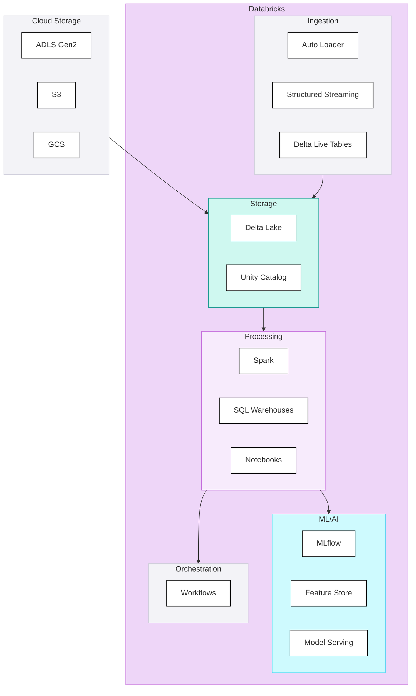

## Databricks

**The Lakehouse Platform** - Databricks pioneered the lakehouse architecture, combining data lake flexibility with warehouse reliability. Best suited for organisations with data engineering depth and advanced analytics ambitions.

Databricks is a unified analytics platform built on Apache Spark, offering a lakehouse architecture with Delta Lake at its core. It excels at large-scale data engineering, machine learning, and advanced analytics.

#### Key Characteristics

| Aspect | Description |
|--------|-------------|
| **Architecture** | Lakehouse on Delta Lake (open format) |
| **Primary Languages** | Python, Spark SQL, Scala, R |
| **Pricing Model** | Usage-based (DBUs) |
| **Target Audience** | Data engineering teams, ML/AI practitioners |
| **Maturity** | Mature, large enterprise adoption |

#### Platform Components

### When to Choose Databricks

#### Strong Fit ✓

| Scenario | Why Databricks Works |
|----------|---------------------|
| **Advanced ML/AI requirements** | Best-in-class MLflow, Feature Store, Model Serving |
| **Data engineering at scale** | Spark-native, handles petabyte-scale |
| **Team has Spark expertise** | Maximises platform capabilities |
| **Multi-cloud requirement** | Available on Azure, AWS, GCP |
| **Open format priority** | Delta Lake is open, portable |
| **Complex streaming workloads** | Structured Streaming production-grade |

#### Weak Fit ✗

| Scenario | Why Databricks Struggles |
|----------|-------------------------|
| **SQL-only team** | Requires Python/Spark skills for full value |
| **Simple BI workloads** | Over-engineered for basic reporting |
| **Fixed budget requirement** | Usage-based pricing can spike |
| **Low operational maturity** | Requires platform engineering skills |

### Component Scores

#### Summary

| Component | Score | Assessment |
|-----------|-------|------------|
| Ingestion | 4.1 | Strong Auto Loader and Structured Streaming; connector breadth via partners |
| Storage | 5.0 | Delta Lake, open format, full ACID, best-in-class cloning |
| Compute | 4.9 | Flexible clusters, serverless, auto-scaling |
| Transformation | 4.7 | Spark SQL, PySpark, excellent dbt integration |
| Orchestration | 4.0 | Workflows native, integrates with external orchestrators |
| BI & Semantic | 3.4 | SQL Warehouses for queries; no native BI or semantic layer |
| Data Science & ML | 5.0 | Best-in-class MLflow, Feature Store, distributed training |
| Generative AI | 5.0 | Mosaic AI, Foundation Models, native Vector Search |
| Agentic AI | 4.3 | Mosaic AI Agent Framework, UC functions as tools |
| Governance | 4.8 | Unity Catalog comprehensive, column-level lineage |
| Security | 5.0 | Cloud IAM, row/column filters, Private Link, full compliance |
| Operations | 4.7 | Comprehensive Terraform, Asset Bundles, mature CI/CD |

**Overall Component Score: 4.6**

<PlatformRadarChart
    title="Databricks — Component Scores"
    data='[{"component":"Ingestion","score":4.1},{"component":"Storage","score":5.0},{"component":"Compute","score":4.9},{"component":"Transformation","score":4.7},{"component":"Orchestration","score":4.0},{"component":"BI & Semantic","score":3.4},{"component":"DS & ML","score":5.0},{"component":"GenAI","score":5.0},{"component":"Agentic AI","score":4.3},{"component":"Governance","score":4.8},{"component":"Security","score":5.0},{"component":"Operations","score":4.7}]'
    color="#FF3621"
    strokeColor="#CC2B1A"
/>

#### Detailed Component Assessment

##### Ingestion (4.1)

| Capability | Score | Notes |
|------------|-------|-------|
| Batch Ingestion | <ScoreBadge value={5} showLabel={false} size="sm" /> | Auto Loader, COPY INTO at scale |
| Native Connectors | <ScoreBadge value={3} showLabel={false} size="sm" /> | Good coverage; often augmented with Fivetran/Airbyte |
| CDC Support | <ScoreBadge value={4} showLabel={false} size="sm" /> | Delta Lake merge, Change Data Feed |
| Schema Evolution | <ScoreBadge value={5} showLabel={false} size="sm" /> | Native Delta support, automatic inference |
| Error Handling | <ScoreBadge value={4} showLabel={false} size="sm" /> | Configurable through Spark; requires engineering |
| Streaming Ingestion | <ScoreBadge value={5} showLabel={false} size="sm" /> | Structured Streaming, exactly-once semantics |

**Tools:** Auto Loader, Structured Streaming, Delta Live Tables, Partner connectors (Fivetran, Airbyte)

<DosAndDonts dosLabel="Strengths" dontsLabel="Limitations"
  dos={[
    {text: "Auto Loader scales to millions of files with schema inference"},
    {text: "Structured Streaming is production-grade with exactly-once semantics"},
    {text: "Delta Lake Change Data Feed for efficient CDC patterns"}
  ]}
  donts={[
    {text: "Native connector breadth relies on Fivetran/Airbyte for full coverage"},
    {text: "Requires Spark expertise for optimal ingestion configuration"}
  ]}
/>

##### Storage (5.0)

| Capability | Score | Notes |
|------------|-------|-------|
| Data Format Support | <ScoreBadge value={5} showLabel={false} size="sm" /> | All formats; structured, semi-structured, unstructured in UC volumes |
| Storage/Compute Separation | <ScoreBadge value={5} showLabel={false} size="sm" /> | True separation; data on cloud storage, compute on clusters |
| Time Travel | <ScoreBadge value={5} showLabel={false} size="sm" /> | Configurable retention, efficient versioning |
| Cloning & Data Sharing | <ScoreBadge value={5} showLabel={false} size="sm" /> | Zero-copy clones, shallow clones for dev/test |
| ACID Transactions | <ScoreBadge value={5} showLabel={false} size="sm" /> | Full ACID with Delta Lake |

**Tools:** Delta Lake on ADLS/S3/GCS, Unity Catalog

<DosAndDonts dosLabel="Strengths" dontsLabel="Limitations"
  dos={[
    {text: "Delta Lake is open source - no vendor lock-in for data"},
    {text: "UniForm provides Iceberg/Hudi compatibility for interoperability"},
    {text: "True storage/compute separation across Azure, AWS, GCP"},
    {text: "Zero-copy clones for instant dev/test environment creation"}
  ]}
  donts={[
    {text: "Requires managing underlying cloud storage lifecycle and permissions"},
    {text: "More operational complexity than fully managed storage options"}
  ]}
/>

##### Compute (4.9)

| Capability | Score | Notes |
|------------|-------|-------|
| Elastic Scaling | <ScoreBadge value={5} showLabel={false} size="sm" /> | Auto-scaling clusters, serverless |
| Workload Isolation | <ScoreBadge value={5} showLabel={false} size="sm" /> | Job clusters, interactive, SQL warehouses |
| Job vs Interactive | <ScoreBadge value={5} showLabel={false} size="sm" /> | Clear separation, optimised for each |
| Cold Start | <ScoreBadge value={4} showLabel={false} size="sm" /> | Cluster startup time (pools and serverless help) |
| Cost Attribution | <ScoreBadge value={5} showLabel={false} size="sm" /> | Per-cluster, per-job DBU tracking |

**Tools:** Job clusters, Interactive clusters, SQL Warehouses, Serverless

<DosAndDonts dosLabel="Strengths" dontsLabel="Limitations"
  dos={[
    {text: "Flexible cluster configuration for every workload type"},
    {text: "Serverless options reduce cold start and cluster management overhead"},
    {text: "Spot instances deliver 60-90% cost savings on fault-tolerant workloads"},
    {text: "Granular DBU tracking enables detailed cost attribution"}
  ]}
  donts={[
    {text: "Cluster startup time remains a consideration despite pools and serverless"},
    {text: "Requires understanding of cluster sizing for cost optimisation"}
  ]}
/>

##### Transformation (4.7)

| Capability | Score | Notes |
|------------|-------|-------|
| SQL-First | <ScoreBadge value={4} showLabel={false} size="sm" /> | Spark SQL strong but Python often needed for full value |
| Non-SQL Processing | <ScoreBadge value={5} showLabel={false} size="sm" /> | PySpark, Scala native, best-in-class |
| dbt Integration | <ScoreBadge value={5} showLabel={false} size="sm" /> | Mature adapter, excellent dbt Cloud support |
| Performance Optimisation | <ScoreBadge value={5} showLabel={false} size="sm" /> | Adaptive query execution, Z-ordering, liquid clustering |
| Testing & Quality | <ScoreBadge value={5} showLabel={false} size="sm" /> | DLT expectations, dbt tests, quality gates |

**Tools:** Spark SQL, PySpark, Delta Live Tables, dbt

<DosAndDonts dosLabel="Strengths" dontsLabel="Limitations"
  dos={[
    {text: "Delta Live Tables for declarative pipelines with built-in quality expectations"},
    {text: "Mature dbt adapter with excellent dbt Cloud integration"},
    {text: "Adaptive query execution, Z-ordering, and liquid clustering for performance"},
    {text: "Best-in-class for complex multi-language transformations"}
  ]}
  donts={[
    {text: "Full platform value requires Python/Spark skills beyond SQL"},
    {text: "More complex than pure SQL platforms for straightforward queries"}
  ]}
/>

##### Orchestration (4.0)

| Capability | Score | Notes |
|------------|-------|-------|
| DAG Definition | <ScoreBadge value={4} showLabel={false} size="sm" /> | Multi-task jobs, dependencies, API-driven |
| End-to-End Pipeline | <ScoreBadge value={4} showLabel={false} size="sm" /> | Chains ingestion and transformation; BI refresh requires API calls |
| Scheduling | <ScoreBadge value={4} showLabel={false} size="sm" /> | Cron, file triggers, continuous |
| Observability | <ScoreBadge value={4} showLabel={false} size="sm" /> | Run history, metrics, logs |
| Retry & Failure | <ScoreBadge value={4} showLabel={false} size="sm" /> | Configurable, task-level retry |

**Tools:** Workflows, integrates with Airflow, Prefect, Dagster

<DosAndDonts dosLabel="Strengths" dontsLabel="Limitations"
  dos={[
    {text: "Native Workflows sufficient for most Databricks-centric pipelines"},
    {text: "Strong integration with external orchestrators via API"},
    {text: "API-driven design enables full automation"}
  ]}
  donts={[
    {text: "Native orchestration less feature-rich than dedicated tools like Airflow"},
    {text: "Complex cross-platform workflows typically need an external orchestrator"}
  ]}
/>

##### BI & Semantic (3.4)

| Capability | Score | Notes |
|------------|-------|-------|
| Semantic Layer | <ScoreBadge value={3} showLabel={false} size="sm" /> | Partner tools (dbt metrics, Looker) |
| Metric Consistency | <ScoreBadge value={3} showLabel={false} size="sm" /> | Relies on dbt or partner BI tool |
| Query Performance | <ScoreBadge value={4} showLabel={false} size="sm" /> | SQL Warehouses optimised for BI queries |
| Fine-Grained Security | <ScoreBadge value={4} showLabel={false} size="sm" /> | Unity Catalog row/column filters |
| Self-Service | <ScoreBadge value={3} showLabel={false} size="sm" /> | SQL editor available; BI requires partner tools |

**Tools:** SQL Warehouses, partner BI tools (Power BI, Tableau, Looker)

<DosAndDonts dosLabel="Strengths" dontsLabel="Limitations"
  dos={[
    {text: "SQL Warehouses provide optimised query performance for BI workloads"},
    {text: "Unity Catalog row/column filters for fine-grained BI security"}
  ]}
  donts={[
    {text: "No native BI tool - requires Power BI, Tableau, or Looker"},
    {text: "Semantic layer requires dbt metrics or a partner BI tool"},
    {text: "Less integrated BI experience compared to Fabric's native Power BI"}
  ]}
/>

##### Data Science & ML (5.0)

| Capability | Score | Notes |
|------------|-------|-------|
| Notebook Development | <ScoreBadge value={5} showLabel={false} size="sm" /> | Best-in-class, collaborative, Git-native |
| Feature Store | <ScoreBadge value={5} showLabel={false} size="sm" /> | Native, online/offline, Unity Catalog integrated |
| Model Training | <ScoreBadge value={5} showLabel={false} size="sm" /> | Distributed training, GPU clusters, experiment tracking |
| Model Registry | <ScoreBadge value={5} showLabel={false} size="sm" /> | MLflow registry, stages, lineage |
| MLOps | <ScoreBadge value={5} showLabel={false} size="sm" /> | Full lifecycle, monitoring, A/B testing, model serving |

**Tools:** MLflow, Feature Store, Model Serving

<DosAndDonts dosLabel="Strengths" dontsLabel="Limitations"
  dos={[
    {text: "MLflow is the industry standard for experiment tracking and model registry"},
    {text: "Native Feature Store with online/offline serving and Unity Catalog integration"},
    {text: "GPU clusters for distributed training at scale"},
    {text: "Full MLOps lifecycle with A/B testing and model monitoring"}
  ]}
  donts={[
    {text: "Requires ML engineering skills to get full value"},
    {text: "Can be over-engineered for organisations that only need simple analytics"}
  ]}
/>

##### Generative AI (5.0)

| Capability | Score | Notes |
|------------|-------|-------|
| LLM Access | <ScoreBadge value={5} showLabel={false} size="sm" /> | Foundation Model APIs, external model gateway |
| Embedding Models | <ScoreBadge value={5} showLabel={false} size="sm" /> | BGE, GTE, custom models via Model Serving |
| Vector Search | <ScoreBadge value={5} showLabel={false} size="sm" /> | Native Vector Search, Delta Sync, fully integrated |
| RAG Support | <ScoreBadge value={5} showLabel={false} size="sm" /> | End-to-end RAG with retrieval, chunking, Vector Search |
| Fine-Tuning | <ScoreBadge value={5} showLabel={false} size="sm" /> | Fine-tune open models (Llama, Mistral) on own compute |

**Tools:** Mosaic AI, Foundation Model APIs, Vector Search

<DosAndDonts dosLabel="Strengths" dontsLabel="Limitations"
  dos={[
    {text: "Native Vector Search deeply integrated with Delta Lake and Unity Catalog"},
    {text: "End-to-end RAG pipeline support with retrieval, chunking, and evaluation"},
    {text: "Fine-tune open models (Llama, Mistral) on your own compute and data"},
    {text: "External model gateway for any LLM provider (OpenAI, Anthropic, Google)"}
  ]}
  donts={[
    {text: "Requires engineering expertise to build and operate GenAI workloads at scale"}
  ]}
/>

##### Agentic AI (4.3)

| Capability | Score | Notes |
|------------|-------|-------|
| Agent Frameworks | <ScoreBadge value={4} showLabel={false} size="sm" /> | Mosaic AI Agent Framework, LangChain, LlamaIndex |
| Tool Calling | <ScoreBadge value={5} showLabel={false} size="sm" /> | Unity Catalog functions as tools |
| Multi-Step Orchestration | <ScoreBadge value={4} showLabel={false} size="sm" /> | Multi-step chains, agent loops via Mosaic AI |
| Guardrails | <ScoreBadge value={4} showLabel={false} size="sm" /> | AI Gateway, Lakehouse Monitoring, guardrail APIs |

**Tools:** Mosaic AI Agent Framework, AI Gateway

<DosAndDonts dosLabel="Strengths" dontsLabel="Limitations"
  dos={[
    {text: "Unity Catalog functions natively expose data assets as agent tools"},
    {text: "Mosaic AI Agent Framework for structured agent development"},
    {text: "AI Gateway for centralised LLM traffic management and rate limiting"}
  ]}
  donts={[
    {text: "Agent framework still maturing relative to Azure AI Agent Service"},
    {text: "Platform-specific tooling creates coupling to Databricks ecosystem"}
  ]}
/>

##### Governance (4.8)

| Capability | Score | Notes |
|------------|-------|-------|
| Data Catalog & Discovery | <ScoreBadge value={5} showLabel={false} size="sm" /> | Unity Catalog with search, tags, AI-generated docs |
| Data Lineage & Impact Analysis | <ScoreBadge value={5} showLabel={false} size="sm" /> | Column-level lineage automatic and visual |
| Data Quality Framework | <ScoreBadge value={4} showLabel={false} size="sm" /> | Lakehouse monitoring, DLT expectations, quality dashboards |
| Business Glossary & Classification | <ScoreBadge value={5} showLabel={false} size="sm" /> | Tags, policies, inheritance; comprehensive classification |
| AI/ML Governance | <ScoreBadge value={5} showLabel={false} size="sm" /> | MLflow tracking, model lineage in UC, feature store governance |

**Tools:** Unity Catalog, Delta Sharing

<DosAndDonts dosLabel="Strengths" dontsLabel="Limitations"
  dos={[
    {text: "Unity Catalog provides automatic column-level lineage and impact analysis"},
    {text: "Delta Sharing is an open protocol for cross-platform data sharing"},
    {text: "Full AI/ML governance - model lineage, feature store governance via Unity Catalog"},
    {text: "Comprehensive tag-based classification with policy inheritance"}
  ]}
  donts={[
    {text: "Unity Catalog requires deliberate setup and adoption to unlock full value"},
    {text: "Full governance capability requires migrating to Unity Catalog"}
  ]}
/>

##### Security (5.0)

| Capability | Score | Notes |
|------------|-------|-------|
| IAM & SSO Integration | <ScoreBadge value={5} showLabel={false} size="sm" /> | Cloud IAM (Entra ID, Okta), SCIM, SSO native |
| Fine-Grained Access Control | <ScoreBadge value={5} showLabel={false} size="sm" /> | Row filters, column masks in Unity Catalog |
| Network Security | <ScoreBadge value={5} showLabel={false} size="sm" /> | Private Link, VNet injection, IP access lists |
| Secret Management & Encryption | <ScoreBadge value={5} showLabel={false} size="sm" /> | Secret scopes, customer-managed keys |
| Compliance & Audit | <ScoreBadge value={5} showLabel={false} size="sm" /> | System tables for audit; SOC 2, ISO, HIPAA, FedRAMP |

**Tools:** Unity Catalog, Secret Scopes, Private Link

<DosAndDonts dosLabel="Strengths" dontsLabel="Limitations"
  dos={[
    {text: "Row filters and column masks natively enforced in Unity Catalog"},
    {text: "VNet injection and Private Link for comprehensive network isolation"},
    {text: "System tables provide 30-day audit log with query and access history"},
    {text: "SOC 2, ISO, HIPAA, FedRAMP certifications"}
  ]}
  donts={[
    {text: "Security model can be complex to configure correctly at scale"},
    {text: "Requires cloud networking expertise for full network isolation"}
  ]}
/>

##### Operations (4.7)

| Capability | Score | Notes |
|------------|-------|-------|
| CI/CD | <ScoreBadge value={5} showLabel={false} size="sm" /> | GitHub Actions, API-driven, Asset Bundles |
| Infrastructure as Code | <ScoreBadge value={5} showLabel={false} size="sm" /> | Comprehensive Terraform provider |
| Environment Strategy | <ScoreBadge value={5} showLabel={false} size="sm" /> | Workspace per environment, mature |
| Observability | <ScoreBadge value={4} showLabel={false} size="sm" /> | System tables, Ganglia, Datadog/Prometheus |
| Cost Management | <ScoreBadge value={4} showLabel={false} size="sm" /> | DBU tracking, budgets, requires attention |

**Tools:** Repos, Databricks Terraform provider, APIs

<DosAndDonts dosLabel="Strengths" dontsLabel="Limitations"
  dos={[
    {text: "Comprehensive Terraform provider covering all resource types"},
    {text: "Asset Bundles for declarative notebook and job deployment"},
    {text: "API-first design enables full CI/CD automation via GitHub Actions"},
    {text: "Workspace-per-environment pattern is mature and well-understood"}
  ]}
  donts={[
    {text: "Cost management requires attention - usage-based DBUs can spike without controls"},
    {text: "Higher operational overhead than fully managed SaaS platforms"}
  ]}
/>

### Vendor Modifiers

| Modifier | Assessment | Value |
|----------|------------|-------|
| Platform Maturity | Mature, large enterprise adoption | +0.1 |
| Operational Complexity | Multiple services, platform engineering needed | -0.1 |
| Cost Model Structure | Usage-based, can spike | -0.1 |
| Lock-in Characteristics | Open formats, high portability | +0.1 |
| Roadmap Direction | Strong AI/ML innovation | +0.1 |
| **Total Vendor Modifier** | | **+0.1** |

### Cost Model

#### Databricks Units (DBUs)

| Workload Type | DBU Rate | Use Case |
|---------------|----------|----------|
| Jobs Compute | Lower | Scheduled batch workloads |
| All-Purpose Compute | Medium | Interactive development |
| SQL Warehouse | Medium | BI queries |
| Serverless | Premium | Fast start, variable workloads |

#### Cost Considerations

| Factor | Impact |
|--------|--------|
| **Predictability** | Variable; requires monitoring |
| **Cluster sizing** | Right-sizing critical for cost |
| **Auto-termination** | Essential for cost control |
| **Spot instances** | 60-90% savings on compute |
| **Serverless** | Premium but no cluster management |
| **Storage** | Cloud storage costs separate |

#### Cost Optimisation

- Use job clusters for production (not interactive)
- Enable auto-termination (5-10 mins for interactive)
- Leverage spot instances for fault-tolerant workloads
- Right-size clusters based on workload
- Use Photon for SQL workloads
- Monitor and alert on DBU consumption

### Pros and Cons

#### Pros

| Advantage | Description |
|-----------|-------------|
| **Best-in-class ML** | MLflow, Feature Store, Model Serving |
| **Open formats** | Delta Lake portable, no lock-in |
| **Multi-cloud** | Azure, AWS, GCP |
| **Scalability** | Petabyte-scale proven |
| **Flexibility** | Full control over compute |
| **Innovation** | Leading data + AI convergence |
| **Community** | Large ecosystem, extensive resources |

#### Cons

| Disadvantage | Description |
|--------------|-------------|
| **Complexity** | Requires platform engineering |
| **Cost unpredictability** | Usage-based can spike |
| **Skill requirements** | Needs Spark/Python expertise |
| **No native BI** | Partner tool dependency |
| **Operational overhead** | More to manage than SaaS |
| **Overkill risk** | Can be too much for simple workloads |
