## Snowflake

**The Data Cloud** - Snowflake pioneered cloud-native data warehousing with true separation of storage and compute. Best suited for SQL-centric teams seeking managed simplicity with strong data sharing capabilities.

Snowflake is a fully managed cloud data platform offering data warehousing, data lake, data sharing, and increasingly, data engineering and AI capabilities. It's known for its simplicity, performance, and the Snowflake Marketplace.

#### Key Characteristics

| Aspect | Description |
|--------|-------------|
| **Architecture** | Cloud-native warehouse, multi-cluster shared data |
| **Primary Language** | SQL (Snowpark for Python/Java/Scala) |
| **Pricing Model** | Usage-based (credits) + storage |
| **Target Audience** | SQL analysts, analytics teams, data sharing |
| **Maturity** | Mature, strong enterprise adoption |

#### Platform Components

```mermaid
flowchart TB
    subgraph SNOWFLAKE[Snowflake]
        subgraph INGEST[Ingestion]
            SP[Snowpipe]
            SPS[Snowpipe Streaming]
            COPY[COPY INTO]
        end

        subgraph STORE[Storage]
            ST[Snowflake Storage]
            ICE[Iceberg Tables]
        end

        subgraph COMPUTE[Compute]
            VW[Virtual Warehouses]
        end

        subgraph TRANSFORM[Transform]
            SQL[SQL]
            SNP[Snowpark]
            TASK[Tasks]
        end

        subgraph SERVE[Serving]
            DS[Data Sharing]
            MKT[Marketplace]
        end

        subgraph AI[AI/ML]
            CX[Cortex]
            ML[Snowpark ML]
        end

        subgraph GOVERN[Governance]
            HZ[Horizon]
            AC[Access Control]
        end
    end

    INGEST --> STORE
    STORE --> COMPUTE
    COMPUTE --> TRANSFORM
    TRANSFORM --> SERVE
    TRANSFORM --> AI
    GOVERN -.-> STORE
    GOVERN -.-> COMPUTE

    style SNOWFLAKE fill:#FFF,stroke:#FFF
    style INGEST fill:#F3F3F7,stroke:#D1D0DC
    style STORE fill:#CFF8F0,stroke:#18978E
    style COMPUTE fill:#EED6F8,stroke:#C36BDB
    style TRANSFORM fill:#F7EBFC,stroke:#C36BDB
    style SERVE fill:#F3F3F7,stroke:#D1D0DC
    style AI fill:#CEFAFE,stroke:#26D4F0
    style GOVERN fill:#FFE3EA,stroke:#FF6196
    style SP fill:#fff,stroke:#000
    style SPS fill:#fff,stroke:#000
    style COPY fill:#fff,stroke:#000
    style ST fill:#fff,stroke:#000
    style ICE fill:#fff,stroke:#000
    style VW fill:#fff,stroke:#000
    style SQL fill:#fff,stroke:#000
    style SNP fill:#fff,stroke:#000
    style TASK fill:#fff,stroke:#000
    style DS fill:#fff,stroke:#000
    style MKT fill:#fff,stroke:#000
    style CX fill:#fff,stroke:#000
    style ML fill:#fff,stroke:#000
    style HZ fill:#fff,stroke:#000
    style AC fill:#fff,stroke:#000
```

### When to Choose Snowflake

#### Strong Fit ✓

| Scenario | Why Snowflake Works |
|----------|---------------------|
| **SQL-centric team** | Pure SQL experience, minimal code |
| **Managed preference** | Zero infrastructure management |
| **Data sharing primary** | Native sharing, Marketplace |
| **Multi-cloud flexibility** | Azure, AWS, GCP |
| **Moderate streaming needs** | Snowpipe sufficient |
| **Cost control important** | Per-warehouse controls, auto-suspend |

#### Weak Fit ✗

| Scenario | Why Snowflake Struggles |
|----------|------------------------|
| **Heavy streaming workloads** | Less mature than Spark-based |
| **Advanced ML/MLOps** | Cortex improving but less mature |
| **Complex data engineering** | Snowpark capable but Spark more mature |
| **Open format requirement** | Proprietary storage (Iceberg helping) |

### Component Scores

#### Summary

| Component | Score | Assessment |
|-----------|-------|------------|
| Ingestion | 2.5 | Snowpipe for batch; native connectors and CDC rely on partners |
| Storage | 4.8 | Managed, full ACID, best-in-class time travel and cloning |
| Compute | 5.0 | Virtual warehouses, instant scaling, complete isolation |
| Transformation | 4.9 | Best-in-class SQL, excellent dbt, Snowpark for Python |
| Orchestration | 3.0 | Tasks basic, complex workflows need external tools |
| BI & Semantic | 4.0 | Partner tools, semantic views, strong query performance |
| Data Science & ML | 3.8 | Snowpark ML, Feature Store GA, MLOps maturing |
| Generative AI | 4.1 | Cortex AI, SQL-native LLM functions, embeddings |
| Agentic AI | 3.5 | Cortex Analyst, limited native agent support |
| Governance | 4.5 | Horizon catalog and lineage, tagging, DQ emerging |
| Security | 4.8 | RBAC, row/column policies, PrivateLink, Tri-Secret Secure |
| Operations | 4.0 | dbt-centric DevOps, resource monitors, Terraform partial |

**Overall Component Score: 4.1**

<PlatformRadarChart
    title="Snowflake — Component Scores"
    data='[{"component":"Ingestion","score":2.5},{"component":"Storage","score":4.8},{"component":"Compute","score":5.0},{"component":"Transformation","score":4.9},{"component":"Orchestration","score":3.0},{"component":"BI & Semantic","score":4.0},{"component":"DS & ML","score":3.8},{"component":"GenAI","score":4.1},{"component":"Agentic AI","score":3.5},{"component":"Governance","score":4.5},{"component":"Security","score":4.8},{"component":"Operations","score":4.0}]'
    color="#29B5E8"
    strokeColor="#1A8BB5"
/>

#### Detailed Component Assessment

##### Ingestion (2.5)

| Capability | Score | Notes |
|------------|-------|-------|
| Batch Ingestion | <ScoreBadge value={3} showLabel={false} size="sm" /> | Snowpipe, COPY INTO - simple and effective |
| Native Connectors | <ScoreBadge value={2} showLabel={false} size="sm" /> | Partner ecosystem (Fivetran, Airbyte) provides coverage |
| CDC Support | <ScoreBadge value={2} showLabel={false} size="sm" /> | Supported through partners; native CDC less developed |
| Schema Evolution | <ScoreBadge value={4} showLabel={false} size="sm" /> | Handled well but requires more manual intervention |
| Error Handling | <ScoreBadge value={2} showLabel={false} size="sm" /> | Good error logging and retry capabilities |
| Streaming Ingestion | <ScoreBadge value={3} showLabel={false} size="sm" /> | Snowpipe Streaming improving but less mature |

**Tools:** Snowpipe, Snowpipe Streaming, COPY INTO, Partner connectors (Fivetran, Airbyte, Matillion)

<DosAndDonts dosLabel="Strengths" dontsLabel="Limitations"
  dos={[
    {text: "Snowpipe is simple, serverless, and accessible to SQL teams"},
    {text: "Strong partner ecosystem (Fivetran, Airbyte) provides broad connector coverage"},
    {text: "SQL-based ingestion patterns accessible to all skill levels"}
  ]}
  donts={[
    {text: "Native connectors and CDC heavily reliant on partner tools"},
    {text: "Streaming ingestion less mature than Spark Structured Streaming"},
    {text: "Error handling less configurable than Spark-based alternatives"}
  ]}
/>

##### Storage (4.8)

| Capability | Score | Notes |
|------------|-------|-------|
| Data Format Support | <ScoreBadge value={4} showLabel={false} size="sm" /> | Strong structured and semi-structured (VARIANT); unstructured via directory tables |
| Storage/Compute Separation | <ScoreBadge value={5} showLabel={false} size="sm" /> | True separation; virtual warehouses scale independently |
| Time Travel | <ScoreBadge value={5} showLabel={false} size="sm" /> | Up to 90 days; Fail-safe adds 7 days |
| Cloning & Data Sharing | <ScoreBadge value={5} showLabel={false} size="sm" /> | Zero-copy cloning is best-in-class |
| ACID Transactions | <ScoreBadge value={5} showLabel={false} size="sm" /> | Full ACID, production-proven |

**Tools:** Snowflake-managed storage, Iceberg Tables

<DosAndDonts dosLabel="Strengths" dontsLabel="Limitations"
  dos={[
    {text: "Fully managed storage - zero administration overhead"},
    {text: "Best-in-class time travel up to 90 days plus 7-day Fail-safe"},
    {text: "Zero-copy cloning enables instant environment creation for dev/test"},
    {text: "Automatic clustering and storage optimisation"}
  ]}
  donts={[
    {text: "Proprietary storage format limits portability (Iceberg support improving)"},
    {text: "Less portable than Delta Lake for multi-platform scenarios"}
  ]}
/>

##### Compute (5.0)

| Capability | Score | Notes |
|------------|-------|-------|
| Elastic Scaling | <ScoreBadge value={5} showLabel={false} size="sm" /> | Instant scaling, multi-cluster |
| Workload Isolation | <ScoreBadge value={5} showLabel={false} size="sm" /> | Separate warehouses, complete isolation |
| Job vs Interactive | <ScoreBadge value={5} showLabel={false} size="sm" /> | Different warehouses for different uses |
| Cold Start | <ScoreBadge value={5} showLabel={false} size="sm" /> | Near-instant warehouse startup |
| Cost Attribution | <ScoreBadge value={5} showLabel={false} size="sm" /> | Per-warehouse, per-query attribution |

**Tools:** Virtual Warehouses (XS to 6XL), multi-cluster

<DosAndDonts dosLabel="Strengths" dontsLabel="Limitations"
  dos={[
    {text: "Near-instant warehouse startup - no cold start delays"},
    {text: "Complete workload isolation via separate virtual warehouses"},
    {text: "Auto-suspend eliminates idle compute costs"},
    {text: "Multi-cluster warehouses handle concurrency spikes automatically"}
  ]}
  donts={[
    {text: "Less flexibility than Spark clusters for custom compute configurations"},
    {text: "Warehouse sizing requires ongoing tuning to avoid over-provisioning"}
  ]}
/>

##### Transformation (4.9)

| Capability | Score | Notes |
|------------|-------|-------|
| SQL-First | <ScoreBadge value={5} showLabel={false} size="sm" /> | Best-in-class SQL, highly optimised |
| Non-SQL Processing | <ScoreBadge value={4} showLabel={false} size="sm" /> | Snowpark capable but less mature than Spark |
| dbt Integration | <ScoreBadge value={5} showLabel={false} size="sm" /> | Most mature adapter, best-in-class dbt integration |
| Performance Optimisation | <ScoreBadge value={5} showLabel={false} size="sm" /> | Automatic clustering, materialized views, result caching |
| Testing & Quality | <ScoreBadge value={5} showLabel={false} size="sm" /> | dbt tests, constraints, quality mature |

**Tools:** SQL, Snowpark, dbt, Streams, Tasks

<DosAndDonts dosLabel="Strengths" dontsLabel="Limitations"
  dos={[
    {text: "Best-in-class SQL experience - the most mature and optimised SQL engine"},
    {text: "Most mature dbt adapter with excellent dbt Cloud integration"},
    {text: "Automatic clustering, result caching, and materialized views for performance"},
    {text: "Streams for efficient CDC and incremental processing patterns"}
  ]}
  donts={[
    {text: "Snowpark less mature than PySpark for complex Python transformations"},
    {text: "Complex multi-language transformations less natural than Databricks"}
  ]}
/>

##### Orchestration (3.0)

| Capability | Score | Notes |
|------------|-------|-------|
| DAG Definition | <ScoreBadge value={3} showLabel={false} size="sm" /> | Tasks are basic; complex needs external |
| End-to-End Pipeline | <ScoreBadge value={3} showLabel={false} size="sm" /> | SQL chains; ingestion and BI refresh need external orchestration |
| Scheduling | <ScoreBadge value={3} showLabel={false} size="sm" /> | Cron, stream-triggered |
| Observability | <ScoreBadge value={3} showLabel={false} size="sm" /> | Task history available, less rich than others |
| Retry & Failure | <ScoreBadge value={3} showLabel={false} size="sm" /> | Basic retry, manual intervention often needed |

**Tools:** Tasks (native), partner orchestrators (Airflow, Dagster, Prefect)

<DosAndDonts dosLabel="Strengths" dontsLabel="Limitations"
  dos={[
    {text: "Tasks work for simple SQL-based workflows and stream-triggered logic"},
    {text: "Strong integration with Airflow, Dagster, and Prefect via connectors"}
  ]}
  donts={[
    {text: "Native Tasks limited for complex multi-system DAGs"},
    {text: "Most production Snowflake deployments require an external orchestrator"},
    {text: "Task observability and retry logic less mature than platform-native options"}
  ]}
/>

##### BI & Semantic (4.0)

| Capability | Score | Notes |
|------------|-------|-------|
| Semantic Layer | <ScoreBadge value={4} showLabel={false} size="sm" /> | Partner tools, Streamlit apps |
| Metric Consistency | <ScoreBadge value={4} showLabel={false} size="sm" /> | Via dbt metrics or BI tool |
| Query Performance | <ScoreBadge value={4} showLabel={false} size="sm" /> | Strong query performance, caching |
| Fine-Grained Security | <ScoreBadge value={4} showLabel={false} size="sm" /> | Row access policies, column masking |
| Self-Service | <ScoreBadge value={4} showLabel={false} size="sm" /> | Snowsight, Streamlit for exploration |

**Tools:** Semantic Views, partner BI tools (Power BI, Tableau, Looker)

<DosAndDonts dosLabel="Strengths" dontsLabel="Limitations"
  dos={[
    {text: "Excellent query performance with result caching for repeated queries"},
    {text: "Strong partner BI ecosystem - Tableau, Looker all work natively"},
    {text: "Row and column-level security mature and SQL-based"}
  ]}
  donts={[
    {text: "No native BI tool - requires partner tooling for dashboards"},
    {text: "Semantic layer newer and less established than Power BI semantic models"}
  ]}
/>

##### Data Science & ML (3.8)

| Capability | Score | Notes |
|------------|-------|-------|
| Notebook Development | <ScoreBadge value={4} showLabel={false} size="sm" /> | Snowflake Notebooks, improving rapidly |
| Feature Store | <ScoreBadge value={4} showLabel={false} size="sm" /> | Feature Store recently GA |
| Model Training | <ScoreBadge value={4} showLabel={false} size="sm" /> | Snowpark ML, container services |
| Model Registry | <ScoreBadge value={4} showLabel={false} size="sm" /> | Model Registry available |
| MLOps | <ScoreBadge value={3} showLabel={false} size="sm" /> | Less mature; relies on external tooling for full MLOps |

**Tools:** Snowpark ML, Snowflake Notebooks, Streamlit

<DosAndDonts dosLabel="Strengths" dontsLabel="Limitations"
  dos={[
    {text: "Snowpark ML makes ML accessible to SQL-centric teams in Python"},
    {text: "Feature Store is now GA, enabling reusable features within Snowflake"},
    {text: "Streamlit for building lightweight ML apps without leaving Snowflake"}
  ]}
  donts={[
    {text: "MLOps end-to-end lifecycle less mature than Databricks MLflow"},
    {text: "Full MLOps requires external tooling (e.g., MLflow, external CI/CD)"},
    {text: "Less GPU compute flexibility than Databricks for distributed training"}
  ]}
/>

##### Generative AI (4.1)

| Capability | Score | Notes |
|------------|-------|-------|
| LLM Access | <ScoreBadge value={4} showLabel={false} size="sm" /> | Cortex LLM functions (SQL-accessible); fewer model options |
| Embedding Models | <ScoreBadge value={5} showLabel={false} size="sm" /> | Cortex embed functions, arctic-embed, multiple models |
| Vector Search | <ScoreBadge value={4} showLabel={false} size="sm" /> | VECTOR type, Cortex Search |
| RAG Support | <ScoreBadge value={4} showLabel={false} size="sm" /> | Cortex Search for RAG, simple SQL interface |
| Fine-Tuning | <ScoreBadge value={3} showLabel={false} size="sm" /> | Limited fine-tuning options |

**Tools:** Cortex AI, Cortex Search, VECTOR type

<DosAndDonts dosLabel="Strengths" dontsLabel="Limitations"
  dos={[
    {text: "Cortex brings AI capabilities to SQL users - LLM functions callable from SQL"},
    {text: "Simple RAG via Cortex Search with a SQL-native interface"},
    {text: "Strong embedding model selection including arctic-embed"}
  ]}
  donts={[
    {text: "Fewer LLM model options compared to Azure AI Foundry or Databricks gateway"},
    {text: "Fine-tuning support limited relative to Databricks and Azure"},
    {text: "Less flexible than Spark-based approaches for complex GenAI pipelines"}
  ]}
/>

##### Agentic AI (3.5)

| Capability | Score | Notes |
|------------|-------|-------|
| Agent Frameworks | <ScoreBadge value={3} showLabel={false} size="sm" /> | Via Snowpark + external frameworks; no native agent service |
| Tool Calling | <ScoreBadge value={4} showLabel={false} size="sm" /> | Cortex Analyst, Snowflake functions |
| Multi-Step Orchestration | <ScoreBadge value={3} showLabel={false} size="sm" /> | Manual implementation; no native agent orchestration |
| Guardrails | <ScoreBadge value={4} showLabel={false} size="sm" /> | Cortex Guard for content safety |

**Tools:** Cortex Analyst, Snowpark

<DosAndDonts dosLabel="Strengths" dontsLabel="Limitations"
  dos={[
    {text: "Cortex Analyst enables natural language queries against Snowflake data"},
    {text: "Cortex Guard provides content safety for AI outputs"}
  ]}
  donts={[
    {text: "No native agent service - requires external frameworks (LangChain, etc.)"},
    {text: "Multi-step agent orchestration requires manual implementation"},
    {text: "Less mature agentic AI story compared to Azure AI Agent Service or Mosaic AI"}
  ]}
/>

##### Governance (4.5)

| Capability | Score | Notes |
|------------|-------|-------|
| Data Catalog & Discovery | <ScoreBadge value={5} showLabel={false} size="sm" /> | Horizon catalog with search, tags, object-level discoverability |
| Data Lineage & Impact Analysis | <ScoreBadge value={5} showLabel={false} size="sm" /> | Horizon lineage with access history; column-level improving |
| Data Quality Framework | <ScoreBadge value={4} showLabel={false} size="sm" /> | Constraints, dbt tests; Snowflake data quality monitoring emerging |
| Business Glossary & Classification | <ScoreBadge value={4} showLabel={false} size="sm" /> | Object tagging, tag-based policies; glossary less mature |
| AI/ML Governance | <ScoreBadge value={4} showLabel={false} size="sm" /> | Model registry with governance; Cortex usage tracking |

**Tools:** Horizon, Object Tagging, Data Sharing, Marketplace

<DosAndDonts dosLabel="Strengths" dontsLabel="Limitations"
  dos={[
    {text: "Horizon catalog is comprehensive with search and object-level discoverability"},
    {text: "Best-in-class data sharing via native Sharing and Marketplace"},
    {text: "Tag-based governance policies that inherit across objects"}
  ]}
  donts={[
    {text: "Business glossary capabilities less mature than Purview or Unity Catalog"},
    {text: "Some Horizon features require higher Snowflake editions"},
    {text: "AI/ML governance less comprehensive than Databricks Unity Catalog"}
  ]}
/>

##### Security (4.8)

| Capability | Score | Notes |
|------------|-------|-------|
| IAM & SSO Integration | <ScoreBadge value={5} showLabel={false} size="sm" /> | SCIM, OAuth, SSO via SAML; key-pair auth |
| Fine-Grained Access Control | <ScoreBadge value={5} showLabel={false} size="sm" /> | Row access policies, dynamic data masking, column-level |
| Network Security | <ScoreBadge value={4} showLabel={false} size="sm" /> | PrivateLink; network policies; less flexible than VNet |
| Secret Management & Encryption | <ScoreBadge value={5} showLabel={false} size="sm" /> | Tri-Secret Secure; automatic encryption; key rotation |
| Compliance & Audit | <ScoreBadge value={5} showLabel={false} size="sm" /> | Access history, query history; SOC 2, ISO, HIPAA, FedRAMP |

**Tools:** RBAC, Row Access Policies, Column Masking, PrivateLink

<DosAndDonts dosLabel="Strengths" dontsLabel="Limitations"
  dos={[
    {text: "Best-in-class SQL-based row access policies and dynamic data masking"},
    {text: "Tri-Secret Secure for customer-controlled encryption key management"},
    {text: "Comprehensive audit history - access, query, and login history retained"},
    {text: "SOC 2, ISO, HIPAA, FedRAMP certifications"}
  ]}
  donts={[
    {text: "Network security less flexible than Azure VNet injection or Databricks VNet"},
    {text: "Some advanced security features require Business Critical or higher edition"}
  ]}
/>

##### Operations (4.0)

| Capability | Score | Notes |
|------------|-------|-------|
| CI/CD | <ScoreBadge value={4} showLabel={false} size="sm" /> | dbt CI, Terraform, external tools |
| Infrastructure as Code | <ScoreBadge value={3} showLabel={false} size="sm" /> | Terraform partial; core resources covered, governance gaps |
| Environment Strategy | <ScoreBadge value={4} showLabel={false} size="sm" /> | Database or account-level isolation |
| Observability | <ScoreBadge value={4} showLabel={false} size="sm" /> | Account usage, 90-day query history, alerts |
| Cost Management | <ScoreBadge value={5} showLabel={false} size="sm" /> | Resource monitors, per-query attribution, auto-suspend |

**Tools:** Git integration, dbt, Terraform (limited), Resource Monitors

<DosAndDonts dosLabel="Strengths" dontsLabel="Limitations"
  dos={[
    {text: "dbt-centric DevOps is well-established and widely adopted"},
    {text: "Resource monitors with hard credit limits prevent cost overruns"},
    {text: "Account usage views provide 90-day query history for observability"},
    {text: "Best-in-class cost management with auto-suspend and per-query attribution"}
  ]}
  donts={[
    {text: "Terraform provider less comprehensive - governance and security resources limited"},
    {text: "IaC for full platform management requires external scripts or manual steps"}
  ]}
/>

### Vendor Modifiers

| Modifier | Assessment | Value |
|----------|------------|-------|
| Platform Maturity | Mature, proven at scale | +0.1 |
| Operational Complexity | Fully managed, low overhead | +0.1 |
| Cost Model Structure | Usage-based but controllable | 0 |
| Lock-in Characteristics | Proprietary storage, medium lock-in | 0 |
| Roadmap Direction | Solid roadmap, expanding into AI | 0 |
| **Total Vendor Modifier** | | **+0.2** |

### Cost Model

#### Credit-Based Pricing

| Warehouse Size | Credits/Hour | Use Case |
|----------------|--------------|----------|
| X-Small | 1 | Light queries |
| Small | 2 | Development |
| Medium | 4 | Standard workloads |
| Large | 8 | Heavy analytics |
| X-Large | 16 | Large transformations |
| 2XL-6XL | 32-128 | Extreme workloads |

#### Cost Considerations

| Factor | Impact |
|--------|--------|
| **Compute** | Credits consumed when warehouse active |
| **Storage** | Per TB per month |
| **Data Transfer** | Cross-region/cloud charges |
| **Auto-suspend** | Critical for cost control |
| **Multi-cluster** | Scales for concurrency |
| **Serverless** | Premium credit rate |

#### Cost Optimisation

- Enable auto-suspend (60 seconds typical)
- Right-size warehouses
- Use resource monitors with alerts
- Leverage caching (avoid redundant queries)
- Consider annual commitments for discounts
- Monitor with Account Usage views

### Pros and Cons

#### Pros

| Advantage | Description |
|-----------|-------------|
| **SQL simplicity** | Pure SQL experience, accessible |
| **Zero administration** | Fully managed, no infrastructure |
| **Data sharing** | Best-in-class native sharing |
| **Performance** | Excellent query performance |
| **Scalability** | True elastic scaling |
| **Multi-cloud** | Azure, AWS, GCP |
| **Partner ecosystem** | Strong modern data stack |

#### Cons

| Disadvantage | Description |
|--------------|-------------|
| **Proprietary storage** | Data portability limited |
| **No native BI** | Partner tool dependency |
| **Orchestration** | Tasks limited, need external |
| **ML maturity** | Behind Databricks |
| **Streaming** | Less mature than Spark |
| **IaC** | Terraform support limited |
