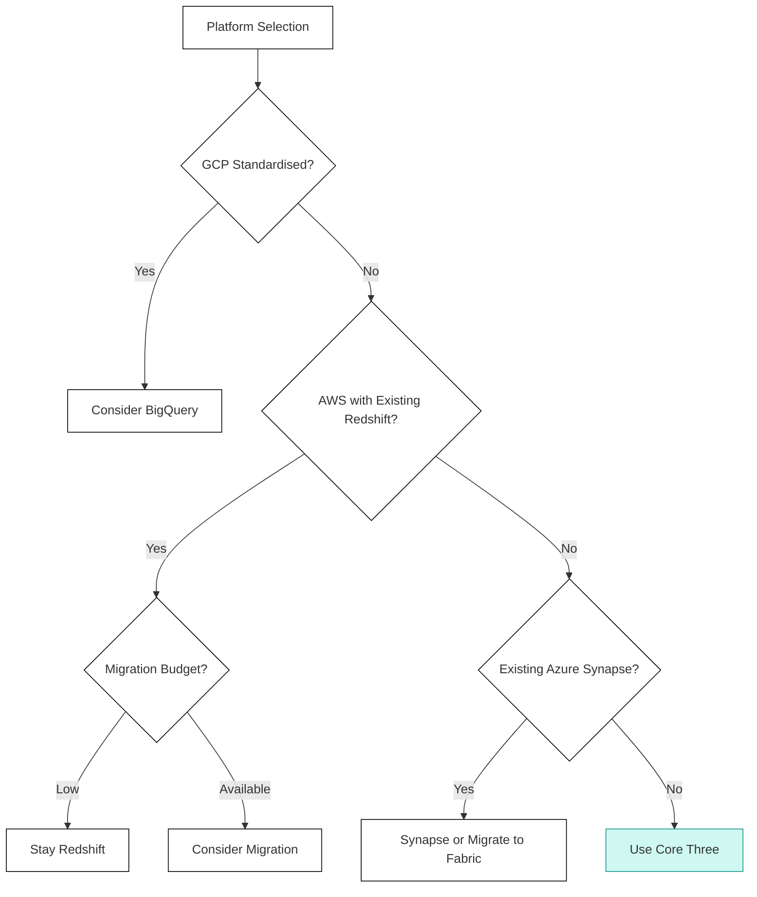

## Other Platforms

<Callout type="info">
  **Context-Specific Alternatives** - While Fabric, Databricks, and Snowflake cover most scenarios, specific client contexts may warrant considering alternative platforms. This page provides guidance for those situations.
</Callout>

### Overview

The JMAN framework focuses on Microsoft Fabric, Databricks, and Snowflake as they represent the majority of client opportunities. However, certain contexts - particularly existing cloud commitments or legacy investments - may require evaluation of alternative platforms:

| Platform | When to Consider |
|----------|------------------|
| **Google BigQuery** | GCP-committed clients |
| **AWS Redshift** | AWS-committed clients with existing investment |
| **Azure Synapse** | Legacy Azure analytics, Fabric migration path |

### Google BigQuery

#### Overview

BigQuery is Google Cloud's fully managed, serverless data warehouse with built-in machine learning capabilities.

#### When to Consider

| Scenario | Rationale |
|----------|-----------|
| **GCP standardisation** | Native GCP integration, shared security |
| **Serverless preference** | True serverless, no cluster management |
| **ML integration** | BigQuery ML for in-database ML |
| **Large-scale analytics** | Petabyte-scale proven |
| **Looker standardisation** | Native integration |

#### When to Avoid

| Scenario | Rationale |
|----------|-----------|
| **Non-GCP cloud** | Limited multi-cloud support |
| **Streaming-heavy** | Less mature than Spark-based |
| **Complex data engineering** | More warehouse than lakehouse |
| **Power BI primary** | Less optimised than Fabric |

#### High-Level Assessment

| Component | Score | Notes |
|-----------|-------|-------|
| Ingestion | 4.0 | Streaming inserts, Transfer Service |
| Storage | 4.5 | Managed, partitioning, clustering |
| Compute | 5.0 | True serverless, slot-based |
| Transformation | 4.5 | SQL, dbt, Dataform |
| Orchestration | 4.0 | Composer (managed Airflow) |
| BI & Semantic | 4.0 | Looker integration |
| AI/ML | 4.5 | BigQuery ML, Vertex AI |
| Governance | 4.5 | Data Catalog, IAM |
| Operations | 4.0 | Terraform, limited IaC |

**Overall: 4.33** - Strong for GCP-native workloads

#### Pros and Cons

| Pros | Cons |
|------|------|
| True serverless | GCP-only |
| Excellent SQL performance | Streaming less mature |
| BigQuery ML built-in | Less flexible than lakehouse |
| Looker integration | Slot-based pricing complexity |

### AWS Redshift

#### Overview

Redshift is Amazon's cloud data warehouse, recently enhanced with Redshift Serverless and spectrum for data lake integration.

#### When to Consider

| Scenario | Rationale |
|----------|-----------|
| **AWS standardisation** | Native AWS integration |
| **Existing Redshift investment** | Migration cost avoidance |
| **SQL-centric team** | Familiar PostgreSQL dialect |
| **Cost-sensitive** | Reserved instances cost-effective |

#### When to Avoid

| Scenario | Rationale |
|----------|-----------|
| **Non-AWS cloud** | AWS-only |
| **Modern data stack preference** | Less modern tooling integration |
| **Complex streaming** | Streaming support limited |
| **Advanced ML** | SageMaker integration, not native |

#### High-Level Assessment

| Component | Score | Notes |
|-----------|-------|-------|
| Ingestion | 3.5 | COPY, Kinesis, limited streaming |
| Storage | 4.0 | Managed, spectrum for S3 |
| Compute | 4.0 | RA3 nodes, serverless option |
| Transformation | 4.0 | SQL, dbt supported |
| Orchestration | 3.5 | Step Functions, external tools |
| BI & Semantic | 3.5 | QuickSight, partner tools |
| AI/ML | 3.5 | SageMaker integration |
| Governance | 4.0 | Lake Formation, IAM |
| Operations | 3.5 | Terraform, CloudFormation |

**Overall: 3.72** - Solid for AWS-committed, cost-focused

#### Pros and Cons

| Pros | Cons |
|------|------|
| AWS native | Less modern architecture |
| Cost-effective at scale | Streaming limited |
| PostgreSQL familiarity | Concurrency challenges |
| Spectrum for data lake | Less ecosystem integration |

### Azure Synapse Analytics

#### Overview

Synapse is Azure's analytics service combining data warehousing and big data analytics. With Fabric's emergence, Synapse is now primarily a migration path.

#### When to Consider

| Scenario | Rationale |
|----------|-----------|
| **Existing Synapse investment** | Minimise disruption |
| **Fabric not ready** | Specific feature gaps |
| **Dedicated SQL pools** | Specific performance needs |
| **Migration staging** | Synapse → Fabric path |

#### When to Avoid

| Scenario | Rationale |
|----------|-----------|
| **New deployment** | Fabric is strategic direction |
| **Unified analytics** | Fabric better integrated |
| **Long-term investment** | Fabric is Microsoft's future |

#### High-Level Assessment

| Component | Score | Notes |
|-----------|-------|-------|
| Ingestion | 4.0 | Pipelines, similar to Fabric |
| Storage | 4.0 | ADLS Gen2 |
| Compute | 4.0 | Dedicated and serverless pools |
| Transformation | 4.0 | Spark, SQL, dbt |
| Orchestration | 4.0 | Synapse Pipelines |
| BI & Semantic | 4.0 | Power BI integration |
| AI/ML | 3.5 | Spark ML, Azure ML |
| Governance | 4.0 | Purview integration |
| Operations | 3.5 | CI/CD, Git integration |

**Overall: 3.89** - Capable but consider Fabric for new work

#### Migration to Fabric

| Synapse Component | Fabric Equivalent |
|-------------------|-------------------|
| Dedicated SQL Pool | Fabric Warehouse |
| Serverless SQL | Fabric Lakehouse SQL endpoint |
| Spark Pools | Fabric Spark |
| Pipelines | Fabric Data Factory |
| Power BI | Power BI (unchanged) |

### Decision Framework

#### When to Look Beyond Core Three

#### Platform Selection by Cloud

| Cloud | Primary | Alternative |
|-------|---------|-------------|
| **Azure** | Fabric | Databricks, Synapse (legacy) |
| **AWS** | Databricks | Snowflake, Redshift |
| **GCP** | BigQuery | Databricks, Snowflake |
| **Multi-Cloud** | Snowflake, Databricks | BigQuery (if GCP included) |

#### Platform Selection by Constraint

| Constraint | Recommended |
|------------|-------------|
| **Existing Redshift** | Evaluate migration vs stay |
| **GCP only** | BigQuery |
| **Existing Synapse** | Evaluate Fabric migration vs stay |
| **Power BI but not Fabric** | Synapse as interim |

### Recommendation

For most JMAN engagements, **Fabric, Databricks, or Snowflake** will be the right choice. Consider alternatives only when:

1. **Cloud commitment** makes alternative natural (BigQuery for GCP)
2. **Existing investment** makes migration cost prohibitive (Redshift, Synapse)

When alternatives are considered, apply the same scoring methodology with adjusted component weightings for the specific platform capabilities.