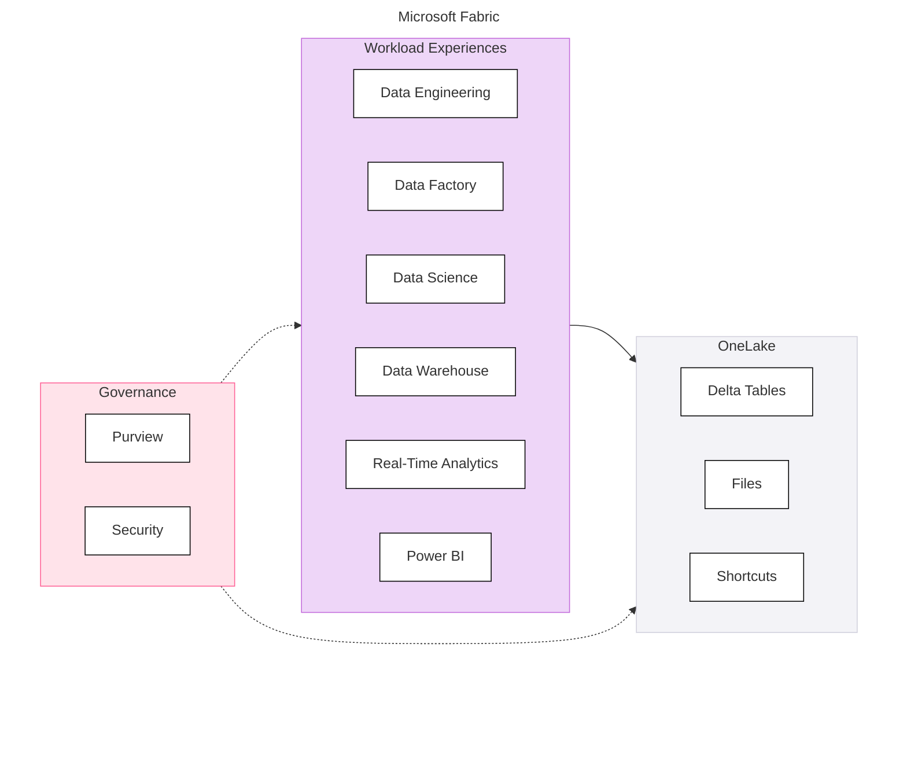
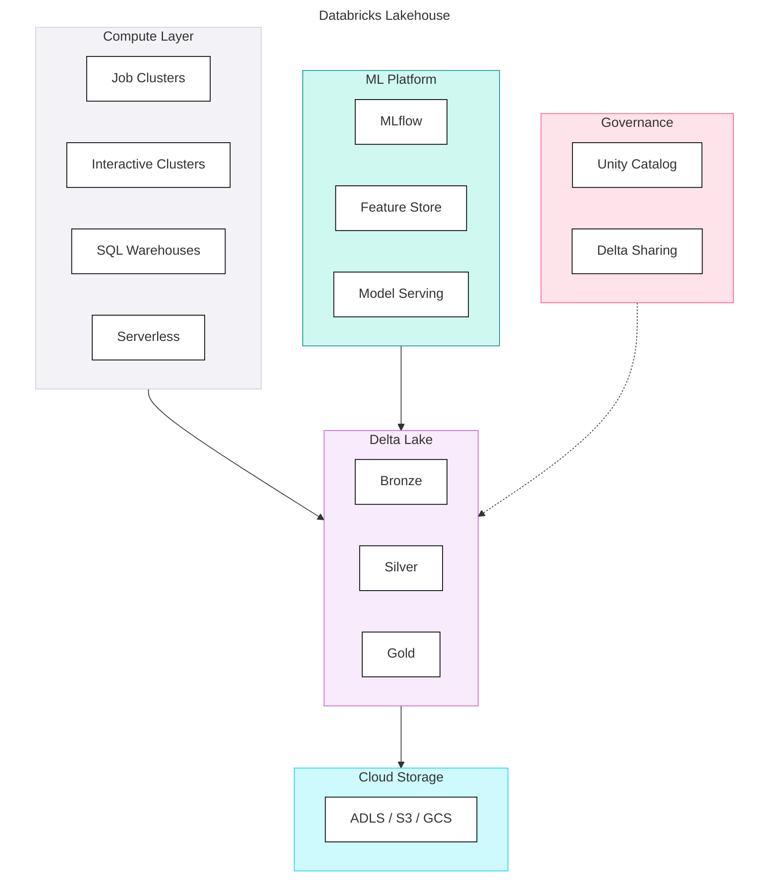
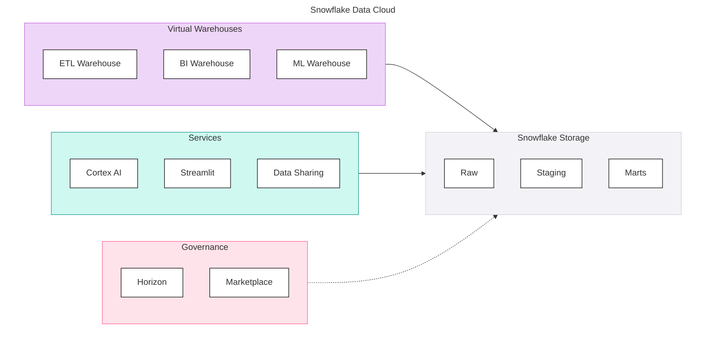

## Core Platforms

<Callout type="info">
  **Three Platforms, Different Strengths** - Microsoft Fabric, Databricks, and Snowflake each excel in different contexts. Understanding their architectures, strengths, and trade-offs is essential for defensible recommendations.
</Callout>

### Overview

The JMAN Platform Selection Framework focuses on three core platforms that represent the majority of client opportunities:

| Platform | Architecture | Primary Strength | Target Audience |
|----------|--------------|------------------|-----------------|
| **Microsoft Fabric** | Unified SaaS on OneLake | Integrated Microsoft analytics | Microsoft-native organisations |
| **Databricks** | Lakehouse on Delta Lake | Data engineering + ML at scale | Data engineering teams |
| **Snowflake** | Cloud data warehouse | SQL simplicity + data sharing | SQL-centric analytics teams |

### Quick Comparison

#### At a Glance

| Aspect | Fabric | Databricks | Snowflake |
|--------|--------|------------|-----------|
| **Architecture** | Unified SaaS | Lakehouse | Cloud warehouse |
| **Storage** | OneLake (Delta) | Delta Lake (open) | Proprietary |
| **Primary Language** | SQL, Power Query | Python, Spark, SQL | SQL |
| **Pricing Model** | Capacity (CU) | Usage (DBU) | Usage (Credits) |
| **BI Integration** | Power BI native | Partner tools | Partner tools |
| **ML Capabilities** | Azure AI Foundry | Best-in-class | Growing (Cortex) |
| **Governance** | Purview | Unity Catalog | Horizon |
| **Multi-Cloud** | Azure only | Azure, AWS, GCP | Azure, AWS, GCP |

#### Component Scores Summary
 
| Component | Fabric | Databricks | Snowflake |
|-----------|--------|------------|-----------|
| Ingestion | 4.7 | 4.1 | 2.5 |
| Storage | 4.6 | 5.0 | 4.8 |
| Compute | 4.0 | 4.9 | 5.0 |
| Transformation | 4.3 | 4.7 | 4.9 |
| Orchestration | 4.4 | 4.0 | 3.0 |
| BI & Semantic | 5.0 | 3.4 | 4.0 |
| Data Science & ML | 4.0 | 5.0 | 3.8 |
| Generative AI | 4.5 | 5.0 | 4.1 |
| Agentic AI | 4.5 | 4.3 | 3.5 |
| Governance | 3.7 | 4.8 | 4.5 |
| Security | 4.6 | 5.0 | 4.8 |
| Operations | 3.8 | 4.7 | 4.0 |
| **Average** | **4.3** | **4.6** | **4.1** |

<PlatformRadarChart
    title="Platform Comparison — Component Scores"
    data='[{"component":"Ingestion","Fabric":4.7,"Databricks":4.1,"Snowflake":2.5},{"component":"Storage","Fabric":4.6,"Databricks":5.0,"Snowflake":4.8},{"component":"Compute","Fabric":4.0,"Databricks":4.9,"Snowflake":5.0},{"component":"Transformation","Fabric":4.3,"Databricks":4.7,"Snowflake":4.9},{"component":"Orchestration","Fabric":4.4,"Databricks":4.0,"Snowflake":3.0},{"component":"BI & Semantic","Fabric":5.0,"Databricks":3.4,"Snowflake":4.0},{"component":"DS & ML","Fabric":4.0,"Databricks":5.0,"Snowflake":3.8},{"component":"GenAI","Fabric":4.5,"Databricks":5.0,"Snowflake":4.1},{"component":"Agentic AI","Fabric":4.5,"Databricks":4.3,"Snowflake":3.5},{"component":"Governance","Fabric":3.7,"Databricks":4.8,"Snowflake":4.5},{"component":"Security","Fabric":4.6,"Databricks":5.0,"Snowflake":4.8},{"component":"Operations","Fabric":3.8,"Databricks":4.7,"Snowflake":4.0}]'
    platforms='[{"name":"Microsoft Fabric","dataKey":"Fabric","color":"#3411A3","strokeColor":"#19105B"},{"name":"Databricks","dataKey":"Databricks","color":"#FF3621","strokeColor":"#CC2B1A"},{"name":"Snowflake","dataKey":"Snowflake","color":"#29B5E8","strokeColor":"#1A8BB5"}]'
/>

<Callout type="warning">
  **Scores are not recommendations.** A platform with a lower average score may be the right choice for a specific client context. Use the full scoring methodology including client fit modifiers.
</Callout>

### Platform Architectures

<PlatformTabs>

<PlatformTabsFabric>

**Key Insight:** Fabric unifies multiple workloads on a single storage layer (OneLake), with native Power BI integration and Azure-native governance via Purview.

</PlatformTabsFabric>

<PlatformTabsDatabricks>

**Key Insight:** Databricks provides maximum flexibility with open formats (Delta Lake) on your cloud storage, with best-in-class ML capabilities across any cloud.

</PlatformTabsDatabricks>

<PlatformTabsSnowflake>

**Key Insight:** Snowflake offers managed simplicity with true storage/compute separation and industry-leading data sharing capabilities via the Data Cloud marketplace.

</PlatformTabsSnowflake>

</PlatformTabs>

### When to Choose Each Platform

<PlatformTabs>

<PlatformTabsFabric>

<DosAndDonts dosLabel="Strong Fit" dontsLabel="Weak Fit"
  dos={[
    {text: "Deep Microsoft ecosystem (M365, Dynamics, Azure)"},
    {text: "Power BI is the primary BI tool"},
    {text: "SQL-focused team with low Spark experience"},
    {text: "Cost predictability is a hard requirement"},
    {text: "Unified platform with low operational overhead"},
    {text: "Azure-only cloud strategy"}
  ]}
  donts={[
    {text: "Multi-cloud requirement (AWS or GCP)"},
    {text: "Advanced ML/MLOps at scale"},
    {text: "Open format or vendor-neutrality priority"},
    {text: "Heavy streaming workloads"},
    {text: "Non-Power BI BI standardisation"}
  ]}
/>

</PlatformTabsFabric>

<PlatformTabsDatabricks>

<DosAndDonts dosLabel="Strong Fit" dontsLabel="Weak Fit"
  dos={[
    {text: "Advanced ML/AI requirements including GenAI and MLOps"},
    {text: "Data engineering at scale with Spark workloads"},
    {text: "Team has Spark or Python expertise"},
    {text: "Multi-cloud required (Azure, AWS, GCP)"},
    {text: "Open format and vendor-neutrality priority"},
    {text: "Complex streaming workloads"}
  ]}
  donts={[
    {text: "SQL-only team with no Spark skills"},
    {text: "Simple BI-only workloads"},
    {text: "Fixed budget with no cost variability"},
    {text: "Low operational maturity or small team"},
    {text: "Power BI as the primary analytics tool"}
  ]}
/>

</PlatformTabsDatabricks>

<PlatformTabsSnowflake>

<DosAndDonts dosLabel="Strong Fit" dontsLabel="Weak Fit"
  dos={[
    {text: "SQL-centric team with strong warehouse skills"},
    {text: "Data sharing is a primary use case"},
    {text: "Multi-cloud flexibility required"},
    {text: "Managed, low-ops preference"},
    {text: "Moderate streaming needs (Snowpipe Streaming)"},
    {text: "Cost control and auto-suspend important"}
  ]}
  donts={[
    {text: "Heavy streaming or complex event processing"},
    {text: "Advanced ML/MLOps at scale"},
    {text: "Native BI tool required"},
    {text: "Complex data engineering pipelines"},
    {text: "Open format or Parquet-first requirement"}
  ]}
/>

</PlatformTabsSnowflake>

</PlatformTabs>

### Cost Model Comparison

#### Pricing Structures

| Aspect | Fabric | Databricks | Snowflake |
|--------|--------|------------|-----------|
| **Model** | Capacity-based | Usage-based | Usage-based |
| **Unit** | Capacity Units (CU) | Databricks Units (DBU) | Credits |
| **Billing** | Monthly commitment | Per-second compute | Per-second compute |
| **Storage** | Included (ADLS rates) | Cloud storage (separate) | Per TB/month |
| **Predictability** | High | Lower | Medium |
| **Burst Handling** | Limited by tier | Elastic | Elastic |

#### Cost Scenarios

| Scenario | Best Cost Model |
|----------|-----------------|
| **Steady, predictable workloads** | Fabric (capacity) |
| **Variable, spiky workloads** | Snowflake (auto-suspend) |
| **Batch-heavy, fault-tolerant** | Databricks (spot instances) |
| **24/7 streaming** | Depends on volume (evaluate all) |
| **Strict budget, no overages** | Fabric (capacity cap) |

### Ecosystem and Partners

#### BI Tools

<EcosystemScoreTable category="biTools" />

#### Ingestion Tools

<EcosystemScoreTable category="ingestionTools" />

#### Transformation Tools

<EcosystemScoreTable category="transformationTools" />

### Platform Selection Quick Guide

#### Client Profile → Platform Direction

| If the client... | Consider... |
|------------------|-------------|
| Is deeply embedded in Microsoft | **Fabric** |
| Has advanced ML/AI requirements | **Databricks** |
| Is SQL-centric with data sharing needs | **Snowflake** |
| Needs multi-cloud flexibility | **Databricks** or **Snowflake** |
| Requires cost predictability | **Fabric** |
| Has a small, SQL-only team | **Snowflake** or **Fabric** |
| Wants maximum engineering flexibility | **Databricks** |
| Prioritises Power BI performance | **Fabric** |

#### Use the Full Framework

This quick guide provides direction, not decisions. For defensible recommendations:

1. Assess all twelve components with client-appropriate weights
2. Apply vendor modifiers
3. Assess client fit
4. Calculate final scores
5. Present recommendation with rationale
