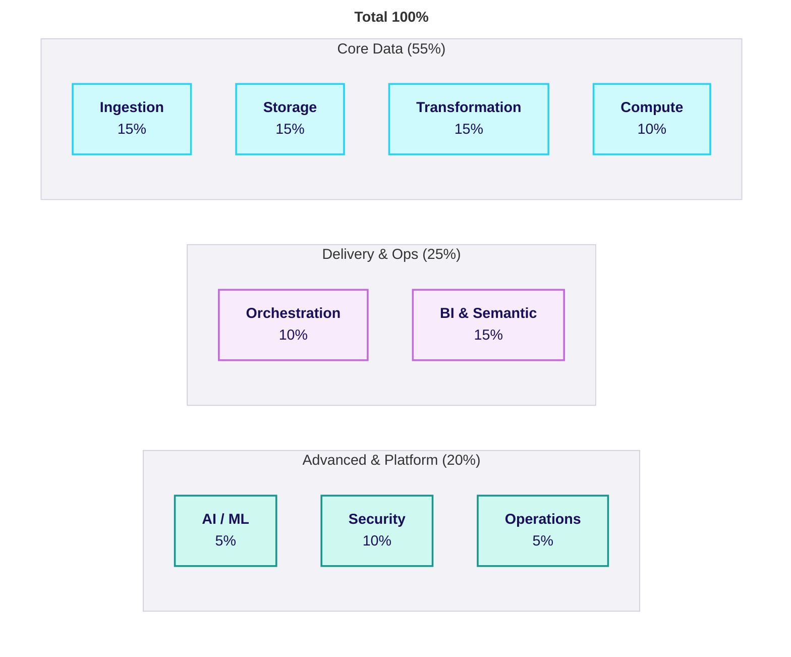
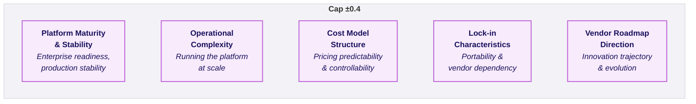
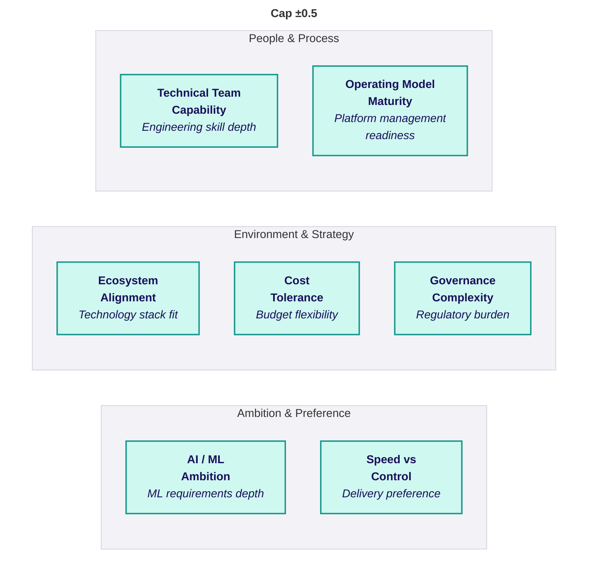
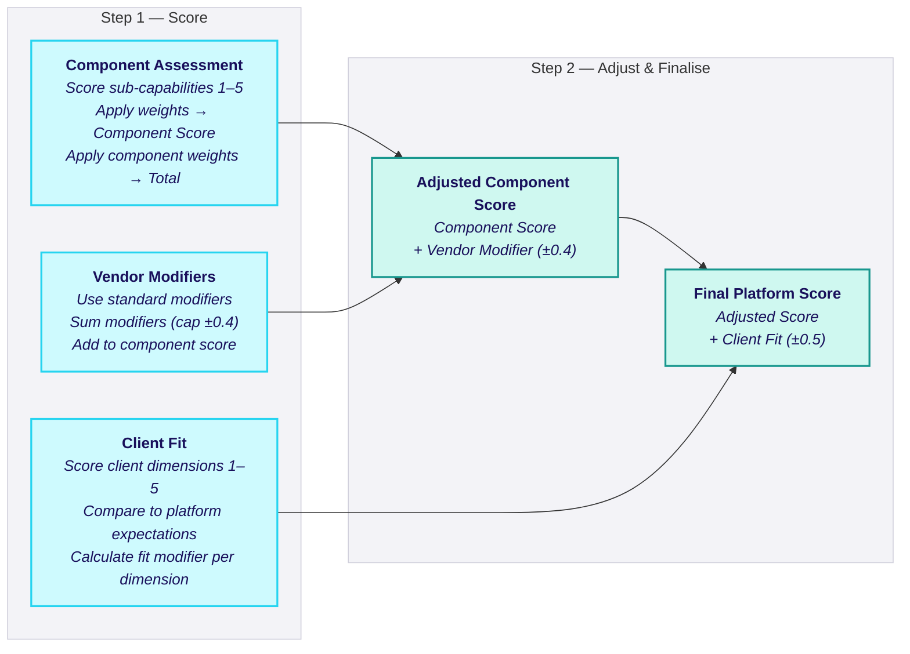

## Evaluation Dimensions

<Callout type="info">
  **The Scoring Criteria** - This page defines every dimension used to assess platforms. Use these definitions to ensure consistent, objective scoring across engagements and team members.
</Callout>

### Overview

Platform evaluation uses three dimension types:

| Type | Purpose | Count | Modifier Cap |
|------|---------|-------|--------------|
| **Component Capabilities** | Technical assessment | 9 components | Weighted to 100% |
| **Vendor Characteristics** | Platform-intrinsic factors | 5 dimensions | ±0.4 total |
| **Client Fit** | Client-specific context | 7 dimensions | ±0.5 total |

### Component Capabilities

#### Scoring Scale (1-5)

| Score | Label | Definition | Evidence Required |
|-------|-------|------------|-------------------|
| **5** | Best-in-class | Industry-leading capability; provides competitive advantage | Market leadership, analyst recognition, proven at scale |
| **4** | Strong | Production-ready; meets most enterprise requirements | GA features, enterprise customers, mature documentation |
| **3** | Adequate | Functional with trade-offs; meets basic requirements | Available but limitations documented |
| **2** | Limited | Possible but significant limitations affect usability | Workarounds required, gaps acknowledged |
| **1** | Weak | Unsuitable without heavy augmentation or workarounds | Missing or severely limited |

#### 1. Ingestion

**Purpose:** Capture data from source systems and land reliably in the platform.

| Sub-Capability | Definition | Score 5 | Score 3 | Score 1 |
|----------------|------------|---------|---------|---------|
| **Why it matters?** | Scheduled/triggered ingestion of files, databases, APIs | Handles any source at scale with minimal config | Works for common sources, some manual effort | Limited sources, significant custom code |
| **Native Connectors** | Pre-built integrations to common sources | 100+ connectors, major SaaS covered | 50+ connectors, gaps for niche sources | Few connectors, heavy partner reliance |
| **CDC Support** | Row-level change capture from transactional systems | Log-based CDC, ordering guaranteed, deletes handled | Query-based CDC, some ordering issues | No native CDC, external tools required |
| **Schema Evolution** | Handle source schema changes without breaking pipelines | Automatic handling of additive and type changes | Additive changes handled, others manual | Schema changes break pipelines |
| **Error Handling** | Retry logic, dead-letter queues, alerting | Comprehensive retry, DLQ, granular alerting | Basic retry, some error isolation | Manual error handling |
| **Streaming Ingestion** | Near real-time event processing with low latency | Sub-second latency, exactly-once, production-proven | Minutes latency, at-least-once, functional | No native streaming or very limited |

**Default Weight:** 15%

#### 2. Storage

**Purpose:** Persist data with reliability, efficiency, and appropriate governance.

| Sub-Capability | Definition | Score 5 | Score 3 | Score 1 |
|----------------|------------|---------|---------|---------|
| **Open Formats** | Support for portable data formats (Parquet, Delta, Iceberg) | Native open format, multi-format support | Primary format open, some limitations | Proprietary format, export required |
| **ACID Transactions** | Concurrent reads/writes with transactional guarantees | Full ACID, high concurrency proven | ACID available, some concurrency limits | No ACID or significant limitations |
| **Time Travel** | Access historical versions for audit/debugging/recovery | 90+ days, configurable, efficient | 7-30 days, functional | No time travel or very limited |
| **Cloning** | Zero-copy dataset replication for dev/test | True zero-copy, instant, no storage cost | Fast cloning, some storage overhead | Full copy required |
| **Storage/Compute Separation** | Independent scaling of storage and compute | True separation, multi-engine access | Logical separation, some coupling | Tightly coupled |

**Default Weight:** 15%

#### 3. Compute

**Purpose:** Execute workloads with appropriate performance and cost.

| Sub-Capability | Definition | Score 5 | Score 3 | Score 1 |
|----------------|------------|---------|---------|---------|
| **Elastic Scaling** | Dynamic resource allocation based on demand | Auto-scale in seconds, handles spikes | Auto-scale in minutes, some lag | Manual scaling required |
| **Workload Isolation** | Separate ETL, BI, ML workloads to prevent contention | Full isolation, dedicated resources | Logical isolation, some contention possible | Shared resources, contention issues |
| **Job vs Interactive** | Distinction between scheduled and ad-hoc compute | Clear separation, optimised for each | Both supported, some overlap | Single compute model |
| **Cold Start Performance** | Time to provision compute resources | Seconds (serverless) or warm pools | 1-5 minutes typical | 5+ minutes, unpredictable |
| **Cost Attribution** | Granular tracking and control across workloads | Per-query/job attribution, budgets | Per-cluster/warehouse attribution | Limited attribution |

**Default Weight:** 10%

#### 4. Transformation

**Purpose:** Model and refine data for analytical consumption.

| Sub-Capability | Definition | Score 5 | Score 3 | Score 1 |
|----------------|------------|---------|---------|---------|
| **SQL-First** | Express majority of transformations in SQL | Optimised SQL engine, full SQL support | Good SQL support, some gaps | Limited SQL, code-heavy |
| **Non-SQL Processing** | Python, Spark for complex transformations | Native Python/Spark, seamless integration | Supported but separate environment | Limited or no support |
| **Incremental Processing** | Efficient delta processing patterns | Native merge, watermarking, CDC patterns | Merge supported, some manual config | Full refresh only or complex setup |
| **Dependency Management** | Explicit handling of transformation dependencies | Native DAG, lineage, impact analysis | dbt integration, basic lineage | Manual dependency tracking |
| **Testing & Quality** | Data validation, schema checks, business rules | Native testing, quality gates, alerting | dbt tests, basic validation | Manual testing only |

**Default Weight:** 15%

#### 5. Orchestration

**Purpose:** Coordinate, schedule, and monitor data workflows.

| Sub-Capability | Definition | Score 5 | Score 3 | Score 1 |
|----------------|------------|---------|---------|---------|
| **DAG Definition** | Define pipeline dependencies as directed graphs | Visual + code DAGs, complex patterns | Basic DAG support, some limitations | Linear pipelines only |
| **Scheduling** | Time, event, and dependency-based execution | All trigger types, complex schedules | Time and basic event triggers | Time-based only |
| **Retry & Failure Handling** | Configurable retry logic and failure management | Granular retry, backoff, alerting | Basic retry, manual intervention | No retry, manual recovery |
| **Observability** | Visibility into execution, runtimes, failures | Real-time monitoring, detailed logs, metrics | Basic monitoring, logs available | Limited visibility |
| **SLA Monitoring** | Define and monitor data freshness guarantees | Native SLA tracking, alerting, reporting | Basic freshness checks | No SLA monitoring |

**Default Weight:** 10%

#### 6. BI & Semantic Layer

**Purpose:** Enable business users to access and analyse data.

| Sub-Capability | Definition | Score 5 | Score 3 | Score 1 |
|----------------|------------|---------|---------|---------|
| **Semantic Layer** | Centralised business entity and logic definitions | Native semantic layer, single source of truth | Partner integration (dbt metrics, etc.) | No semantic layer |
| **Metric Consistency** | KPIs defined once, reused across tools | Metrics defined in platform, consumed anywhere | Metrics in BI tool, some consistency | Metrics duplicated across tools |
| **Query Performance** | Serve analytics queries efficiently at scale | Sub-second for common queries, auto-optimised | Good performance, some tuning needed | Performance issues at scale |
| **Fine-Grained Security** | Row and column level security in semantic layer | Native RLS/CLS, policy-based | RLS available, some manual config | Limited or no fine-grained security |
| **Self-Service Enablement** | Business users explore without compromising governance | Governed self-service, natural language | Self-service available, governance separate | IT-dependent access |

**Default Weight:** 15%

#### 7. AI/ML

**Purpose:** Support data science, machine learning, and AI workloads.

| Sub-Capability | Definition | Score 5 | Score 3 | Score 1 |
|----------------|------------|---------|---------|---------|
| **Notebook Development** | Interactive environments for experimentation | Collaborative notebooks, Git integration, rich viz | Notebooks available, basic features | No native notebooks |
| **Feature Engineering** | Create, store, and reuse features across models | Native feature store, versioning, serving | Feature engineering supported, no store | Manual feature management |
| **Model Training** | Scalable training workloads | Distributed training, GPU support, experiment tracking | Training supported, limited scale | Basic training only |
| **Model Registry** | Version and manage models across environments | Native registry, staging, approval workflows | Registry available, basic versioning | No registry |
| **MLOps** | Deploy models with monitoring and rollback | Full MLOps pipeline, drift detection, A/B testing | Deployment supported, manual monitoring | Manual deployment |
| **GenAI Integration** | LLM, embedding, and AI service support | Native LLM functions, vector search, RAG support | Partner integrations, some native | Limited or no GenAI support |

**Default Weight:** 5%

#### 8. Governance & Security

**Purpose:** Control access, ensure compliance, and maintain data quality.

| Sub-Capability | Definition | Score 5 | Score 3 | Score 1 |
|----------------|------------|---------|---------|---------|
| **Identity & Access** | Enterprise IAM integration and fine-grained permissions | Native SSO, SCIM, attribute-based access | SSO supported, role-based access | Basic authentication |
| **Data Lineage** | End-to-end visibility into data flow and transformations | Automatic column-level lineage, impact analysis | Table-level lineage, some manual | No lineage or very limited |
| **Audit & Compliance** | Logging and traceability for regulatory requirements | Comprehensive audit logs, compliance reports | Audit logs available, manual reporting | Limited audit capability |
| **Data Sharing** | Governed mechanisms for internal and external sharing | Native sharing, marketplace, governance controls | Sharing available, separate governance | Export/import only |
| **Enterprise Readiness** | Compliance certifications and security best practices | SOC2, ISO27001, HIPAA, FedRAMP | Major certifications | Limited certifications |

**Default Weight:** 10%

#### 9. Operations

**Purpose:** Deploy, monitor, and optimise the platform.

| Sub-Capability | Definition | Score 5 | Score 3 | Score 1 |
|----------------|------------|---------|---------|---------|
| **CI/CD** | Automated promotion across environments with testing | Native Git, deployment pipelines, testing gates | Git integration, external CI/CD | Manual deployments |
| **Infrastructure as Code** | Declarative management of platform resources | Comprehensive Terraform/Pulumi provider | Partial IaC support | No IaC support |
| **Environment Strategy** | Clear separation of dev, test, and prod | Native environment separation, promotion paths | Workspace/database separation | Manual environment management |
| **Monitoring & Alerting** | Visibility into platform health and performance | Native dashboards, metrics, alerting | Basic monitoring, external tools | Limited monitoring |
| **Cost Management** | Monitor, forecast, and optimise platform spend | Native cost dashboards, budgets, recommendations | Basic cost tracking | No cost visibility |

**Default Weight:** 5%

### Vendor Characteristics

Vendor characteristics are **platform-intrinsic** and do not change based on client context. These modifiers adjust the component score to reflect real-world delivery realities.

#### Modifier Scale

**Total Cap: ±0.4**

#### 1. Platform Maturity & Stability

**What it measures?:** Enterprise readiness, production stability, and historical reliability.

| Assessment | Indicators |
|------------|------------|
| **High (positive)** | Long GA history, rare breaking changes, large enterprise adoption, stable APIs |
| **Medium (neutral)** | Mix of mature and evolving features, manageable change rate |
| **Low (negative)** | Rapid evolution, frequent breaking changes, features in preview, delivery risk |

**Current Assessments:**

| Platform | Assessment | Modifier | Rationale |
|----------|------------|----------|-----------|
| Fabric | Newer, evolving | -0.1 | GA 2023, rapid feature velocity, some preview features |
| Databricks | Mature | +0.1 | Long history, stable core, enterprise-proven |
| Snowflake | Mature | +0.1 | Stable platform, predictable evolution |

#### 2. Operational Complexity

**What it measures?:** Inherent complexity of running the platform at scale.

| Assessment | Indicators |
|------------|------------|
| **High (positive = low complexity)** | Unified platform, managed services, minimal ops overhead |
| **Medium (neutral)** | Some services to manage, moderate ops |
| **Low (negative = high complexity)** | Multiple services, heavy platform engineering, specialist skills |

**Current Assessments:**

| Platform | Assessment | Modifier | Rationale |
|----------|------------|----------|-----------|
| Fabric | Low complexity | +0.1 | Unified SaaS, Microsoft-managed |
| Databricks | Higher complexity | -0.1 | Multiple services, platform engineering needed |
| Snowflake | Low complexity | +0.1 | Fully managed, minimal ops |

#### 3. Cost Model Structure

**What it measures?:** Pricing predictability and controllability.

| Assessment | Indicators |
|------------|------------|
| **High (positive)** | Predictable pricing, clear controls, easy forecasting |
| **Medium (neutral)** | Usage-based but controllable, moderate predictability |
| **Low (negative)** | Variable pricing, risk of spikes, hard to forecast |

**Current Assessments:**

| Platform | Assessment | Modifier | Rationale |
|----------|------------|----------|-----------|
| Fabric | Predictable | +0.1 | Capacity-based, fixed monthly cost |
| Databricks | Variable | -0.1 | Usage-based DBUs, can spike |
| Snowflake | Moderate | 0 | Usage-based but good controls |

#### 4. Lock-in Characteristics

**What it measures?:** Portability and vendor dependency.

| Assessment | Indicators |
|------------|------------|
| **High (positive = low lock-in)** | Open formats, portable workloads, easy migration |
| **Medium (neutral)** | Mix of open and proprietary, moderate effort to migrate |
| **Low (negative = high lock-in)** | Proprietary formats, deep coupling, hard to migrate |

**Current Assessments:**

| Platform | Assessment | Modifier | Rationale |
|----------|------------|----------|-----------|
| Fabric | Medium lock-in | -0.1 | Delta (open) but Microsoft ecosystem coupling |
| Databricks | Low lock-in | +0.1 | Delta Lake open, multi-cloud, portable |
| Snowflake | Medium lock-in | 0 | Proprietary storage, Iceberg emerging |

#### 5. Vendor Roadmap Direction

**What it measures?:** Innovation trajectory and long-term platform evolution.

| Assessment | Indicators |
|------------|------------|
| **High (positive)** | Strong investment, clear direction, aligned with market trends |
| **Medium (neutral)** | Solid roadmap, incremental innovation |
| **Low (negative)** | Unclear direction, stagnation risk, market position concerns |

**Current Assessments:**

| Platform | Assessment | Modifier | Rationale |
|----------|------------|----------|-----------|
| Fabric | Strong investment | +0.1 | Heavy Microsoft investment, rapid innovation |
| Databricks | Strong investment | +0.1 | AI/ML leadership, open source leadership |
| Snowflake | Solid | 0 | Good roadmap, expanding into AI |

#### Vendor Modifier Summary

| Platform | Maturity | Ops Complexity | Cost Model | Lock-in | Roadmap | **Total** |
|----------|----------|----------------|------------|---------|---------|-----------|
| Fabric | -0.1 | +0.1 | +0.1 | -0.1 | +0.1 | **0.0** |
| Databricks | +0.1 | -0.1 | -0.1 | +0.1 | +0.1 | **+0.1** |
| Snowflake | +0.1 | +0.1 | 0 | 0 | 0 | **+0.2** |

### Client Fit Dimensions

Client fit dimensions assess **how well a platform fits a specific client environment**. Each client is scored once; platforms are compared to that profile.

#### Scoring Scale (1-5)

Each dimension is scored based on the client's actual situation:

#### 1. Technical Team Capability

**What it measures?:** Depth and breadth of the client's engineering skills.

| Score | Description | Indicators |
|-------|-------------|------------|
| **5** | Advanced | Spark/Python expertise, distributed systems experience, ML engineering |
| **4** | Strong | Python comfortable, some Spark, cloud-native experience |
| **3** | Moderate | SQL strong, basic Python, learning cloud |
| **2** | Basic | SQL-centric, limited Python, traditional DBA background |
| **1** | Limited | SQL only, no coding, analyst-level technical skills |

**Platform Expectations:**

| Platform | Expects | Rationale |
|----------|---------|-----------|
| Fabric | 2 | SQL-friendly, low-code options |
| Databricks | 5 | Requires Spark/Python for full value |
| Snowflake | 3 | SQL-centric but some Python for advanced |

#### 2. Operating Model Maturity

**What it measures?:** Client's ability to manage a modern data platform.

| Score | Description | Indicators |
|-------|-------------|------------|
| **5** | Mature | DevOps culture, CI/CD, IaC, monitoring, incident management |
| **4** | Developing | Some automation, defined environments, basic monitoring |
| **3** | Basic | Manual deployments, separate environments, reactive |
| **2** | Ad-hoc | Limited process, shared environments, minimal monitoring |
| **1** | None | No defined process, single environment, no monitoring |

**Platform Expectations:**

| Platform | Expects | Rationale |
|----------|---------|-----------|
| Fabric | 2 | Microsoft manages infrastructure |
| Databricks | 5 | Requires platform engineering maturity |
| Snowflake | 3 | Managed but needs dbt/orchestration ops |

#### 3. Ecosystem Alignment

**What it measures?:** Fit between platform and client's existing technology stack.

| Score | Description | For Fabric | For Databricks | For Snowflake |
|-------|-------------|------------|----------------|---------------|
| **5** | Perfect fit | Deep M365, Azure, Dynamics | Multi-cloud, open source stack | Cloud-agnostic, modern data stack |
| **4** | Good fit | Some Microsoft, Azure primary | Single cloud, flexible | Some tooling alignment |
| **3** | Neutral | Mixed environment | Mixed environment | Mixed environment |
| **2** | Some friction | Minimal Microsoft | Legacy systems, limited cloud | Legacy BI, limited integration |
| **1** | Misaligned | Non-Microsoft committed | On-premises focused | Proprietary stack conflicts |

**Platform Expectations:**

| Platform | Expects | Rationale |
|----------|---------|-----------|
| Fabric | 5 | Best with Microsoft ecosystem |
| Databricks | 4 | Cloud-agnostic but needs cloud |
| Snowflake | 2 | Works with most stacks |

#### 4. Cost Tolerance

**What it measures?:** Client appetite for cost variability.

| Score | Description | Indicators |
|-------|-------------|------------|
| **5** | Flexible | Variable cost acceptable, focus on value |
| **4** | Moderate | Some variability OK, reasonable budget |
| **3** | Balanced | Prefer predictability, can handle some variance |
| **2** | Sensitive | Fixed budget preferred, cost scrutiny |
| **1** | Rigid | Fixed budget required, PE pressure, strict controls |

**Platform Expectations:**

| Platform | Expects | Rationale |
|----------|---------|-----------|
| Fabric | 4 | Capacity-based is predictable |
| Databricks | 3 | Usage-based, needs monitoring |
| Snowflake | 4 | Usage-based but controllable |

#### 5. Governance Complexity

**What it measures?:** Regulatory, compliance, and security burden.

| Score | Description | Indicators |
|-------|-------------|------------|
| **5** | Heavy | Financial services, healthcare, PII, multi-jurisdiction |
| **4** | Significant | Industry regulation, audit requirements |
| **3** | Moderate | Some compliance, standard security |
| **2** | Light | Basic security, minimal regulation |
| **1** | Minimal | Internal use, no regulation |

**Platform Expectations:**

| Platform | Expects | Rationale |
|----------|---------|-----------|
| Fabric | 4 | Good governance, Purview integration |
| Databricks | 5 | Unity Catalog comprehensive |
| Snowflake | 5 | Horizon, strong compliance |

#### 6. AI/ML Ambition

**What it measures?:** Depth and immediacy of AI/ML requirements.

| Score | Description | Indicators |
|-------|-------------|------------|
| **5** | Immediate deep | Production ML, MLOps, GenAI now |
| **4** | Near-term | ML projects planned, building capability |
| **3** | Emerging | Interest in AI, exploring use cases |
| **2** | Future | AI on roadmap, not priority |
| **1** | None | No AI plans, pure BI/reporting |

**Platform Expectations:**

| Platform | Expects | Rationale |
|----------|---------|-----------|
| Fabric | 3 | AI emerging, not primary strength |
| Databricks | 5 | Best-in-class ML platform |
| Snowflake | 3 | Cortex growing, not ML-first |

#### 7. Speed vs Control Preference

**What it measures?:** Client's preference for rapid delivery vs architectural flexibility.

| Score | Description | Indicators |
|-------|-------------|------------|
| **5** | Control priority | Willing to invest time for flexibility, custom solutions |
| **4** | Balanced toward control | Some customisation important |
| **3** | Balanced | Trade-offs acceptable either way |
| **2** | Balanced toward speed | Some flexibility sacrifice OK |
| **1** | Speed priority | Fastest path to value, opinionated platform fine |

**Platform Expectations:**

| Platform | Expects | Rationale |
|----------|---------|-----------|
| Fabric | 5 (prefers speed) | Opinionated, fast to value |
| Databricks | 3 | Flexible, requires decisions |
| Snowflake | 4 | Balanced, some opinions |

#### Client Fit Modifier Calculation

For each dimension:
1. Compare client score to platform expectation
2. Calculate fit:
   - **Within 1 point:** Strong alignment → +0.05 to +0.1
   - **Within 2 points:** Neutral → 0
   - **3+ points apart:** Misalignment → -0.05 to -0.1

**Total client fit modifier capped at ±0.5**

### Using These Dimensions

