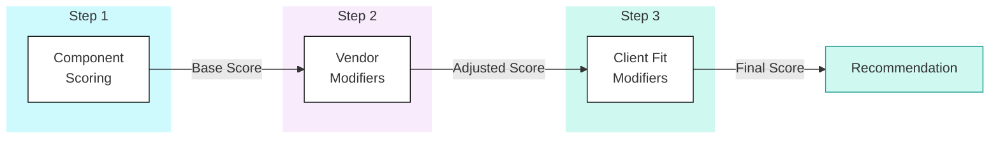

## Scoring Methodology

<Callout type="info">
  **Defensible Recommendations** - This methodology transforms subjective platform preference into quantified assessment. The result is a recommendation that can be explained, challenged, and defended.
</Callout>

The JMAN Platform Selection Framework uses a three-step scoring process:

1. **Component Capability Scoring** - Technical assessment (pure platform capability)
2. **Vendor Capability Modifiers** - Intrinsic platform characteristics
3. **Client Fit Modifiers** - Client-specific context and requirements

Each step builds on the previous, producing a final score that reflects both technical strength and practical suitability.

### Step 1: Component Capability Scoring

#### Purpose

<Callout type="question">
    Can the platform technically do the job?
</Callout>

This step produces a pure technical assessment, independent of client context or vendor characteristics.

#### Components Evaluated

| Component | Weight Range | Description |
|-----------|--------------|-------------|
| Ingestion | 10-20% | Batch, streaming, CDC, connectors |
| Storage | 10-20% | Formats, ACID, versioning, cloning |
| Compute | 10-20% | Scaling, isolation, cost control |
| Transformation | 10-20% | SQL, dbt, incremental, testing |
| Orchestration | 5-15% | DAGs, scheduling, monitoring |
| BI & Semantic | 5-20% | Semantic layer, metrics, self-serve |
| AI/ML | 5-20% | MLOps, features, GenAI |
| Governance | 10-20% | IAM, lineage, compliance |
| Operations | 5-15% | CI/CD, IaC, monitoring |

**Total must equal 100%**

#### Scoring Scale

| Score | Label | Description |
|-------|-------|-------------|
| **1** | Weak | Unsuitable without heavy augmentation or workarounds |
| **2** | Limited | Possible but significant limitations affect usability |
| **3** | Adequate | Functional with trade-offs; meets basic requirements |
| **4** | Strong | Production-ready; meets most enterprise requirements |
| **5** | Best-in-class | Industry-leading capability; competitive advantage |

#### Sub-Capability Scoring

Each component is broken into sub-capabilities. Example for Ingestion:

| Sub-Capability | Weight | Description |
|----------------|--------|-------------|
| Batch Ingestion | 25% | Scheduled file/database ingestion |
| Native Connectors | 20% | Pre-built source integrations |
| CDC Support | 15% | Change data capture capabilities |
| Error Handling | 10% | Retry, dead-letter, alerting |
| Schema Evolution | 10% | Handle source changes |
| Streaming Ingestion | 20% | Real-time event processing |

#### Calculation

**Component Score** = Σ (Sub-Capability Score × Sub-Capability Weight)

**Total Component Score** = Σ (Component Score × Component Weight)

#### Example: Ingestion Scoring for Fabric

| Sub-Capability | Weight | Score | Weighted |
|----------------|--------|-------|----------|
| Batch Ingestion | 25% | 5 | 1.25 |
| Native Connectors | 20% | 5 | 1.00 |
| CDC Support | 15% | 4 | 0.60 |
| Error Handling | 10% | 4 | 0.40 |
| Schema Evolution | 10% | 4 | 0.40 |
| Streaming Ingestion | 20% | 4 | 0.80 |
| **Ingestion Total** | 100% | | **4.45** |

### Step 2: Vendor Capability Modifiers

#### Purpose

<Callout type="question">
    What is this platform inherently like to run?
</Callout>

These modifiers adjust for intrinsic vendor characteristics that affect real-world delivery, regardless of client context.

#### Modifier Categories

| Category | What it measures? | Range |
|----------|------------------|-------|
| Platform Maturity | Enterprise readiness, stability, adoption | ±0.1 to ±0.2 |
| Operational Complexity | Inherent complexity at scale | ±0.1 to ±0.2 |
| Cost Model Structure | Pricing predictability and control | ±0.1 to ±0.2 |
| Lock-in Characteristics | Portability and vendor dependency | ±0.1 to ±0.2 |
| Roadmap Direction | Innovation trajectory alignment | ±0.1 to ±0.2 |

**Total Vendor Modifier Cap: ±0.4**

#### Modifier Definitions

##### Platform Maturity & Stability

**High score (positive modifier):** Proven, stable, widely adopted in production
**Low score (negative modifier):** Rapidly evolving, feature volatility, higher delivery risk

| Platform | Assessment | Modifier |
|----------|------------|----------|
| Fabric | Newer platform, rapid evolution, some features in preview | -0.1 |
| Databricks | Mature, stable, large enterprise adoption | +0.1 |
| Snowflake | Mature, stable, proven at scale | +0.1 |

##### Operational Complexity (Baseline)

**High score (positive modifier):** Unified, lower operational overhead
**Low score (negative modifier):** Multiple moving parts, higher engineering burden

| Platform | Assessment | Modifier |
|----------|------------|----------|
| Fabric | Unified platform, lower ops overhead | +0.1 |
| Databricks | Multiple services, requires platform engineering | -0.1 |
| Snowflake | Managed service, lower ops overhead | +0.1 |

##### Cost Model Structure

**High score (positive modifier):** Predictable, controllable cost model
**Low score (negative modifier):** Harder to forecast, risk of cost leakage

| Platform | Assessment | Modifier |
|----------|------------|----------|
| Fabric | Capacity-based, predictable | +0.1 |
| Databricks | Usage-based, can spike unexpectedly | -0.1 |
| Snowflake | Usage-based but more controllable | 0 |

##### Lock-in Characteristics

**High score (positive modifier):** Open, portable, low lock-in
**Low score (negative modifier):** Deep vendor coupling

| Platform | Assessment | Modifier |
|----------|------------|----------|
| Fabric | Microsoft ecosystem lock-in | -0.1 |
| Databricks | Open formats, high portability | +0.1 |
| Snowflake | Proprietary storage, medium lock-in | 0 |

##### Vendor Roadmap Direction

**High score (positive modifier):** Strong long-term innovation alignment
**Low score (negative modifier):** Unclear roadmap or stagnation risk

| Platform | Assessment | Modifier |
|----------|------------|----------|
| Fabric | Heavy Microsoft investment, rapid innovation | +0.1 |
| Databricks | Strong AI/ML roadmap, open source leadership | +0.1 |
| Snowflake | Solid roadmap, expanding into AI | 0 |

#### Vendor Modifier Summary

| Modifier | Fabric | Databricks | Snowflake |
|----------|--------|------------|-----------|
| Platform Maturity | -0.1 | +0.1 | +0.1 |
| Operational Complexity | +0.1 | -0.1 | +0.1 |
| Cost Model Structure | +0.1 | -0.1 | 0 |
| Lock-in Characteristics | -0.1 | +0.1 | 0 |
| Roadmap Direction | +0.1 | +0.1 | 0 |
| **Total Vendor Modifier** | **0** | **+0.1** | **+0.2** |

### Step 3: Client Fit Modifiers

#### Purpose

<Callout type="question">
    Will this platform succeed in this specific client environment?
</Callout>

The client is assessed once across key dimensions. Each platform's expected profile is compared to the client's reality.

#### Client Assessment Dimensions

| Dimension | What to Assess | Scale |
|-----------|----------------|-------|
| Technical Capability | Team's engineering depth | 1 (SQL-only) to 5 (Advanced Spark/ML) |
| Operating Model | Platform ops maturity | 1 (Ad-hoc) to 5 (Mature DevOps) |
| Ecosystem Alignment | Existing tech stack fit | 1 (Misaligned) to 5 (Perfect fit) |
| Cost Tolerance | Budget flexibility | 1 (Fixed budget) to 5 (Flexible) |
| Governance Complexity | Regulatory burden | 1 (Minimal) to 5 (Heavy regulation) |
| AI Ambition | ML/AI requirements | 1 (None) to 5 (Immediate, deep) |
| Speed vs Control | Delivery preference | 1 (Speed priority) to 5 (Control priority) |

#### Platform Expectation Profiles

Each platform has an "ideal client" profile:

| Dimension | Fabric Expects | Databricks Expects | Snowflake Expects |
|-----------|----------------|-------------------|-------------------|
| Technical Capability | 2 | 5 | 3 |
| Operating Model | 2 | 5 | 3 |
| Ecosystem Fit | 5 (Microsoft) | 4 (Cloud-agnostic) | 2 (No preference) |
| Speed vs Control | 5 (Speed) | 3 | 4 |
| Cost Tolerance | 4 (Predictable) | 3 (Variable OK) | 4 (Controllable) |
| Governance Complexity | 4 | 5 | 5 |
| AI Ambition | 3 | 5 | 3 |

#### Fit Calculation

For each dimension:
- **Strong alignment** (client within 1 of platform expectation): +0.05 to +0.1
- **Neutral** (client within 2 of platform expectation): 0
- **Misalignment** (client differs by 3+): -0.05 to -0.1

**Total Client Fit Modifier Cap: ±0.5**

#### Example: Client Fit Assessment

**Client Profile:**

| Dimension | Client Score |
|-----------|--------------|
| Technical Capability | 2 (SQL-focused team) |
| Operating Model | 2 (Limited DevOps) |
| Microsoft Ecosystem | 5 (Deep M365/Azure) |
| Speed to Value | 4 (Urgent delivery) |
| Cost Predictability | 5 (Fixed budget required) |
| Governance Complexity | 3 (Moderate regulation) |
| AI Ambition | 2 (Future, not now) |

**Fit Comparison:**

| Dimension | Client | Fabric Fit | Databricks Fit | Snowflake Fit |
|-----------|--------|------------|----------------|---------------|
| Technical Capability | 2 | ✓ Match | ✗ Gap (expects 5) | ○ Close |
| Operating Model | 2 | ✓ Match | ✗ Gap (expects 5) | ○ Close |
| Ecosystem | 5 (Microsoft) | ✓ Perfect | ○ OK | ○ Neutral |
| Speed to Value | 4 | ✓ Match | ○ Neutral | ✓ Match |
| Cost Predictability | 5 | ✓ Match | ✗ Gap (variable) | ✓ Match |
| Governance | 3 | ○ Close | ✓ Match | ✓ Match |
| AI Ambition | 2 | ✓ Match | ✗ Gap (overkill) | ✓ Match |

**Client Fit Modifiers:**

| Platform | Fit Summary | Modifier |
|----------|-------------|----------|
| Fabric | Strong fit across team, ecosystem, cost | **+0.4** |
| Databricks | Over-engineered for current team | **-0.4** |
| Snowflake | Mixed fit, generally acceptable | **-0.1** |

### Complete Scoring Example

#### Scenario: Mid-Size Professional Services Firm

**Client Context:**
- 50-person finance team, SQL-skilled, no Spark expertise
- Deep Microsoft ecosystem (M365, Dynamics, Azure AD)
- Fixed annual IT budget, PE-backed with cost scrutiny
- Moderate compliance needs (financial services)
- Primary need: financial reporting and analytics
- AI ambition: future consideration, not immediate

#### Step 1: Component Scoring

- **Client-adjusted weights** reflect this client's priorities (BI & Semantic and Transformation carry highest weight at 20% each).
- **Component scores** are drawn from platform assessments; weighted scores are calculated as weight × score per component.

| Component | Weight | Rationale | Fabric | Databricks | Snowflake |
|-----------|--------|-----------|--------|------------|-----------|
| Ingestion | 15% | Multiple sources but not complex | 4.5 | 4.7 | 3.8 |
| Storage | 15% | Standard needs | 4.2 | 5.0 | 4.6 |
| Compute | 10% | Moderate workloads | 4.0 | 4.8 | 4.7 |
| Transformation | 20% | Core to reporting needs | 4.2 | 4.8 | 4.8 |
| Orchestration | 10% | Basic scheduling | 4.0 | 4.2 | 3.5 |
| BI & Semantic | 20% | Critical for finance reporting | 5.0 | 3.5 | 4.0 |
| AI/ML | 5% | Future consideration | 3.5 | 5.0 | 4.0 |
| Governance | 10% | Moderate compliance | 4.2 | 4.8 | 4.8 |
| Operations | 10% | Standard DevOps | 4.0 | 4.5 | 3.8 |

**Weighted Component Scores:**

| Platform | Calculation | Score |
|----------|-------------|-------|
| Fabric | (0.15×4.5)+(0.15×4.2)+(0.10×4.0)+(0.20×4.2)+(0.10×4.0)+(0.20×5.0)+(0.05×3.5)+(0.10×4.2)+(0.10×4.0) | **4.31** |
| Databricks | (0.15×4.7)+(0.15×5.0)+(0.10×4.8)+(0.20×4.8)+(0.10×4.2)+(0.20×3.5)+(0.05×5.0)+(0.10×4.8)+(0.10×4.5) | **4.44** |
| Snowflake | (0.15×3.8)+(0.15×4.6)+(0.10×4.7)+(0.20×4.8)+(0.10×3.5)+(0.20×4.0)+(0.05×4.0)+(0.10×4.8)+(0.10×3.8) | **4.25** |

#### Step 2: Vendor Modifiers

| Platform | Base Score | Vendor Modifier | Adjusted Score |
|----------|------------|-----------------|----------------|
| Fabric | 4.31 | 0 | **4.31** |
| Databricks | 4.44 | +0.1 | **4.54** |
| Snowflake | 4.25 | +0.2 | **4.45** |

#### Step 3: Client Fit Modifiers

| Platform | Adjusted Score | Client Fit | Final Score |
|----------|----------------|------------|-------------|
| Fabric | 4.31 | +0.4 | **4.71** |
| Databricks | 4.54 | -0.4 | **4.14** |
| Snowflake | 4.45 | -0.1 | **4.35** |

#### Final Recommendation

| Rank | Platform | Final Score | Summary |
|------|----------|-------------|---------|
| 1 | **Fabric** | **4.71** | Best fit for Microsoft ecosystem, SQL team, cost predictability, BI focus |
| 2 | Snowflake | 4.35 | Viable alternative if Fabric maturity concerns |
| 3 | Databricks | 4.14 | Over-engineered for current needs and team capabilities |

**Recommendation:** Microsoft Fabric

**Rationale:**
- Strong technical fit for BI-centric workloads
- Perfect ecosystem alignment with existing Microsoft investment
- Team capability matches platform expectations (SQL-focused)
- Cost model aligns with PE-backed budget requirements
- Native Power BI integration supports primary use case

**Caveats:**
- If AI/ML becomes priority within 12 months, reconsider Databricks
- Monitor Fabric maturity; some features still in preview
- Snowflake is viable alternative with strong transformation capabilities

### Scoring Confidence

  <h4 className="font-semibold text-emerald-800 dark:text-emerald-300 mb-3">High Confidence (±0.3 variance)</h4>
  <ul className="space-y-2 text-sm text-slate-700 dark:text-slate-300 list-disc list-inside">
    <li>Clear client requirements</li>
    <li>Obvious platform strengths</li>
    <li>One platform dominates</li>
  </ul>

  <h4 className="font-semibold text-amber-800 dark:text-amber-300 mb-3">Medium Confidence (±0.5 variance)</h4>
  <ul className="space-y-2 text-sm text-slate-700 dark:text-slate-300 list-disc list-inside">
    <li>Some requirements unclear</li>
    <li>Platforms competitive</li>
    <li>Trade-offs significant</li>
  </ul>

  <h4 className="font-semibold text-red-800 dark:text-red-300 mb-3">Low Confidence (±0.7 variance)</h4>
  <ul className="space-y-2 text-sm text-slate-700 dark:text-slate-300 list-disc list-inside">
    <li>Requirements still forming</li>
    <li>All platforms viable</li>
    <li>Recommend discovery phase</li>
  </ul>

### Using the Framework

  <h4 className="font-semibold text-slate-900 dark:text-slate-100 mb-3">For Pre-Sales</h4>
  <ol className="space-y-2 text-sm text-slate-700 dark:text-slate-300 list-decimal list-inside">
    <li>Quick assessment with decision tree</li>
    <li>High-level component scoring</li>
    <li>Client fit assessment</li>
    <li>Recommendation with confidence level</li>
  </ol>

  <h4 className="font-semibold text-slate-900 dark:text-slate-100 mb-3">For Delivery</h4>
  <ol className="space-y-2 text-sm text-slate-700 dark:text-slate-300 list-decimal list-inside">
    <li>Detailed component scoring</li>
    <li>Sub-capability validation</li>
    <li>Architecture alignment</li>
    <li>Technical deep-dive on selected platform</li>
  </ol>

  <h4 className="font-semibold text-slate-900 dark:text-slate-100 mb-3">For Re-Assessment</h4>
  <ol className="space-y-2 text-sm text-slate-700 dark:text-slate-300 list-decimal list-inside">
    <li>Update client fit (requirements may have changed)</li>
    <li>Update platform scores (capabilities evolve)</li>
    <li>Recalculate and validate</li>
  </ol>

