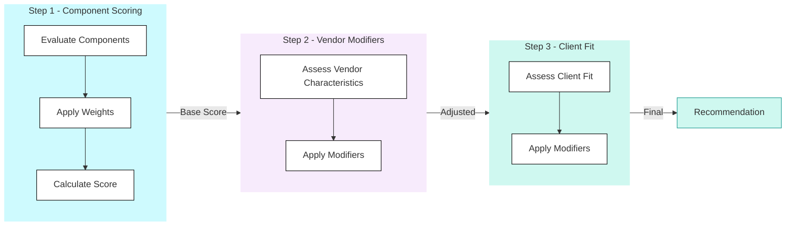

## Platform Selection

<Callout type="info">
  **From Preference to Process** - Platform selection should never be "I prefer X" or "we've always used Y." This section provides the methodology and tools to produce defensible, quantified recommendations.
</Callout>

### Overview

The JMAN Platform Selection Framework transforms subjective platform preference into structured assessment. The result is a recommendation that can be explained, challenged, and defended-to clients, to architects, and to ourselves.

#### The Problem We're Solving

| Without Framework | With Framework |
|-------------------|----------------|
| "I think we should use Fabric" | "Fabric scores 4.71 based on client fit and component needs" |
| "Databricks is better for this" | "Databricks leads on AI/ML but client team lacks Spark skills" |
| "Let's go with what we know" | "Here's the quantified comparison across all dimensions" |

#### Three-Step Methodology

| Step | Question | Output |
|------|----------|--------|
| **1. Component Scoring** | Can the platform technically do the job? | Weighted technical score |
| **2. Vendor Modifiers** | What is this platform inherently like to run? | Adjusted score (±0.4 max) |
| **3. Client Fit** | Will this platform succeed in this client? | Final score (±0.5 max) |

### When to Use This Framework

#### Full Framework (Pre-Sales / Major Decisions)

Use the complete methodology when:
- New client engagement with platform decision pending, particularly in Data & AI Strategy phase
- Client considering platform migration
- RFP response requiring platform recommendation
- Architecture review with platform in scope

#### Quick Assessment (Validation / Sanity Check)

Use the quick decision tree when:
- Validating an assumed platform choice
- Initial scoping conversation
- Checking if alternative platforms warrant investigation

#### Calculator Only (Documentation)

Use the calculator when:
- Documenting a decision already made
- Generating quantified justification
- Comparing scenarios with different weightings

### Framework Components

#### Evaluation Dimensions

The criteria used to assess platforms across components, vendor characteristics, and client fit.

| Dimension Type | Count | Purpose |
|----------------|-------|---------|
| Component Capabilities | 9 components, ~6 sub-capabilities each | Technical assessment |
| Vendor Characteristics | 5 dimensions | Platform-intrinsic factors |
| Client Fit | 7 dimensions | Client-specific context |

#### Scoring Methodology

The complete methodology including:
- Scoring scales and definitions
- Weighting guidance
- Modifier calculations
- Worked examples

#### Interactive Calculator

The tool that brings it together:
- Input component weights
- Assess client fit
- Calculate final scores
- Generate recommendation

### Quick Reference

#### Scoring Scale

| Score | Label | Meaning |
|-------|-------|---------|
| **5** | Best-in-class | Industry-leading, competitive advantage |
| **4** | Strong | Production-ready, meets enterprise needs |
| **3** | Adequate | Functional with trade-offs |
| **2** | Limited | Possible but significant limitations |
| **1** | Weak | Unsuitable without heavy augmentation |

#### Modifier Caps

| Modifier Type | Per Item | Total Cap |
|---------------|----------|-----------|
| Vendor Characteristics | ±0.1 to ±0.2 | **±0.4** |
| Client Fit | ±0.1 to ±0.2 | **±0.5** |

#### Interpretation

| Final Score | Interpretation |
|-------------|----------------|
| **4.5+** | Strong recommendation |
| **4.0-4.5** | Good fit, viable |
| **3.5-4.0** | Adequate with trade-offs |
| **Below 3.5** | Significant concerns |

| Score Difference | Confidence |
|------------------|------------|
| **>0.5** | High confidence in winner |
| **0.2-0.5** | Moderate confidence |
| **&lt;0.2** | Close call, consider other factors |

### Common Scenarios

#### Scenario A: "Client wants Fabric"

1. Run calculator with client-appropriate weights
2. If Fabric scores highest → Validate and document
3. If Fabric doesn't score highest → Discuss trade-offs with client
4. Document rationale either way

#### Scenario B: "We've always used Snowflake"

1. Assess client fit dimensions objectively
2. Run full comparison
3. If Snowflake wins → Great, proceed with confidence
4. If another platform wins → Present findings, discuss

#### Scenario C: "Client has no preference"

1. Assess client fit thoroughly
2. Weight components based on workload priorities
3. Run calculator
4. Present top 2 options with trade-offs

#### Scenario D: "Close scores between platforms"

1. Review client fit dimensions-any strong signals?
2. Consider secondary factors (existing skills, contracts, relationships)
3. Present both as viable with clear trade-offs
4. Let client context be the tiebreaker

### Outputs and Deliverables

#### Internal Use

| Output | Purpose | When |
|--------|---------|------|
| Calculator screenshot | Quick documentation | Always |
| Score breakdown | Architecture review | Major decisions |
| Full assessment | Knowledge capture | New platform evaluations |

#### Client-Facing

| Output | Purpose | When |
|--------|---------|------|
| Recommendation summary | Executive communication | Data & AI Strategy phase |
| Comparison table | Technical discussion | Architecture workshops |
| Trade-off analysis | Decision support | Platform selection meetings |