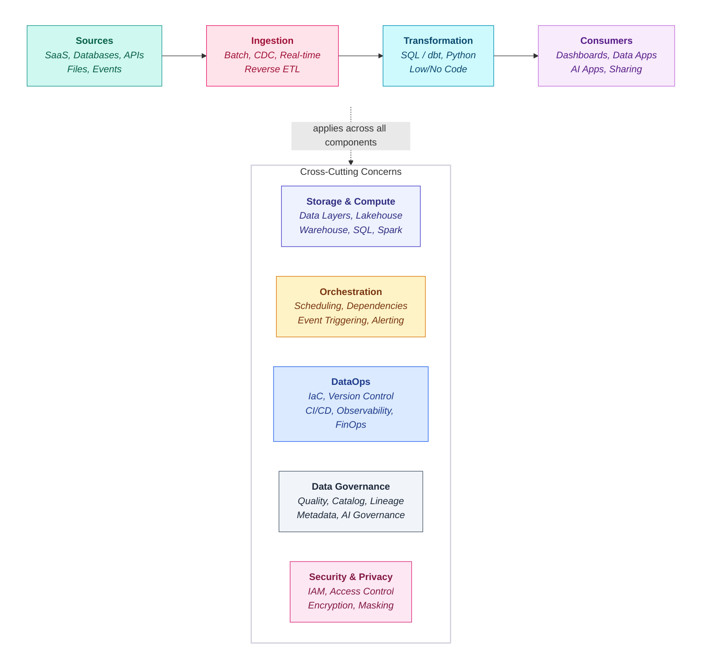

## Platform

### What is a Data Platform?

A **data platform** is not a single tool - it is a collection of interconnected components that together enable an organisation to ingest, store, transform, serve, and govern data. When we say "platform selection," we are evaluating how well each option (Fabric, Databricks, Snowflake) covers all of these components.

Each chapter in this playbook covers one of these components in depth. Platform selection evaluates how well a given platform addresses **all** of them - not just one capability in isolation.

| Component | What It Covers | Key Question |
|-----------|---------------|--------------|
| **Ingestion** | Getting data from source systems into the platform | How do we connect to 50+ SaaS tools, databases, and APIs? |
| **Storage** | Where and how data is physically stored | Lakehouse vs warehouse? Open formats vs proprietary? |
| **Compute** | Processing power for queries, transformations, and ML | How does compute scale? What does it cost at peak? |
| **Transformation** | Converting raw data into business-ready datasets | SQL-first or Python-first? dbt support? |
| **Orchestration** | Scheduling, dependencies, and failure handling | Native scheduling or external tools? Event-driven support? |
| **DataOps** | CI/CD, version control, environments, observability | How do we deploy changes safely? How do we monitor health? |
| **Data Governance** | Quality, catalog, lineage, metadata | Where do we define data quality rules? How is lineage tracked? |
| **Security & Privacy** | IAM, encryption, access control, masking | How granular is access control? Is data encrypted at rest? |

### What is Platform Selection?

**Platform Selection** is the process of choosing the right data platform - the foundational technology stack - for a given client or project. It's about evaluating options like Microsoft Fabric, Databricks, and Snowflake against the client's specific needs: their existing tools, team skills, budget, data volumes, and long-term goals. A good platform choice sets a project up for success; a poor one creates years of friction.

In simple terms: **platform selection answers the question, "Which data platform is the best fit for this client's needs?"**

### The Problem (The "Pain")
> What is the specific pain point or inefficiency we face today?
> (e.g., "Currently, every team builds this from scratch...")

As JMAN continues to scale, data platform selection for clients is increasingly inconsistent and often driven by **individual preference, prior experience, or short-term delivery convenience** rather than a **structured, outcome-led assessment.**

This has resulted in:
* Inconsistent platform recommendations across clusters and solutions.
* Longer decision cycles with clients due to unclear or subjective guidance.
* Suboptimal platform choices that do not fully align with client skillsets, budgets, or existing technology ecosystems.
* Increased delivery risk where platforms are selected without sufficient consideration of long-term scalability, cost, governance, or AI readiness.

Without a clear, repeatable approach, platform selection becomes a point of friction rather than a value-added advisory capability.

### The Opportunity

Platform selection is a critical moment where JMAN can differentiate as a trusted partner rather than a delivery vendor. By productising our approach, we can provide clients with clear, defensible recommendations that balance technology capability, commercial reality, and organisational readiness.

JLabs will create a consistent framework to evaluate and recommend Microsoft **Fabric, Databricks, and Snowflake** (with the modern data stack)tailored to each client’s context.

### The Solution (The Purpose)
> What are we building, and what does "good" look like?

This initiative will establish the **JMAN Way for Data Platform Selection**

JLabs will design a structured, repeatable platform selection framework that:
* Enables consistent, high-quality recommendations across the business.
* Balances technical capability, cost, security, and organisational readiness.
* Accelerates decision-making for both JMAN teams and clients.
* Positions JMAN as platform-agnostic, outcome-focused, and deeply informed.

This is not about narrowing choice, but about removing ambiguity and low-value debate from platform decisions.

#### Platforms in Scope
The framework will support structured comparison and recommendation across:

<PlatformsInScope />

#### Platform Evaluation Dimensions
Each platform will be assessed consistently across the following six areas:

<EvalDimensionGrid />

### Key Outputs
* A standardised platform selection framework usable across all engagements.
* A decision matrix/scoring model to support defensible recommendations.
* Platform comparison artefacts (Fabric vs Databricks vs Snowflake).
* Client-facing materials to support advisory conversations.
* Clear guidance on when each platform is best suited and where trade-offs exist.

### Impact on JMAN Delivery (The Value)
- **Consistency** - One clear, trusted approach across clusters and solutions.
- **Speed** - Faster client decision-making and reduced pre-sales friction.
- **Quality** - Better-aligned platforms leading to more successful deliveries.
- **Credibility** - Stronger positioning as a strategic data & AI advisor.
- **Scalability** - Reduced dependency on individual expertise and preference.

### Why Now? (The Risk)
> What happens if we do nothing or delay this?

JMAN’s growth, combined with increasing client expectations around cost control, AI readiness, and platform longevity, makes informal platform selection unsustainable.

Codifying this knowledge through JLabs ensures we:
* Protect delivery quality as we scale.
* Capture and share expertise that currently lives in individuals’ heads.
* Create space for innovation by removing repeated, low-value decisions.
