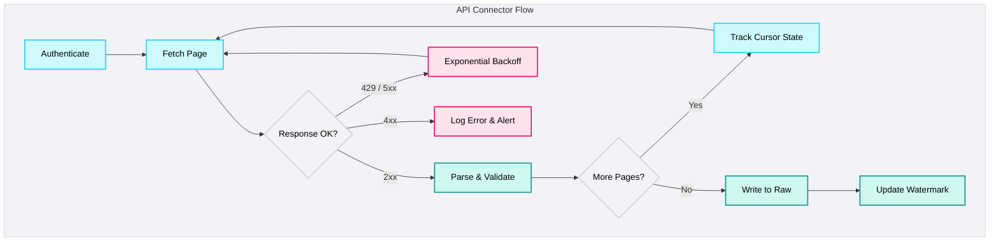

## APIs

<Callout type="info">
  **Build with Resilience** - APIs are the primary domain for custom-built connectors. Every custom connector must implement exponential backoff, pagination state tracking, and response validation. No exceptions.
</Callout>

### What this covers

Custom REST APIs, GraphQL endpoints, webhooks, partner APIs, and any HTTP-based data source where no managed connector exists. This is distinct from SaaS APIs (Salesforce, NetSuite) which have purpose-built connectors - this page covers the APIs you build connectors for yourself.

### Characteristics

| Characteristic | Detail |
|----------------|--------|
| **Access method** | REST (most common), GraphQL, SOAP (legacy), webhooks (push-based) |
| **Schema control** | Varies - documented APIs have contracts, internal APIs change without notice |
| **Rate limiting** | Custom per provider - may be per-second, per-minute, or daily |
| **Pagination** | No standard - cursor, offset, page-token, link-header, or none at all |
| **Error handling** | Inconsistent - some return 200 with error in body instead of proper HTTP status codes |
| **Authentication** | API keys, OAuth 2.0, HMAC signatures, client certificates, custom headers |

### Common Pain Points

| Pain Point | Description | Example |
|---|---|---|
| **No incremental support** | API has no `modified_since` filter. Forced full load every run. | Logistics API returns all 500K shipments with no date filter. Only 200 are new daily. |
| **Nested JSON** | Deeply nested responses don't map to tabular rows without flattening logic. | Payment gateway: transactions with nested `line_items[]`, `refunds[]`, `metadata{}`. |
| **Inconsistent errors** | Some APIs return HTTP 200 with error in the body instead of proper status codes. | Partner API returns HTTP 200 with `{"status": "error"}` instead of HTTP 429. Retry logic never triggers. |
| **Webhook reliability** | Receiver downtime means lost events. At-least-once delivery means duplicates. | Webhook receiver down 20 minutes during deployment. 150 events lost. No replay mechanism. |
| **Undocumented behaviour** | API documentation is incomplete, outdated, or contradicts actual behaviour. | Documentation says date filter accepts ISO 8601. Actual API only accepts Unix timestamps. Discovered after 3 days of debugging. |
| **Breaking changes** | API provider changes response structure without version bump. | Partner removed a nested field from their v2 API response. No deprecation notice. Pipeline failed silently - null values propagated to reports. |

### Building a Resilient API Connector

Every custom connector must implement these patterns:

#### Essential Components

| Component | Purpose | Implementation |
|-----------|---------|---------------|
| **Exponential backoff** | Handle rate limits and transient failures | Start at 1s, double each retry, max 5 retries, add jitter |
| **Pagination tracking** | Resume from last position on failure | Persist cursor/offset to checkpoint table after each page |
| **Response validation** | Detect silent failures (200 with error body) | Validate response schema, check for error fields, verify record count |
| **Idempotent writes** | Safe to re-run without duplicates | Use `merge` or `insert ... on conflict` with deduplication key |
| **Watermark management** | Track extraction progress | Store last successful timestamp/ID in a control table |

### Platform-Specific Guidance

<PlatformTabs>

<PlatformTabsFabric>

**Tools:** ADF Web Activity + Copy Activity, Custom Azure Functions, Logic Apps

**Key considerations:**
- Web Activity handles simple single-page API calls well
- For paginated APIs, use Until loops with cursor tracking
- Complex JSON flattening is easier in Dataflows Gen2 or Azure Functions
- Webhook ingestion: use Event Grid or Logic Apps to receive and queue events

</PlatformTabsFabric>

<PlatformTabsDatabricks>

**Tools:** Python notebooks, Databricks Workflows, requests/httpx libraries

<Callout type="warning">
  **Lakeflow Connect is a New Product** - REST API connector coverage in Lakeflow Connect is limited and growing. For most custom REST APIs, use Python notebooks with the pattern below. Only use Lakeflow Connect if your specific API is in the supported connector list.
</Callout>

**Key considerations:**
- Use `requests` with explicit timeouts - never use default (infinite) timeout
- Persist pagination state to Delta table - if the notebook fails mid-extraction, it can resume
- For nested JSON, use `spark.read.json()` with explicit schema to avoid type inference issues
- Run API connectors as Databricks Workflows with retry policies

</PlatformTabsDatabricks>

<PlatformTabsSnowflake>

**Tools:** External functions, Snowpark (Python), External stages + Snowpipe

<Callout type="warning">
  **Snowflake OpenFlow Requires BYOC** - Snowflake has no native REST API connectors. OpenFlow is early stage and requires Bring Your Own Connector (BYOC). For REST API ingestion, use Snowpark stored procedures, external functions, or partner tools.
</Callout>

**Key considerations:**
- Snowpark Python UDFs and stored procedures can call external APIs
- For complex connectors, prefer external orchestration (Airflow, ADF) that writes to cloud storage, then ingest via Snowpipe
- External functions via API Gateway add latency - not suitable for high-volume pagination
- Webhook events: receive via cloud function → write to S3/GCS → Snowpipe auto-ingest

</PlatformTabsSnowflake>

</PlatformTabs>

### Webhook vs Polling Decision

| Factor | Polling (Pull) | Webhooks (Push) |
|--------|---------------|-----------------|
| **Latency** | Minutes to hours (depends on schedule) | Near real-time (seconds) |
| **Reliability** | You control the schedule - missed events can be retried | Receiver downtime = lost events unless replay exists |
| **Complexity** | Simpler - standard request/response | More complex - need receiver, queue, deduplication |
| **Backfill** | Easy - just change the date range | Difficult - usually no historical replay |
| **When to use** | Default choice for batch ingestion | Only when sub-minute latency is required AND source supports reliable delivery |

<Callout type="warning">
  **Webhooks are Not a Silver Bullet** - If the webhook provider doesn't guarantee delivery or offer replay, you will lose data during receiver downtime. Always pair webhooks with a periodic polling reconciliation to catch missed events.
</Callout>

<DosAndDonts
  dos={[
    { text: "Implement exponential backoff with jitter for every API connector - no exceptions" },
    { text: "Persist pagination state (cursor/offset) after every page - enables resume on failure" },
    { text: "Validate response schema, not just HTTP status code - detect silent 200-with-error responses" },
    { text: "Set explicit timeouts on all HTTP requests (30s is a good default)" },
    { text: "Flatten nested JSON at ingestion time - store both raw JSON and flattened columns in Raw" },
    { text: "Log every API call with request URL, status code, record count, and duration" },
    { text: "Pair webhooks with periodic polling reconciliation to catch missed events" }
  ]}
  donts={[
    { text: "Use default (infinite) HTTP timeouts - a hung connection will block the entire pipeline" },
    { text: "Assume pagination works the same across endpoints - test each one with concurrent writes" },
    { text: "Build a custom connector before checking JMAN Marketplace and partner tools" },
    { text: "Retry on 4xx errors (except 429) - client errors won't resolve with retries" },
    { text: "Store raw API responses only as strings - parse and validate at ingestion time" },
    { text: "Trust API documentation blindly - test actual behaviour with real data before building" }
  ]}
/>

<AntiPatterns patterns={[
  {
    title: "Untested Pagination",
    problem: "Connector assumes offset-based pagination. The API actually uses cursor-based. During concurrent writes, offset-based pagination returns duplicates or skips records because the result set shifts between pages.",
    example: "A connector used `?offset=0&limit=100`, then `?offset=100&limit=100`. During extraction, 50 new records were inserted. Pages shifted - 50 records appeared twice, 50 were skipped. Final count: 11,400 rows instead of 10,000. Duplicates inflated revenue metrics by 14%.",
    prevention: "Always test pagination with concurrent writes. Verify extracted count matches source count. Use cursor-based pagination when available - it's immune to concurrent inserts. For offset-based APIs, extract in a single consistent window if possible."
  },
  {
    title: "The Silent 200 Error",
    problem: "API returns HTTP 200 with an error message in the response body. Standard retry logic only checks HTTP status codes, so the error is never detected. Pipeline succeeds with zero or partial data.",
    example: "A partner API returned `{\"status\": \"error\", \"message\": \"rate limit exceeded\"}` with HTTP 200. The connector treated it as success. An entire day of data was missing. The dashboard showed $0 revenue for Tuesday. Finance escalated to the CEO.",
    prevention: "Never validate API responses by HTTP status code alone. Parse the response body and check for error indicators (`status`, `error`, `message` fields). Validate that the response contains the expected data structure and record count."
  },
  {
    title: "The No-Timeout Connector",
    problem: "HTTP requests use the default timeout (infinite in most libraries). When the API server hangs, the connector waits indefinitely, blocking the entire pipeline schedule. No alert fires because the job is technically still 'running'.",
    example: "A logistics API experienced a server issue. The connector's GET request hung for 14 hours without timing out. The daily pipeline never completed. Downstream dashboards showed stale data for an entire day. The issue was only discovered when a user complained.",
    prevention: "Set explicit timeouts on every HTTP request - 30 seconds for connection, 60 seconds for read. Use circuit breaker patterns for APIs with known reliability issues. Alert if any API connector exceeds its expected duration by 2x."
  },
  {
    title: "The Lost Webhook Events",
    problem: "Team implements webhook-only ingestion without polling backup. When the receiver goes down for deployment or maintenance, events are lost permanently because the provider doesn't offer replay.",
    example: "A payment gateway webhook receiver was down for 20 minutes during a Kubernetes deployment. 150 payment events were lost. The provider's webhook had no retry or replay mechanism. The finance team discovered $45,000 in unrecorded transactions during month-end reconciliation.",
    prevention: "Never rely on webhooks as the sole data source unless the provider guarantees delivery with retry. Always implement a periodic polling reconciliation job that catches any events missed by the webhook. Use a message queue (Event Hub, SQS) between webhook receiver and processing to decouple availability."
  }
]} />