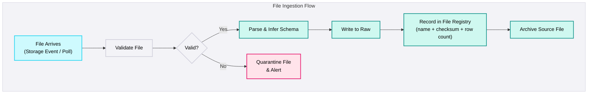

## Files & Object Storage

<Callout type="warning">
  **Never Trust a File** - Files have no schema enforcement, no delivery guarantee, and no consistency contract. Every file ingestion pipeline must validate before loading. No exceptions.
</Callout>

### What this covers

CSV, Excel, Parquet, JSON files delivered via SFTP, Azure Blob Storage, AWS S3, GCS, SharePoint.

### Characteristics

| Characteristic | Detail |
|----------------|--------|
| **Access method** | Cloud storage events (recommended), SFTP polling, email attachment parsing |
| **Schema control** | None - CSV files have no schema. Headers can change between deliveries. |
| **Delivery** | Push-based (provider drops file) or pull-based (scheduled download) |
| **Format consistency** | Varies - delimiter, encoding, date formats can change without notice |
| **Volume** | Ranges from 50-row reference files to multi-GB transaction exports |
| **Change detection** | File arrival = new data. No incremental within a file - it's always a full snapshot of that delivery. |

### Common Pain Points

| Pain Point | Description | Example |
|---|---|---|
| **Inconsistent formats** | Delimiters, headers, encoding vary between deliveries from the same provider. | Pipe delimiter one month, tab the next. `Customer Name` becomes `customer_name`. UTF-8 one week, Windows-1252 the next. |
| **Empty or corrupt files** | 0-byte files, broken Excel formulas, truncated rows, extra header rows mid-file. | SFTP drops 0-byte file at 6am. Pipeline processes as "no new data." Dashboard shows stale data for 2 days before anyone notices. |
| **Late arrivals** | Files expected at a specific time arrive late, arrive multiple times, or don't arrive at all. | Invoice file expected 6am arrives 11am. Pipeline already ran. Data missing from morning reports. |
| **No schema enforcement** | CSV has no embedded schema. Date formats, number formats, and column order vary within the same file. | Mixed `2026-01-15` and `01/15/2026` in the same column. 2,000 of 50,000 rows fail date casting. |
| **Duplicate deliveries** | Provider re-sends the same file (same name or different name, same content). Pipeline loads it twice. | Vendor sends `orders_20260301.csv` and `orders_20260301_v2.csv`. Both are loaded. Revenue doubled for one day. |
| **Large files** | Multi-GB CSV files that can't be processed in memory. Need chunked or distributed processing. | 8GB CSV with 50M rows. Pandas-based connector runs out of memory. Pipeline crashes. |

### File Processing Flow

### File Validation Checklist

Every file must pass these checks before loading:

| Check | Rule | Action on Failure |
|-------|------|-------------------|
| **File size** | Size > 0 bytes | Quarantine + alert |
| **Row count** | Within expected range (±20% of typical) | Alert + load with flag |
| **Expected columns** | All required columns present | Quarantine + alert |
| **Column count** | Matches expected count | Quarantine + alert |
| **Duplicate check** | File checksum not seen before | Skip + log |
| **Encoding** | Valid UTF-8 (or expected encoding) | Attempt conversion, quarantine if fails |
| **Date formats** | Consistent within column | Parse with fallback patterns, flag exceptions |

### Platform-Specific Guidance

<PlatformTabs>

<PlatformTabsFabric>

**Tools:** Data Factory Copy Activity, Dataflows Gen2, Event Grid triggers

**Key considerations:**
- Use Event Grid triggers for event-driven file processing - don't poll storage accounts
- ADF handles CSV, Parquet, Excel, JSON, and Avro natively
- For validation, add a preceding Lookup Activity to check file size and row count
- Use `modifiedDatetimeStart` to avoid reprocessing old files

</PlatformTabsFabric>

<PlatformTabsDatabricks>

**Tools:** Auto Loader (recommended), Spark read with schema enforcement, Databricks Workflows

**Key considerations:**
- Auto Loader is the preferred method - handles schema evolution, checkpointing, and exactly-once semantics
- For CSV files with inconsistent schemas, define explicit schema with `StructType` instead of inference
- `input_file_name()` captures the source file path - essential for debugging and lineage
- Use `trigger(availableNow=True)` for batch-style processing of streaming sources

</PlatformTabsDatabricks>

<PlatformTabsSnowflake>

**Tools:** Snowpipe (auto-ingest), COPY INTO, External stages

**Key considerations:**
- Snowpipe auto-ingest is excellent for continuous file processing from S3/GCS/Azure
- Use `ON_ERROR = 'SKIP_FILE'` to prevent one bad file from blocking the entire pipe
- `MATCH_BY_COLUMN_NAME` handles column ordering differences between file deliveries
- Monitor `COPY_HISTORY` for failed files - they need manual investigation

</PlatformTabsSnowflake>

</PlatformTabs>

### File Registry Pattern

Track every file processed to prevent duplicates and enable auditing:

| Column | Purpose | Example |
|--------|---------|---------|
| `file_name` | Original file name | `orders_20260301.csv` |
| `file_path` | Full source path | `/landing/invoices/orders_20260301.csv` |
| `file_checksum` | SHA-256 hash of file content | `a3f2b8c...` |
| `file_size_bytes` | File size for anomaly detection | `2,450,312` |
| `row_count` | Rows loaded (excluding header) | `48,721` |
| `loaded_at` | When the file was processed | `2026-03-01T06:15:00Z` |
| `status` | Processing result | `loaded` / `quarantined` / `skipped_duplicate` |

<DosAndDonts
  dos={[
    { text: "Use cloud storage as landing zone, not SFTP directly - storage events enable reliable triggering" },
    { text: "Validate every file before loading: size > 0, row count in range, expected columns present" },
    { text: "Track processed files by name + checksum - prevents duplicate loads" },
    { text: "Use Auto Loader (Databricks) or Snowpipe (Snowflake) for event-driven processing" },
    { text: "Define explicit schemas for CSV files - never rely on type inference for production pipelines" },
    { text: "Archive source files after processing - enables replay without re-requesting from provider" },
    { text: "Quarantine invalid files with alerts - never silently skip bad data" }
  ]}
  donts={[
    { text: "Trust file contents without validation - a 3-row file instead of 50,000 rows will corrupt dashboards" },
    { text: "Process files directly from SFTP - copy to cloud storage first, then process" },
    { text: "Use file name alone for deduplication - providers re-send files with the same name but different content" },
    { text: "Infer date formats from CSV data - mixed formats in the same column cause silent data loss" },
    { text: "Process multi-GB CSV files with pandas - use Spark or chunked processing" },
    { text: "Delete source files before confirming successful load - you may need to replay" }
  ]}
/>

<AntiPatterns patterns={[
  {
    title: "Trust the File",
    problem: "Pipeline loads CSV without any validation. A corrupt or truncated file has 3 rows instead of 50,000. The pipeline succeeds, the dashboard updates, and stakeholders make decisions based on drastically wrong data.",
    example: "A vendor's SFTP delivery failed mid-transfer. The pipeline received a 3-row file (header + 2 records) instead of the usual 50,000. Dashboard showed $450 instead of $4.5M daily revenue. The error wasn't detected for 3 days because no validation existed.",
    prevention: "Validate every file: size > 0, row count within expected range (±20%), required columns present. Quarantine files that fail validation. Alert the team. Never load unvalidated files into Raw."
  },
  {
    title: "The Duplicate File Load",
    problem: "Provider re-sends a file (intentionally or accidentally). The pipeline loads it again, doubling the data. No deduplication mechanism exists because the pipeline treats every file as new.",
    example: "A vendor re-sent `invoices_202603.csv` due to an internal error. The pipeline loaded both copies. Revenue for March was doubled in all reports. Finance discovered the issue during monthly close - 3 weeks after the duplicate load.",
    prevention: "Maintain a file registry with checksums. Before loading, check if the file's SHA-256 hash has been seen before. If yes, skip and log. If the file name matches but content differs, load as new version and flag for review."
  },
  {
    title: "The SFTP Direct Read",
    problem: "Pipeline reads files directly from the vendor's SFTP server. Network latency, SFTP session limits, and provider maintenance windows cause intermittent failures. Failed reads are retried against the SFTP, adding load to the provider's server.",
    example: "Pipeline read from vendor SFTP at 6am daily. One morning, the SFTP was under maintenance (no SLA). Pipeline failed. Retry at 6:30 failed. Manual intervention at 9am, data available at 10am. Repeated monthly during vendor maintenance windows.",
    prevention: "Copy files from SFTP to cloud storage (Blob, S3) as a separate step. Process files from cloud storage, not SFTP. This decouples ingestion from vendor availability and enables event-driven processing."
  },
  {
    title: "The Schema Drift Surprise",
    problem: "CSV file schema changes between deliveries - column added, removed, renamed, or reordered. Pipeline fails or silently loads wrong data into wrong columns because it relies on positional matching.",
    example: "A vendor added a `discount_pct` column between `quantity` and `total`. The pipeline used positional CSV parsing. `total` values were loaded into the `discount_pct` column. All order totals appeared as percentages. Downstream calculations produced negative margins.",
    prevention: "Always parse CSV by column name, not position. Use `MATCH_BY_COLUMN_NAME` (Snowflake) or header-based parsing with explicit schema mapping. Detect new/missing columns and alert before loading."
  }
]} />