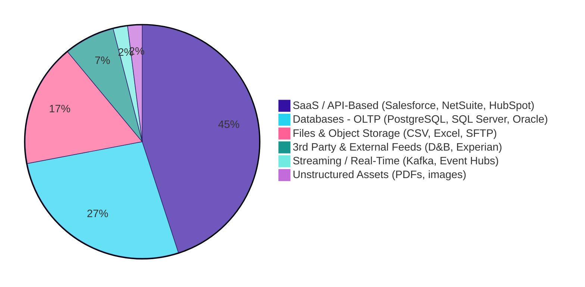

## Sources

<Callout type="info">
  **Classify Before You Code** - The source type determines access method, loading strategy, tooling choice, and the pain points you'll encounter. Getting this right upfront saves weeks of rework.
</Callout>

Before building any ingestion pipeline, classify the source. Each source type has distinct characteristics that dictate how you extract data, what can go wrong, and which tools are appropriate.

**Source distribution across JMAN projects (indicative):**

<Callout type="note">
  **Where to focus:** API-based sources and databases account for ~70-80% of all ingestion work. These are the pages you should know deeply. File ingestion is common but technically simpler. Streaming is rare (~2%) - covered briefly in Frequency & Scheduling but not the priority for this chapter.
</Callout>

### Source Assessment Checklist

Every source should be assessed during discovery, before any pipeline code is written.

| Assessment Item | Why It Matters |
|-----------------|---------------|
| Source type classified | Determines access method and tooling |
| Authentication method confirmed | Avoids week-3 blockers (OAuth, service accounts, VPN) |
| Source constraints documented (rate limits, sessions, maintenance windows) | Prevents production surprises |
| Deletion behaviour documented per table | Determines if you need CDC or soft-delete tracking |
| Initial load volume estimated | Determines chunking and checkpointing needs |
| Schema change frequency assessed | Drives schema evolution strategy |
| Data owner and escalation path identified | Ensures you can resolve source-side issues quickly |

<Callout type="warning">
  **Day-1 Discovery Questions** - "Can we enable CDC?", "What are the API rate limits?", "Who owns this source system?" - these must be answered during discovery, not during development. Every unanswered question becomes a production incident waiting to happen.
</Callout>
