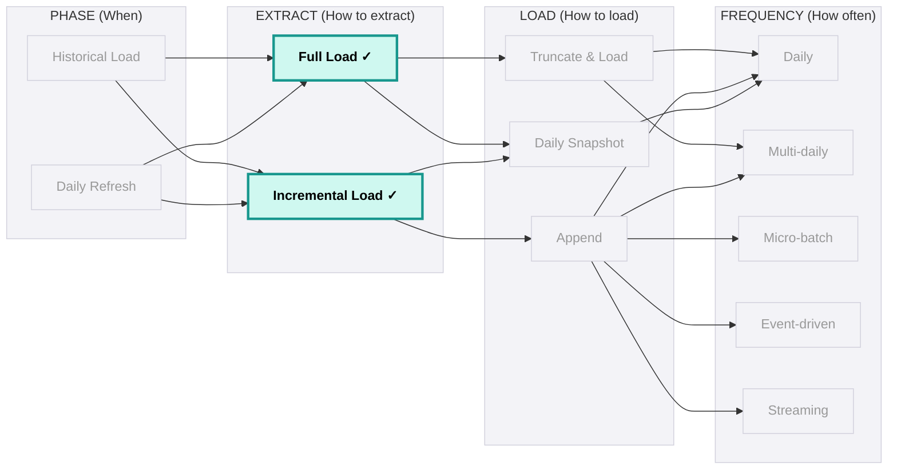
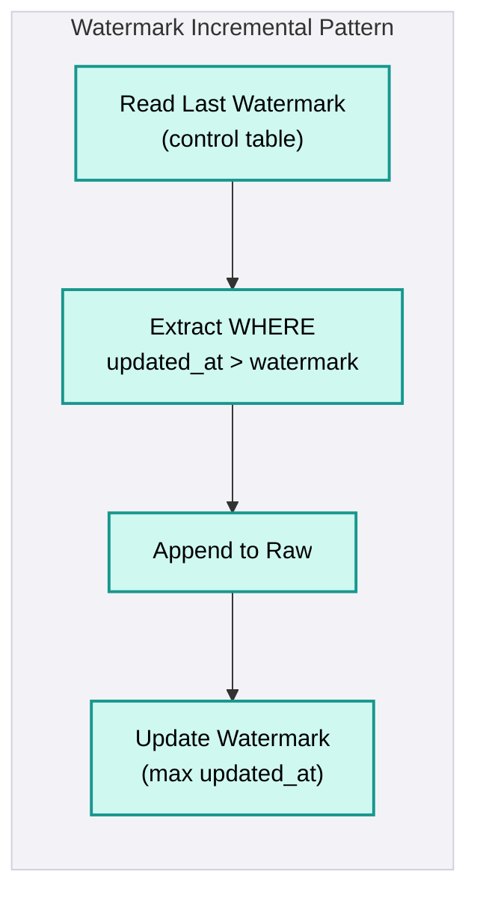
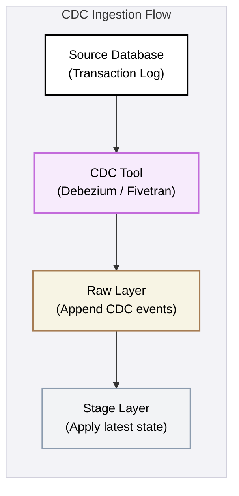
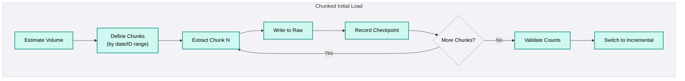
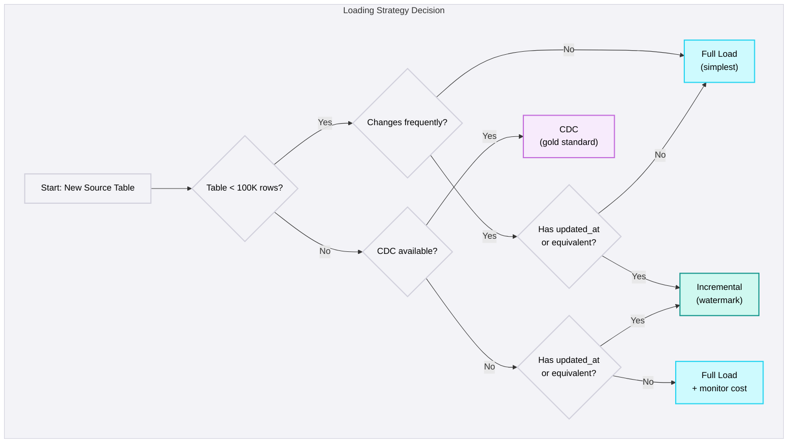

## How to extract

<Callout type="info">
  **Per-Table Decision, Not Per-Source** - The loading strategy is chosen per source table, not per source system. The same Salesforce org might use full load for `ref_country_codes` (500 rows) and incremental for `opportunity` (2M rows).
</Callout>

### Overview

Every ingestion pipeline must answer one question: **how much data do we extract on each run?** The answer determines cost, speed, source impact, and reliability. There are three strategies, each with clear use cases.

### Strategy Comparison

| Strategy | What It Extracts | Captures Deletes? | Source Impact | Complexity | Best For |
|----------|-----------------|-------------------|---------------|------------|----------|
| **Full Load** | Entire table/dataset | Yes (by comparison) | High | Low | Small tables, reference data, no change indicators |
| **Incremental (Watermark)** | Changed records since last run | No | Low | Medium | Tables with `updated_at`, API sources |
| **CDC (Log-based)** | Inserts + Updates + Deletes from transaction log | Yes | Minimal | High (setup) | Production databases, large transactional tables |

### Full Load

Every run extracts the entire dataset. Simple, reliable, guarantees consistency.

**When to use:**
- Source table has fewer than 100K rows
- No reliable change indicators (`updated_at`, `modified_date`)
- Reference data or lookup tables (countries, currencies, product categories)
- Source has hard deletes and no CDC - full load is the only way to detect removed records

**How it works:**
1. Extract all rows from source
2. Append entire snapshot to Raw (with `__loaded_at` metadata)
3. Stage layer deduplicates to get current state

**Cost formula:** `cost = rows × extract_time × frequency`

<Callout type="warning">
  **Full Load Scales Linearly** - A full load that takes 5 minutes with 100K rows will take 50 minutes with 1M rows and 8+ hours with 10M rows. If your full extract exceeds 30 minutes, it's time to switch to incremental.
</Callout>

### Incremental Load (Delta / Watermark)

Each run extracts only records changed since the last successful run.

**Change detection methods (ranked by reliability):**

| Method | Captures Inserts | Captures Updates | Captures Deletes | Reliability |
|--------|-----------------|-----------------|-----------------|-------------|
| **CDC / Log-based** | Yes | Yes | Yes | Highest |
| **`updated_at` watermark** | Yes | Yes | No | High |
| **Increasing ID** | Yes | No | No | Medium |
| **Full extract + hash diff** | Yes | Yes | Yes | High (but expensive) |

#### Watermark Pattern

The most common incremental approach for SaaS and API sources:

<Callout type="warning">
  **Watermark Misses Deletes** - If a record is deleted in the source, there's no `updated_at` change to trigger extraction. The record remains in your warehouse as a ghost record. For sources with hard deletes, pair watermark incremental with periodic full-load reconciliation.
</Callout>

### Platform-Specific Implementation

<PlatformTabs>

<PlatformTabsFabric>

**Key considerations:**
- ADF has built-in watermark support via Lookup + Copy + Stored Procedure pattern
- Use Tumbling Window triggers for time-based incremental runs
- For CDC, use SQL Server Change Tracking or Change Data Capture with ADF

</PlatformTabsFabric>

<PlatformTabsDatabricks>

**Key considerations:**
- Always update watermark AFTER successful write - never before
- For CDC, use Lakeflow Connect or Debezium + Auto Loader
- Delta table `MERGE` is ideal for applying CDC changes (insert/update/delete in one statement)

</PlatformTabsDatabricks>

<PlatformTabsSnowflake>

**Key considerations:**
- Snowflake Streams provide native change tracking on Snowflake tables (not source databases)
- For source database CDC, use partner tools (Fivetran, HVR) that land data in Raw
- Streams + Tasks automate incremental processing within Snowflake

</PlatformTabsSnowflake>

</PlatformTabs>

### CDC as a Loading Strategy

<Callout type="info">
  **CDC is Batch-Adjacent, Not Streaming** - In the context of ingestion, CDC captures changes from the database transaction log and applies them in micro-batches or scheduled batches. It's the most reliable way to capture inserts, updates, AND deletes with minimal source impact.
</Callout>

CDC captures inserts, updates, AND deletes from the database transaction log. It provides the most complete picture of source data changes.

#### CDC Modes

| Mode | Source Impact | Captures Deletes | Tools | When to Use |
|------|-------------|-----------------|-------|-------------|
| **Log-based (Recommended)** | Minimal - reads transaction log, not tables | Yes | Debezium, Fivetran, Lakeflow Connect, ADF CDC | Always, when DBA enables it |
| **Query-based (Fallback)** | Moderate - runs watermark queries | No | Any tool with SQL access | When log-based CDC is not available |

#### CDC Data Flow

### Initial Load & Backfill

<Callout type="warning">
  **Initial Load is Not Just "Run the Pipeline Once"** - First-time historical sync is fundamentally different from ongoing delta. It involves orders of magnitude more data, risks overwhelming the source, and can take days. Treat it as a separate engineering problem.
</Callout>

#### Pattern: Chunked Initial Load with Checkpointing

1. **Estimate volume** - Query source metadata (row counts, table sizes)
2. **Chunk by range** - Date range, ID range, or natural partitions
3. **Extract per chunk** - Extract → write to Raw → record checkpoint
4. **On failure** - Resume from last successful checkpoint (not from scratch)
5. **Validate** - Compare source vs target row counts after all chunks complete
6. **Switch to incremental** - Set watermark to max timestamp from initial load

#### Volume Estimates

| Source | Typical Size | Load Time | Strategy |
|---|---|---|---|
| Salesforce (mid-market) | 1-5M records | 2-6 hours | Bulk API 2.0, chunked by object |
| PostgreSQL (production) | 10-500GB | 4-24 hours | COPY to cloud storage, parallel by table |
| NetSuite | 500K-5M records | 3-8 hours | SuiteQL, chunked by date range |
| Large ERP (SAP, Oracle) | 50-500GB | 12-72 hours | Parallel export, weekend window |

### Delete Handling

Hard deletes in the source are invisible to watermark-based incremental pipelines. Records simply disappear - no `updated_at` change, no event, no trace.

| Approach | How It Works | When to Use |
|----------|-------------|-------------|
| **CDC tombstone** | Transaction log captures DELETE events | When CDC is available (always preferred) |
| **Soft delete flag** | Source sets `is_deleted = true` instead of deleting | When source supports soft deletes |
| **Periodic reconciliation** | Full extract → compare with warehouse → flag missing records | When neither CDC nor soft deletes exist |
| **Snapshot comparison** | Keep full snapshots, diff consecutive ones | Small tables only (< 100K rows) |

<Callout type="note">
  **Ghost Records Kill Reports** - A record deleted in the source but remaining in the warehouse is a ghost record. It inflates counts, corrupts aggregations, and produces wrong business decisions. Every source must have a delete handling strategy documented during discovery.
</Callout>

### Decision Framework

<DosAndDonts
  dos={[
    { text: "Choose loading strategy per table based on volume, change detection, and delete behaviour" },
    { text: "Default to CDC for production databases - lowest source impact, captures deletes" },
    { text: "Use watermark-based incremental for SaaS/API sources with modified_date fields" },
    { text: "Build initial load separately from ongoing sync - with chunking and checkpointing" },
    { text: "Update watermark only AFTER successful write - never before" },
    { text: "Document delete handling strategy for every source table during discovery" },
    { text: "Validate row counts between source and target after initial load completes" },
    { text: "Pair watermark incremental with periodic full-load reconciliation to catch deletes" }
  ]}
  donts={[
    { text: "Default to full load 'because it's simpler' - it scales linearly and becomes unsustainable" },
    { text: "Use the same pipeline for initial load and ongoing sync - they have fundamentally different requirements" },
    { text: "Ignore hard deletes - ghost records accumulate silently and corrupt downstream reports" },
    { text: "Use increasing ID as change detection - it only captures inserts, not updates" },
    { text: "Start initial load without estimating volume - a 48-hour extract that fails at hour 30 with no checkpointing wastes a week" },
    { text: "Update watermark before the write completes - a failure after watermark update means lost data" }
  ]}
/>

<AntiPatterns patterns={[
  {
    title: "Full Load by Default",
    problem: "Team uses full load for all tables because 'it's simpler'. As data grows, extract times increase linearly. Eventually, the pipeline exceeds its schedule window and either runs into the next cycle or misses the SLA.",
    example: "A NetSuite environment extracted all transactions daily - 12M records covering 18 months. The full extract took 2.5 hours and growing. Actual daily delta: ~5,000 records. When the extract exceeded the 4-hour window, it overlapped with business hours and slowed the NetSuite UI for 200 users.",
    prevention: "Full load is only appropriate for tables under 100K rows or reference data. For anything larger, implement incremental. If a full extract takes more than 30 minutes, it's a signal to switch to incremental or CDC."
  },
  {
    title: "CDC Without DBA Alignment",
    problem: "Team plans CDC for production database. Development proceeds assuming CDC will be available. Discovery in sprint 3-4: the required database setting isn't enabled and requires DBA approval, a maintenance window, and potentially a database restart.",
    example: "Team planned PostgreSQL CDC. Sprint 3: discovered `wal_level = replica`, not `logical`. Change required restart. DBA unavailable 2 weeks. Maintenance window 3 weeks out. Total delay: 5 weeks. Fell back to watermark incremental, missing all hard deletes for the first 3 months.",
    prevention: "'Can we enable CDC?' is a day-1 discovery question. Get DBA confirmation in writing during the first week. Document the fallback strategy (watermark + reconciliation) before development starts."
  },
  {
    title: "No Checkpointing on Initial Load",
    problem: "Initial sync runs as a single monolithic extract. If it fails partway through, it must restart from scratch. For large sources, this means days of wasted work.",
    example: "Fivetran initial sync for a large Salesforce org: estimated 48 hours. Failed at hour 30 due to API rate limit exhaustion. No checkpoint mechanism. Restarted from scratch. Failed again at hour 35. Total time to complete initial sync: 2 weeks instead of 2 days.",
    prevention: "Always build checkpointing into initial loads. Chunk by date range, ID range, or object. Record the last successful chunk in a control table. On failure, resume from the last checkpoint - not from the beginning."
  },
  {
    title: "Ghost Records from Missing Delete Handling",
    problem: "Incremental pipeline captures inserts and updates but not deletes. Over time, deleted records accumulate in the warehouse as ghost records, inflating counts and corrupting reports.",
    example: "A client's sales team merged duplicate Accounts in Salesforce weekly. The watermark pipeline only tracked `SystemModstamp` changes - inserts and updates. After 6 months, the warehouse had 15,000 Account records while Salesforce had 11,000. Revenue reports were overstated by $2.3M due to duplicate ghost records.",
    prevention: "Every source table must have a documented delete handling strategy. Use CDC when available (captures DELETE events). For SaaS, use `IsDeleted` flags or `queryAll`. When neither is available, run periodic full-load reconciliation (weekly or monthly) to identify and flag ghost records."
  }
]} />
