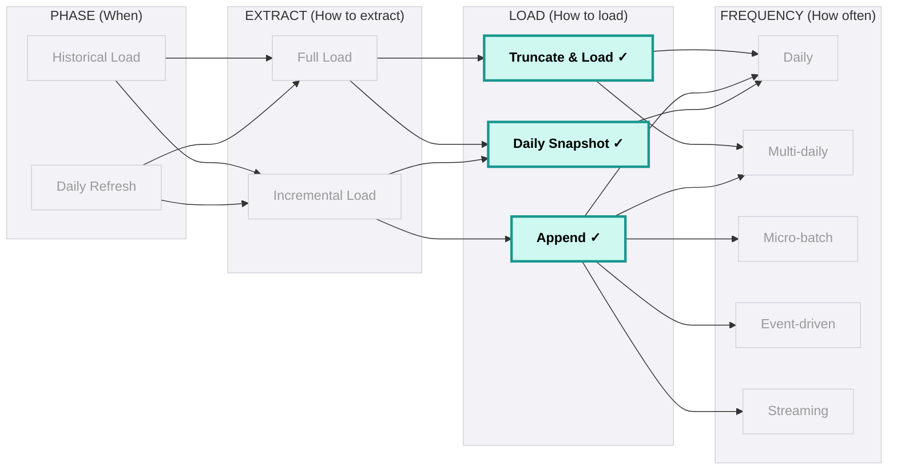
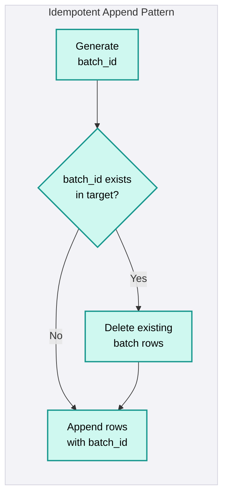
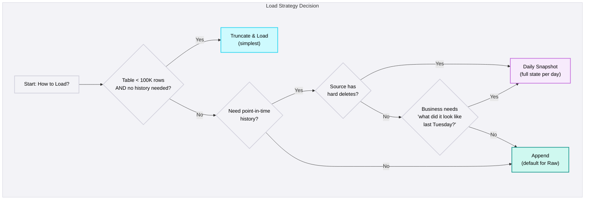

## How to load

<Callout type="info">
  **Per-Table Decision** - The load strategy is chosen per source table, not per source system. A Salesforce org might use Truncate & Load for `ref_currency_codes` and Append for `opportunity`. The decision depends on table size, whether history is needed, and how the Stage layer consumes the data.
</Callout>

### Overview

Once data is extracted from the source, the next decision is: **how do we write it to the target (Raw layer)?** The load strategy determines how data lands, whether history is preserved, and how downstream layers (Stage, Core) consume it.

### Strategy Comparison

| Strategy | What It Does | Preserves History? | Handles Duplicates? | Best For |
|----------|-------------|-------------------|--------------------|---------|
| **Truncate & Load** | Replace target entirely | No | N/A (full replace) | Small reference tables, lookup data |
| **Append** | Add new/changed rows | Yes (all versions) | No (Stage deduplicates) | Large transactional tables, CDC |
| **Daily Snapshot** | Store each day's full state as a partition | Yes (point-in-time) | N/A (full state per day) | Hard deletes, SCD-2 construction |

### Truncate & Load

Delete all rows in the target table, then insert the full extract. The target always matches the source exactly - no ghost records, no duplicates, no history.

**When to use:**
- No business need for historical versions of records
- Source table has fewer than 100K rows
- Reference data or lookup tables (countries, currencies, product categories)
- Source has hard deletes and you don't need to track them

**How it works:**
1. Extract all rows from source (Full Load)
2. Truncate the target table
3. Insert the full extract
4. Target now mirrors source exactly

| Pros | Cons |
|------|------|
| Target always matches source exactly - no ghost records | Zero history - yesterday's data is gone |
| Simple recovery - just re-run the pipeline | Brief window of no data during truncate (downstream queries fail) |
| No deduplication needed | Only works with Full Load extract (not incremental) |
| Good for small reference tables (< 100K rows) | Expensive for large tables - rewrites everything every run |

<Callout type="warning">
  **The Truncate Window** - Between truncate and insert completion, the target table is empty. Any downstream query that runs during this window returns zero rows. For critical tables, use a swap pattern instead: write to a staging table, then atomically rename.
</Callout>

### Append

Insert new/changed rows into the target without modifying existing rows. The Raw layer standard - every version of every record is preserved.

**When to use:**
- Large transactional tables (100K+ rows)
- Incremental or CDC extraction
- You want full history of every record version
- Stage layer handles deduplication downstream

**How it works:**
1. Extract changed rows from source (Incremental / CDC)
2. Append to target with `__loaded_at`, `__batch_id`, `__source_system` metadata
3. Target now contains both old and new versions of changed records
4. Stage layer deduplicates to get current state

| Pros | Cons |
|------|------|
| Fast writes - no reads or deletes required | Requires deduplication downstream (Stage layer) |
| Full history preserved - every version of every record | Target grows continuously - needs retention/compaction strategy |
| Pairs naturally with incremental extract | Duplicate rows if pipeline re-runs without idempotency |
| Raw layer standard - append with `__batch_id` for lineage | Queries against Raw must filter by `__loaded_at` or `__batch_id` |

#### Idempotency Pattern

A pipeline re-run should not create duplicate data. The standard pattern:

1. Each run gets a unique `__batch_id`
2. Before appending, check if `__batch_id` already exists in the target
3. If it exists, delete those rows first, then re-append
4. Result: re-runs produce the same output as the first run

### Daily Snapshot

Preserve each day's full state as a separate partition. Yesterday's data remains; today's snapshot is added alongside it.

**When to use:**
- Source has hard deletes and no CDC
- Business needs point-in-time history ("what did the data look like last Tuesday?")
- SCD-2 construction in downstream layers
- Compliance or audit requirements for state-at-a-point-in-time

**How it works:**
1. Extract full dataset from source (Full Load)
2. Write as a new partition with `snapshot_date = today`
3. Yesterday's partition is untouched
4. Stage layer can diff consecutive snapshots to detect changes and deletes

| Pros | Cons |
|------|------|
| Full point-in-time history - "what did the data look like last Tuesday?" | Storage grows linearly (full copy per day) |
| Enables SCD-2 construction in downstream layers | Expensive for large tables - stores entire dataset daily |
| Simple recovery - re-extract and replace today's partition | Requires partition management (date-based partitioning) |
| No data loss risk - previous snapshots are untouched | Full Load extract required (can't snapshot from incremental delta) |

<Callout type="warning">
  **Storage Cost Scales Linearly** - A 50K-row table at 10MB per snapshot costs 3.6GB per year (365 snapshots). A 5M-row table at 1GB per snapshot costs 365GB per year. Apply retention policies to snapshots older than the business requires (typically 90-180 days).
</Callout>

#### Snapshot + Diff Pattern

Daily snapshots enable detecting hard deletes by comparing consecutive days:

| Snapshot Date | Records | Notable Change |
|---|---|---|
| 2026-03-07 | 50,000 | Acct-001, Acct-002, Acct-003 all present |
| 2026-03-08 | 49,999 | Acct-002 missing (merged/deleted in CRM) |

**Detecting deletes:** `SELECT * FROM snapshot_2026_03_07 EXCEPT SELECT * FROM snapshot_2026_03_08` returns Acct-002.

### How Extract and Load Combine

Not every combination is valid. The extract strategy constrains the available load strategies:

| Extract | Load | Valid? | Notes |
|---------|------|--------|-------|
| Full Load | Truncate & Load | Yes | Standard for small reference tables |
| Full Load | Append | Yes | Rarely useful - appends full copies every run |
| Full Load | Daily Snapshot | Yes | Standard for hard-delete detection |
| Incremental | Truncate & Load | No | Incremental only has the delta - truncating loses all other rows |
| Incremental | Append | Yes | **Default for Raw layer** - append the delta, Stage deduplicates |
| Incremental | Daily Snapshot | Partial | Only if merged with yesterday's snapshot to produce today's full state |

### Platform-Specific Implementation

<PlatformTabs>

<PlatformTabsFabric>

**Truncate & Load:**
- ADF Copy Activity with `writeBehavior: "upsert"` or pre-copy script `TRUNCATE TABLE target`
- Use Stored Procedure activity for atomic swap pattern

**Append:**
- ADF Copy Activity default behaviour is append
- Add `__loaded_at` and `__batch_id` using derived columns in Data Flow
- For idempotency, use pre-copy script to delete existing batch rows

**Daily Snapshot:**
- Use dynamic dataset with `snapshot_date` parameter for partition path
- Lakehouse tables: partition by `snapshot_date` column
- Apply retention with Fabric pipeline to drop partitions older than N days

</PlatformTabsFabric>

<PlatformTabsDatabricks>

**Truncate & Load:**
- `spark.write.mode("overwrite").saveAsTable("raw.source.table")`
- For atomic swap: write to temp table, then `ALTER TABLE SWAP`

**Append:**
- `spark.write.mode("append").saveAsTable("raw.source.table")`
- Delta Lake `MERGE` for idempotent append: `MERGE INTO target USING batch ON batch_id WHEN MATCHED THEN DELETE; INSERT *`
- Auto Loader with `cloudFiles` for file-based append

**Daily Snapshot:**
- Partition by `snapshot_date`: `.partitionBy("snapshot_date").mode("overwrite")`
- Use `replaceWhere` for partition-level overwrite: `.option("replaceWhere", "snapshot_date = '2026-03-08'")`
- Retention via `OPTIMIZE` + `VACUUM` and Delta Lake time travel

</PlatformTabsDatabricks>

<PlatformTabsSnowflake>

**Truncate & Load:**
- `COPY INTO target FROM @stage` with `TRUNCATECOLUMNS = TRUE`
- Or `CREATE OR REPLACE TABLE target AS SELECT * FROM @stage`

**Append:**
- `COPY INTO target FROM @stage` (default is append)
- Add metadata: `METADATA$FILENAME`, `CURRENT_TIMESTAMP()` for `__loaded_at`
- Streams + Tasks for automated incremental append

**Daily Snapshot:**
- Use Time Travel for point-in-time queries: `SELECT * FROM table AT(TIMESTAMP => '2026-03-07')`
- Or explicit partition via `snapshot_date` column with clustering
- Set `DATA_RETENTION_TIME_IN_DAYS` for automatic retention

</PlatformTabsSnowflake>

</PlatformTabs>

### Retention & Compaction

Append and Daily Snapshot strategies cause Raw to grow continuously. Without a retention strategy, storage costs escalate and query performance degrades.

| Strategy | Retention Rule | Implementation |
|----------|---------------|----------------|
| **Append** | Keep last N batches or last N days | Delete rows where `__loaded_at < cutoff` |
| **Daily Snapshot** | Keep last N snapshots (90-180 days typical) | Drop partitions older than N days |
| **Both** | Compact small files into larger ones | Delta Lake `OPTIMIZE`, Snowflake automatic clustering |

<Callout type="note">
  **Retention is Not Optional** - Every Append and Daily Snapshot table must have a documented retention policy. Without it, Raw becomes a storage black hole that no one can query efficiently.
</Callout>

### Decision Framework

<DosAndDonts
  dos={[
    { text: "Default to Append for the Raw layer - it preserves full history and pairs naturally with incremental extract" },
    { text: "Use Truncate & Load only for small reference tables under 100K rows" },
    { text: "Implement idempotent append using batch_id - re-runs should not create duplicate data" },
    { text: "Document retention policies for every Append and Daily Snapshot table" },
    { text: "Use partition-level overwrite for Daily Snapshot - never overwrite the entire table" },
    { text: "Add __loaded_at, __batch_id, __source_system metadata to every row in Raw" },
    { text: "Use atomic swap pattern for Truncate & Load on critical tables to avoid empty-table windows" }
  ]}
  donts={[
    { text: "Use Truncate & Load for large tables - it rewrites everything on every run and loses all history" },
    { text: "Append without idempotency - pipeline re-runs will create duplicate rows that corrupt downstream aggregations" },
    { text: "Use Daily Snapshot for tables over 5M rows without validating storage cost - 365 full copies per year adds up fast" },
    { text: "Skip retention policies - Raw becomes a storage black hole within 6 months" },
    { text: "Use incremental extract with Truncate & Load - the delta alone doesn't represent the full table" },
    { text: "Query Raw directly for analytics - always go through Stage (which deduplicates) or downstream layers" }
  ]}
/>

<AntiPatterns patterns={[
  {
    title: "Truncate & Load on Large Tables",
    problem: "Team uses Truncate & Load for a 5M-row table 'because it's simpler.' Each run takes 45 minutes, costs 3x more than incremental, and creates a 45-minute window where downstream queries return zero rows.",
    example: "A NetSuite environment used Truncate & Load for the transactions table (5M rows). The daily pipeline took 45 minutes. During this window, the finance dashboard showed zero revenue. The CFO escalated after seeing a blank dashboard at 6:15am. Switching to Append + Stage deduplication reduced the pipeline to 3 minutes with no downtime.",
    prevention: "Truncate & Load is for tables under 100K rows only. For anything larger, use Append. If you need the simplicity of a full refresh, use Daily Snapshot with partition-level overwrite - it avoids the empty-table window."
  },
  {
    title: "Append Without Idempotency",
    problem: "Pipeline fails partway through an append. Operator re-runs the pipeline. The successfully-written rows from the first run are now duplicated. Downstream reports double-count affected records.",
    example: "An ingestion pipeline appended 5,000 Salesforce Opportunity records. It failed after writing 3,200 rows (network timeout). The operator re-ran the pipeline, which appended all 5,000 rows again. Raw now had 8,200 rows for a 5,000-record batch. Stage deduplication caught most duplicates, but 200 records with identical timestamps slipped through, overstating pipeline value by $1.2M.",
    prevention: "Every append pipeline must use a unique batch_id. Before writing, check if the batch_id exists. If it does, delete those rows first, then re-append. This makes re-runs safe and idempotent."
  },
  {
    title: "Daily Snapshot Without Retention",
    problem: "Team implements Daily Snapshot for 20 source tables. No retention policy. After 12 months, Raw storage is 8TB and growing. Query performance degrades. Storage costs are 10x the original budget.",
    example: "A client used Daily Snapshot for all CRM tables - 20 tables averaging 500K rows each. After one year: 365 snapshots × 20 tables × 500K rows = 3.65B rows in Raw. Storage cost: $12,000/month. No one queried snapshots older than 90 days. Implementing 90-day retention reduced storage to $3,000/month.",
    prevention: "Document retention policies during pipeline design, not after storage costs escalate. Default: 90 days for operational tables, 180 days for compliance-sensitive tables. Automate partition cleanup with scheduled jobs."
  }
]} />
