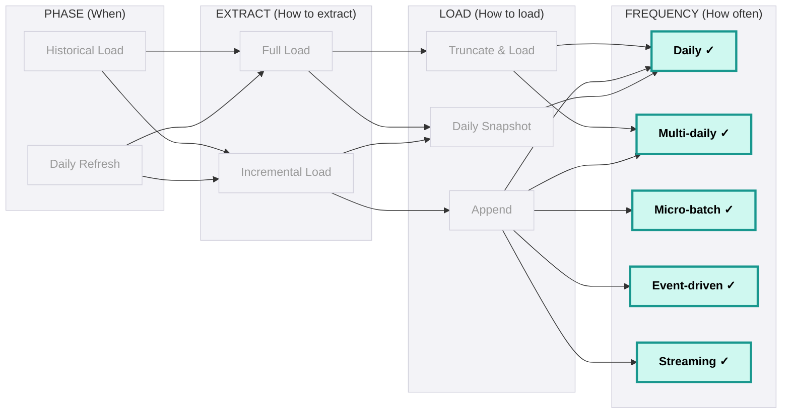
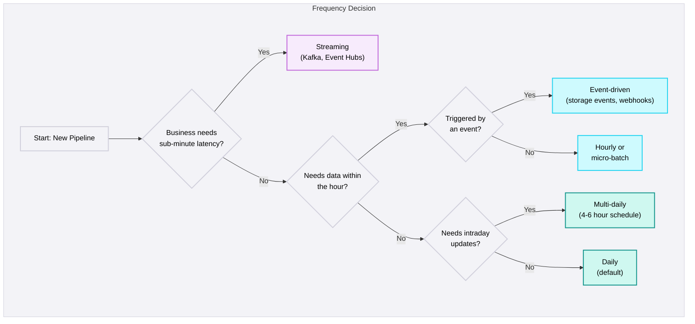

## Frequency & Scheduling

<Callout type="info">
  **Default to Daily** - Most business processes need data that is "fresh enough," not real-time. Daily ingestion at lowest cost covers 80%+ of use cases. Upgrade frequency only when the business articulates a specific need.
</Callout>

### Frequency Options

| Frequency | Use Case | Cost | Source Impact | Complexity |
|---|---|---|---|---|
| **Daily** | Most dashboards, financial reporting, standard analytics | Lowest | Lowest | Low |
| **Multi-daily** (4-6 hrs) | Operational dashboards, intraday inventory tracking | Moderate | Low | Low |
| **Hourly** | Near real-time analytics, operational reporting | Higher | Moderate | Medium |
| **Event-driven** | File arrival, webhooks, storage events | Variable | Minimal | Medium |
| **Micro-batch** (5-15 min) | Operational alerting, live dashboards | High | Moderate-High | High |
| **Streaming** (sub-minute) | Fraud detection, live monitoring, real-time personalisation | Highest | Depends on pattern | Highest |

### Choosing the Right Frequency

The frequency decision should be driven by business need, not technical ambition. Ask these three questions:

<Callout type="question">
  **The Three Client Questions:**
  1. "How often do you look at this dashboard / use this data?"
  2. "What's the latest you can accept yesterday's data?"
  3. "Is there a business process that depends on data freshness (e.g., alerting, operations)?"
</Callout>

### Scheduling Patterns

| Pattern | How It Works | Best For |
|---------|-------------|----------|
| **Time-based (cron)** | Run at fixed intervals (e.g., 2am daily, every 6 hours) | Most batch pipelines |
| **Event-driven** | Triggered by file arrival, webhook, or storage event | File ingestion, webhook sources |
| **Dependency-based** | Triggered when upstream pipeline completes | Multi-step ingestion chains |
| **Tumbling window** | Fixed-size, non-overlapping time windows | Time-series data, log ingestion |
| **SLA-driven** | Work backward from business deadline to determine latest start time | Dashboard refresh SLAs |

#### SLA-Driven Scheduling

<Callout type="note">
  **Work Backward from the Business Deadline** - If the dashboard must be ready by 8am and transformation takes 1 hour, ingestion must complete by 7am. If ingestion takes 90 minutes, it must start by 5:30am. Always add a 30-minute buffer for retries.
</Callout>

| Step | Time | Activity |
|------|------|----------|
| Dashboard ready | 8:00 AM | Business SLA |
| BI refresh | 7:30 AM | Scheduled refresh |
| Transformation complete | 7:00 AM | dbt run finishes |
| Ingestion complete | 5:30 AM | All sources landed in Raw |
| Ingestion starts | 4:00 AM | Earliest source extraction |
| Buffer | 30 min | Retry window for failed sources |

### Streaming & Real-Time: A Forward Look

<Callout type="info">
  **Streaming is ~2% of Our Current Workload** - But it's growing. This section provides a forward look at when streaming is warranted. For most projects today, hourly or micro-batch satisfies the requirement.
</Callout>

True streaming (Kafka, Event Hubs, Kinesis) is warranted when:

- **Sub-minute latency required** - Fraud detection, live monitoring, real-time personalisation
- **Source natively produces events** - IoT sensors, clickstream, application logs
- **Volume makes batch impractical** - Millions of events per hour

### Batch vs Streaming Comparison

| Factor | Batch (Daily/Hourly) | Micro-batch (5-15 min) | Streaming (sub-minute) |
|--------|---------------------|----------------------|----------------------|
| **Latency** | Hours | Minutes | Seconds |
| **Complexity** | Low | Medium | High |
| **Cost** | Lowest | Moderate | Highest |
| **Error recovery** | Simple - rerun the batch | Moderate - reprocess window | Complex - offset management, exactly-once |
| **Monitoring** | Standard job monitoring | Job + lag monitoring | Continuous lag, throughput, backpressure |
| **Team skill** | SQL/Python engineers | Spark Streaming experience | Kafka/Flink expertise |
| **When justified** | Default for 80%+ use cases | Operational dashboards needing 15-min freshness | Fraud, IoT, real-time personalisation |

For most projects today, hourly or micro-batch satisfies the requirement. When true streaming is needed, it will be covered in a dedicated chapter. The architecture diagram includes Kafka and Azure Event Hubs under the Real-Time pillar - this is the future state we're building toward.

### Frequency Decision Framework

<DosAndDonts
  dos={[
    { text: "Default to daily ingestion - it covers 80%+ of business needs at the lowest cost" },
    { text: "Validate frequency with actual usage patterns, not stated requirements - 'real-time' usually means 'fresher than today'" },
    { text: "Work backward from the business SLA to determine ingestion schedule - add 30-min retry buffer" },
    { text: "Use event-driven triggers for file ingestion - polling wastes resources" },
    { text: "Document the frequency decision and rationale for every source - reviewable by future engineers" },
    { text: "Monitor actual dashboard/data usage - if no one accesses intraday data, downgrade frequency" }
  ]}
  donts={[
    { text: "Build hourly or streaming pipelines without validated business need - it adds complexity and cost" },
    { text: "Equate 'real-time' with streaming - most stakeholders mean 'faster than daily', not sub-second" },
    { text: "Schedule all pipelines at the same time - stagger start times to avoid resource contention and source overload" },
    { text: "Over-engineer for streaming when micro-batch satisfies the latency requirement" },
    { text: "Ignore the cost of higher frequency - hourly is 24x the cost of daily, micro-batch is 96-288x" }
  ]}
/>

<AntiPatterns patterns={[
  {
    title: "Over-Engineering Frequency",
    problem: "Client says 'real-time.' Team builds hourly micro-batch CDC pipeline with Kafka. Three months later, the dashboard is opened once daily at 9am. The engineering effort and ongoing operational cost were wasted.",
    example: "A retail client requested 'real-time inventory visibility.' The team built a streaming pipeline with Kafka and Spark Structured Streaming - 6 weeks of engineering. Post-launch analysis showed the inventory dashboard was accessed 3 times per day, all between 8-9am. A daily batch pipeline would have taken 3 days to build.",
    prevention: "Validate stated frequency with actual usage patterns before building. Ask: 'How often do you look at this?' and 'What decision depends on this being fresher?' If the answer is 'daily at the morning standup,' build daily. You can always upgrade later - you can't easily downgrade."
  },
  {
    title: "The Midnight Stampede",
    problem: "All ingestion pipelines are scheduled at midnight. They compete for source system resources, cloud compute, and API rate limits simultaneously. Some pipelines fail due to timeouts and resource contention.",
    example: "15 ingestion pipelines all triggered at 00:00. They competed for 3 concurrent Salesforce API sessions, exhausted the NetSuite concurrent user limit, and spiked Databricks cluster to 200 DBUs. Three pipelines failed. By the time retries completed, transformation jobs had already started with incomplete data.",
    prevention: "Stagger pipeline start times based on priority and dependencies. Critical sources first, reference data last. Coordinate API rate limits across concurrent pipelines. Use dependency-based triggers so downstream jobs wait for upstream completion, not fixed times."
  },
  {
    title: "The Frequency Ratchet",
    problem: "Frequency is increased from daily to hourly for one urgent request. It's never reduced back because 'it might be needed.' Over time, multiple pipelines run hourly without business justification, consuming 24x the resources.",
    example: "A quarterly board meeting required hourly data for a one-week period. The pipeline was upgraded to hourly. Six months later, it was still running hourly. No one requested or used the intraday data. Annual cost: $18,000 in unnecessary compute - 24x the daily run cost.",
    prevention: "When upgrading frequency, set a review date. After the business need passes, review usage and downgrade if not justified. Monitor actual data access patterns monthly. If intraday data isn't queried between runs, the frequency is too high."
  }
]} />

### JMAN Guidance

**Default to daily. Upgrade only when the business articulates a specific, validated need.**

| Business Need | Recommended Frequency |
|---------------|----------------------|
| Standard dashboards and reporting | Daily |
| Operational dashboards (inventory, pipeline) | Multi-daily (4-6 hours) |
| Alerts and notifications | Hourly or event-driven |
| File-based ingestion | Event-driven (on file arrival) |
| Live monitoring, fraud detection | Streaming (justify the investment) |
