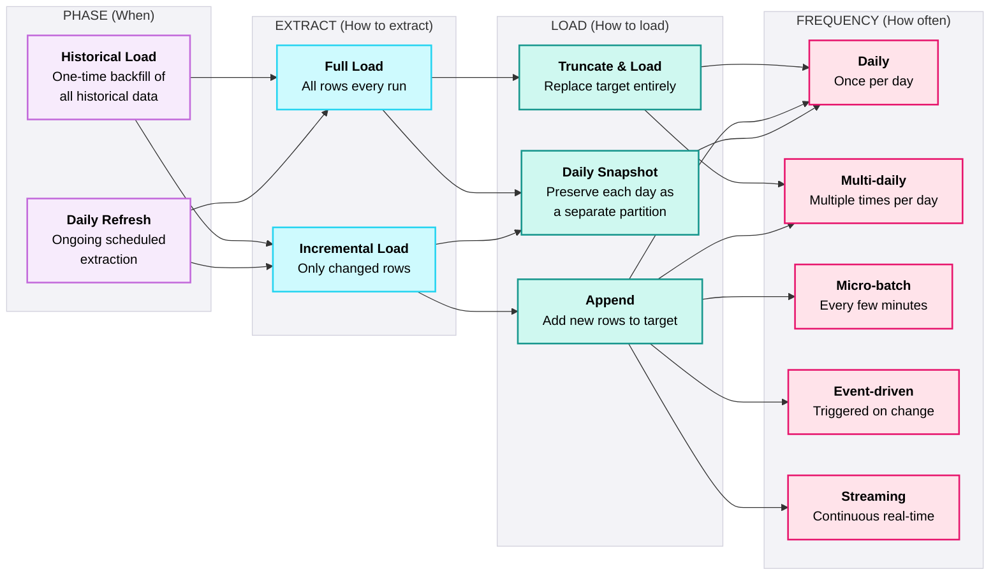
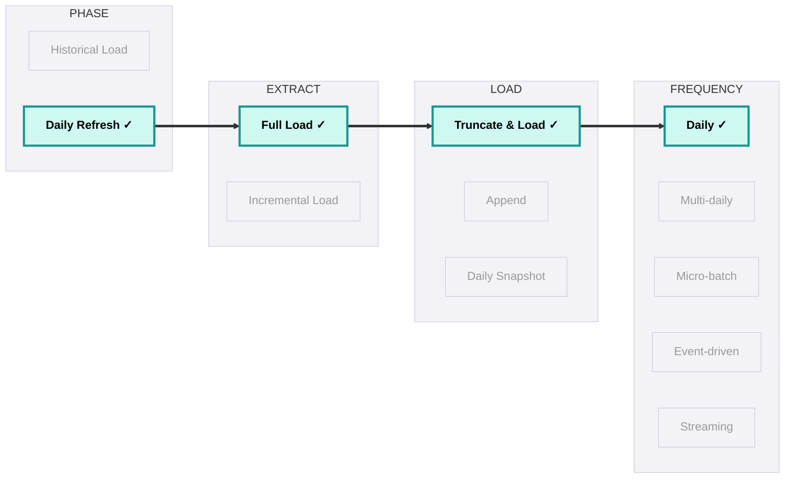
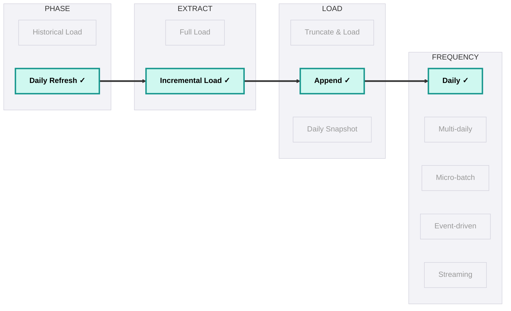
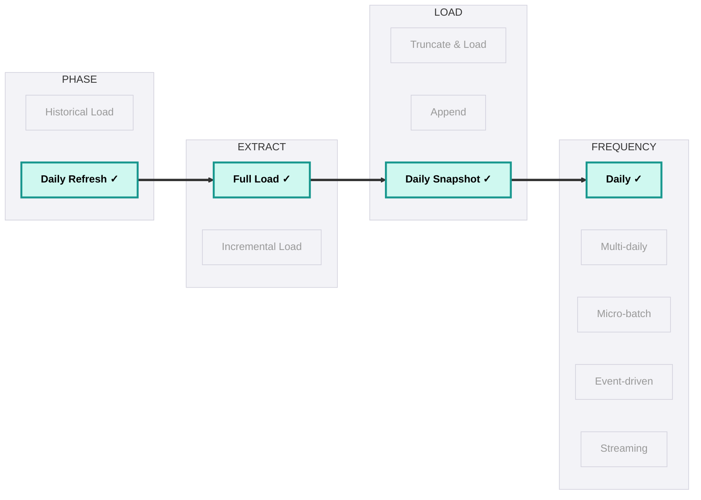
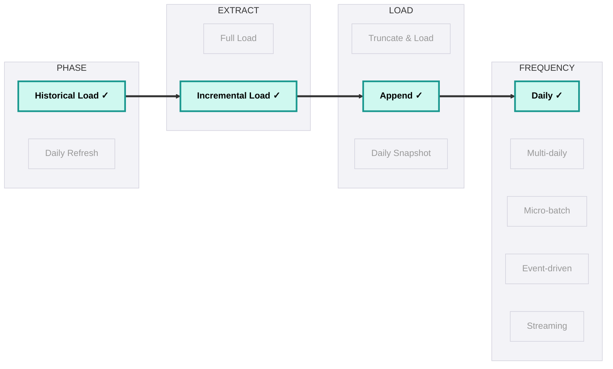
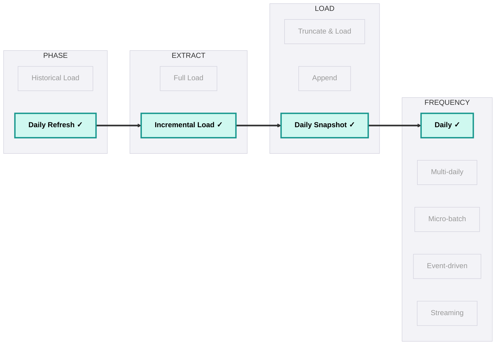
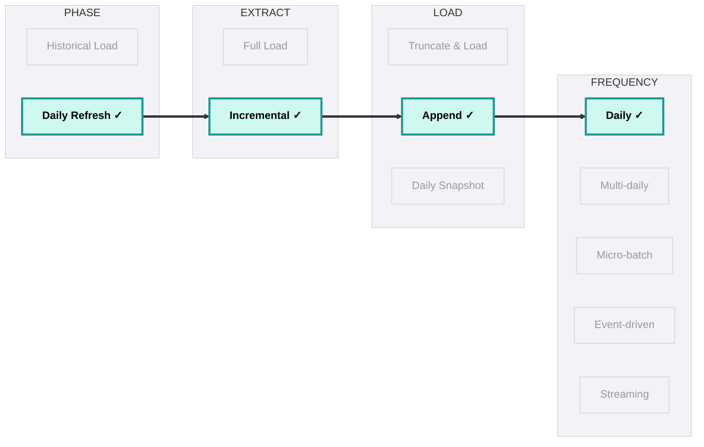

## Patterns

<Callout type="info">
  **Per-Table, Not Per-Source** - The loading strategy determines how data moves from source to Raw. This decision is made per source table, not per source system - the same Salesforce org might use full load for `ref_country_codes` (500 rows) and incremental for `opportunity` (2M rows).
</Callout>

### Extract & Load Strategy Overview

Every ingestion pipeline has four decisions:
* **when** (historical backfill or ongoing refresh)
* **how to extract** (what data to pull from the source)
* **how to load** (how to write it to the target)
* **how often** (daily, multi-daily, micro-batch, event-driven, or streaming)

These are independent choices that combine to form the complete loading pattern.

### Scenario Walk-Throughs

#### Scenario 1: Currency Code Reference Table (500 rows)

The client's ERP has a `ref_currency_codes` table with 500 rows. It rarely changes (maybe once a quarter). There's no `updated_at` column.

- **Phase:** Daily Refresh - runs every morning at 5am
- **Extract:** Full Load - 500 rows takes 2 seconds. Not worth building incremental for this volume.
- **Load:** Truncate & Load - wipe the target, reload all 500 rows. Target always matches source exactly. If a currency code was removed, it disappears from the warehouse too.

Every morning, all 500 rows are extracted from the ERP and replace the entire target table. Target always matches source exactly - if a currency code was removed from the ERP, it disappears from the warehouse too.

---

#### Scenario 2: Salesforce Opportunities (2M rows, ongoing)

The client's Salesforce org has 2M Opportunity records. Only ~3,000 change per day. Each record has a `SystemModstamp` field.

- **Phase:** Daily Refresh - runs at 5:30am via Databricks Workflow
- **Extract:** Incremental - query `WHERE SystemModstamp > '2026-03-08T05:30:00Z'`. Extracts ~3,000 rows in 15 seconds instead of 2M rows in 45 minutes.
- **Load:** Append - add the 3,000 changed rows to Raw with `__loaded_at` and `__batch_id`. Stage deduplicates to get current state.

Only the ~3,000 changed records are extracted and appended to Raw with a new `__batch_id`. Raw now contains both the old version (`__batch_101`) and the new version (`__batch_102`) of each changed record. Stage deduplicates by keeping the latest version per Opportunity ID.

---

#### Scenario 3: CRM Accounts with Hard Deletes (50K rows)

The client's sales team regularly merges duplicate Accounts in the CRM. Merged accounts are hard-deleted (no soft-delete flag, no CDC). The business needs to answer "how many active accounts did we have last Tuesday?"

- **Phase:** Daily Refresh - runs at 6am
- **Extract:** Full Load - extract all 50K accounts every day. This is the only way to detect deletions (missing rows = merged/deleted).
- **Load:** Daily Snapshot - store each day's full extract as a date-partitioned snapshot. Yesterday's data is preserved. Today's snapshot sits alongside it.

Each day's full extract is stored as a separate partition in Raw:

| Snapshot Date | Records | Notable Change |
|---|---|---|
| 2026-03-07 | 50,000 | Acct-001, Acct-002, Acct-003 all present |
| 2026-03-08 | 49,999 | Acct-002 missing (merged/deleted in CRM) |

**Query examples:** "Accounts on March 7?" → filter `snapshot_date = 2026-03-07` → 50,000. "What was deleted?" → compare consecutive snapshots → Acct-002 missing.

---

#### Scenario 4: PostgreSQL Orders Table (80M rows, first-time setup)

New project onboarding. The client's PostgreSQL `orders` table has 80M rows spanning 5 years. After the backfill, daily refresh takes over.

- **Phase:** Historical Load - one-time, scheduled over a weekend against the read replica
- **Extract:** Incremental by date range - chunk by month (`WHERE order_date BETWEEN '2021-01-01' AND '2021-01-31'`). Each chunk is a manageable 1.3M rows. If chunk 37 of 60 fails, resume from chunk 37.
- **Load:** Append (chunked) - each chunk is appended to Raw with a checkpoint recorded. After all 60 chunks complete, validate total row count against source.
- **Then:** Switch to Daily Refresh → Incremental (by `updated_at`) → Append

**Historical Load (weekend):** 60 chunks by month (Jan 2021 → Mar 2026), each ~1.1-1.5M rows. Checkpoint recorded after each chunk. If chunk 37 fails, resume from chunk 37 - not from scratch. After all 60 complete, validate total row count (80M) against source.

**Then Daily Refresh (ongoing):** Switch to incremental using `WHERE updated_at > last_watermark`, extracting ~5K rows/day.

---

#### Scenario 5: Employee Directory from BambooHR (2K rows, need history)

HR needs to track employee changes over time (title changes, department transfers, manager changes). BambooHR has an `updated_at` field. Only ~10-20 records change daily, but the business needs "who was in which department last quarter?"

- **Phase:** Daily Refresh - runs at 6:30am
- **Extract:** Incremental - query only changed records via BambooHR API (`?since=2026-03-08`). Extracts ~15 rows instead of 2,000.
- **Load:** Daily Snapshot - but only for the changed records, merged with yesterday's snapshot to produce today's full state. This gives point-in-time history without the cost of a full extract.

Yesterday's snapshot (2,000 employees) is merged with today's 15 changed records to produce today's full snapshot (2,001 employees). Unchanged records carry forward. Updated records (e.g., Bob moved from Sales to Marketing) are overwritten. New hires are added. The result is a complete point-in-time state for every day - enabling queries like "who was in which department last quarter?"

### Phase Strategies

#### Historical Load (Initial Backfill)

One-time extraction of all historical data. Runs once (or during re-platforming / disaster recovery). Fundamentally different from daily refresh - treat it as a separate engineering problem.

| Pros | Cons |
|------|------|
| Establishes the full baseline - all history available from day one | Can take hours to days for large sources (10M+ rows, multi-GB) |
| Enables historical trend reporting immediately after go-live | Risks overwhelming the source system (API limits, DB locks) |
| Only runs once - no ongoing cost | Requires chunking + checkpointing (failure at hour 30 of 48 wastes days) |
| Can be scheduled during a maintenance window to minimise impact | Must coordinate with source team for capacity and access |

#### Daily Refresh (Ongoing)

Scheduled extraction that runs on a recurring cadence (daily, hourly, event-driven). This is the steady-state operation after historical load completes.

| Pros | Cons |
|------|------|
| Keeps data current - business decisions based on fresh data | Requires monitoring, alerting, and SLA tracking |
| Small, predictable data volumes per run | Accumulates technical debt if not maintained (schema drift, credential expiry) |
| Cost is stable and budgetable | Must handle edge cases: late-arriving data, source downtime, retries |
| Can be tuned independently of historical load | Frequency decision has cost implications (hourly = 24x daily cost) |

<Callout type="warning">
  **Historical Load and Daily Refresh are Different Pipelines** - Historical load needs chunking, checkpointing, and a weekend maintenance window. Daily refresh needs watermarking, retry logic, and SLA monitoring. Building one pipeline that "does both" leads to fragile code that handles neither well.
</Callout>

### How the Four Dimensions Combine

| Phase | Extract | Load | Frequency | When to Use | Example |
|-------|---------|------|-----------|-------------|---------|
| Historical | Full Load | Append (chunked) | One-time | First-time backfill of large tables | Load 3 years of Salesforce Opportunity history in date-range chunks |
| Historical | Incremental (by date range) | Append (chunked) | One-time | Backfill when source supports range queries | Load PostgreSQL orders by month: Jan 2024, Feb 2024, ... |
| Daily | Full Load | Truncate & Load | Daily | Small reference tables, ongoing | Refresh 500-row currency code table every morning |
| Daily | Full Load | Daily Snapshot | Daily | Sources with hard deletes, need history | Snapshot CRM accounts daily to track changes over time |
| Daily | Incremental | Append | Daily | Large transactional tables, CDC | Append today's new/updated orders to Raw |
| Daily | Incremental | Append | Event-driven | File arrival or webhook triggers | Ingest new files as they land in blob storage |
| Daily | Incremental | Daily Snapshot | Daily | Slowly changing dimensions | Snapshot customer attributes daily for SCD-2 construction |

### Decision Priority

Start with "Can the source support incremental?" If yes, use it for any table above 100K rows. If no, use full load and monitor cost. CDC is the gold standard for databases - use it whenever the DBA grants access.

<Callout type="note">
  **Raw Layer Default** - For most production tables, use the following default pattern. Daily Snapshot is used when point-in-time history is a business requirement. Historical Load is always a separate, one-time pipeline with chunking and checkpointing.
</Callout>

