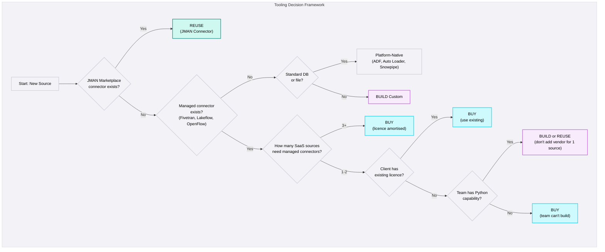

## Buy vs Build vs Reuse

<Callout type="info">
  **JMAN Marketplace First** - Before buying a vendor licence or building from scratch, check whether JMAN has a tested, reusable connector for the source. Zero vendor cost, faster than custom build, and maintained by the CoE.
</Callout>

### When to Buy

| Criteria | Why |
|----------|-----|
| 3+ SaaS sources need managed connectors | Licence cost amortised across multiple sources |
| Client already has a managed tool licence | Sunk cost - use it |
| Team lacks Python/Spark capability | Managed tools require configuration, not code |
| Time pressure | Managed connector ready in minutes vs weeks for custom |
| Source requires complex CDC | Managed CDC is more reliable than self-built |

### When to Build

| Criteria | Why |
|----------|-----|
| Proprietary API, no managed connector, no JMAN pattern | Only option |
| On-premises source behind firewall | Managed tools may not reach the source |
| Compliance prevents third-party data transit | Data must stay within the network |
| Complex extraction logic (multi-step API, custom joins) | Managed connectors don't support complex workflows |
| Single API with simple structure | Custom is faster than introducing a vendor |

### When to Reuse (JMAN Marketplace)

| Criteria | Why |
|----------|-----|
| JMAN has a tested connector for the source type | Proven, maintained, zero vendor cost |
| Common SaaS source (Salesforce, NetSuite, HubSpot) | Pattern already established |
| Database extract with standard pattern | JDBC templates available |
| File ingestion with validation | CSV/Excel patterns available |

### Total Cost of Ownership

<Callout type="warning">
  **Don't Compare Licence vs Free** - Compare total cost of ownership over 12 months: licence + implementation + maintenance + incident resolution. A "free" custom connector that takes 3 weeks to build and requires monthly maintenance is often more expensive than a managed tool.
</Callout>

| Cost Component | Buy (Managed) | Build (Custom) | Reuse (JMAN) |
|----------------|---------------|----------------|--------------|
| **Licence** | $500-5,000/month | $0 | $0 |
| **Implementation** | Hours (config) | Weeks (code) | Days (deploy + config) |
| **Maintenance** | Vendor handles | Project team | Data Engineering CoE |
| **Schema evolution** | Automatic | Manual handling | Configurable |
| **Incident resolution** | Vendor support | Project team | Data Engineering CoE + Project team |

#### Example: 5 SaaS Sources on Databricks (12-Month TCO)

| Cost Component | Buy (Fivetran) | Build (Custom Notebooks) | Reuse (JMAN Connectors) |
|----------------|---------------|--------------------------|------------------------|
| **Licence** | ~$2,000/month × 12 = **$24,000** | $0 | $0 |
| **Implementation** | 1 engineer × 1 week = **$2,500** | 1 engineer × 3 weeks/source × 5 = **$37,500** | 1 engineer × 3 days/source × 5 = **$7,500** |
| **Maintenance** | Vendor handles = **$0** | 2 days/month × 12 = **$12,000** | CoE handles = **$0** (project) |
| **Incident resolution** | ~2 incidents/year = **$1,000** | ~8 incidents/year = **$8,000** | ~4 incidents/year = **$4,000** |
| **Schema changes** | Automatic = **$0** | ~1 day/change × 6/year = **$3,000** | Configurable = **$1,500** |
| **12-Month Total** | **~$27,500** | **~$60,500** | **~$13,000** |

<Callout type="note">
  **Read the numbers, not the conclusion.** The example above favours Buy over Build for 5 SaaS sources - but change the inputs and the answer flips. With 1 source, Fivetran's licence cost isn't amortised. With database sources, platform-native beats both. Always run your own numbers.
</Callout>

#### Example: 3 Database Sources on Fabric (12-Month TCO)

| Cost Component | Buy (Fivetran) | Platform-Native (ADF) | Reuse (JMAN Connectors) |
|----------------|---------------|----------------------|------------------------|
| **Licence** | ~$1,500/month × 12 = **$18,000** | Included in Fabric capacity = **$0** | $0 |
| **Implementation** | 1 week = **$2,500** | 1 engineer × 1 week/source × 3 = **$7,500** | 1 engineer × 2 days/source × 3 = **$3,000** |
| **Maintenance** | Vendor handles = **$0** | 1 day/month × 12 = **$6,000** | CoE handles = **$0** (project) |
| **Incident resolution** | ~2 incidents/year = **$1,000** | ~3 incidents/year = **$1,500** | ~3 incidents/year = **$1,500** |
| **Schema changes** | Automatic = **$0** | ~1 day/change × 4/year = **$2,000** | Configurable = **$1,000** |
| **12-Month Total** | **~$21,500** | **~$17,000** | **~$5,500** |

In this scenario, platform-native (ADF) is cheaper than the managed tool, and JMAN Connectors are cheapest. **For databases, the managed tool rarely wins on cost.**

#### Example: 1 Niche API on Snowflake (12-Month TCO)

| Cost Component | Buy (Fivetran) | Build (Custom Python → S3 → Snowpipe) | Reuse (JMAN Connector) |
|----------------|---------------|----------------------------------------|------------------------|
| **Licence** | Connector not available = **N/A** | $0 | Pattern not available = **N/A** |
| **Implementation** | - | 1 engineer × 2 weeks = **$5,000** | - |
| **Maintenance** | - | 1 day/month × 12 = **$6,000** | - |
| **Incident resolution** | - | ~4 incidents/year = **$4,000** | - |
| **12-Month Total** | **N/A** | **~$15,000** | **N/A** |

When no managed connector or JMAN pattern exists, Build is the only option. **Budget for ongoing maintenance - the initial build is less than half the total cost.**

<Callout type="warning">
  **Engineering day rate assumption:** Examples above use **$500/day** (~$130K/year fully loaded). Adjust for your region and seniority mix. The relative ranking rarely changes - Build maintenance is the hidden cost that makes it expensive regardless of day rate.
</Callout>

### Platform Coverage: How Much Can You Do Natively?

Each platform has a different level of built-in ingestion capability. This determines how likely you are to need a third-party tool.

<ComparisonTable
  data={{
    headers: [
      "Capability",
      "Fabric",
      "Databricks",
      "Snowflake"
    ],
    rows: [
      {
        header: "SaaS Sources",
        cells: [
          { content: "ADF has 100+ linked services. Excellent for Microsoft ecosystem (Dynamics, SharePoint). Limited for non-Microsoft SaaS", status: "above" },
          { content: "Lakeflow Connect covers major SaaS (Salesforce, HubSpot). Connector catalog still growing - verify your source is supported", status: "meets" },
          { content: "No native SaaS connectors. All SaaS ingestion requires partner tools (Fivetran, Airbyte) or external functions", status: "below" }
        ]
      },
      {
        header: "Databases",
        cells: [
          { content: "ADF + On-Premises Data Gateway. Handles cloud and on-prem databases natively. Fully integrated with Azure ecosystem", status: "above" },
          { content: "Lakeflow Connect + Spark JDBC. Strong native database connectivity with Unity Catalog integration", status: "above" },
          { content: "No native database extraction. Requires external tools (Fivetran, HVR) or custom ETL to land data in stages", status: "below" }
        ]
      },
      {
        header: "Files",
        cells: [
          { content: "ADF Copy Activity + Event Grid triggers. Handles CSV, Parquet, JSON, Excel natively with event-driven processing", status: "above" },
          { content: "Auto Loader is best-in-class. Automatic file discovery, schema evolution, exactly-once processing via checkpoints", status: "above" },
          { content: "Snowpipe + external stages. Reliable auto-ingest from cloud storage. Strong native file ingestion path", status: "above" }
        ]
      },
      {
        header: "CDC",
        cells: [
          { content: "ADF CDC for SQL Server via Change Tracking. Requires manual configuration for other database engines", status: "meets" },
          { content: "Lakeflow Connect provides native log-based CDC. Strong for supported databases with Delta Lake merge", status: "above" },
          { content: "No native CDC capability. Requires partner tools (Fivetran, HVR, Debezium) for all database change capture", status: "below" }
        ]
      },
      {
        header: "Custom APIs",
        cells: [
          { content: "ADF Web Activity + Azure Functions. Native integration with Azure compute for custom extraction logic", status: "above" },
          { content: "Python notebooks via Databricks Workflows. Flexible but requires engineering effort for each custom source", status: "meets" },
          { content: "External process → Stage → Snowpipe. No native API connector - all custom ingestion runs outside Snowflake", status: "below" }
        ]
      },
      {
        header: "3rd Party Likelihood",
        cells: [
          { content: "Low - rarely needed. ADF covers most source types natively. Only consider for niche SaaS with no ADF connector", status: "above" },
          { content: "Medium - depends on source mix. Lakeflow covers databases; gaps remain for niche SaaS APIs", status: "meets" },
          { content: "High - almost always needed. No native source extraction beyond files. Budget for external ingestion tooling from day one", status: "below" }
        ]
      }
    ]
  }}
/>

<Callout type="note">
  **Snowflake Projects: Budget for Ingestion Tooling** - Unlike Fabric or Databricks, Snowflake has no native way to pull data from sources. Every Snowflake project needs an external ingestion layer - either a managed tool (Fivetran), a custom pipeline (Python → S3 → Snowpipe), or a JMAN connector. Factor this into project scoping and cost estimates from day one.
</Callout>

### Platform-Specific Recommendations

<PlatformTabs>

<PlatformTabsFabric>

**Default tools:** ADF Copy Activity, Dataflows Gen2, Event Grid

| Source Type | Recommended Tool |
|-------------|-----------------|
| SaaS (3+ sources) | ADF, Fivetran (if really required) |
| SaaS (1-2 sources) | JMAN Connector / ADF custom activity |
| Database (on-premises) | ADF + On-premises Data Gateway |
| Database (cloud) | ADF linked service |
| Files | ADF Copy Activity + Event Grid trigger |
| Custom APIs | ADF Web Activity / Azure Function |

**Key consideration:** ADF is deeply integrated with Fabric. For Azure-centric projects, ADF should be the first choice before introducing external tools.

</PlatformTabsFabric>

<PlatformTabsDatabricks>

**Default tools:** Lakeflow Connect, Auto Loader, Spark notebooks

| Source Type | Recommended Tool |
|-------------|-----------------|
| SaaS (3+ sources) | JMAN Connector / Custom Notebooks or Fivetran |
| SaaS (1-2 sources) | JMAN Connector / Python notebook |
| Database (CDC) | Lakeflow Connect (native CDC) |
| Database (query) | JMAN Connector / Spark JDBC |
| Files | Auto Loader (always) |
| Custom APIs | Python notebook via Databricks Workflows |
| 3rd Party sharing | Delta Sharing |

**Key consideration:** Lakeflow Connect is Databricks-native and included in DBU cost. Prefer it over Fivetran for supported sources.

</PlatformTabsDatabricks>

<PlatformTabsSnowflake>

**Default tools:** Snowpipe, External stages, Snowpark

| Source Type | Recommended Tool |
|-------------|-----------------|
| SaaS (3+ sources) | Fivetran |
| SaaS (1-2 sources) | JMAN Connector / Snowpark |
| Database (CDC) | Fivetran or HVR |
| Database (query) | JMAN Connector |
| Files | Snowpipe + external stage |
| Custom APIs | External orchestration → S3/GCS → Snowpipe |
| 3rd Party sharing | Snowflake Data Share |

**Key consideration:** Snowflake has no native API connector. For SaaS sources, you must use partner tools or external processing.

</PlatformTabsSnowflake>

</PlatformTabs>

### Decision Framework

<DosAndDonts
  dos={[
    { text: "Check JMAN Marketplace before building custom - someone may have already solved this" },
    { text: "Evaluate total cost of ownership over 12 months, not just licence cost" },
    { text: "Use platform-native tools for databases and files - lowest friction" },
    { text: "Require 3+ SaaS sources before introducing a managed tool licence" },
    { text: "Document the Buy/Build/Reuse decision per source with rationale" },
    { text: "Re-evaluate tooling at project handoff - build-phase choices may not suit operations" }
  ]}
  donts={[
    { text: "Introduce a managed tool for a single source - operational overhead doubles for minimal benefit" },
    { text: "Default to 'build everything' when proven connectors exist" },
    { text: "Mix multiple managed tools (Fivetran + Airbyte + custom) - three stacks to monitor" },
    { text: "Ignore ongoing maintenance cost of custom connectors - they need updates when APIs change" },
    { text: "Let one outlier source drive the tool choice for all sources" }
  ]}
/>

<AntiPatterns patterns={[
  {
    title: "Fivetran for One Source",
    problem: "Project introduces a managed tool for a single SaaS source when the rest of the stack uses platform-native tools. The team now manages two ingestion systems, two sets of credentials, and two alerting pipelines.",
    example: "A Databricks project introduced Fivetran solely for Salesforce. The other 5 sources used Spark notebooks. When the Fivetran sync failed at 3am, no one noticed because alerts were only configured for the Spark pipelines. Salesforce data was stale for 2 days.",
    prevention: "Don't introduce a managed tool for a single source. Build or reuse a JMAN connector. The threshold is 3+ SaaS sources before a managed tool earns its licence cost and operational overhead."
  },
  {
    title: "Building What's Already Solved",
    problem: "Team builds custom connectors for multiple SaaS sources that have excellent managed connectors. Weeks of engineering time spent on pagination, rate limiting, and schema evolution - problems already solved by managed tools.",
    example: "An engineer spent 3 weeks building a custom Salesforce connector, then 2 weeks on NetSuite, then 2 weeks on HubSpot. Each had subtle bugs with pagination and rate limiting. Fivetran would have handled all three in 2 days of configuration, saving 5 weeks of engineering.",
    prevention: "When 3+ SaaS sources need connectors, buy the managed tool. Focus custom engineering on sources that genuinely have no managed option."
  },
  {
    title: "Wrong Tool for Source Mix",
    problem: "Managed tool chosen for all sources including databases and files, when platform-native is better for most. Team pays licence fees and gets inferior results for the majority of sources.",
    example: "A Databricks project with 5 PostgreSQL databases and 1 HubSpot chose Fivetran for all 6. Fivetran's PostgreSQL connector was less capable than Lakeflow Connect's native CDC. The team paid $3,000/month for a managed tool when the platform-native option was superior for 5 of 6 sources.",
    prevention: "Match tool to source type. Use platform-native for databases and files, managed tools only for SaaS sources that justify the cost."
  }
]} />
