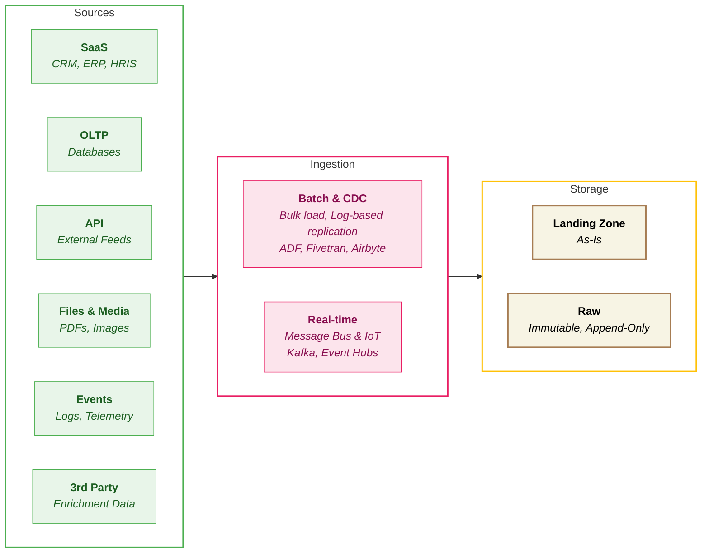

## Brief

### What is Data Ingestion?

**Data Ingestion** is the process of collecting and importing data from various source systems into your data platform. Think of it as the "front door" of your data warehouse - it's how raw information from CRMs, databases, APIs, files, and event streams first enters the platform where it can be stored, cleaned, and analysed. Without reliable ingestion, nothing downstream - no dashboards, no reports, no AI models - can function.

In simple terms: **ingestion answers the question, "How do we get the data in?"**

### The Problem (The "Pain")

Ingestion is the front door of the data platform. It's the first thing that runs, the first thing that breaks, and the first thing the business notices when it goes wrong. If the data doesn't land in Raw, nothing downstream works - no transformation, no dashboards, no insights. Yet across our projects, ingestion is often the least standardised component of the entire stack.

*Source system ignorance*

-   Engineers build ingestion pipelines without understanding the source system's constraints. APIs have rate limits. Databases have concurrency restrictions. SFTP servers go down for maintenance at predictable times. We learn these the hard way - in production, at 3am, when the pipeline breaks.

-   Source schema changes are discovered when the pipeline fails, not before. A column gets renamed, and the entire ingestion breaks because there's no schema contract between the source team and the data team.

*Inconsistent loading strategy*

-   One project uses full load for everything because "it's simpler." The extract takes 3 hours and costs $200/day in compute. Another project uses incremental load but doesn't handle deletes, so ghost records accumulate. A third project uses CDC but doesn't understand the ordering guarantees, creating data corruption.

-   The decision between full load and incremental load is made based on what the engineer is comfortable with, not what the data characteristics require.

*No separation between initial load and ongoing sync*

-   The first time you connect a source, you need months or years of historical data. This is fundamentally different from the daily delta sync. Yet we use the same pipeline for both, leading to initial loads that take days, time out, or overwhelm the source system.

*Tool sprawl and inconsistent choices*

-   One project uses Fivetran, another uses ADF Copy Activities, a third uses custom Python scripts. The choice is driven by what the engineer knows, not what the project needs. Teams build custom connectors for sources that have existing solutions, wasting weeks. Conversely, teams introduce managed tools for a single source when the rest of the stack doesn't need them - adding vendor cost and operational overhead for minimal value.

### The Solution (The Purpose)

This framework establishes the "JMAN Way" for ingestion. We are standardising:

-   Source type classification - understanding the characteristics, constraints, and gotchas of each source category before writing a line of code
-   Loading strategy selection - a decision framework for full load vs incremental vs CDC
-   Initial load as a first-class pattern - separate from ongoing sync, with checkpointing
-   Buy vs Build vs Reuse - when to use managed tools, when to build custom, and when to reuse JMAN Marketplace connectors
-   Raw layer standards - consistent metadata fields, schema evolution handling, and deleted record management
-   Security at ingestion - PII handling before data reaches the platform
-   Observability - source freshness dashboards, SLA monitoring, error categorisation, and late-arriving data detection

### Impact on JMAN Delivery (The Value)

-   Consistency - The JMAN way for ingestion across projects
-   Reliability - Pipelines that handle source constraints gracefully and recover without manual intervention
-   Speed - Engineers don't waste weeks building connectors for solved problems
-   Cost efficiency - Right-sized tooling decisions that don't introduce unnecessary vendor cost

### Why Now?

By 2026, we will be ~700 people in business. The ingestion landscape is shifting - Databricks launched Lakeflow Connect, Snowflake released OpenFlow. Without a framework, every new project will make these choices from scratch. The knowledge about source system quirks sits in individual minds. We need to codify it.

### Open Questions - The Unknowns

-   Should we standardise on a single ingestion tool across all projects, or allow project-level choice within the framework?
-   When does "near real-time" (micro-batch every 5 minutes) justify the additional complexity over daily batch?

### Risks & Dependencies

-   Dependencies - Orchestration chapter (ingestion scheduling), Transformation chapter (Raw to Stage handoff), DataOps chapter (CI/CD for ingestion code), Security chapter (deeper PII and encryption guidance)
-   Risks - None
