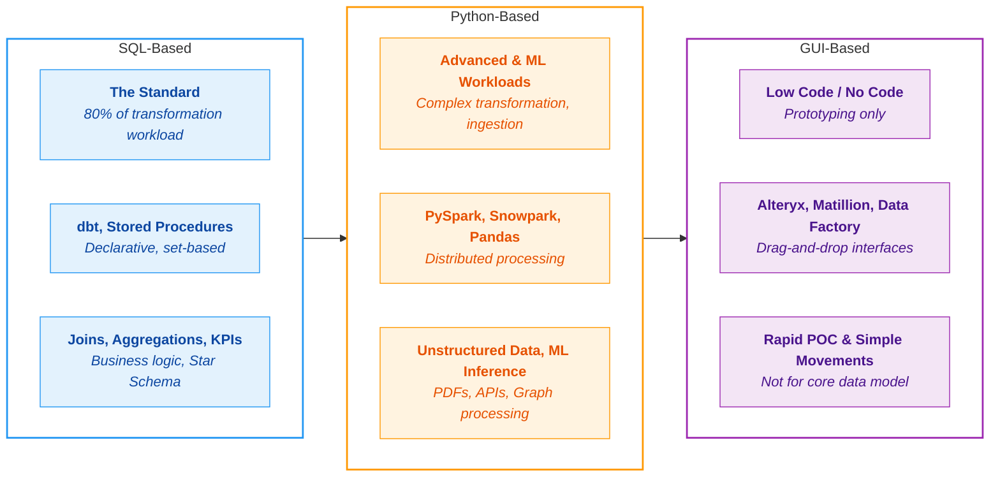

## Language & Tooling

There are three primary ways to transform data within a modern data platform. At JMAN, we choose the approach based on the workload - not personal preference.

### SQL - The Default (80% of Workloads)

SQL is the universal language of data. Every modern cloud warehouse - Snowflake, Databricks SQL, BigQuery - runs on Massively Parallel Processing (MPP) engines that optimise SQL execution far better than most hand-written Python scripts. SQL is readable by engineers, analysts, and business users alike, making it the only language that genuinely breaks down silos between technical and commercial teams.

At JMAN, SQL is the default choice for joining, aggregating, cleaning, and modelling structured data. We pair it with **dbt** as our transformation framework - dbt treats SQL like software by adding version control, automated testing, dependency management, and auto-generated documentation. Engineers write simple `SELECT` statements; dbt handles the rest.

### Python - For Edge Workloads

Python (via PySpark, Snowpark, or Pandas) is reserved for workloads where SQL hits its architectural limits. This includes ingestion pipelines with custom API connectors, unstructured data processing (parsing PDFs, images, deeply nested JSON), identity resolution, machine learning inference, and complex statistical simulations. Major platforms now support running Python and SQL on the same engine, so the two coexist without friction.

The key discipline: Python is not a substitute for SQL in standard transformation. Using Python for simple `SELECT * WHERE` logic introduces unnecessary dependency management overhead and limits who can read and maintain the code.

### GUI - For Prototyping Only

GUI-based tools (Alteryx, Matillion, Fabric Data Flow) enable non-technical users to build insights quickly through drag-and-drop interfaces. They are valuable for rapid prototyping and proving business value early. However, they carry significant long-term debt: version control is difficult (binary files don't diff well in Git), reusability is limited, and complex workflows quickly become unmanageable "spaghetti bowls." At JMAN, GUI tools are strictly excluded from the core enterprise data model.
