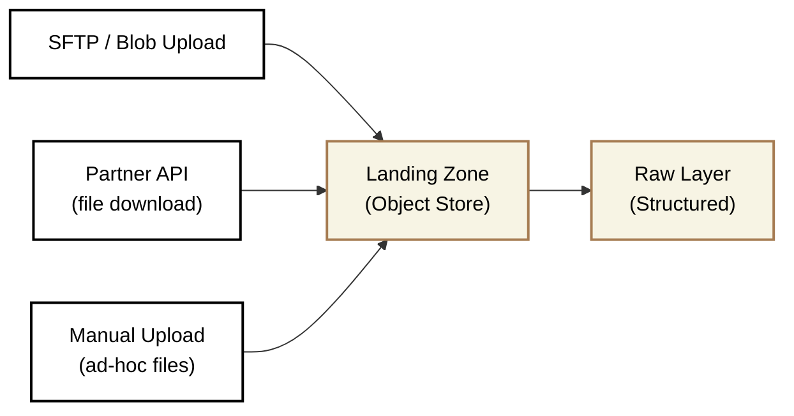

## Landing zone

<Callout type="warning">
**Optional Layer** — Only needed for AI workflows or file-based ingestion. Managed connectors (e.g., Fivetran, Airbyte) load directly to Raw.
</Callout>

### Overview

Landing Zone is the physical entry point for data that cannot be directly loaded into Raw as structured tables. It serves as a transient holding area where files are validated and prepared for structured ingestion.

#### Key Principle
* Capture immediately, validate later
* Data lands here without strict schema enforcement, enabling rapid ingestion that handles <Term>schema drift</Term> gracefully without pipeline failure

#### What lives here

| Data Type | Examples |
|-----------|----------|
| Files from external parties | CSV, Excel, JSON from suppliers or partners |
| Unstructured data for AI/ML | PDFs, images, audio, video files |
| Legacy system exports | Mainframe flat files, custom extracts |
| Raw event payloads | Webhook JSON before parsing |
| Manual data drops | Ad-hoc files from business users |

##### What happens here

- Files are received and stored in original format
- Basic validation (file exists, not empty, expected extension)
- Metadata capture (arrival timestamp, source system, file size, checksum)
- Virus/malware scanning (if required by CSP - client security policy)

##### What does NOT belong here

- Structured API responses → Use managed connectors directly to Raw
- Database CDC streams → Use replication tools directly to Raw
- Transformed or cleansed data → Belongs in Stage or later
- Long-term archival → Landing Zone is transient (30-day retention)

#### Data Flow

**Note:** After successful load to Raw, files in Landing Zone are archived or deleted after 'x' days

#### Input sources
- SFTP/FTPS file drops
- Azure Blob Storage or AWS S3 uploads
- Partner API downloads (files, not structured data)
- Manual uploads from business users

#### Output destination
- Raw layer (after parsing and structuring)
- Archive storage (for compliance retention, if required)

#### Loading Strategy

| Aspect | Approach |
|--------|----------|
| **Pattern** | Append-only file storage |
| **Trigger** | Event-driven (file arrival) or scheduled polling |
| **Retention** | 30 days default, then archive or delete - depends on project & client's retention policy |
| **Replay** | Files retained until successfully loaded to Raw |

### Naming Convention and Structure

#### Folder Structure

Landing Zone uses a consistent folder hierarchy rather than database schemas. Choose the structure that fits your project.

<SchemaOptionMatrix
  options={[
    {
      name: "Option 1",
      subtitle: "Source System only",
      tree: `landing/\n├── supplier_acme/\n│   └── 2026/01/15/\n│       ├── invoices_20260115_083042.csv\n│       └── invoices_20260115_083042.csv.meta\n└── erp_netsuite/\n    └── 2026/01/15/\n        └── orders_20260115_091500.csv`
    },
    {
      name: "Option 2",
      subtitle: "Entity/Region → Source System",
      tree: `landing/\n├── uk/\n│   ├── supplier_acme/\n│   │   └── 2026/01/15/\n│   │       └── invoices_20260115.csv\n│   └── erp_netsuite/\n│       └── 2026/01/15/\n└── us/\n    └── supplier_acme/\n        └── 2026/01/15/\n            └── invoices_20260115.csv`
    }
  ]}
  factors={[
    {
      name: "When to Apply",
      description: "The client context that drives this folder structure choice",
      ratings: [
        { rating: "green", label: "Default",   note: "Single entity or single country — simplest structure, start here" },
        { rating: "amber", label: "M&A / Multi-region", note: "Multiple subsidiaries or countries delivering files from the same source system names" }
      ]
    },
    {
      name: "Naming Collision Risk",
      description: "Risk of two sources using the same folder or file name across entities/regions",
      ratings: [
        { rating: "amber", label: "Possible",  note: "No isolation — two entities using supplier_acme would clash in the same folder" },
        { rating: "green", label: "None",      note: "Entity/region prefix isolates each source — uk/supplier_acme and us/supplier_acme are separate" }
      ]
    },
    {
      name: "Data Isolation",
      description: "Degree of physical separation between entities or regions before Core unification",
      ratings: [
        { rating: "amber", label: "None",      note: "All sources co-mingled — isolation only by folder name, not by path segment" },
        { rating: "green", label: "Clear",     note: "Top-level entity/region segment provides physical isolation in the path" }
      ]
    },
    {
      name: "File Discovery",
      description: "Ease of locating all files for a specific source system across entities",
      ratings: [
        { rating: "green", label: "Easy",      note: "All files for a source system are under one top-level folder" },
        { rating: "amber", label: "Moderate",  note: "Must traverse entity folders to find all files for a given source system" }
      ]
    },
    {
      name: "Setup Complexity",
      description: "Engineering effort to configure ingestion pipelines and folder routing",
      ratings: [
        { rating: "green", label: "Low",       note: "No routing logic — all files land under their source system folder directly" },
        { rating: "amber", label: "Moderate",  note: "Pipelines must resolve entity/region and prepend the correct top-level folder" }
      ]
    }
  ]}
/>

#### File Naming Convention

| Element | Convention | Example |
|---------|------------|---------|
| Entity / Region folder | `snake_case`, entity name or ISO country/region code (Option 2 only) | `uk`, `us`, `acme` |
| Source folder | `snake_case`, matches source system name | `supplier_acme` |
| Date folders | ISO format `yyyy/mm/dd` | `2026/01/15` |
| File name | `{entity}_{yyyymmdd}_{hhmmss}.{ext}` | `invoices_20260115_083042.csv` |
| Metadata file | Same name with `.meta` extension | `invoices_20260115_083042.csv.meta` |

### Data Modelling

**Approach:** No modelling.

Landing Zone stores files in their original format. No transformation, no schema enforcement, no interpretation. The goal is to preserve exactly what was received for auditability and replay capability.

### Data Quality Rules

Landing Zone validation is intentionally lightweight-heavy validation happens in Stage.

| Rule | Check | Action on Failure |
|------|-------|-------------------|
| **File exists** | File is not zero bytes | Reject, alert |
| **Expected format** | Extension matches expected (.csv, .json, .parquet) | Reject, alert |
| **Naming convention** | File name matches expected pattern | Warn, proceed |
| **Duplicate detection** | Checksum not seen in last 7 days | Warn, proceed (may be legitimate resend) |
| **Arrival window** | File arrived within expected schedule | Warn, proceed |

### Testing Strategy

| Test Type | What We Check | When |
|-----------|---------------|------|
| **File arrival** | Expected files arrived within schedule window | After each scheduled window |
| **File integrity** | File is not corrupted (checksum validation) | On arrival |
| **Duplicate detection** | Same file not processed twice | Before processing |
| **Processing success** | File successfully parsed and loaded to Raw | After pipeline run |

#### What we do NOT validate here

- Schema correctness (column names, data types)
- Data completeness (required fields)
- Business rules (valid values, referential integrity)

These validations happen after parsing, in the Raw → Stage transition.

### Security & Access

| Aspect | Standard |
|--------|----------|
| **Encryption** | At rest (SSE-S3, Azure Storage Encryption) and in transit (TLS 1.2+) |
| **Access** | Service accounts and Admin Engineers only |
| **No direct queries** | Business users never access Landing Zone |
| **PII handling** | Data lands as-is; masking happens at Raw / Stage |
| **Audit logging** | All file operations logged (upload, read, delete) |

#### Access Matrix & Consumers

| Role | Access Method | Read | Write | Delete | Use Case |
|------|---------------|------|-------|--------|----------|
| Ingestion Pipeline (Service Account) | Object storage API | ✓ | ✓ | ✓ | Read files, load to Raw, delete after success |
| Data Engineer (Admin) | Object storage API, CLI | ✓ | ✓ | ✓ | Investigate failed loads and manual updates |
| Data Engineer (Standard) | Object storage API, CLI | ✓ | ✗ | ✗ | Investigate failed loads and replay files |
| AI/ML Pipelines | Object storage API | ✓ | ✗ | ✗ | Access unstructured content (images, PDFs) |
| Analytics Engineers | None | ✗ | ✗ | ✗ | Should use Raw or later layers |
| Business Users | None | ✗ | ✗ | ✗ | Should use Mart layer |

#### What consumers should NOT do

- Query Landing Zone for analytics (use Raw or later)
- Assume files are validated (they are not)
- Rely on files being present long-term (30-day retention)

### Refresh Frequency

| Scenario | Frequency |
|----------|-----------|
| **Scheduled file drops** | Match source schedule (daily, hourly) |
| **Event-driven arrivals** | Process within 15 minutes of arrival |
| **Manual uploads** | Process within 1 hour during business hours |

### Retention & Lifecycle

| Stage | Retention | Action |
|-------|-----------|--------|
| **Pending** | Until processed | File awaiting ingestion to Raw |
| **Processed** | 7 days | Successfully loaded; kept for short-term replay |
| **Archived** | 30 days | Moved to archive tier (if compliance requires) |
| **Deleted** | After 30 days | Permanently removed |

### Dos and Don'ts

<DosAndDonts
  dos={[
    { text: "Store files in original format without modification" },
    { text: "Capture metadata (arrival time, source, checksum) for every file" },
    { text: "Use consistent folder structure across all sources" },
    { text: "Configure automated retention policies" },
    { text: "Alert on missing expected files" },
    { text: "Keep files until successfully loaded to Raw (replay capability)" }
  ]}
  donts={[
    { text: "Transform or cleanse data in Landing Zone" },
    { text: "Allow business users to query Landing Zone" },
    { text: "Store files indefinitely (enforce 30-day retention)" },
    { text: "Assume file contents are valid (validate in Stage)" },
    { text: "Use Landing Zone as a data archive" },
    { text: "Skip metadata capture to \"save time\"" }
  ]}
/>

### Anti-Patterns

<AntiPatterns
  patterns={[
    {
      title: "The Infinite Dumping Ground",
      problem: "Files accumulate without retention policies. Landing Zone grows to 50TB over two years. Storage costs spiral. Engineers can't find relevant files among years of historical data.",
      example: "A retail client's Landing Zone contained 3 years of daily inventory files. When they needed to replay a failed load, engineers spent two days identifying which files were relevant. Storage costs exceeded £2,000/month for data that should have been deleted after 30 days.",
      prevention: "Configure lifecycle policies on day one. Enforce 30-day retention. Archive to cold storage only if compliance requires it."
    },
    {
      title: "The Schema Enforcement Trap",
      problem: "Team adds strict schema validation to Landing Zone. A partner changes their file format slightly. Pipeline rejects files for a week before anyone notices.",
      example: "A supplier added a new column to their daily feed. The Landing Zone validation rejected all files because the column count didn't match. The Raw layer went stale for 5 days before the team discovered the issue buried in logs.",
      prevention: "Landing Zone validates only file-level properties (exists, not empty, correct extension). Schema validation happens after parsing, in the Raw → Stage transition, where it can be monitored and alerted properly."
    }
  ]}
/>