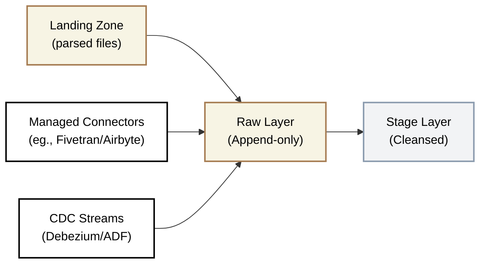

## Raw Layer

<Callout type="info">
**Mandatory Layer** — Raw is required in every architecture tier. It preserves the complete audit trail of everything received from source systems.
</Callout>

<Callout type="warning">
  **Immutable by Design** - Data in Raw is never updated or deleted. Every record received is preserved exactly as it arrived, creating a complete audit trail.
</Callout>

### Overview

Raw is the permanent, append-only record of everything we receive from source systems. It preserves data exactly as the source sent it, with technical metadata added to track when and how it arrived.

#### Key Principle

* Preserve everything, transform nothing
* If something goes wrong downstream, we can always return to Raw and replay the data without re-extracting from source systems

#### What lives here

| Data Type | Examples |
|-----------|----------|
| API extracts | Salesforce accounts, HubSpot contacts, NetSuite transactions |
| Database replications | <Term>CDC</Term> streams, full table extracts |
| Parsed file contents | CSV/JSON from Landing Zone, now structured |
| Event streams | Kafka messages, webhook payloads |
| Third-party data feeds | Market data, enrichment providers |

#### What happens here

- Data arrives exactly as source sent it (column names, data types preserved)
- Technical metadata appended (`__data_loaded_at`, `__source_file`, `__batch_id`)
- Records are appended, never updated or deleted
- Schema evolution handled gracefully (new columns added automatically) where technically possible

#### What does NOT belong here

- Transformed or cleansed data → Belongs in Stage
- Calculated fields or business logic → Belongs in Core or later
- Aggregated or summarised data → Belongs in Mart
- Data with PII masked → Masking happens at Stage, but Raw retains original

#### Data Flow

**Schema Organization:** One schema per source system

#### Input Sources
- Landing Zone (parsed files)
- Managed connectors (Fivetran, Airbyte) - direct load
- CDC tools (Debezium, ADF Change Tracking)
- Custom Python/Spark ingestion scripts

#### Output Destination
- Stage layer (for cleansing and standardisation)

#### Loading Strategy

| Aspect | Approach |
|--------|----------|
| **Pattern** | Append-only (insert only) |
| **Why** | Preserves complete audit trail; enables replay without re-querying source |
| **Updates** | Never update existing records; insert new version with new `__data_loaded_at` |
| **Deletes** | Never delete; if source deletes, capture via soft-delete flag or CDC tombstone |

### Naming Convention and Structure

#### Database & Schema Structure

Raw schema naming combines up to three namespace attributes — **System** (e.g. `salesforce`), **Entity** (e.g. `acme`), and **Country** (e.g. `uk`) — in the order that matches how the client thinks about their data.

<Callout type="info">
**Discuss with the client early.** Schema naming is one of the first decisions in a project and one of the hardest to change later. Ask: *"Do you think about your data by system, by subsidiary, or by country first?"* There is no wrong answer — consistency matters more than convention.
</Callout>

<SchemaOptionMatrix
  options={[
    {
      name: "Option 1",
      subtitle: "System only",
      tree: `raw/\n├── salesforce/\n│   ├── account\n│   ├── opportunity\n│   └── ...\n└── netsuite/\n    ├── customer\n    └── ...`
    },
    {
      name: "Option 2",
      subtitle: "System-first\n(system_entity_country)",
      tree: `raw/\n├── salesforce_acme_uk/\n│   ├── account\n│   └── ...\n├── salesforce_beta_de/\n│   └── ...\n├── netsuite_acme_uk/\n│   └── ...\n└── dynamics_beta_de/\n    └── ...`
    },
    {
      name: "Option 3",
      subtitle: "Entity/Country-first\n(entity_country_system)",
      tree: `raw/\n├── acme_uk_salesforce/\n│   ├── account\n│   └── ...\n├── acme_uk_netsuite/\n│   └── ...\n├── beta_de_salesforce/\n│   └── ...\n└── beta_de_dynamics/\n    └── ...`
    },
    {
      name: "Option 4",
      subtitle: "Compliance DB Separation",
      tree: `raw_uk/\n├── salesforce/\n│   └── ...\n└── netsuite/\n    └── ...\n\nraw_de/\n├── salesforce/\n│   └── ...\n└── sap_s4/\n    └── ...`
    }
  ]}
  factors={[
    {
      name: "When to Apply",
      description: "The client context that drives this namespace choice",
      ratings: [
        { rating: "green", label: "Default",            note: "Single entity, single country — start here unless told otherwise" },
        { rating: "amber", label: "System-centric org",  note: "Tech team manages by system; want all Salesforce data grouped regardless of entity/country" },
        { rating: "amber", label: "Domain-centric org",  note: "Business thinks by subsidiary or region first; M&A, multi-country, or both" },
        { rating: "red",   label: "Compliance only",     note: "GDPR / data residency laws require physical database isolation per country — not a default choice" }
      ]
    },
    {
      name: "Schema Count",
      description: "Number of schemas created and governance overhead",
      ratings: [
        { rating: "green", label: "Minimal",               note: "One schema per source system" },
        { rating: "amber", label: "Grows with complexity",  note: "N systems × M entities/countries — same count as Option 3" },
        { rating: "amber", label: "Grows with complexity",  note: "Identical count to Option 2 — ordering differs, not quantity" },
        { rating: "red",   label: "Highest",               note: "Multiple databases × schemas — most overhead to govern" }
      ]
    },
    {
      name: "Engineer Navigation",
      description: "How easily a data engineer finds all tables for a given source system",
      ratings: [
        { rating: "green", label: "Easy",     note: "System is the schema — instantly obvious where Salesforce data lives" },
        { rating: "green", label: "Easy",     note: "System is the first prefix — all salesforce_* schemas group together alphabetically" },
        { rating: "amber", label: "Moderate", note: "System is the last segment — must know entity/country prefix to locate schemas" },
        { rating: "amber", label: "Moderate", note: "Must know which database to query first before finding the schema" }
      ]
    },
    {
      name: "Business / Domain Navigation",
      description: "How easily a domain owner or analyst finds all tables for their entity or region",
      ratings: [
        { rating: "amber", label: "Moderate", note: "Must know which system holds the domain data — no entity/country grouping" },
        { rating: "amber", label: "Moderate", note: "Entity/country is a suffix — not immediately visible when browsing schemas" },
        { rating: "green", label: "Easy",     note: "Entity/country is the first prefix — all acme_* schemas group together" },
        { rating: "green", label: "Easy",     note: "Each database is a country — navigation is inherently country-first" }
      ]
    },
    {
      name: "Group-Level Analytics",
      description: "Ease of joining or aggregating data across all entities and countries for group-wide reporting",
      ratings: [
        { rating: "green", label: "Trivial",  note: "All data in one database — no federation needed" },
        { rating: "green", label: "Trivial",  note: "All data in one database — no federation needed" },
        { rating: "green", label: "Trivial",  note: "All data in one database — no federation needed" },
        { rating: "red",   label: "Hard",     note: "Cross-database federation required — group reporting is complex and costly" }
      ]
    },
    {
      name: "Setup Complexity",
      description: "Engineering effort to build and maintain ingestion pipelines for this structure",
      ratings: [
        { rating: "green", label: "Low",      note: "Simplest — system name only, no routing logic needed" },
        { rating: "amber", label: "Moderate", note: "Pipelines must resolve and tag entity + country per load" },
        { rating: "amber", label: "Moderate", note: "Same routing logic as Option 2 — only the naming convention differs" },
        { rating: "red",   label: "High",     note: "Separate database targets per country — most complex to build and monitor" }
      ]
    }
  ]}
/>

#### Table Naming Convention

| Element | Convention | Example |
|---------|------------|---------|
| Database | `raw` (single database unless compliance requires separation) | `raw`, `raw_uk`, `raw_de` |
| Schema | `snake_case`, combining relevant namespaces in client-preferred order | `salesforce`, `salesforce_acme_uk`, `uk_netsuite` |
| Table | `snake_case`, matches source entity | `accounts`, `opportunities`, `invoices` |
| Columns | Preserve source names exactly | `AccountId`, `Created_Date`, `amount__c` |

#### Required Metadata Columns

Every Raw table must include these technical metadata columns:

| Column | Type | Description |
|--------|------|-------------|
| `__data_loaded_at` | `TIMESTAMP_TZ` | When the record was loaded to Raw |
| `__source` | `VARCHAR` | Origin identifier (e.g., `fivetran`, `adf_pipeline_x`) |
| `__batch_id` | `VARCHAR` | Unique identifier for the load batch |
| `__source_file` | `VARCHAR` | File path (if from Landing Zone), null otherwise |
| `__is_deleted` | `BOOLEAN` | Soft-delete flag for CDC tombstones |

### Data Modelling

**Approach:** No modelling. Source-aligned.

Raw tables mirror the source system schema exactly. We do not rename columns, change data types, or apply any business interpretation. The goal is a faithful copy that can be used to reconstruct any downstream layer.

| Aspect | Raw Layer Approach |
|--------|-------------------|
| Table structure | Matches source exactly |
| Column names | Preserved from source (even if inconsistent) |
| Data types | Preserved from source (even if suboptimal) |
| Relationships | Not enforced; foreign keys not validated |
| History | Full history via append-only pattern |

### Data Quality Rules

Raw layer validation ensures data arrived correctly, not that it's "clean."

| Rule | Check | Action on Failure |
|------|-------|-------------------|
| **Primary key populated** | Source ID is not null | Reject record, alert |
| **Metadata complete** | `__data_loaded_at`, `__source`, `__batch_id` present | Reject batch, alert |
| **Row count variance** | Count within ±20% of previous load (configurable) | Warn, proceed |
| **Schema compatibility** | New columns allowed; dropped columns flagged | Warn, proceed |
| **Freshness** | Data arrived within expected window | Alert if late |

#### What we do NOT validate here

- Data type correctness (string dates, malformed numbers)
- Business rules (valid status codes, referential integrity)
- PII compliance (masking happens at Stage)

These validations happen in the Raw → Stage transition.

### Testing Strategy

| Test Type | What We Check | When |
|-----------|---------------|------|
| **Row count** | Count within expected variance of previous load | After each load |
| **Freshness** | `MAX(__data_loaded_at)` within expected window | Continuous monitoring |
| **Schema drift** | New/dropped columns detected and logged | After each load |
| **Null primary keys** | Source ID is never null | After each load |
| **Duplicate detection** | Same source ID + `__data_loaded_at` not duplicated | After each load |

### Security & Access

| Aspect | Standard |
|--------|----------|
| **Encryption** | At rest and in transit |
| **Access** | Service accounts and Data Engineers only |
| **No business access** | Analysts and business users do not access Raw |
| **PII handling** | PII exists unmasked; access strictly controlled |
| **Audit logging** | All queries logged for compliance |

#### Access Matrix & Consumers

| Role | Access Method | Read | Write | Delete | Use Case |
|------|---------------|------|-------|--------|----------|
| Ingestion Pipeline (Service Account) | Direct SQL | ✓ | ✓ | ✗ | Data ingestion and pipeline orchestration |
| Stage Layer Pipelines | Direct SQL | ✓ | ✗ | ✗ | Read raw data for transformation |
| Data Engineer (Admin) | SQL client | ✓ | ✓ | ✗ | Pipeline maintenance and troubleshooting |
| Data Engineer (Standard) | SQL client | ✓ | ✗ | ✗ | Quality investigation and debugging |
| Analytics Engineers | None | ✗ | ✗ | ✗ | Should use Stage or Core layers |
| BI Developers | None | ✗ | ✗ | ✗ | Should use Mart layer |
| Business Users | None | ✗ | ✗ | ✗ | Should use Mart layer |

<Callout type="warning">
  **Why No Delete?** Even admin engineers cannot delete from Raw. If incorrect data is loaded, insert a corrective record or flag via `__is_deleted`. This preserves the audit trail.
</Callout>

#### What Consumers Should NOT Do

- Build reports directly on Raw (data is unvalidated)
- Assume data is clean or consistent
- Join across source schemas (relationships not validated)
- Query without date filters (full scans are expensive)

### Dos and Don'ts

<DosAndDonts
  dos={[
    { text: "Append all records, even if source sends duplicates" },
    { text: "Preserve source column names exactly" },
    { text: "Add technical metadata to every record" },
    { text: "Handle schema evolution automatically (new columns OK)" },
    { text: "Partition by load date for query efficiency" },
    { text: "Monitor freshness and row count variance" }
  ]}
  donts={[
    { text: "Update or delete records in Raw" },
    { text: "Rename or transform columns" },
    { text: "Apply business logic or calculations" },
    { text: "Allow analysts to build reports on Raw" },
    { text: "Store aggregated or summarised data" },
    { text: "Skip metadata columns to \"simplify\"" }
  ]}
/>

### Anti-Patterns

<AntiPatterns
  patterns={[
    {
      title: "The Update Trap",
      problem: "Team configures ingestion to UPSERT into Raw instead of append. Historical record of changes is lost. When a bug corrupts data, there's no way to see what the source originally sent.",
      example: "A client's ERP connector was configured to update existing rows. When the ERP had a bug that zeroed out invoice amounts for 3 days, the team couldn't determine which invoices were affected because the original values were overwritten.",
      prevention: "Raw is always append-only. UPSERT logic belongs in Core layer, where business keys are validated and SCD-2 history is intentionally managed."
    },
    {
      title: "The Reporting Shortcut",
      problem: "Business users discover they can query Raw directly. They build dashboards on unvalidated data. Numbers don't match between teams because each interprets the raw data differently.",
      example: "A sales director queried Raw Salesforce data directly to \"get numbers faster.\" Their pipeline didn't account for deleted opportunities (`_fivetran_deleted = TRUE`), inflating pipeline numbers by 40%. The error wasn't discovered until board reporting.",
      prevention: "Restrict Raw access to Data Engineers and pipeline service accounts. Business users access Data Mart or Data Product layers only."
    },
    {
      title: "The Transformation Creep",
      problem: "Engineer adds \"just one small transformation\" to Raw-converting a date format or trimming whitespace. Over time, Raw becomes a mix of original and modified data, losing its purpose as a faithful copy.",
      example: "A team added currency conversion to Raw \"for convenience.\" When exchange rates were updated retroactively, historical Raw data no longer matched what the source had sent, breaking audit requirements.",
      prevention: "Zero transformations in Raw. Not even \"simple\" ones. All cleansing happens in Stage."
    },
    {
      title: "The Missing Metadata",
      problem: "Team skips metadata columns to simplify the schema. Later, they can't determine when data arrived, which batch it came from, or how to replay a specific load.",
      example: "A migration project loaded 5 years of historical data without `__data_loaded_at` timestamps. When investigating a data quality issue, the team couldn't distinguish between data loaded yesterday and data loaded 3 years ago.",
      prevention: "Metadata columns are non-negotiable. Every record must have `__data_loaded_at`, `__source`, and `__batch_id`."
    }
  ]}
/>