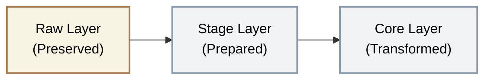

## Stage Layer

<Callout type="info">
**Mandatory Layer** — Stage is required in every architecture tier. It applies universal cleansing rules and tracks historical changes via SCD-2.
</Callout>

### Overview

Stage is where raw data is cleansed, standardised, and historised. It applies consistent technical rules across all sources, ensuring downstream layers work with predictable, well-typed data. Critically, Stage is where we track how source records change over time (SCD-2) - preserving the full change history before Core narrows the schema into business objects.

#### Key Principle

* Standardise the technical, preserve the business
* Stage fixes data types, normalises column names, and removes duplicates - but does not interpret what the data means
* Stage tracks historical changes (SCD-2) to source records so that no history is lost when Core models the data into business objects
* Business rules are applied in Core

#### What lives here

| Data Type | Examples |
|-----------|----------|
| Cleansed source data | Salesforce accounts with standardised column names |
| Deduplicated records | Latest version of each source record |
| Type-cast data | Dates as DATE, numbers as NUMBER, not strings |
| PII-masked data | Email addresses hashed, SSNs masked |
| Historical changes (SCD-2) | Previous and current versions of source records with valid-from/valid-to timestamps |

#### What happens here

- Data types enforced (string dates → DATE, string numbers → NUMBER)
- Column names standardised (snake_case, consistent naming)
- Duplicates removed (latest record per business key)
- PII masked or hashed (sensitive data protected before downstream)
- Universal cleansing applied (trimming, null handling, encoding fixes)
- Historical changes tracked via SCD-2 (valid-from, valid-to, is-current flag)
- Highly governed with clear documentation

#### What does NOT belong here

- Business calculations → Belongs in Core or Mart
- Entity unification (merging customers from multiple sources) → Belongs in Core
- Aggregations or summaries → Belongs in Mart
- Consumer-facing structures → Belongs in Data Product

#### Data Flow

**Schema Organization:** One schema per source system (mirrors Raw)

#### Input Source
- Raw layer only

#### Output Destination
- Data Mart layer if there is no Core layer
- Core layer (for business modelling)

#### Loading Strategy

| Aspect | Default (Incremental + SCD-2) | Fallback (Full Refresh) |
|--------|-----------------------|-------------------------|
| **Pattern** | Process only new/changed records from Raw using `__data_loaded_at` watermark. Detect changes via column comparison and apply SCD-2 history tracking | Truncate and reload from Raw |
| **When** | Default for all dimension and transactional tables where source records change over time | Reference/lookup tables (< 10K rows), or one-off backfill when cleansing rules change |
| **Why** | Cost-efficient at scale; preserves full change history at the source-level before Core narrows schema into business objects | Ensures no <Term>ghost records</Term>; applies latest cleansing rules to entire dataset |
| **Frequency** | Matches Raw cadence (daily, hourly, or event-driven) | On-demand when rules or schema evolve |
| **Idempotency** | Guaranteed via watermark - reprocessing a time window produces same output | Guaranteed - same Raw input always produces same Stage output |

#### Why SCD-2 at Stage, not Core?

Core models data into business objects - it joins sources, creates surrogate keys, and narrows the schema to what the business needs. This means **columns that don't make it into Core lose their history forever**. By tracking SCD-2 at Stage:

- **All source columns retain history**, even those that Core drops during business modelling
- **Core becomes simpler** - it can read the current snapshot from Stage (`__is_active_version = TRUE`) or the full history as needed, without managing its own SCD-2 logic
- **Core is optional** - for simpler projects that skip Core and go directly from Stage to Mart, SCD-2 history is still preserved
- **Debugging is easier** - when a business user asks "when did this customer's industry change?", the answer exists at Stage without needing to trace through Core's business entity model

#### SCD-2 Implementation

Every Stage table that tracks history includes these additional columns:

| Column | Type | Description |
|--------|------|-------------|
| `__effective_from` | `TIMESTAMP_TZ` | When this version of the record became active |
| `__effective_to` | `TIMESTAMP_TZ` | When this version was superseded (NULL if current) |
| `__is_active_version` | `BOOLEAN` | `TRUE` for the latest version of each record |

**How it works:**

1. New records from Raw (identified via `__data_loaded_at` watermark) are compared against the current Stage record for the same business key
2. If any tracked column has changed → close the existing record (`__effective_to` = now, `__is_active_version` = FALSE) and insert the new version (`__effective_from` = now, `__is_active_version` = TRUE)
3. If nothing changed → no action (avoid bloating Stage with identical versions)
4. If the record is new → insert with `__is_active_version` = TRUE

<Callout type="note">
**Not every table needs SCD-2.** Event/transaction tables (e.g., `orders`, `invoice_lines`) are naturally append-only - they don't change after creation. SCD-2 applies to dimension-like source tables where records are updated in place (e.g., `accounts`, `contacts`, `products`).
</Callout>

<Callout type="warning">
**Avoid the Full Refresh Forever anti-pattern.** Since Raw is append-only and grows indefinitely, a daily full refresh means reprocessing the entire history every run. Use incremental loading with a `__data_loaded_at` watermark as the default. Reserve full refresh for small reference tables and one-off backfills when cleansing rules change.
</Callout>

### Data Modelling

**Approach:** No business modelling. Source-aligned with technical standardisation and history tracking.

Stage tables maintain the same granularity and structure as source systems. We do not join tables, create surrogate keys, or apply business rules. The only changes are technical: data types, column names, deduplication, and SCD-2 history tracking for dimension-like tables.

| Aspect | Stage Layer Approach |
|--------|---------------------|
| Table structure | Mirrors source (one Stage table per Raw table) |
| Column names | Standardised to snake_case |
| Data types | Cast to appropriate warehouse types |
| Relationships | Not enforced; foreign keys not validated |
| Grain | Same as source; dimension-like tables may have multiple rows per business key (SCD-2 versions) |
| History | SCD-2 for dimension-like tables; append-only tables (events/transactions) pass through as-is |

### Naming Convention and Structure

#### Database & Schema Structure

<Callout type="info">
**Stage always mirrors Raw.** Whatever namespace order the client chose for Raw (System → Entity → Country, Entity → System, Country → System, etc.) is replicated exactly in Stage. This 1:1 mapping makes lineage trivial and debugging straightforward.
</Callout>

<SchemaOptionMatrix
  options={[
    {
      name: "Option 1",
      subtitle: "System only",
      tree: `stage/\n├── salesforce/\n│   ├── account\n│   ├── opportunity\n│   └── ...\n└── netsuite/\n    ├── customer\n    └── ...`
    },
    {
      name: "Option 2",
      subtitle: "System-first\n(system_entity_country)",
      tree: `stage/\n├── salesforce_acme_uk/\n│   ├── account\n│   └── ...\n├── salesforce_beta_de/\n│   └── ...\n├── netsuite_acme_uk/\n│   └── ...\n└── dynamics_beta_de/\n    └── ...`
    },
    {
      name: "Option 3",
      subtitle: "Entity/Country-first\n(entity_country_system)",
      tree: `stage/\n├── acme_uk_salesforce/\n│   ├── account\n│   └── ...\n├── acme_uk_netsuite/\n│   └── ...\n├── beta_de_salesforce/\n│   └── ...\n└── beta_de_dynamics/\n    └── ...`
    },
    {
      name: "Option 4",
      subtitle: "Compliance DB Separation",
      tree: `stage_uk/\n├── salesforce/\n│   └── ...\n└── netsuite/\n    └── ...\n\nstage_de/\n├── salesforce/\n│   └── ...\n└── sap_s4/\n    └── ...`
    }
  ]}
  factors={[
    {
      name: "When to Apply",
      description: "The client context that drives this namespace choice",
      ratings: [
        { rating: "green", label: "Default",            note: "Single entity, single country — start here unless told otherwise" },
        { rating: "amber", label: "System-centric org",  note: "Tech team manages by system; want all Salesforce data grouped regardless of entity/country" },
        { rating: "amber", label: "Domain-centric org",  note: "Business thinks by subsidiary or region first; M&A, multi-country, or both" },
        { rating: "red",   label: "Compliance only",     note: "GDPR / data residency laws require physical database isolation per country — not a default choice" }
      ]
    },
    {
      name: "Schema Count",
      description: "Number of schemas created and governance overhead",
      ratings: [
        { rating: "green", label: "Minimal",               note: "One schema per source system" },
        { rating: "amber", label: "Grows with complexity",  note: "N systems × M entities/countries — same count as Option 3" },
        { rating: "amber", label: "Grows with complexity",  note: "Identical count to Option 2 — ordering differs, not quantity" },
        { rating: "red",   label: "Highest",               note: "Multiple databases × schemas — most overhead to govern" }
      ]
    },
    {
      name: "Engineer Navigation",
      description: "How easily a data engineer finds all tables for a given source system",
      ratings: [
        { rating: "green", label: "Easy",     note: "System is the schema — instantly obvious where Salesforce data lives" },
        { rating: "green", label: "Easy",     note: "System is the first prefix — all salesforce_* schemas group together alphabetically" },
        { rating: "amber", label: "Moderate", note: "System is the last segment — must know entity/country prefix to locate schemas" },
        { rating: "amber", label: "Moderate", note: "Must know which database to query first before finding the schema" }
      ]
    },
    {
      name: "Business / Domain Navigation",
      description: "How easily a domain owner or analyst finds all tables for their entity or region",
      ratings: [
        { rating: "amber", label: "Moderate", note: "Must know which system holds the domain data — no entity/country grouping" },
        { rating: "amber", label: "Moderate", note: "Entity/country is a suffix — not immediately visible when browsing schemas" },
        { rating: "green", label: "Easy",     note: "Entity/country is the first prefix — all acme_* schemas group together" },
        { rating: "green", label: "Easy",     note: "Each database is a country — navigation is inherently country-first" }
      ]
    },
    {
      name: "Group-Level Analytics",
      description: "Ease of joining or aggregating data across all entities and countries for group-wide reporting",
      ratings: [
        { rating: "green", label: "Trivial",  note: "All data in one database — no federation needed" },
        { rating: "green", label: "Trivial",  note: "All data in one database — no federation needed" },
        { rating: "green", label: "Trivial",  note: "All data in one database — no federation needed" },
        { rating: "red",   label: "Hard",     note: "Cross-database federation required — group reporting is complex and costly" }
      ]
    },
    {
      name: "Setup Complexity",
      description: "Engineering effort to configure and maintain pipelines for this structure",
      ratings: [
        { rating: "green", label: "Low",      note: "Simplest — system name only, no routing logic needed" },
        { rating: "amber", label: "Moderate", note: "Pipelines must resolve and tag entity + country per load" },
        { rating: "amber", label: "Moderate", note: "Same routing logic as Option 2 — only the naming convention differs" },
        { rating: "red",   label: "High",     note: "Separate database targets per country — most complex to build and monitor" }
      ]
    }
  ]}
/>

#### Table Naming Convention

| Element | Convention | Example |
|---------|------------|---------|
| Database | `stage` (single database unless Raw uses per-country separation) | `stage`, `stage_uk`, `stage_de` |
| Schema | `snake_case`, mirrors Raw schema names exactly | `salesforce`, `salesforce_acme_uk`, `uk_netsuite` |
| Table | `snake_case`, matches source entity | `accounts`, `opportunities` |
| Columns | `snake_case`, standardised from source names | `account_id`, `created_date`, `annual_revenue` |

#### Column Naming Rules

| Source Format | Stage Format | Example |
|---------------|--------------|---------|
| PascalCase | snake_case | `AccountId` → `account_id` |
| Salesforce custom fields | Remove `__c` suffix | `Custom_Field__c` → `custom_field` |
| Spaces | Underscores | `First Name` → `first_name` |
| Special characters | Removed | `Amount ($)` → `amount` |
| Abbreviations | Expanded if ambiguous | `amt` → `amount` |

#### Required Metadata Columns

Stage retains key metadata from Raw and adds SCD-2 tracking columns:

| Column | Type | Description |
|--------|------|-------------|
| `__data_loaded_at` | `TIMESTAMP_TZ` | Inherited from Raw - original load time |
| `__source` | `VARCHAR` | Inherited from Raw - origin identifier |
| `__updated_at` | `TIMESTAMP_TZ` | When this Stage record was last refreshed |
| `__effective_from` | `TIMESTAMP_TZ` | When this version of the record became active (SCD-2) |
| `__effective_to` | `TIMESTAMP_TZ` | When this version was superseded; NULL if current (SCD-2) |
| `__is_active_version` | `BOOLEAN` | `TRUE` for the latest version of each record (SCD-2) |

<Callout type="note">
**SCD-2 columns are required for dimension-like tables** (e.g., accounts, contacts, products) where source records change over time. For event/transaction tables (e.g., orders, invoice lines) that are naturally append-only, SCD-2 columns are not needed.
</Callout>

### Data Quality Rules

Stage is where serious validation begins.

| Rule | Check | Action on Failure |
|------|-------|-------------------|
| **Primary key not null** | Business key is populated | Reject record, log |
| **Primary key unique** | No duplicate business keys after deduplication | Fail pipeline, alert |
| **Data type valid** | String dates parse correctly, numbers are numeric | Null value, log warning |
| **Required fields** | Critical fields are not null | Reject record or warn (configurable) |
| **PII masked** | Sensitive columns are hashed/masked | Fail pipeline, alert |
| **Referential integrity** | Foreign keys exist in related Stage tables | Warn, do not enforce |

#### Common Cleansing Rules

| Issue | Rule | Example |
|-------|------|---------|
| Leading/trailing whitespace | Trim | `"  John  "` → `"John"` |
| Empty strings | Convert to null | `""` → `NULL` |
| Invalid dates | Parse or null | `"31/02/2026"` → `NULL` |
| Numeric strings | Cast or null | `"1,234.56"` → `1234.56` |
| Encoding issues | Normalise to UTF-8 | `"Café"` → `"Café"` |
| Boolean variations | Standardise | `"Y"`, `"Yes"`, `"1"` → `TRUE` |

#### Testing Strategy

| Test Type | What We Check | When |
|-----------|---------------|------|
| **Uniqueness** | Primary key is unique | After each refresh |
| **Not null** | Required columns populated | After each refresh |
| **Referential integrity** | Foreign keys exist (warning only) | After each refresh |
| **PII compliance** | Sensitive columns are masked | After each refresh |
| **Row count** | Within expected range vs Raw | After each refresh |
| **Data type validity** | No casting failures | After each refresh |

### Security & Access

| Aspect | Standard |
|--------|----------|
| **Encryption** | At rest and in transit |
| **Access** | Data Engineers and pipelines |
| **PII status** | Masked in this layer-sensitive columns hashed/redacted |
| **Audit logging** | All queries logged |

#### PII Masking

**Critical Step:** Sensitive data is masked at Stage before flowing to downstream layers.

| Data Type | Masking Approach |
|-----------|------------------|
| Email addresses | SHA-256 hash or domain-only (`***@company.com`) |
| Phone numbers | Last 4 digits only (`***-***-1234`) |
| SSN / National ID | Full mask (`***-**-****`) |
| Names (if required) | First initial + last name or full mask |
| Addresses | City + country only |

#### Access Matrix & Consumers

| Role | Access Method | Read | Write | Delete | Use Case |
|------|---------------|------|-------|--------|----------|
| Transformation Pipeline (Service Account) | Direct SQL | ✓ | ✓ | ✓ | Pipeline orchestration and data loading |
| Core Layer Pipelines | Direct SQL | ✓ | ✗ | ✗ | Build business entities |
| Data Engineers | SQL client | ✓ | ✗ | ✗ | Debugging and quality investigation |
| Analytics Engineers | None | ✗ | ✗ | ✗ | Should use Core or Mart layers |
| BI Developers | None | ✗ | ✗ | ✗ | Should use Mart layer |
| Business Users | None | ✗ | ✗ | ✗ | Should use Mart layer |

### Example: Salesforce Accounts

#### Raw Data (as received)

| Column | Value | Issue |
|--------|-------|-------|
| Id | 001Dn00000ABC123 | - |
| Name | "  Acme Corporation  " | Leading/trailing spaces |
| AccountNumber | ACC-001234 | - |
| Industry | technology | Inconsistent case |
| AnnualRevenue | "5000000" | String, not number |
| CreatedDate | "2024-03-15T10:30:00.000Z" | String, not timestamp |
| Email__c | john@acme.com | PII - needs masking |

#### Stage Data (cleansed, with SCD-2)

Suppose the account's industry changed from "Technology" to "Software" on 2026-02-10. Stage retains both versions:

| account_id | account_name | industry | annual_revenue | email_hash | __effective_from | __effective_to | __is_active_version |
|------------|-------------|----------|---------------|------------|-------------|-----------|-------------|
| 001Dn00000ABC123 | Acme Corporation | Technology | 5000000 | a1b2c3... | 2026-01-15 07:15:00 | 2026-02-10 06:30:00 | FALSE |
| 001Dn00000ABC123 | Acme Corporation | Software | 5000000 | a1b2c3... | 2026-02-10 06:30:00 | NULL | TRUE |

| Column | Transformation Applied |
|--------|------------------------|
| account_id | Renamed from `Id` |
| account_name | Trimmed, renamed from `Name` |
| industry | Title case standardised |
| annual_revenue | Cast to NUMBER |
| email_hash | SHA-256 hash (PII masked) |
| __effective_from | Set when this version became active |
| __effective_to | Set when superseded; NULL if current |
| __is_active_version | TRUE for latest version |

### Dos and Don'ts

<DosAndDonts
  dos={[
    { text: "Standardise column names to snake_case" },
    { text: "Cast data types explicitly" },
    { text: "Remove duplicates using ROW_NUMBER()" },
    { text: "Mask PII before data flows downstream" },
    { text: "Apply universal cleansing rules consistently" },
    { text: "Track historical changes via SCD-2 for dimension-like tables" },
    { text: "Document transformation logic clearly" }
  ]}
  donts={[
    { text: "Apply business logic (calculations, categorisations)" },
    { text: "Join tables across sources (that's Core)" },
    { text: "Create surrogate keys (that's Core)" },
    { text: "Aggregate or summarise data" },
    { text: "Allow business users to access Stage" },
    { text: "Skip PII masking \"because it's internal\"" },
    { text: "Apply SCD-2 to event/transaction tables that are naturally append-only" }
  ]}
/>

### Anti-Patterns

<AntiPatterns
  patterns={[
    {
      title: "The Business Logic Creep",
      problem: "Engineer adds \"just one calculation\" to Stage-converting currency or categorising status codes. Over time, Stage becomes a mix of technical and business logic, making it unclear what's source data vs interpretation.",
      example: "A team added customer segmentation logic to Stage. When the business rules changed, they had to update Stage models instead of Core, breaking the principle that Stage is source-aligned. Debugging required understanding both source schemas AND business rules at Stage.",
      prevention: "Stage does technical cleansing only. If you're asking \"what does this data mean?\"-that logic belongs in Core."
    },
    {
      title: "The PII Leak",
      problem: "Team skips PII masking in Stage because \"only engineers access it.\" An engineer accidentally exposes Stage data in a debugging session, or the data flows unmasked to a sandbox environment accessed by contractors.",
      example: "A client's Stage tables contained unmasked email addresses. During a demo to a potential vendor, the engineer queried Stage to show pipeline architecture. Customer email addresses were visible on screen, violating GDPR and NDA commitments.",
      prevention: "Mask PII at Stage, no exceptions. If engineers need to debug with real PII, use a separate, access-controlled Raw layer with explicit justification."
    },
    {
      title: "The Incomplete Deduplication",
      problem: "Deduplication logic doesn't account for all edge cases. Deleted records remain, or multiple versions of the same record pass through.",
      example: "A team deduplicated by `Id` but didn't filter soft-deleted records. The Stage table had 15% more accounts than expected because deleted accounts were included. Downstream reporting showed churned customers as active.",
      prevention: "Always filter `__is_deleted` (or equivalent) before deduplication. Validate row counts against expected business numbers."
    },
    {
      title: "The Full Table Scan",
      problem: "Stage model scans the entire Raw table on every refresh, even though only a small portion of data changed.",
      example: "A client's Raw table had 500M rows. Stage refreshed by scanning all 500M rows daily, taking 4 hours and consuming significant compute credits. The actual daily change was less than 100K rows.",
      prevention: "For large tables, consider incremental Stage models that process only recent Raw partitions. But validate that the added complexity is justified by genuine cost/time savings."
    }
  ]}
/>