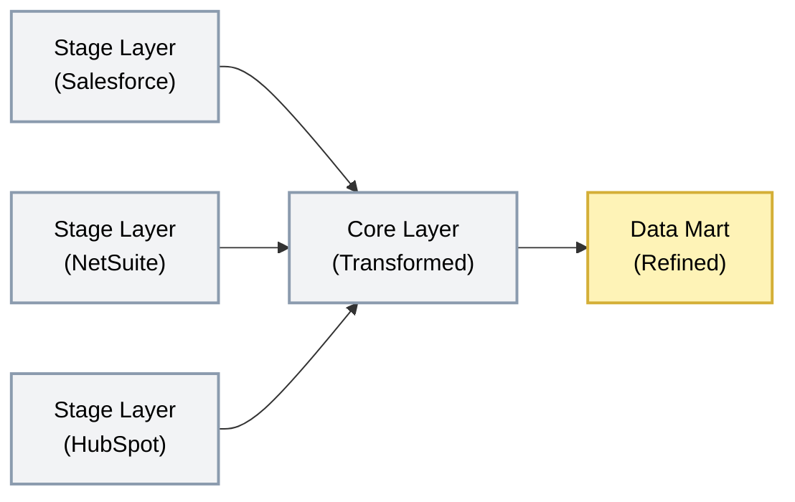

## Core

<Callout type="warning">
**Optional Layer** — Only needed for M&A clients or when integrating 3+ source systems with overlapping business entities. Not required for simple single-system projects.
</Callout>

<Callout type="info">
  **Business Truth, Not Source Truth** - Core models the business, not the source systems. A "Customer" in Core is defined by business rules, not by how Salesforce or NetSuite happens to structure their data.
</Callout>

### Purpose

Core is where disparate source data becomes unified business entities. It integrates data from multiple sources into a single, consistent model that represents how the business actually operates-not how individual systems store data.

#### Key Principle

* Model the business, not the system
* If the CRM changes, Core remains stable because it represents business concepts (Customer, Order, Product), not source system structures

#### What lives here

| Data Type | Examples |
|-----------|----------|
| Unified business entities | `customer` (merged from CRM + ERP + Support) |
| Enterprise reference data | `product`, `geography`, `currency` |
| Normalised transactional data | `order`, `order_line`, `invoice`, `invoice_line` |
| Full historical state | <Term>SCD-2</Term> history for all entity changes |
| Cross-system relationships | Customer ↔ Order ↔ Product linkages |

#### What happens here

- Multiple source systems unified into single entities
- Business rules and complex transformations applied
- Surrogate keys generated (independent of source IDs)
- <Term>SCD-2</Term> history maintained for dimension changes
- Referential integrity enforced
- Data enriched with third-party or reference datasets
- Lineage metadata tracked (which sources contributed)

#### What does NOT belong here

- Source-aligned tables → Belongs in Stage
- Pre-aggregated metrics → Belongs in Mart
- Consumer-ready flat tables → Belongs in Data Product
- Denormalised reporting structures → Belongs in Mart

#### Data Flow

**Schema Organization:** Entity-aligned schemas (customer, order, product)

#### Input Sources
- Stage layer (all source systems)
- Reference data (internal or third-party)
- Enrichment feeds (demographics, firmographics)

#### Output Destination
- Data Mart (for reporting)

#### Loading Strategy

| Aspect | Approach |
|--------|----------|
| **Pattern** | Upsert (Merge) |
| **Why** | Core tables are too large to reload daily; upsert touches only changed records |
| **History** | <Term>SCD-2</Term> for dimensions (tracks all changes over time) |
| **Efficiency** | Uses business keys to match; updates existing, inserts new |

### Naming Convention and Structure

#### Database & Schema Structure

<SchemaOptionMatrix
  options={[
    {
      name: "Option 1",
      subtitle: "By Source Entity",
      tree: `core/\n├── entity_1/\n│   ├── customer\n│   └── product\n├── entity_2/\n│   ├── customer\n│   └── product\n└── entities/\n    ├── customer\n    └── product`
    },
    {
      name: "Option 2",
      subtitle: "By Entity Type",
      tree: `core/\n├── customer/\n│   ├── entity1_customer\n│   └── entity2_customer\n├── product/\n│   ├── entity1_product\n│   └── entity2_product\n└── entities/\n    ├── customer\n    └── product`
    },
    {
      name: "Option 3",
      subtitle: "Flat Pre-Core",
      tree: `core/\n├── pre_core/\n│   ├── entity1_customer\n│   ├── entity1_product\n│   ├── entity2_customer\n│   └── entity2_product\n└── entities/\n    ├── customer\n    └── product`
    }
  ]}
  factors={[
    {
      name: "Entity-level Data Access",
      description: "How easy is it for engineers to query a specific entity's data?",
      ratings: [
        { rating: "green", label: "Easy", note: "One schema per entity — obvious where to look" },
        { rating: "red",   label: "Hard", note: "Entities split across entity-type schemas" },
        { rating: "red",   label: "Hard", note: "All pre-core mixed in one flat schema" }
      ]
    },
    {
      name: "Number of Schemas",
      description: "Total schema count as entities and source systems grow",
      ratings: [
        { rating: "red",   label: "Grows with entities", note: "N schemas per acquired entity" },
        { rating: "amber", label: "Moderate",            note: "One schema per entity type" },
        { rating: "green", label: "Very few",            note: "pre_core + entities only" }
      ]
    },
    {
      name: "Development Easiness",
      description: "Effort to build, extend, and onboard new engineers",
      ratings: [
        { rating: "green", label: "Easy",     note: "Natural grouping mirrors the source" },
        { rating: "amber", label: "Moderate", note: "Requires understanding entity-type taxonomy" },
        { rating: "green", label: "Easy",     note: "Flat pre_core is simple to navigate" }
      ]
    },
    {
      name: "Scalability",
      description: "How well the structure handles adding new entities or source systems",
      ratings: [
        { rating: "green",   label: "High",      note: "New entity = new schema proliferation" },
        { rating: "amber", label: "Moderate", note: "New entity adds tables to existing schemas" },
        { rating: "red", label: "Low",     note: "pre_core absorbs additions with no restructure" }
      ]
    }
  ]}
/>

#### Table Naming Convention

| Element | Convention | Example |
|---------|------------|---------|
| Database | `core` | `core` |
| Schema | Plural, by domain or function | `entities`, `links`, `references`, `sales`, `finance` |
| Entity tables | `{entity}` (no prefix) | `customer`, `product`, `order` |
| Link tables | `lnk_{entity_a}_{entity_b}` | `lnk_customer_account`, `lnk_order_line` |
| Reference tables | `ref_{domain}` | `ref_currency`, `ref_country` |
| Surrogate key | `{entity}_key` | `customer_key`, `product_key` |
| Natural key | `{entity}_id` | `customer_id`, `product_id` |

<Callout type="warning">
  **No dim_ or fct_ prefixes in Core.** These prefixes are reserved for Data Mart's dimensional model. Core models business entities in normalised form (3NF or Data Vault), not star schemas.
</Callout>

#### <Term>SCD-2</Term> Standard Columns

Every dimension table includes:

| Column | Type | Description |
|--------|------|-------------|
| `{entity}_key` | `INTEGER` or `VARCHAR(32)` | Surrogate key (primary) |
| `{entity}_id` | `VARCHAR` | Natural business key |
| `__effective_from` | `DATE` | When this version became active |
| `__effective_to` | `DATE` | When superseded (NULL if current) |
| `__is_active_version` | `BOOLEAN` | TRUE for active version |
| `__record_hash` | `VARCHAR(32)` | Hash of tracked columns |

### Data Modelling

**Approach:** 3NF or Data Vault 2.0 - Entity-aligned, normalised, models the business.

Core uses normalised structures to reduce redundancy and establish the single source of truth for business entities. This is fundamentally different from Data Mart's dimensional model.

| Aspect | Core Layer Approach |
|--------|---------------------|
| Structure | Normalised (3NF) or Data Vault (Hubs, Links, Satellites) |
| Grain | One row per business entity (or per entity version for <Term>SCD-2</Term>) |
| Redundancy | Minimised through normalisation |
| Surrogate keys | Always generated; independent of source IDs |
| History | <Term>SCD-2</Term> for entity changes |
| Relationships | Explicitly modelled via foreign keys or link tables |
| Prefixes | None-tables named by entity (`customer`, not `dim_customer`) |

### Core vs Data Mart Modelling

| Aspect | Core | Data Mart |
|--------|------|-----------|
| Model type | 3NF / Data Vault | Dimensional (Star Schema) |
| Table naming | Entity name (`customer`, `order`) | Prefixed (`dim_customer`, `fct_sales`) |
| Normalisation | Normalised | Denormalised |
| Optimised for | Data integrity, flexibility | Query performance, BI tools |
| Redundancy | Avoided | Accepted for performance |

<Callout type="note">
  **3NF vs Data Vault** - See the [Data Modelling](/data-engineering/handbook/transformation/data-modelling) section for guidance on when to use each approach. Core supports both patterns.
</Callout>

### Data Quality Rules

| Rule | Check | Action on Failure |
|------|-------|-------------------|
| **Surrogate key unique** | `{entity}_key` has no duplicates | Fail pipeline |
| **Single current record** | Only one `__is_active_version = TRUE` per business key | Fail pipeline |
| **Referential integrity** | Foreign keys exist in related entities | Warn, create "Unknown" record |
| **Date validity** | `effective_from <= effective_to` | Fail record |
| **No orphan records** | All entity keys resolved | Warn, log orphans |

### Testing Strategy

| Test Type | What We Check | When |
|-----------|---------------|------|
| **Surrogate key unique** | No duplicate keys | After each run |
| **<Term>SCD-2</Term> integrity** | Single current record per business key | After each run |
| **Referential integrity** | Fact keys exist in dimensions | After each run |
| **Entity matching** | Match rates within expected range | After each run |
| **Row count trends** | Growth within expected bounds | Daily |

### Security & Access

| Aspect | Standard |
|--------|----------|
| **Encryption** | At rest and in transit |
| **Access** | Analytics Engineers, Data Scientists |
| **Row-Level Security** | Applied by region, business unit, or tenant |
| **PII status** | Masked (inherited from Stage) |

#### Access Matrix & Consumers

| Role | Access Method | Read | Write | Delete | Use Case |
|------|---------------|------|-------|--------|----------|
| Core Pipeline (Service Account) | Direct SQL | ✓ | ✓ | ✓ | Pipeline orchestration and data loading |
| Analytics Engineers | SQL client | ✓ | ✗ | ✗ | Create new marts and investigate data |
| Data Scientists | SQL client | ✓ | ✗ | ✗ | Feature engineering and ML training |
| Data Mart Pipelines | Direct SQL | ✓ | ✗ | ✗ | Build star schemas for reporting |
| BI Developers | None | ✗ | ✗ | ✗ | Should use Mart layer instead |
| Business Users | None | ✗ | ✗ | ✗ | Should use Mart layer instead |

### Example: Unified Customer Dimension

#### Source Data (Stage)

**Salesforce:**
| account_id | account_name | industry | country |
|------------|--------------|----------|---------|
| SF-001 | Acme Corp | Technology | UK |

**NetSuite:**
| customer_id | company_name | segment | billing_country |
|-------------|--------------|---------|-----------------|
| NS-1234 | Acme Corporation | Enterprise | United Kingdom |

### Core Output (customer)

| customer_key | customer_id | customer_name | industry | segment | country | source_systems | __effective_from | __effective_to | __is_active_version |
|--------------|-------------|---------------|----------|---------|---------|----------------|----------------|--------------|------------|
| abc123hash | CUST-001 | Acme Corporation | Technology | Enterprise | United Kingdom | salesforce,netsuite | 2024-01-15 | NULL | TRUE |

### Dos and Don'ts

<DosAndDonts
  dos={[
    { text: "Generate surrogate keys for all entities" },
    { text: "Implement SCD-2 for dimension history" },
    { text: "Enforce referential integrity" },
    { text: "Document entity matching rules" },
    { text: "Normalise to reduce redundancy" },
    { text: "Track source system lineage" }
  ]}
  donts={[
    { text: "Denormalise for reporting (that's Mart)" },
    { text: "Skip surrogate keys (source IDs change)" },
    { text: "Allow direct business user access" },
    { text: "Store aggregations (that's Mart)" },
    { text: "Mix source-aligned and entity-aligned tables" }
  ]}
/>

### Anti-Patterns

<AntiPatterns
  patterns={[
    {
      title: "The Source-System Mimic",
      problem: "Core tables mirror Stage structure instead of modelling business entities. `core.salesforce.accounts` instead of `core.entities.customer`.",
      example: "A team created Core as a copy of Stage with minor joins. When the client acquired a company using HubSpot, they had no unified customer entity-just three separate \"customer\" tables that analysts had to manually reconcile.",
      prevention: "Core models business entities, not source systems. If you're naming tables by source system in Core, you're doing it wrong."
    },
    {
      title: "The Missing History",
      problem: "Team uses SCD-1 (overwrite) instead of SCD-2, losing historical state. When asked \"who was this customer's account manager last quarter?\", the data doesn't exist.",
      example: "Sales commission disputes arose because historical territory assignments were overwritten. Finance couldn't determine which rep owned the account when the deal closed.",
      prevention: "Default to SCD-2 for all dimensions. The storage cost is minimal; the audit value is immense."
    },
    {
      title: "The Orphan Epidemic",
      problem: "Fact tables reference dimension keys that don't exist. Reports show \"Unknown\" for 30% of records.",
      example: "A retail client's order facts referenced product keys before the product dimension was fully loaded. 40% of orders showed \"Unknown Product\" in reports, making inventory analysis useless.",
      prevention: "Enforce referential integrity. Create \"Unknown\" dimension records proactively. Alert when orphan rates exceed thresholds (e.g., >1%)."
    }
  ]}
/>