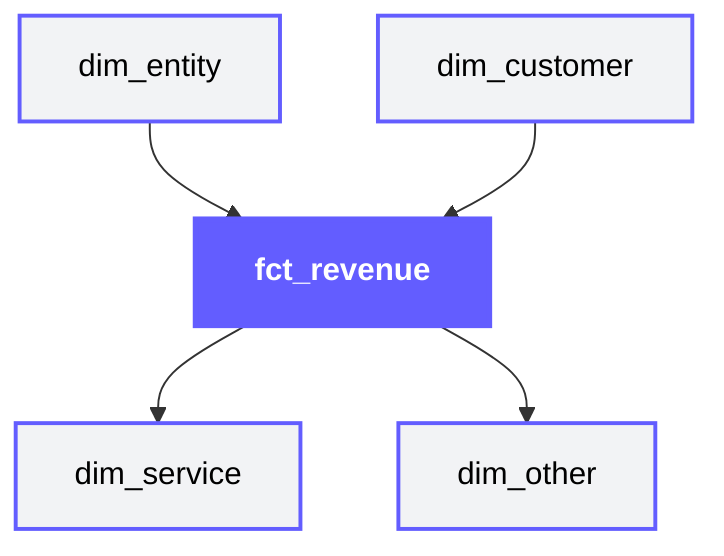
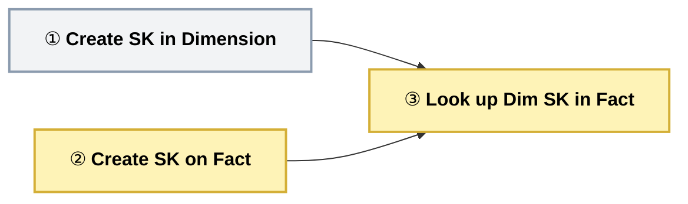

## Data Mart

<Callout type="info">
**Mandatory Layer** — Data Mart is required in every architecture tier. It is the single source of truth for enterprise reporting.
</Callout>

### Purpose

Data Mart is the single source of truth for enterprise reporting. It transforms normalised Core data into denormalised star schemas optimised for BI tools like Power BI, Tableau, and Looker.

#### Key Principle

* Optimised for questions, not storage
* Data Mart prioritises query performance and analyst usability over storage efficiency
* Redundancy is acceptable if it makes reports faster

#### What lives here

| Data Type | Examples |
|-----------|----------|
| Star schema dimensions | `dim_customer`, `dim_product`, `dim_date` |
| Star schema facts | `fct_sales`, `fct_orders`, `fct_support_tickets` |
| Aggregate tables | `agg_sales_monthly`, `agg_customer_lifetime` |
| Snapshot tables | `snap_inventory_daily`, `snap_pipeline_weekly` |
| Metric definitions | Consistent KPI calculations |

#### What happens here

- Core entities denormalised into star schemas
- Dimensions flattened for BI tool compatibility
- Facts pre-joined with common dimensions
- Aggregations pre-computed for performance
- Point-in-time snapshots captured
- Consistent metric calculations applied
- Optimised for read-heavy analytical queries

#### What does NOT belong here

- Raw or source-aligned data → Belongs in Stage
- Normalised entity models → Belongs in Core
- External API feeds → Belongs in Data Product
- One-off analysis tables → Use scratch schemas

#### Data Flow


**Schema Organization:** Domain-specific schemas (sales, finance, ops)

#### Input Sources
- Core layer (dimensions and facts)
- Reference data (calendars, hierarchies)

#### Output Destination
- BI tools (Power BI, Tableau, Looker)
- Ad-hoc analysis (SQL clients)
- Data Products (for further transformation)

#### Loading Strategy

| Aspect | Approach |
|--------|----------|
| **Dimensions** | SCD-2 (track historical changes via `__effective_from` / `__effective_to`) |
| **Facts** | Incremental append (new periods only) |
| **Aggregates** | Full refresh or incremental by period |
| **Snapshots** | Append (one record per snapshot period) |


### Data Modelling

**Approach:** Dimensional Modelling (Star Schema) - Consumer-aligned, optimised for questions.

| Aspect | Data Mart Approach |
|--------|-------------------|
| Structure | Star schema (facts + dimensions) |
| Normalisation | Denormalised for query performance |
| Grain | One row per measurable event |
| Dimensions | Flattened (no snowflaking unless necessary) |
| Metrics | Pre-calculated in fact tables |

#### Core to Mart Transformation

| Core Entity | Mart Table | Transformation |
|-------------|------------|----------------|
| `customer` | `dim_customer` | Flatten hierarchy, add derived attributes |
| `product` | `dim_product` | Flatten categories, add current pricing |
| `order` + `order_line` | `fct_sales` | Denormalise, pre-compute metrics |
| `calendar` (reference) | `dim_date` | Expand with fiscal periods, holidays |

<Callout type="info">
  **Prefixes start here.** Core uses entity names (`customer`, `order`). Mart introduces `dim_` and `fct_` prefixes to signal dimensional modelling and make the star schema explicit to BI developers.
</Callout>

#### Star Schema Principles

1. **Facts contain measurements** - Numbers you aggregate (revenue, quantity, count)
2. **Dimensions contain context** - Attributes you filter/group by (customer name, product category)
3. **Grain is explicit** - Document what one row represents
4. **Conformed dimensions** - Same `dim_customer` across all facts


### Naming Convention and Structure

#### Database & Schema Structure

Choose the structure that best fits your platform and consumption patterns.

<SchemaOptionMatrix
  options={[
    {
      name: "Option 1",
      subtitle: "Data Mart + Product / Domain",
      tree: `data_mart/\n├── data_mart/\n│   ├── dim_customer\n│   ├── dim_product\n│   └── fct_revenue\n├── snapshot/\n│   ├── snap_inventory_daily\n│   └── snap_account_monthly\n├── aggregate/\n│   ├── agg_sales_monthly\n│   └── agg_revenue_weekly\n├── product_snowball/\n│   ├── prd_revenue\n│   └── prd_mrr\n└── product_utilisation/`
    },
    {
      name: "Option 2",
      subtitle: "Data Mart Only",
      tree: `data_mart/\n├── data_mart/\n│   ├── dim_customer\n│   ├── dim_product\n│   └── fct_revenue\n├── snapshot/\n│   ├── snap_inventory_daily\n│   └── snap_account_monthly\n└── aggregate/\n    ├── agg_sales_monthly\n    └── agg_revenue_weekly`
    }
  ]}
  factors={[
    {
      name: "Consumer Query Complexity",
      description: "How much SQL knowledge a consumer needs to get value from this layer",
      ratings: [
        { rating: "green", label: "Low",    note: "Pre-joined product tables — zero-join consumption" },
        { rating: "red",   label: "High",   note: "Consumers must write star-schema joins themselves" }
      ]
    },
    {
      name: "Number of Schemas",
      description: "Total schema count and governance overhead",
      ratings: [
        { rating: "amber", label: "Moderate", note: "Additional domain/product schemas per use case" },
        { rating: "green", label: "Minimal",  note: "data_mart + snapshot + aggregate only" }
      ]
    },
    {
      name: "BI Tool Compatibility",
      description: "How well the structure integrates with Power BI, Tableau, Looker",
      ratings: [
        { rating: "green", label: "Native",  note: "data_mart schema still provides full star schema" },
        { rating: "green", label: "Native",  note: "Star schema is the standard BI model" }
      ]
    },
    {
      name: "Self-Serve Capability",
      description: "How easily business users can query without analyst support",
      ratings: [
        { rating: "green", label: "High",  note: "Product tables are flat and self-contained" },
        { rating: "red",   label: "Low",   note: "Requires join knowledge or BI intermediary" }
      ]
    }
  ]}
/>

#### Table Naming Convention

| Element | Convention | Example |
|---------|------------|---------|
| Mart catalog | `<env>_mart` | `dev_mart`, `prod_mart` |
| Product catalog | `<env>_product` (Option 1 only) | `dev_product`, `prod_product` |
| Schema | Domain name or `data_mart` | `sales`, `finance`, `data_mart` |
| Dimension | `dim_{entity}` | `dim_customer`, `dim_product` |
| Fact | `fct_{event}` | `fct_sales`, `fct_orders` |
| Aggregate | `agg_{entity}_{grain}` | `agg_sales_monthly` |
| Snapshot | `snap_{entity}_{frequency}` | `snap_inventory_daily` |
| Product table | `prd_{description}` (Option 1 only) | `prd_sales_overview` |
| Metrics | `metric_{name}` or embedded in fact | `total_revenue`, `units_sold` |

### Star Schema Structure

Each domain has a central fact table surrounded by dimension tables:



#### Example: Sales Star Schema


### Surrogate Keys

Surrogate keys are system-generated identifiers that replace natural business keys in the dimensional model. Every dimension and fact table in Mart must use surrogate keys — but how and where they are generated matters enormously.



#### Generating Surrogate Keys in Dimensions

<Callout type="warning">
  **Generate surrogate keys in one place only — the dimension.** The dimension is the single source of truth for its own surrogate key. Any table that needs to reference a dimension entity must obtain the surrogate key by joining to that dimension, never by re-generating it independently.
</Callout>

The surrogate key for a dimension is computed once, inside the dimension model, using a deterministic hash of the natural business key:

```sql
-- dim_customer: surrogate key generated here and ONLY here
SELECT
    MD5(customer_id)          AS customer_sk,   -- generated once, in the dimension
    customer_id,                                 -- natural business key retained
    customer_name,
    segment,
    valid_from,
    valid_to
FROM core.entities.customer
```

This means:
- `dim_customer.customer_sk` is the **only** authoritative source of `customer_sk`
- No other model should call `MD5(customer_id)` to derive `customer_sk` independently
- Fact tables receive `customer_sk` via a **join to the dimension**, not by recomputing it

**Why this breaks when teams re-generate keys on the fact:**

A common mistake is for the fact pipeline to generate the surrogate key directly rather than looking it up:

```sql
-- ❌ WRONG — fact table re-derives the surrogate key independently
SELECT
    MD5(f.customer_id)  AS customer_sk,   -- duplicates dim logic; breaks if dim uses different hash
    f.order_id,
    f.order_date,
    f.revenue
FROM stage.orders AS f
```

This creates silent inconsistency. If the dimension ever changes its hashing approach, casing, or trims leading/trailing whitespace, the fact's independently-computed key will no longer match the dimension — referential integrity breaks and records are silently lost in BI joins. Even if both use the same `MD5` today, they are two separate implementations that can diverge over time.

#### Surrogate Keys on Fact Tables

Fact tables need their own surrogate key — a single-column primary key that uniquely identifies each row in the fact table itself. This is separate from the foreign key surrogate keys that the fact looks up from dimensions.

Transaction tables often have no single natural primary key. Their grain is defined by a combination of dimensions (e.g. one row per order line = `order_id + product_id`), but that composite key is awkward to use as a join target, hard to index efficiently, and fragile if the grain ever changes.

The solution is to generate a dedicated fact surrogate key:

```sql
-- fct_sales: fact table with its own surrogate key
SELECT
    MD5(CONCAT(f.order_id, '-', f.product_id))  AS fct_sales_sk,   -- fact's own PK
    d_customer.customer_sk,                                          -- FK from dim_customer
    d_product.product_sk,                                            -- FK from dim_product
    d_date.date_sk,                                                  -- FK from dim_date
    f.order_id,                                                      -- degenerate dimension
    f.order_line,                                                    -- degenerate dimension
    f.revenue,
    f.quantity
FROM stage.orders AS f
INNER JOIN mart.sales.dim_customer AS d_customer
    ON  f.customer_id  = d_customer.customer_id
    AND f.order_date  >= d_customer.valid_from
    AND f.order_date   < COALESCE(d_customer.valid_to, '9999-12-31')
INNER JOIN mart.sales.dim_product AS d_product
    ON f.product_id = d_product.product_id
INNER JOIN mart.sales.dim_date AS d_date
    ON f.order_date = d_date.date_day
```

**Key points:**

- `fct_sales_sk` is the fact table's own primary key — it uniquely identifies a row within `fct_sales`
- It is generated from the **natural grain columns** of the fact (the fields that together make a row unique), hashed into a single key
- It is **not** a lookup from any dimension — the fact owns this key
- Foreign keys (`customer_sk`, `product_sk`, `date_sk`) are still looked up from their respective dimensions as described below
- Degenerate dimensions (`order_id`, `order_line`) are the source system identifiers that have no dimension of their own — they live directly on the fact

<Callout type="note">
  **Degenerate dimensions** are source system keys (like `order_id`) that don't have a corresponding dimension table. They are retained on the fact for traceability and drill-through — e.g. linking a BI report row back to the originating order in the source system.
</Callout>

| Key Type | Lives On | Generated By | Purpose |
|----------|----------|--------------|---------|
| `fct_sales_sk` | Fact table | Fact model (hash of grain columns) | Primary key of the fact row |
| `customer_sk` | Fact table (FK) | `dim_customer` — looked up via join | Links fact to the correct dimension version |
| `order_id` | Fact table | Source system — carried through as-is | Degenerate dimension for traceability |

#### Surrogate Key Lookup in Facts — Join to Dimension

Once surrogate keys live exclusively in dimensions, fact tables obtain them via a **lookup join**. For SCD-2 dimensions, the join must include the validity window so the fact resolves to the dimension version that was active at the time of the event.

```sql
-- ✅ CORRECT — fact obtains customer_sk by joining to the dimension
SELECT
    f.order_id,
    f.order_date,
    d.customer_sk,            -- surrogate key from dim, not recomputed
    d.customer_name,          -- point-in-time attribute
    d.segment,                -- attribute as-of the order date
    f.revenue,
    f.quantity
FROM stage.orders AS f
INNER JOIN mart.sales.dim_customer AS d
    ON  f.customer_id   = d.customer_id                          -- natural key match
    AND f.order_date   >= d.valid_from                           -- event within validity window
    AND f.order_date    < COALESCE(d.valid_to, '9999-12-31')     -- open-ended current record
```

For dimensions without SCD-2 (no history tracking), the join is a simple equality:

```sql
-- SCD-1 dimension — no validity window needed
INNER JOIN mart.sales.dim_product AS p
    ON f.product_id = p.product_id
```

**Why `INNER JOIN` and not `LEFT JOIN`:**

Use `INNER JOIN` deliberately. If a fact row has no matching dimension record, an `INNER JOIN` surfaces the problem immediately (row dropped, pipeline count mismatch detectable). A `LEFT JOIN` silently produces `NULL` surrogate keys that corrupt BI reports. Orphan records should be resolved upstream — not papered over with `LEFT JOIN`.

| Approach | Result |
|----------|--------|
| Join to dimension (correct) | Surrogate key is authoritative. Point-in-time attributes resolved correctly. Referential integrity intact. |
| Re-generate key on fact (wrong) | Two independent implementations — drift over time. Breaks joins silently. |
| Use business key directly (wrong) | Always joins to the latest dimension version. Historical attributes incorrect for past transactions. |
| `LEFT JOIN` to dimension (wrong) | Orphan keys become `NULL`. Reports show blank dimensions. Problem hidden until business notices. |

<Callout type="info">
  **Late-arriving facts** are handled correctly by the validity window join — the fact resolves to whichever dimension version was active at the event date, regardless of when the fact was loaded. This is the core advantage of SCD-2 over SCD-1.
</Callout>

### Column Ordinality

Column order in a dimension or fact table is not cosmetic — it is documentation. When a engineers opens a table in a data catalogue, SQL client, or BI tool, the column sequence should tell a story: *what is this row, what does it belong to, what happened, and when?*

A consistent column order across every Mart table means any developer can orient themselves in an unfamiliar table within seconds — without reading a data dictionary.

<Callout type="info">
  **Column order is a contract.** Analysts and BI developers scan column lists constantly. When the sequence is predictable — own key first, natural key second, foreign keys third, payload fourth, metadata last — they instantly know where to look. Break the pattern and they must read every column label just to find the primary key.
</Callout>

#### The Standard Column Order

| Position | Column Type | Examples | Why it comes here |
|----------|-------------|----------|-------------------|
| **1** | Own surrogate key | `customer_key`, `sales_key` | First question: *what uniquely identifies this row?* |
| **2** | Natural / business key | `customer_id`, `order_id` | Second question: *what real-world thing does this row represent?* |
| **3** | Related surrogate keys (FKs) | `product_key`, `date_key`, `region_key` | Third question: *what context surrounds this row?* — the dimensional joins |
| **4** | Descriptive / measure columns | `customer_name`, `revenue`, `quantity` | Fourth: the payload — attributes or metrics that answer the business question |
| **5** | SCD-2 / metadata columns | `__effective_from`, `__effective_to`, `__is_active_version`, `__loaded_at` | Last: audit trail — when was this version valid and when was it loaded |

#### Why This Order Tells a Story

Think of each row as a sentence. For `dim_customer`:

> *"I am `customer_key = abc123` **[1 — own key]**, the record for `customer_id = C-00842` **[2 — natural key]**, operating in region `region_key = r9` **[3 — FK context]**, named Acme Corp, UK enterprise segment **[4 — descriptive payload]**, valid from 2023-01-15 to present **[5 — SCD-2 metadata]**."*

The column list itself reads like an introduction — identity first, context second, details third, history last:

```
customer_key           ← who is this row?
customer_id            ← what real-world entity?
region_key             ← what cluster/region do they belong to?
segment_key            ← what segment?
customer_name          ← descriptive payload starts here
email_domain
country
__effective_from       ← SCD-2 validity window
__effective_to
__is_active_version
__loaded_at            ← pipeline audit trail
```

Without this discipline, Engineers have to hunt for the primary key, piece together which columns are FKs, and guess where the metadata lives. With it, every table has the same grammar.

#### Applying It in SQL / dbt

Column order is established in the `SELECT` list — the order of columns in a `SELECT` statement is the order in the output table. Use section comments to make the intent explicit.

```sql
-- ✅ CORRECT — column order tells the story
SELECT
    -- 1. Own surrogate key
    MD5(customer_id)                                AS customer_key,

    -- 2. Natural / business key
    customer_id,

    -- 3. Related surrogate keys (FKs to other dimensions)
    r.region_key,
    s.segment_key,

    -- 4. Descriptive attributes
    customer_name,
    email_domain,
    country,
    annual_revenue_band,

    -- 5. SCD-2 metadata
    valid_from                                      AS __effective_from,
    COALESCE(valid_to, '9999-12-31')                AS __effective_to,
    CASE WHEN valid_to IS NULL THEN TRUE
         ELSE FALSE END                             AS __is_active_version,
    CURRENT_TIMESTAMP                               AS __loaded_at

FROM core.entities.customer AS c
LEFT JOIN mart.ref.dim_region  AS r ON c.region_code  = r.region_code
LEFT JOIN mart.ref.dim_segment AS s ON c.segment_code = s.segment_code
```

```sql
-- ❌ WRONG — no narrative; Engineers must hunt for every key
SELECT
    CURRENT_TIMESTAMP                               AS __loaded_at,
    customer_name,
    MD5(customer_id)                                AS customer_key,
    country,
    valid_from,
    customer_id,
    r.region_key,
    email_domain,
    valid_to,
    annual_revenue_band,
    s.segment_key
FROM core.entities.customer AS c
LEFT JOIN mart.ref.dim_region  AS r ON c.region_code  = r.region_code
LEFT JOIN mart.ref.dim_segment AS s ON c.segment_code = s.segment_code
```

The wrong version contains identical data — the difference is purely structural, but the cognitive load on every future reader is significantly higher.

#### The Same Pattern on Fact Tables

The same narrative applies to facts, with foreign keys taking a proportionally larger share of positions 3:

```
sales_key              ← 1. own surrogate key (fact's PK)
order_id               ← 2. natural key / degenerate dimension
order_line_id          ← 2. secondary natural key
customer_key           ← 3. FK → dim_customer
product_key            ← 3. FK → dim_product
date_key               ← 3. FK → dim_date
promotion_key          ← 3. FK → dim_promotion
revenue                ← 4. measures / facts start here
quantity
discount_amount
unit_cost
__loaded_at            ← 5. metadata (facts rarely have SCD-2)
```

<Callout type="warning">
  **"I'll fix the column order later."** Column order is far harder to change after a table is in production. BI semantic layers, notebook code, and downstream models may reference columns by ordinal position or rely on a stable schema shape. Establish the correct order when the model is first authored — not as a post-launch cleanup task.
</Callout>

### Data Quality Rules

| Rule | Check | Action on Failure |
|------|-------|-------------------|
| **Dimension key unique** | Primary key has no duplicates | Fail pipeline |
| **Fact referential integrity** | All foreign keys exist in dimensions | Warn, use "Unknown" dimension |
| **Metric consistency** | Aggregates match detail (fct vs agg) | Alert, investigate |
| **Snapshot completeness** | Expected snapshot exists for each period | Alert |
| **No future facts** | Transaction dates not in future | Warn, investigate |


### Testing Strategy

| Test Type | What We Check | When |
|-----------|---------------|------|
| **Referential integrity** | Fact FKs exist in dimensions | After each refresh |
| **Metric consistency** | Agg totals match fact sums | After each refresh |
| **Row count trends** | Growth within expected bounds | Daily |
| **Null checks** | Required columns populated | After each refresh |
| **Freshness** | Data updated within SLA | Continuous |

### Security & Access

| Aspect | Standard |
|--------|----------|
| **Encryption** | At rest and in transit |
| **Access** | BI Developers, Analysts (via RBAC) |
| **Row-Level Security** | Inherited from Core or applied at Mart |
| **PII status** | Masked (inherited from upstream) |

#### Access Matrix & Consumers

| Role | Access Method | Read | Write | Delete | Use Case |
|------|---------------|------|-------|--------|----------|
| Mart Pipeline (Service Account) | Direct SQL | ✓ | ✓ | ✓ | Pipeline orchestration and data loading |
| BI Developers | BI tool, SQL client | ✓ | ✗ | ✗ | Build dashboards and reports |
| Data Analysts | SQL client, BI tool | ✓ | ✗ | ✗ | Ad-hoc analysis and self-serve |
| Business Users | BI tool | ✓ (filtered) | ✗ | ✗ | Consume dashboards and reports |
| Analytics Engineers | SQL client | ✓ | ✗ | ✗ | Model development and troubleshooting |
| Data Scientists | SQL client | ✓ | ✗ | ✗ | Feature exploration (prefer Core for training) |

#### What Consumers Should NOT Do

- Create their own tables in Mart (use scratch/sandbox)
- Modify data or table structures
- Build reports bypassing documented metrics
- Join across domains without understanding grain

### Dos and Don'ts

<DosAndDonts
  dos={[
    { text: "Denormalise dimensions for BI performance" },
    { text: "Pre-calculate common metrics in facts" },
    { text: "Use conformed dimensions across domains" },
    { text: "Document grain for every fact table" },
    { text: "Create aggregates for common queries" },
    { text: "Optimise for read-heavy workloads" }
  ]}
  donts={[
    { text: "Include source-aligned structures" },
    { text: "Allow users to create tables in Mart" },
    { text: "Skip metric documentation" },
    { text: "Over-partition small tables" },
    { text: "Mix current and historical dimensions (use snapshots)" },
    { text: "Duplicate dimensions across schemas unnecessarily" }
  ]}
/>

### Anti-Patterns

<AntiPatterns
  patterns={[
    {
      title: "The Metric Maze",
      problem: "Same metric calculated differently across reports. Revenue in Dashboard A doesn't match Dashboard B. Business users lose trust in data.",
      example: "A client had \"Total Revenue\" defined in 7 different Power BI reports. Each used slightly different logic (some included refunds, some didn't; some used order date, some used invoice date). Finance and Sales argued about whose numbers were \"right.\"",
      prevention: "Define metrics once in Mart fact tables. All reports use the same pre-calculated columns. Document metric definitions in a data dictionary."
    },
    {
      title: "The Snowflake Schema Trap",
      problem: "Team normalises Mart dimensions into multiple levels (customer → account → region → country). BI tool performance tanks. Analysts can't understand the model.",
      example: "A team created a \"proper\" normalised model in Mart with 12 dimension tables for what should have been 4 flattened dimensions. Power BI queries took 45 seconds. They eventually rebuilt as star schema, reducing query time to 2 seconds.",
      prevention: "Mart is denormalised by design. Flatten hierarchies into single dimension tables. Storage is cheap; query time is expensive."
    },
    {
      title: "The One Big Table (Too Early)",
      problem: "Team creates a single massive denormalised table with 200 columns instead of a proper star schema. Adding new attributes requires restructuring everything.",
      example: "A retail client built a \"master sales table\" with every possible dimension attribute embedded. When they added a new product hierarchy, they had to rebuild the entire table (5 billion rows). Star schema would have required updating only dim_product.",
      prevention: "Mart uses star schema. OBT is for Data Product layer where the use case is specific and well-defined."
    },
    {
      title: "The Aggregate Inconsistency",
      problem: "Aggregated table totals don't match summed detail. Users question data accuracy.",
      example: "An `agg_sales_monthly` table was built from a slightly different source than `fct_sales` (one filtered cancelled orders, one didn't). When users drilled from summary to detail, numbers didn't reconcile.",
      prevention: "Build aggregates directly from fact tables, not from parallel sources. Add validation tests comparing agg to SUM(fact)."
    }
  ]}
/>