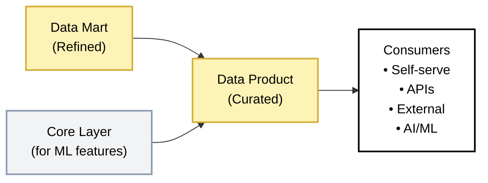

## Data Product

<Callout type="warning">
**Optional Layer** — Needed when BI team is a bottleneck, external consumers need data access, or self-serve analytics is required.
</Callout>

### The Mart-to-Product Boundary

<Callout type="question">
**When does data belong in Mart vs Data Product?** If the consumer is a BI tool (Power BI, Tableau, Looker) and uses star schema joins, it belongs in **Mart**. If the consumer needs a flat, pre-joined, self-contained dataset — whether for self-serve analytics, APIs, external sharing, or ML — it belongs in **Data Product**. The boundary is the consumer's capability: Mart assumes the tool can join; Product assumes it cannot (or should not).
</Callout>

### Purpose

Data Product is the consumer-ready layer where data is packaged for direct use. Unlike Mart (which serves BI tools), Data Products serve specific use cases: self-serve analytics, API feeds, external data sharing, and AI model inputs.

#### Key Principle

* Zero-join consumption
* Users should be able to answer their questions without writing complex SQL or understanding the underlying data model
* Data Products are flat, documented, and purpose-built

#### What lives here

| Data Type | Examples |
|-----------|----------|
| One Big Tables (OBT) | `prd_customer_360`, `prd_order_complete` |
| Metrics Store | Centralised KPI definitions decoupled from BI tools |
| API-ready datasets | Pre-structured for REST/GraphQL endpoints |
| ML feature stores | Pre-computed features for model training |
| External data shares | Datasets for partners or customers |
| Self-serve datasets | Curated, documented, business-friendly tables |

#### What happens here

- Mart data denormalised into flat structures (OBT)
- Business-specific transformations applied
- Metrics centralised and decoupled from BI tools
- Data documented with SLAs and contracts
- Products grouped by business function
- Highly governed with clear ownership

#### What does NOT belong here

- Raw or source-aligned data → Belongs in Stage
- Normalised entity models → Belongs in Core
- Star schemas for BI tools → Belongs in Mart
- Exploratory or ad-hoc analysis → Use sandbox

#### Data Flow

#### Input Sources
- Data Mart (for reporting-aligned products)

#### Output Destination
- Business users (self-serve analytics)
- External applications (Reverse ETL, APIs)
- Partner data shares (Snowflake Data Sharing, Databricks Delta Sharing)
- AI/ML systems (feature stores, training datasets)

#### Loading Strategy

| Aspect | Approach |
|--------|----------|
| **Pattern** | Materialisation (full refresh) |
| **Why** | OBT tables pre-compute all joins; full reload ensures dimension changes propagate |
| **Frequency** | Daily or more frequent based on SLA |
| **Idempotency** | Guaranteed-same input always produces same output |

### Data Modelling

**Approach:** One Big Table (OBT) - Consumer-aligned, optimised for zero-join queries.

| Aspect | Data Product Approach |
|--------|----------------------|
| Structure | Fully denormalised wide tables |
| Grain | One row per analysis entity |
| Joins | Pre-computed; consumers never join |
| Metrics | Embedded in table or centralised metrics store |
| Documentation | Mandatory; business-friendly descriptions |

#### OBT Principles

1. **Self-contained** - All attributes needed for analysis in one table
2. **Business-named** - Column names readable without data dictionary
3. **Pre-computed** - Metrics calculated, not derived at query time
4. **Documented** - Every column has a description
5. **SLA-bound** - Freshness and availability commitments defined

### Naming Convention and Structure

#### Database & Schema Structure

<SchemaOptionMatrix
  options={[
    {
      name: "Option 1",
      subtitle: "By Business Domain",
      tree: `data_product/\n├── pdt_sales/\n│   ├── pdt_revenue\n│   └── pdt_mrr\n└── product_operation/`
    },
    {
      name: "Option 2",
      subtitle: "By Product / Type",
      tree: `data_product/\n├── pdt_snowball/\n│   ├── pdt_revenue\n│   └── pdt_mrr\n└── product_utilisation/`
    }
  ]}
  factors={[
    {
      name: "Consumer Discoverability",
      description: "How easily a business user can find the right table for their use case",
      ratings: [
        { rating: "green", label: "Easy",     note: "Business domains are intuitive (sales, ops, finance)" },
        { rating: "amber", label: "Moderate", note: "Requires knowledge of product taxonomy" }
      ]
    },
    {
      name: "Business Domain Alignment",
      description: "How closely the structure maps to the organisation's business structure",
      ratings: [
        { rating: "green", label: "High",  note: "Domains mirror business units and ownership" },
        { rating: "red",   label: "Low",   note: "Product types don't map to org structure" }
      ]
    },
    {
      name: "Ownership Clarity",
      description: "How clearly a team or domain owns a schema and its data products",
      ratings: [
        { rating: "green", label: "Clear",    note: "One domain = one owning team" },
        { rating: "amber", label: "Moderate", note: "Multiple teams may contribute to same product type" }
      ]
    },
    {
      name: "Cross-domain Reusability",
      description: "Ease of reusing a product table across different business contexts",
      ratings: [
        { rating: "green", label: "Easy",  note: "Domain schemas make shared datasets obvious" },
        { rating: "red",   label: "Hard",  note: "Product-type grouping fragments reusable datasets" }
      ]
    },
    {
      name: "Governance Complexity",
      description: "Effort to enforce access control, SLAs, and data contracts per schema",
      ratings: [
        { rating: "green", label: "Simple",   note: "RBAC aligned to domain ownership" },
        { rating: "amber", label: "Moderate", note: "Access policies span multiple product types" }
      ]
    }
  ]}
/>

#### Table Naming Convention

| Element | Convention | Example |
|---------|------------|---------|
| Database | `product` | `product` |
| Schema | Business function | `finance`, `sales`, `external`, `ml` |
| Product tables | `prd_{domain}_{purpose}` | `prd_customer_360` |
| Metrics tables | `metrics_{domain}` | `metrics_sales` |
| Feature tables | `features_{use_case}` | `features_customer_churn` |
| External shares | `share_{audience}_{content}` | `share_partner_sales` |

#### Column Naming for Self-Serve

Use business-friendly names that don't require data dictionary lookup:

| Technical Name | Business-Friendly Name |
|----------------|------------------------|
| `cust_ltv` | `customer_lifetime_value` |
| `rev_ytd` | `revenue_year_to_date` |
| `qty` | `quantity_sold` |
| `dt` | `transaction_date` |

### Data Quality Rules

Data Products have the highest quality bar-they're directly consumed by business users and external systems.

| Rule | Check | Action on Failure |
|------|-------|-------------------|
| **Schema stability** | No unexpected column changes | Fail pipeline, alert |
| **SLA compliance** | Data refreshed within committed window | Alert, escalate |
| **Metric accuracy** | KPIs match source of truth | Fail pipeline |
| **Completeness** | Expected records present | Alert, investigate |
| **Freshness** | Data current as per SLA | Alert, escalate |

### Testing Strategy

| Test Type | What We Check | When |
|-----------|---------------|------|
| **Schema stability** | No unexpected column changes | Before deployment |
| **SLA compliance** | Refresh completed within window | After each refresh |
| **Row count** | Within expected bounds | After each refresh |
| **Metric accuracy** | KPIs match Mart source | After each refresh |
| **Null rates** | Critical columns populated | After each refresh |

### Security & Access

| Aspect | Standard |
|--------|----------|
| **Encryption** | At rest and in transit |
| **Access** | Business users, external apps (via RBAC) |
| **PII status** | Masked or excluded based on product purpose |
| **Audit logging** | All queries logged |
| **Data sharing** | Governed by legal/compliance approval |

#### Access Matrix & Consumers

| Role | Access Method | Read | Write | Delete | Use Case |
|------|---------------|------|-------|--------|----------|
| Product Pipeline (Service Account) | Direct SQL | ✓ | ✓ | ✓ | Pipeline orchestration and data loading |
| Business Users | SQL client, spreadsheet | ✓ | ✗ | ✗ | Self-serve analysis |
| External Applications | API, Reverse ETL | ✓ (scoped) | ✗ | ✗ | Operational systems integration |
| Partners | Data Share | ✓ (contracted) | ✗ | ✗ | Contracted data access |
| AI/ML Systems | Direct query, feature store | ✓ | ✗ | ✗ | Model training and inference |
| Data Engineers | SQL client | ✓ | ✗ | ✗ | Troubleshooting and support |

#### Self-Serve Enablement

For true self-serve, provide:
- **Data catalog entry** - Discoverable with search
- **Column descriptions** - Business-friendly explanations
- **Sample queries** - Common analysis patterns
- **Freshness indicator** - When data was last updated
- **Owner contact** - Who to ask questions

### Example: Customer 360 OBT

#### Purpose
Single table containing everything known about a customer-demographics, transactions, engagement, and predictions-for self-serve analysis.

#### Table Structure

| Column | Type | Description |
|--------|------|-------------|
| customer_id | VARCHAR | Unique customer identifier |
| customer_name | VARCHAR | Full name |
| email_domain | VARCHAR | Email domain (PII masked) |
| segment | VARCHAR | Enterprise / SMB / Consumer |
| industry | VARCHAR | Customer's industry |
| country | VARCHAR | Billing country |
| region | VARCHAR | Geographic region |
| account_manager | VARCHAR | Assigned sales rep |
| customer_since | DATE | First purchase date |
| days_as_customer | INTEGER | Days since first purchase |
| total_orders | INTEGER | Lifetime order count |
| total_revenue | DECIMAL | Lifetime revenue |
| total_margin | DECIMAL | Lifetime margin |
| average_order_value | DECIMAL | Revenue / orders |
| last_order_date | DATE | Most recent order |
| days_since_last_order | INTEGER | Recency |
| orders_last_30_days | INTEGER | Recent activity |
| revenue_last_30_days | DECIMAL | Recent revenue |
| orders_last_365_days | INTEGER | Annual activity |
| revenue_last_365_days | DECIMAL | Annual revenue |
| support_tickets_open | INTEGER | Current open tickets |
| support_tickets_lifetime | INTEGER | All-time tickets |
| nps_score | INTEGER | Latest NPS response |
| churn_risk_score | DECIMAL | ML-predicted churn probability |
| recommended_next_product | VARCHAR | ML recommendation |
| data_as_of | TIMESTAMP | When this row was computed |

**Grain:** One row per customer.

### Dos and Don'ts

<DosAndDonts
  dos={[
    { text: "Denormalise fully-zero joins for consumers" },
    { text: "Use business-friendly column names" },
    { text: "Document every column with descriptions" },
    { text: "Define and publish SLAs" },
    { text: "Version schemas with breaking change notices" },
    { text: "Pre-compute all metrics and calculations" }
  ]}
  donts={[
    { text: "Require consumers to write joins" },
    { text: "Use technical abbreviations in column names" },
    { text: "Change schemas without notice" },
    { text: "Skip data contracts for external shares" },
    { text: "Expose PII without explicit approval" },
    { text: "Create OBTs without clear use cases" }
  ]}
/>

### Anti-Patterns

<AntiPatterns
  patterns={[
    {
      title: "The Kitchen Sink OBT",
      problem: "Team creates an OBT with 500+ columns containing \"everything anyone might need.\" Table is slow to query, hard to understand, and expensive to maintain.",
      example: "A client built a \"master customer OBT\" with every field from every source system. Query time was 3 minutes. Users couldn't find relevant columns among hundreds of options. Most columns were never used.",
      prevention: "Build purpose-specific OBTs. `prd_customer_360` for customer analysis, `prd_customer_support` for support metrics. Each focused, each fast."
    },
    {
      title: "The Undocumented Product",
      problem: "OBT is created without column descriptions or usage guidance. Business users don't understand the data. They either don't use it or use it incorrectly.",
      example: "A `revenue_ytd` column was computed using fiscal year, not calendar year. Marketing used it assuming calendar year, reporting incorrect figures for months until discovered.",
      prevention: "Every column requires a description. Every product requires sample queries and usage guidance. Treat documentation as part of the product, not an afterthought."
    },
    {
      title: "The Silent Schema Change",
      problem: "Engineer renames or removes a column without notification. Downstream reports break. External integrations fail.",
      example: "An engineer renamed `customer_lifetime_value` to `ltv` to \"simplify.\" A partner's API integration (which expected the original name) silently stopped updating for two weeks before anyone noticed.",
      prevention: "Schema changes require 14-day notice. Breaking changes require approval. Use data contracts to formalise these commitments."
    },
    {
      title: "The Feature Store Chaos",
      problem: "ML features are computed ad-hoc by data scientists, not governed as products. Training and inference use different feature versions. Model performance degrades mysteriously.",
      example: "A churn model was trained on features computed from yesterday's snapshot but scored customers using week-old features (due to a stale cache). Predictions were systematically wrong.",
      prevention: "Feature tables are Data Products. Same governance, same SLAs, same versioning. Training and inference consume the same feature store."
    }
  ]}
/>