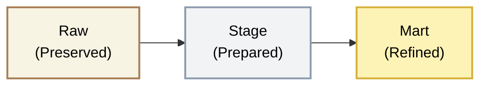
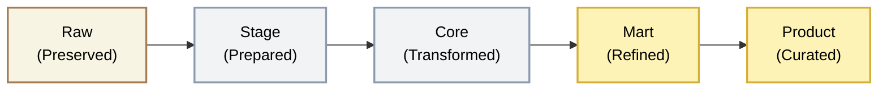
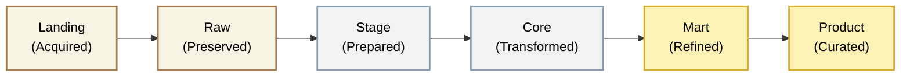

## Layer Decision framework

Not every project needs six layers. Over-engineering creates unnecessary complexity; under-engineering creates technical debt. This framework helps you choose the right architecture for your specific context.

#### Risks of Over-Engineering (Building full layers for simple data)
- Velocity Drag: It takes 3 weeks to add a simple column because it must pass through 7 layers
- Maintenance Overhead: More dbt models/SQL scripts to maintain than necessary
- Engineer Burnout: Team feels they are doing "busy work" rather than delivering value

#### Risks of Under-Engineering (Using simplified for complex Data)
- Spaghetti Code: Huge SQL queries (1000+ lines) in the Mart layer that are impossible to debug
- Inconsistent Truth: Marketing calculates "Revenue" differently than Finance because they defined it separately in their own Marts
- Fan-out/Explosion: Joining raw tables directly can lead to row multiplication errors (many-to-many join issues) that go undetected

<Callout type="warning">
  **Match layers to scope, not ambition.** It's easier to add layers when needed than to remove them when over-built. Default to the minimum viable architecture for your project's integration scope.
</Callout>

### The Three Tiers

Each tier describes the **scope of integration** a project requires — not a maturity progression. Choose the tier that matches your project's needs; there is no expectation that every project should move from left to right.

| Tier | Layers | Architecture | Best For |
|------|--------|--------------|----------|
| **Single-Domain** | 3 | Raw → Stage → Mart | Projects serving 1-2 functional domains from a few sources |
| **Cross-Domain** | 5 | Raw → Stage → Core → Mart → Product | Platforms integrating data across multiple business domains |
| **Full Platform** | 6 | Landing → Raw → Stage → Core → Mart → Product | Enterprise-scale with MDM, Data Vault, and AI workloads |

#### Single-Domain (Three-Layer)

**Trigger:** Day 1 Standard

The default starting architecture. It provides history (Raw), clean data (Stage), and fast reporting (Mart), solving the immediate reporting need.

| Aspect | Detail |
|--------|--------|
| **Layers** | Raw, Stage, Mart |
| **Skipped** | Landing, Core, Product |
| **Ideal For** | Small-to-medium businesses managing data across 1-2 functional domains (e.g., Finance and Commercial) |
| **Source Systems** | 1-3 systems |
| **Timeline** | 4-12 weeks |
| **Team Size** | 1-3 engineers |
| **Critical Risk** | Logic duplication-skipping Core means the same business logic is implemented differently in each Data Mart, leading to conflicting reports |

<Card>
  <CardHeader>
    <CardTitle className="text-base">When to use</CardTitle>
  </CardHeader>
  <CardContent>
    <ul className="list-disc ml-4 space-y-1.5 text-sm">
      <li>Single source of truth not required across domains</li>
      <li>Limited integration between source systems</li>
      <li>Speed to first dashboard is priority</li>
      <li>Budget or timeline constraints</li>
    </ul>
  </CardContent>
</Card>

<Card>
  <CardHeader>
    <CardTitle className="text-base">Deliverables</CardTitle>
  </CardHeader>
  <CardContent>
    <ul className="list-disc ml-4 space-y-1.5 text-sm">
      <li>Source data preserved in Raw</li>
      <li>Cleansed, typed data in Stage</li>
      <li>Star schema in Mart for BI tools</li>
      <li>First dashboards live</li>
    </ul>
  </CardContent>
</Card>

#### Cross-Domain (Five-Layer)

| Aspect | Detail |
|--------|--------|
| **Layers** | Raw, Stage, Core, Mart, Product |
| **Skipped** | Landing |
| **Ideal For** | Businesses with maturing infrastructure requiring company-wide analytics, data integration, and advanced insights |
| **Source Systems** | 3-10 systems |
| **Timeline** | 3-9 months |
| **Team Size** | 3-8 engineers |
| **Critical Risk** | Providing open access to Core or Stage leads to non-technical users reporting on 'dirty,' unharmonised data |

<Card>
  <CardHeader>
    <CardTitle className="text-base">When to use</CardTitle>
  </CardHeader>
  <CardContent>
    <ul className="list-disc ml-4 space-y-1.5 text-sm">
      <li>Multiple source systems need integration</li>
      <li>Business entities span systems (Customer in CRM + ERP + Support)</li>
      <li>Self-serve analytics is a goal</li>
      <li>Data products will feed external systems</li>
    </ul>
  </CardContent>
</Card>

<Card>
  <CardHeader>
    <CardTitle className="text-base">Deliverables</CardTitle>
  </CardHeader>
  <CardContent>
    <ul className="list-disc ml-4 space-y-1.5 text-sm">
      <li>Unified business entities in Core</li>
      <li>Star schema Marts for BI tools</li>
      <li>Data Products for self-serve and APIs</li>
      <li>Cross-domain analytics capability</li>
    </ul>
  </CardContent>
</Card>

##### Add Core layer
**Trigger:** When joining 3+ source systems OR when business logic is duplicated across Marts

Do not build a complex Core layer if you only have one source system (e.g., just CRM). It adds unnecessary overhead for simple pipelines.

<Card>
  <CardHeader>
    <CardTitle className="text-base">Signs you need Core</CardTitle>
  </CardHeader>
  <CardContent>
    <ul className="list-disc ml-4 space-y-1.5 text-sm">
      <li>Same customer appears in CRM, ERP, and Support system</li>
      <li>Mart models duplicate the same entity join logic</li>
      <li>Business asks "which customer record is correct?"</li>
      <li>You're building the same dimension in multiple Marts</li>
    </ul>
  </CardContent>
</Card>

<Card>
  <CardHeader>
    <CardTitle className="text-base">Deliverables</CardTitle>
  </CardHeader>
  <CardContent>
    <ul className="list-disc ml-4 space-y-1.5 text-sm">
      <li>Unified business entities (customer, product, order)</li>
      <li>Single source of truth for cross-system entities</li>
      <li>SCD-2 history for entity changes</li>
    </ul>
  </CardContent>
</Card>

<Card>
  <CardHeader>
    <CardTitle className="text-base">Checklist</CardTitle>
  </CardHeader>
  <CardContent>
    <ul className="list-disc ml-4 space-y-1.5 text-sm">
      <li>3+ source systems integrated</li>
      <li>Business entities (Customer, Product) span multiple systems</li>
      <li>Same join logic duplicated in multiple Marts</li>
      <li>Business asks "which record is the source of truth?"</li>
      <li>Plan to build 3+ Marts that share entities</li>
    </ul>
  </CardContent>
</Card>

##### Add Product layer

**Trigger:** When BI team is a bottleneck OR external consumers need data access

Only introduce this layer when business users are capable of doing their own analysis and need curated, self-serve products.

<Card>
  <CardHeader>
    <CardTitle className="text-base">Signs you need Data Product</CardTitle>
  </CardHeader>
  <CardContent>
    <ul className="list-disc ml-4 space-y-1.5 text-sm">
      <li>Analysts wait days for BI team to build reports</li>
      <li>External applications need data feeds</li>
      <li>Partners require data sharing</li>
      <li>AI/ML needs pre-computed features</li>
    </ul>
  </CardContent>
</Card>

<Card>
  <CardHeader>
    <CardTitle className="text-base">Deliverables</CardTitle>
  </CardHeader>
  <CardContent>
    <ul className="list-disc ml-4 space-y-1.5 text-sm">
      <li>Product tables for self-serve analytics</li>
      <li>API-ready datasets</li>
      <li>Feature store for ML</li>
      <li>Data sharing for partners</li>
    </ul>
  </CardContent>
</Card>

<Card>
  <CardHeader>
    <CardTitle className="text-base">Checklist</CardTitle>
  </CardHeader>
  <CardContent>
    <ul className="list-disc ml-4 space-y-1.5 text-sm">
      <li>BI team is bottleneck for report requests</li>
      <li>Business users capable of self-serve analysis</li>
      <li>External applications need data feeds</li>
      <li>Partners or customers need data access</li>
      <li>ML team needs feature store</li>
    </ul>
  </CardContent>
</Card>

#### Full Platform (Six-Layer)

**Trigger:** When AI/unstructured data is required

Essential when ingesting non-relational data (PDFs, images, audio, IoT streams) required for AI workflows. Structured tables cannot hold these files.

| Aspect | Detail |
|--------|--------|
| **Layers** | All six layers |
| **Skipped** | None |
| **Ideal For** | Enterprise-scale organisations managing multiple business units that require robust Data Vault architecture and Master Data Management (MDM) |
| **Source Systems** | 10+ systems |
| **Timeline** | 6-18 months |
| **Team Size** | 5-15+ engineers |
| **Critical Risk** | Spending 12 months building Data Vault and MDM without delivering a single report, causing the business to lose faith and pull funding |

<Card>
  <CardHeader>
    <CardTitle className="text-base">When to use</CardTitle>
  </CardHeader>
  <CardContent>
    <ul className="list-disc ml-4 space-y-1.5 text-sm">
      <li>Unstructured data for AI/ML workloads</li>
      <li>Complex entity resolution across many systems</li>
      <li>Regulatory requirements for full audit trail</li>
      <li>Multiple business units with different data ownership</li>
      <li>Long-term platform investment justified</li>
    </ul>
  </CardContent>
</Card>

<Card>
  <CardHeader>
    <CardTitle className="text-base">Signs you need Landing Zone</CardTitle>
  </CardHeader>
  <CardContent>
    <ul className="list-disc ml-4 space-y-1.5 text-sm">
      <li>AI/ML project requires document processing</li>
      <li>IoT or sensor data ingestion</li>
      <li>Partner file drops (CSV, Excel)</li>
      <li>Legacy mainframe extracts</li>
    </ul>
  </CardContent>
</Card>

<Card>
  <CardHeader>
    <CardTitle className="text-base">Deliverables</CardTitle>
  </CardHeader>
  <CardContent>
    <ul className="list-disc ml-4 space-y-1.5 text-sm">
      <li>Object storage for unstructured data</li>
      <li>File validation and metadata capture</li>
      <li>Event-driven processing to Raw</li>
    </ul>
  </CardContent>
</Card>

<Card>
  <CardHeader>
    <CardTitle className="text-base">Checklist</CardTitle>
  </CardHeader>
  <CardContent>
    <ul className="list-disc ml-4 space-y-1.5 text-sm">
      <li>Unstructured data required (PDFs, images, audio)</li>
      <li>File-based ingestion from partners</li>
      <li>Legacy system flat file exports</li>
      <li>AI/ML document processing initiative</li>
    </ul>
  </CardContent>
</Card>

### Scoring Model

Score your project across six dimensions to determine the recommended tier.

#### Dimensions

| Dimension | 1 Point | 2 Points | 3 Points |
|-----------|---------|----------|----------|
| **Source System Count** | 1-2 sources | 3-5 sources | 6+ sources |
| **Entity Complexity** | Entities exist in single system | Entities span 2-3 systems | Entities span 4+ systems requiring MDM |
| **Consumer Diversity** | Single team / dashboard | Multiple teams / departments | External consumers, APIs, partners |
| **Data Volume** | &lt;10GB, &lt;10M rows | 10GB-1TB, 10M-1B rows | &gt;1TB, &gt;1B rows |
| **Team Capability** | Junior-heavy, SQL-only | Mixed experience, SQL + Python | Senior team, Data Vault experience |
| **Timeline &amp; Budget** | &lt;3 months, constrained | 3-9 months, moderate | 9+ months, significant investment |

#### Scoring

| Total Score | Recommended Tier |
|-------------|------------------|
| 6-9 | **Single-Domain** (3 layers) |
| 10-14 | **Cross-Domain** (5 layers) |
| 15-18 | **Full Platform** (6 layers) |

#### Override Rules

Regardless of score, apply these overrides:

| Condition | Override |
|-----------|----------|
| Unstructured data for AI/ML required | Minimum **Cross-Domain** + Landing Zone |
| Regulatory audit trail required (finance, healthcare) | Minimum **Cross-Domain** |
| Master Data Management explicitly required | **Full Platform** |
| Timeline &lt;8 weeks | Maximum **Single-Domain** |
| Single source system, single consumer | **Single-Domain** (regardless of score) |

#### Quick Decision Rules

| Scenario | Recommended Tier |
|----------|------------------|
| POC or pilot project | Single-Domain |
| Single CRM analytics | Single-Domain |
| CRM + ERP integration | Cross-Domain |
| Company-wide data platform | Cross-Domain |
| Multi-subsidiary enterprise | Full Platform |
| AI/ML with unstructured data | Cross-Domain + Landing |
| Regulated industry (finance, healthcare) | Minimum Cross-Domain |

### Calculator

<LayerDecisionCalculator />

### Anti-Patterns

<AntiPatterns
  patterns={[
    {
      title: "The Premature Full Platform",
      problem: "Team builds six layers with Data Vault for a 3-month pilot project. Spends 10 weeks on architecture, 2 weeks on actual dashboards. Business sees no value.",
      example: "A fintech startup hired a consultancy to build their \"enterprise data platform.\" After 4 months and £200K, they had a beautiful Data Vault with zero reports. The CEO pulled funding.",
      prevention: "Start with Single-Domain. Prove value with first dashboards. Add layers only when triggers occur."
    },
    {
      title: "The Stuck Single-Domain",
      problem: "Team stays on 3 layers despite growing complexity. Business logic duplicated across 8 Marts. Every report has different numbers for the same metrics.",
      example: "A retail client had 12 Marts, each with its own customer dimension. \"Total customers\" ranged from 45K to 78K depending on which dashboard you viewed. Board lost trust in all data.",
      prevention: "Recognise the triggers. When you're duplicating entity logic across Marts, it's time for Core."
    },
    {
      title: "The Big Bang Migration",
      problem: "Team decides to \"do it right\" and rebuilds entire platform from 3 layers to 6 layers in one project. 12-month migration with no new features.",
      example: "An insurance company froze all analytics development for 18 months during their \"data platform modernisation.\" Business units built shadow IT solutions. When the platform launched, nobody used it.",
      prevention: "Incremental migration. Add Core without disrupting existing Marts. Migrate Marts to use Core one at a time."
    },
    {
      title: "The Landing Zone for Everything",
      problem: "Team routes all data through Landing Zone, even structured API extracts. Adds unnecessary complexity and latency for data that could go directly to Raw.",
      example: "A team insisted all data \"must follow the six-layer pattern.\" Salesforce API data was written to files, then parsed back into tables. Added 2 hours to pipeline runtime for zero benefit.",
      prevention: "Landing Zone is for unstructured data and files only. Managed connectors (Fivetran, Airbyte) load directly to Raw."
    }
  ]}
/>

### Summary

<DataMaturityComparison />

**Remember**
- Layers are a liability until they deliver value
- Start with the tier that fits your scope, evolve only when triggers occur
- The goal is insights, not architecture
