## Reference & Mapping Data

### What is Reference & Mapping Data?

Not all data comes from transactional source systems. Every data platform relies on two types of supporting data that provide context, enable cross-system alignment, and enrich business entities:

- **Reference Data** - standardised values that provide context but are not owned by any single source system
- **Mapping Data** - translation tables that align values between systems or define business hierarchies

Without consistent management of these datasets, teams end up with hardcoded values scattered across SQL models, mismatched hierarchies, and currency conversions that differ between dashboards.

### Reference Data vs Mapping Data

| Aspect | Reference Data | Mapping Data |
|--------|---------------|-------------|
| **Purpose** | Provides standardised context values | Translates or aligns values between systems or defines business hierarchies |
| **Ownership** | External authority or company-wide standard | Business or commercial team defines the rules |
| **Change frequency** | Changes on a known schedule (daily, monthly) or rarely | Changes when business rules, structures, or system mappings change |
| **Examples** | Exchange rates, country codes, calendar/fiscal periods, industry classifications | Product hierarchy mapping, region-to-country mapping, account-to-segment mapping, GL account categorisation |
| **Source** | External providers (central banks, ISO standards) or internal finance/ops | Internal business decisions, often maintained in spreadsheets or master data tools |

### Reference Data

Reference data provides standardised, externally or centrally defined values that enrich transactional data with consistent context.

#### Common Reference Data Types

| Reference Dataset | Source | Refresh Frequency | Example Use |
|-------------------|--------|-------------------|-------------|
| **Exchange rates** | Central banks, Treasury, ERP | Daily | Convert local currency transactions to group reporting currency |
| **Country & currency codes** | ISO 3166 / ISO 4217 | Rarely (on ISO updates) | Standardise country/currency fields across sources |
| **Calendar / fiscal periods** | Internal finance team | Annually (or on fiscal year change) | Enable time-based reporting aligned to business fiscal year |
| **Industry classifications** | SIC / NAICS / GICS | Rarely | Categorise accounts by standard industry codes |
| **Tax rates** | Government / tax authority | On regulatory change | Apply correct tax calculations |
| **Public holidays** | Government / regional | Annually | Exclude non-business days from SLA and working-day calculations |

#### Key Characteristics

- **Immutable for a given point in time** - an exchange rate on 2026-03-15 is a fact; it doesn't change retroactively
- **Versioned, not updated** - when rates change, a new row is added with a new effective date; old rows are preserved
- **Not owned by any source system** - exchange rates don't belong to Salesforce or NetSuite; they exist independently

#### Storage Pattern

Reference data lives in a dedicated schema, separate from source-system schemas:

```
stage/
├── salesforce/
│   └── ...
├── netsuite/
│   └── ...
├── reference/                    ← dedicated reference schema
│   ├── exchange_rate
│   ├── country
│   ├── currency
│   ├── calendar
│   ├── fiscal_period
│   └── public_holiday
```

### Mapping Data

Mapping data defines how values from one context translate to another. These are business-owned rules, not external standards - they reflect how the organisation chooses to categorise, group, or align its data.

#### Common Mapping Data Types

| Mapping Dataset | Owned By | Purpose | Example |
|-----------------|----------|---------|---------|
| **Product hierarchy** | Commercial / Product team | Maps products → sub-categories → categories → lines of business | `Widget Pro` → `Widgets` → `Hardware` → `Product Revenue` |
| **Region / geography mapping** | Operations / Finance | Maps countries to regions, territories, or reporting groups | `Germany` → `DACH` → `EMEA` |
| **Account segmentation** | Commercial / Strategy | Maps accounts to segments, tiers, or cohorts | `Acme Corp` → `Enterprise` → `Tier 1` |
| **GL account mapping** | Finance | Maps chart of accounts codes to reporting categories | `4010` → `Software Revenue` → `Revenue` |
| **Cost centre mapping** | Finance / HR | Maps cost centres to departments or business units | `CC-1042` → `Engineering` → `R&D` |
| **Channel mapping** | Marketing / Sales | Maps lead sources or campaign codes to reporting channels | `utm_google_paid` → `Paid Search` → `Digital` |

#### Key Characteristics

- **Business-owned** - the commercial or finance team defines the rules; engineering implements them
- **Hierarchical** - most mappings define multi-level hierarchies (leaf → parent → grandparent)
- **Change when the business changes** - a restructure, acquisition, or new product line triggers mapping updates
- **Often maintained in spreadsheets** - until formalised in the data platform

<Callout type="warning">
**Mapping data must live in the platform, not in SQL.** A common anti-pattern is hardcoding mappings as CASE WHEN statements scattered across dbt models. When the business restructures product lines or regions, engineers must find and update every model. Instead, maintain mappings as tables that models JOIN to - update one table, and every downstream model reflects the change.
</Callout>

#### Storage Pattern

Mapping data lives alongside reference data in a dedicated schema:

```
stage/
├── reference/
│   ├── exchange_rate
│   ├── country
│   └── ...
├── mapping/                      ← dedicated mapping schema
│   ├── product_hierarchy
│   ├── region_mapping
│   ├── account_segment
│   ├── gl_account_mapping
│   └── cost_centre_mapping
```

### Layer Flow

Reference and mapping data flows through the same layers as transactional data, but with key differences at each stage.

```mermaid
flowchart LR
    subgraph Sources["Sources"]
        direction TB
        API["External APIs<br/>(central banks, ISO)"]
        Files["File uploads<br/>(spreadsheets, CSVs)"]
        Seeds["dbt seeds<br/>(version-controlled)"]
    end

    subgraph RAW["Raw Layer"]
        direction TB
        R1["Append-only storage"]
        R2["ref_exchange_rate_raw"]
        R3["ref_country_raw"]
    end

    subgraph STAGE["Stage Layer"]
        direction TB
        S1["reference/ schema"]
        S2["mapping/ schema"]
        S3["Standardised types<br/>and naming"]
    end

    subgraph CORE["Core Layer"]
        direction TB
        C1["ref_ prefixed tables"]
        C2["lnk_ for cross-references"]
        C3["Versioned with<br/>effective dates"]
    end

    subgraph MART["Mart / Product"]
        direction TB
        M1["Joined into dims and facts"]
        M2["No separate ref tables<br/>(denormalised into consumers)"]
    end

    Sources --> RAW --> STAGE --> CORE --> MART

    style Sources fill:#fff,stroke:#000
    style RAW fill:#f7f4e4,stroke:#A67C52
    style STAGE fill:#f2f3f5,stroke:#8B9BAE
    style CORE fill:#f2f3f5,stroke:#8B9BAE
    style MART fill:#fef3b7,stroke:#D4AF37

    style API fill:#fff,stroke:#000
    style Files fill:#fff,stroke:#000
    style Seeds fill:#fff,stroke:#000
    style R1 fill:#fff,stroke:#A67C52
    style R2 fill:#fff,stroke:#A67C52
    style R3 fill:#fff,stroke:#A67C52
    style S1 fill:#fff,stroke:#8B9BAE
    style S2 fill:#fff,stroke:#8B9BAE
    style S3 fill:#fff,stroke:#8B9BAE
    style C1 fill:#fff,stroke:#8B9BAE
    style C2 fill:#fff,stroke:#8B9BAE
    style C3 fill:#fff,stroke:#8B9BAE
    style M1 fill:#fff,stroke:#D4AF37
    style M2 fill:#fff,stroke:#D4AF37
```



| Layer | What happens to reference/mapping data |
|-------|---------------------------------------|
| **Raw** | Stored as-is from source. Append-only for time-series data (exchange rates). Full snapshot for static data (country codes). |
| **Stage** | Standardised column names, data types, and null handling. Stored in dedicated `reference/` and `mapping/` schemas. |
| **Core** | Versioned with `effective_from` / `effective_to` for mappings. Prefixed with `ref_` (e.g., `ref_exchange_rate`, `ref_country`). Cross-reference tables use `lnk_` prefix. |
| **Mart** | Not stored separately. Reference and mapping values are denormalised into dimension and fact tables via joins at build time. |

### Loading Strategy

| Data Type | Strategy | Rationale |
|-----------|----------|-----------|
| **Reference data** (exchange rates) | Append new values; never update historical | Exchange rate on a given date is a fact - preserve the full history |
| **Reference data** (country codes, calendars) | Full refresh | Small, rarely changing datasets; full refresh is simpler and cost is negligible |
| **Mapping data** | Versioned with `effective_from` / `effective_to` | Business rules change over time; versioning preserves the mapping that was active at any point in history |

<Callout type="info">
**Why version mapping data?** When the business restructures product lines mid-year, historical reports should reflect the hierarchy that was active at the time of the transaction - not today's hierarchy. Versioned mappings with `effective_from` / `effective_to` enable both current-state and point-in-time reporting.
</Callout>

### Versioning Patterns

#### Pattern 1: Append-Only (Exchange Rates, Time-Series)

Each new value is a new row. No row is ever updated or deleted.

```sql
-- ref_exchange_rate in Core
SELECT
  currency_pair,     -- e.g., 'GBP/USD'
  rate_date,         -- e.g., 2026-03-27
  exchange_rate,     -- e.g., 1.2945
  source,            -- e.g., 'ECB', 'Bloomberg'
  __data_loaded_at
FROM stage.reference.exchange_rate
```

**Joining to transactions:**

```sql
-- Get revenue in GBP using the rate on the transaction date
SELECT
  f.order_id,
  f.revenue_usd,
  f.revenue_usd * r.exchange_rate AS revenue_gbp
FROM core.fct_orders f
LEFT JOIN core.ref_exchange_rate r
  ON r.currency_pair = 'USD/GBP'
  AND r.rate_date = f.order_date
```

#### Pattern 2: Effective-Dated (Mapping Hierarchies)

Each mapping version has a validity window. When the business restructures, a new version is added and the old version is closed.

```sql
-- ref_product_hierarchy in Core
SELECT
  product_code,          -- e.g., 'WIDGET-PRO'
  sub_category,          -- e.g., 'Premium Widgets'
  category,              -- e.g., 'Hardware'
  line_of_business,      -- e.g., 'Product Revenue'
  effective_from,        -- e.g., 2025-01-01
  effective_to,          -- e.g., 2026-06-30 (NULL = current)
  __is_active_version    -- TRUE for current mapping
FROM stage.mapping.product_hierarchy
```

**Joining with point-in-time correctness:**

```sql
-- Historical: use mapping active at transaction time
SELECT
  f.order_id,
  f.order_date,
  m.category,
  m.line_of_business
FROM core.fct_orders f
LEFT JOIN core.ref_product_hierarchy m
  ON f.product_code = m.product_code
  AND f.order_date >= m.effective_from
  AND (f.order_date < m.effective_to OR m.effective_to IS NULL)

-- Current: use latest mapping only
SELECT
  f.order_id,
  m.category,
  m.line_of_business
FROM core.fct_orders f
LEFT JOIN core.ref_product_hierarchy m
  ON f.product_code = m.product_code
  AND m.__is_active_version = TRUE
```

#### Pattern 3: Full Refresh (Static Codes)

Small, rarely changing datasets are fully replaced each load. No effective dating needed.

```sql
-- ref_country in Core (full refresh)
SELECT
  country_code,     -- e.g., 'GB'
  country_name,     -- e.g., 'United Kingdom'
  region,           -- e.g., 'Europe'
  currency_code     -- e.g., 'GBP'
FROM stage.reference.country
```

### Sourcing and Governance

| Aspect | Reference Data | Mapping Data |
|--------|---------------|-------------|
| **Who defines it** | External authority or central team (finance, ops) | Business / commercial team |
| **How it enters the platform** | API feed, file upload, or manual seed | Spreadsheet upload, admin UI, or dbt seed |
| **Who approves changes** | Finance / ops lead | Business owner of the hierarchy |
| **Version control** | Append-only (exchange rates) or full refresh (codes) | Versioned with effective dates |
| **Validation** | Cross-reference against ISO standards or provider | Review with business owner; validate completeness (no orphan codes) |

### Data Quality for Reference & Mapping Data

| Check | What It Validates | Frequency |
|-------|-------------------|-----------|
| **Orphan detection** | Every transactional code exists in the mapping table | Every pipeline run |
| **Completeness** | No NULL keys in reference tables | Every pipeline run |
| **Freshness** | Exchange rates loaded for today's date | Daily |
| **Overlap detection** | No overlapping `effective_from`/`effective_to` ranges for the same key | On mapping change |
| **Referential integrity** | All foreign keys in Core/Mart resolve to a valid reference record | Every pipeline run |

<Callout type="note">
**dbt seeds are a pragmatic starting point.** For small, infrequently changing mapping data (< 1,000 rows), `dbt seed` files (CSV in the dbt project) provide version control, code review, and CI/CD for free. As mapping data grows or changes more frequently, migrate to a dedicated table loaded via a managed process.
</Callout>

### Anti-Patterns

<AntiPatterns
  patterns={[
    {
      title: "The CASE WHEN Maze",
      problem: "Mappings are hardcoded as CASE WHEN statements across dozens of dbt models. When the business restructures, engineers spend days hunting down every instance.",
      example: "A client's product categorisation was defined as CASE WHEN statements in 14 different dbt models. When they acquired a new brand, engineers spent 3 sprints updating every model. Two were missed, causing inconsistent reporting for a month.",
      prevention: "Maintain all mappings as tables (seeds or loaded tables). Models JOIN to the mapping table - one update propagates everywhere."
    },
    {
      title: "The Unversioned Mapping",
      problem: "Mapping table is updated in place without effective dates. Historical reports retroactively change when the mapping changes, breaking period-over-period comparisons.",
      example: "A client reorganised their sales territories mid-Q3. The region mapping was updated in place. Suddenly, Q1 and Q2 reports showed the new territory structure, making year-over-year comparisons meaningless. Finance lost trust in the platform.",
      prevention: "Always version mappings with effective_from / effective_to. Historical transactions should reflect the mapping that was active at the time."
    },
    {
      title: "The Orphan Code",
      problem: "Source system introduces a new value (product code, country, GL account) that doesn't exist in the mapping table. Downstream reports silently drop or misclassify records.",
      example: "A new product was added to the ERP but not to the product hierarchy mapping. Revenue for the new product showed as 'Uncategorised' in executive dashboards for 6 weeks before anyone noticed.",
      prevention: "Add data quality tests that flag orphan codes - source values that exist in transactional data but not in the mapping table. Alert on first occurrence."
    }
  ]}
/>