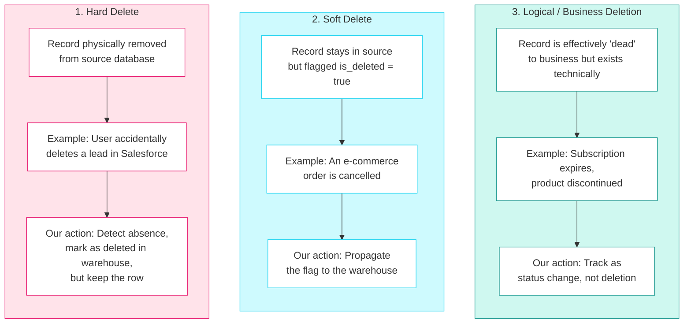
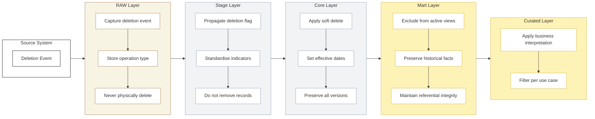
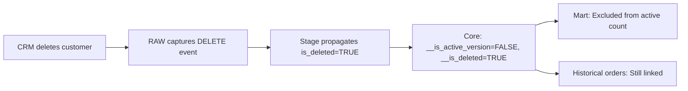
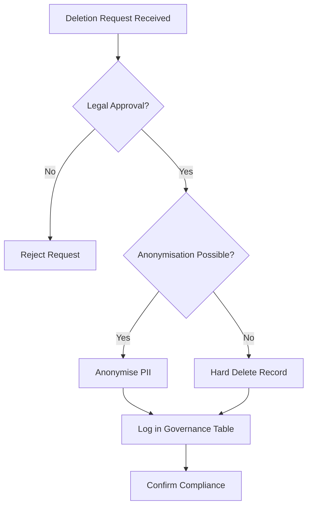

## Deletion handling

<Callout type="warning">
  **A Data Warehouse is a History Book, Not a Mirror** - If a customer is deleted from the CRM today, that doesn't change the fact that they bought a product last year. If we delete them from the warehouse, we orphan their historical transactions and break our reporting.
</Callout>

### Brief

#### The Problem

Source systems delete data for many reasons-user mistakes, customer cancellations, data corrections, system purges. When these deletions flow into the data warehouse without proper handling:

- Historical reports change unexpectedly
- Referential integrity breaks (orphaned facts)
- Audit trails disappear
- Compliance becomes impossible
- Business users lose trust in the data

**The question isn't whether deletions happen-it's how we preserve truth when they do.**

#### The Solution

Implement a layer-by-layer deletion strategy that:

1. **Captures** deletion events in RAW (what happened)
2. **Propagates** deletion flags in Stage (standardised)
3. **Preserves** history in Core (soft delete with effective dating)
4. **Filters** in Mart/Curated (business-appropriate views)

### Core Principle

- **Data warehouses are analytical systems, not transactional mirrors**
- **Physical deletes should almost never occur in analytical layers. Deletion events must be tracked, not erased**

| System Type | Cares About | Deletion Approach |
|-------------|-------------|-------------------|
| **Transactional** (ERP, CRM) | The "Now" | Hard delete to maintain performance |
| **Analytical** (Data Warehouse) | The "Then" and "Now" | Soft delete to preserve history |

**We almost never perform a physical hard delete unless legally compelled (e.g., GDPR Right to be Forgotten, even for RTBF, Anonymisation is the preferred option).**

### The Three Types of Deletions

Before handling a deletion, identify which type you're dealing with:



### High-Level Deletion Flow



### Layer-by-Layer Strategy

#### RAW Layer (Bronze)

**Objective:** Capture exactly what happened in the source.

**Principle:** RAW must remain immutable and auditable.

| Action | Implementation |
|--------|----------------|
| Capture delete operation via CDC | Store `_operation_type` column |
| **Never physically delete rows** | Append-only pattern |

**Required Metadata Columns:**

```
    _source_deleted_at TIMESTAMP,     -- When source deleted (if known)
    _is_deleted_from_source BOOLEAN,  -- Flag for hard deletes
```

**CDC-Based Capture (Preferred):**

- Consume CDC stream from source (Debezium, Fivetran, etc.)
- Map CDC operation type (`I`, `U`, `D`) to `_operation_type` column
- For DELETE operations, capture the change timestamp as `_source_deleted_at`
- Set `_is_deleted_from_source = TRUE` for delete events
- Append all events (including deletes) to RAW-never filter them out
- Include batch/run identifier for lineage tracking

**Snapshot-Based Detection (When CDC unavailable):**

- Compare current source extract against previous snapshot in RAW
- Records present in previous snapshot but missing in current extract are hard deletes
- Generate synthetic DELETE records for missing rows
- Set `_operation_type = 'DELETE'` and `_is_deleted_from_source = TRUE`
- Use ingestion timestamp as proxy for deletion time (actual deletion time unknown)
- Be cautious with large datasets-this approach is computationally expensive
- Consider partitioning by date to limit comparison scope

#### Stage Layer

**Objective:** Standardise and prepare data for transformation.

**Principle:** Do not remove records-just mark them appropriately.

| Action | Implementation |
|--------|----------------|
| Propagate deletion flags | Standardise to `is_deleted` |
| Standardise delete indicators | Consistent naming across sources |
| Validate data consistency | Check for orphans early |
| **Do not remove records yet** | Pass through all records |

#### Core Layer

**Objective:** Maintain historical integrity and support audit.

**Principle:** This is the most critical layer for deletion handling.

**Recommended Pattern: Soft Delete with Effective Dating (SCD Type 2)**

| Column | Purpose |
|--------|---------|
| `__is_active_version` | Is this the current version? |
| `__is_deleted` | Has this record been deleted from source? |
| `__effective_from` | When this version became effective |
| `__effective_to` | When this version was superseded |

**Why This Matters:**

| Benefit | Explanation |
|---------|-------------|
| Historical accuracy | Past reports don't change |
| Referential integrity | Facts still join to dimension |
| Audit trail | Can see when deletion occurred |
| Reversibility | Can "undelete" if needed |

#### Mart Layer

**Objective:** Support analytics and reporting with appropriate filtering.

**Principle:** Exclude deleted records from active views, preserve historical facts.

#### Curated Layer

**Objective:** Deliver business-ready datasets with appropriate interpretation.

**Principle:** Follow business-defined interpretation. Never override Core historical truth.

### Deletion Decision Matrix

| Deletion Type | RAW | Stage | Core | Mart | Curated |
|---------------|-----|-------|------|------|---------|
| **Hard Delete** | Capture event | Propagate flag | Soft delete + effective date | Exclude from active | Business view |
| **Soft Delete** | Propagate flag | Standardise | Mark inactive | Exclude from active | Filtered |
| **Logical Inactivation** | Capture update | Pass through | Mark inactive | Filtered | Business logic |

### Practical Scenarios

#### Scenario 1: Customer Deleted in CRM

**Source action:** Customer record removed from Salesforce.

**Warehouse action:**



**Result:**
- Current active customer count: **Decreases by 1**
- Historical revenue: **Unchanged**
- Audit trail: **Complete**

#### Scenario 2: Invoice Deleted Due to Correction

**Source action:** Invoice removed and replaced with corrected version.

**Warehouse action (Preferred):**

```sql
-- Mark original as invalid, not deleted
UPDATE core.fct_invoices
SET 
    is_valid = FALSE,
    invalidated_reason = 'Corrected',
    superseded_by_invoice_id = :new_invoice_id
WHERE invoice_id = :old_invoice_id;

-- Insert corrected invoice normally
INSERT INTO core.fct_invoices (...)
SELECT ... FROM stage.invoices WHERE invoice_id = :new_invoice_id;
```

**Result:**
- Original invoice: Preserved with `is_valid = FALSE`
- Corrected invoice: New record
- Audit trail: Links old to new

### Scenario 3: Subscription Cancelled

**Source action:** Subscription status changed to 'Cancelled'.

**Warehouse action:**

```sql
-- This is a status change, not a deletion
UPDATE core.dim_subscription
SET 
    subscription_status = 'Cancelled',
    end_date = :cancellation_date,
    __is_active_version = FALSE,
    -- NOT marking as deleted
    __is_deleted = FALSE
WHERE subscription_id = :sub_id;
```

**Result:**
- Subscription preserved with status change
- Historical MRR calculations unaffected
- Not treated as deletion

### The Exception: GDPR Right to be Forgotten

There is **one exception** to the "Never Hard Delete" rule: **Legal Compliance**.

When a user exercises their Right to be Forgotten (GDPR/CCPA), we are legally obligated to remove their PII.

#### Compliance Workflow



### Anti-Patterns to Avoid

| Anti-Pattern | Why It's Bad | What to Do Instead |
|--------------|--------------|---------------------|
| **Physically deleting in Core** | Breaks history, orphans facts | Soft delete with effective dating |
| **Overwriting history** | Can't audit, can't debug | Append new versions |
| **Deleting facts when dimension deleted** | Loses business transactions | Preserve facts, soft delete dim |
| **Ignoring deletion events** | Data drift, inconsistency | Capture and track all deletes |
| **Deleting without audit trail** | Compliance risk | Log all deletions |
| **Cascading deletes** | Uncontrolled data loss | Explicit handling per relationship |