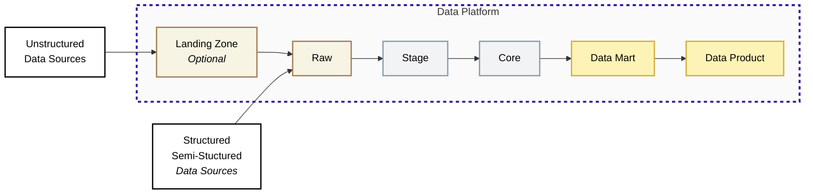

## Data Flow

### Overview

Data Layer is the architectural component responsible for the movement, processing, and storage of data as it flows from source systems to end-user consumption. It acts as the "manufacturing plant" where raw materials (source data) are converted into finished products (insights).

#### Why is it crucial?

Without a structured data layer, organizations suffer from <Term>data swamp</Term> - repositories where data is unorganized, unreliable, and difficult to query. A structured data layer provides:

- **Trust:** Ensures data quality and consistency.
- **History** Preserves historical data that source systems might delete.
- **Performance** Optimizes data structures for fast reporting.
- **Governance** Manage security, <Term>PII</Term>, and access control centrally

### Deep Dive

<DataZones />

### Six-Layer Model

| Layer | Status | Purpose | Modelling |
|-------|--------|---------|-----------|
| **Landing Zone** | Acquired | Physical entry point for files and unstructured data | None |
| **Raw** | Preserved | Complete history of received data, exactly as it arrived | None (source-aligned) |
| **Stage** | Prepared | Technical cleansing and standardisation | None (source-aligned) |
| **Core** | Transformed | Unified business entities with full history | 3NF / Data Vault (entity tables) |
| **Data Mart** | Refined | Analytics-ready datasets for reporting | Dimensional (dim_ and fct_ tables) |
| **Data Product** | Curated | Consumer-ready datasets and metrics | One Big Table (OBT) |

<Callout type="note">
**Medallion Architecture vs Six Layers**
You may have encountered the **Medallion Architecture** (Bronze, Silver, Gold) popularised by Databricks. Our six-layer model is not a replacement-it is an expansion that provides more precise boundaries for enterprise data platforms.
</Callout>

<Callout type="note">
  **Naming convention shift:** Core uses entity names (`customer`, `order`). Dimensional prefixes (`dim_`, `fct_`) are introduced only at Data Mart, signalling the shift from normalised entities to star schemas.
</Callout>

### Why six layers instead of three?

| Medallion Layer | Problem with Single Layer | JMAN Solution |
|-----------------|---------------------------|---------------|
| **Bronze** | Conflates "transient file storage" with "permanent raw history" | **Landing Zone** (transient, 30-day retention) vs **Raw** (permanent, append-only) |
| **Silver** | Mixes "technical cleansing" with "business modelling" | **Stage** (technical standards only) vs **Core** (business entity modelling) |
| **Gold** | Conflates "analyst-facing marts" with "consumer-facing products" | **Data Mart** (internal BI) vs **Data Product** (external apps, APIs, self-serve) |

### When to use which terminology?

- **Client conversations:** Use Medallion terminology if the client already uses it-map to our layers internally
- **Technical documentation:** Use the six-layer model for precision
- **Team discussions:** Use six layers to avoid ambiguity about where work should happen

<Callout type="note">
  The Medallion pattern is not wrong-it is simply less precise. Our six-layer model gives engineers clearer boundaries, especially when multiple teams contribute to different parts of the pipeline.
</Callout>

### Loading Strategy by transition

All pipelines must be <Term>idempotent</Term> - running the same pipeline twice should not duplicate data.

| Transition | Strategy | Description | Rationale |
|------------|----------|-------------|-----------|
| Ingest → Raw | Append-Only | Insert new records only; never update or delete | Preserves complete audit trail for replay |
| Raw → Stage | Incremental + SCD-2 (default) | Process new/changed records via `_loaded_at` watermark. Track historical changes via SCD-2 for dimension-like tables | Preserves full source-level change history before Core narrows schema into business objects; cost-efficient at scale |
| Raw → Stage | Full Refresh (fallback) | Truncate and reload from Raw - used for reference tables or when cleansing rules change | One-off backfill for rule changes or schema evolution; appropriate for small lookup tables (< 10K rows) |
| Stage → Core | Upsert (Merge) | Match by business key; update existing, insert new. Read current state (`__is_active_version = TRUE`) or full history from Stage as needed | Models data into business entities; Core is simplified because SCD-2 history is already managed at Stage |
| Core → Mart | Incremental + SCD-2 | Append new time periods to facts; apply SCD-2 to dimensions to preserve historical attributes | Performance - facts grow indefinitely; SCD-2 ensures mart dimensions retain change history for accurate point-in-time reporting |
| Mart → Product | Materialisation | Pre-compute joins into flat tables | Simplicity - OBT enables true self-serve |

<Callout type="warning">
**Avoid the Full Refresh Forever anti-pattern for Raw → Stage.** Since Raw is append-only and grows indefinitely, a daily full refresh means reprocessing the entire history every run. A table that takes 20 minutes today will take 2 hours within a year. Use incremental loading with a `_loaded_at` watermark as the default. Reserve full refresh for reference/lookup tables and one-off backfills when cleansing rules change.
</Callout>

### Security by Layer

A <Term>Zero Trust</Term> policy is enforced by default. Data is assumed sensitive until explicitly cleared for business consumption.

| Layer | Introduced at this Layer | Cumulative Controls | Who Can Access |
|-------|--------------------------|---------------------|----------------|
| Landing & Raw | Encryption at Rest | Encryption at Rest | Service Accounts, Admin Engineers only |
| Stage | PII Masking | Encryption at Rest + PII Masking | Data Engineers (read), Pipelines (write) |
| Core | Row-Level Security (RLS) | Encryption at Rest + PII Masking + RLS | Analytics Engineers, Data Scientists |
| Mart & Product | Role-Based Access (RBAC) | Encryption at Rest + PII Masking + RLS + RBAC | BI Developers, Business Users |

<Callout type="info">
  **Security controls are cumulative.** Each layer inherits all controls from upstream layers and adds its own. For example, PII masking applied at Stage carries through to Core, Mart, and Product — it is not removed downstream.
</Callout>

### Which layer do I use?

| I need to... | Use this layer |
|--------------|----------------|
| Store incoming files before processing | Landing Zone |
| Query exactly what the source system sent | Raw |
| Apply consistent data types and column names | Stage |
| Build business entities (Customer, Order, Product) | Core |
| Create dashboards and reports | Data Mart |
| Expose data to external apps or self-serve users | Data Product |
