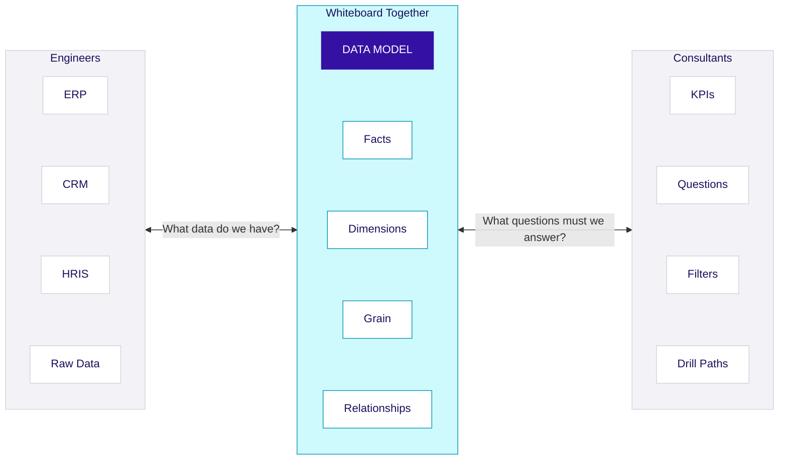
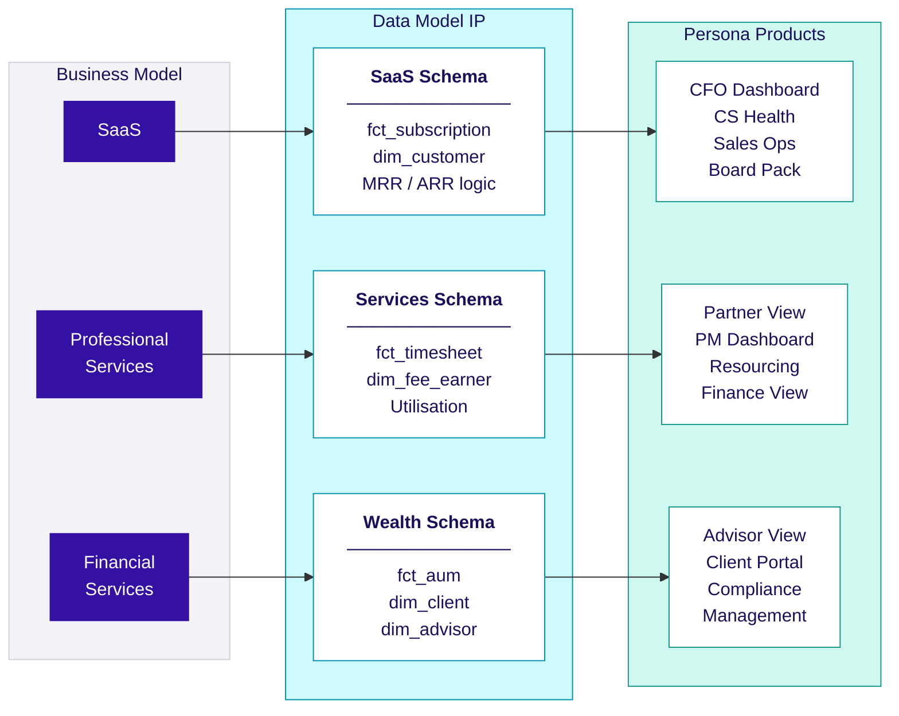
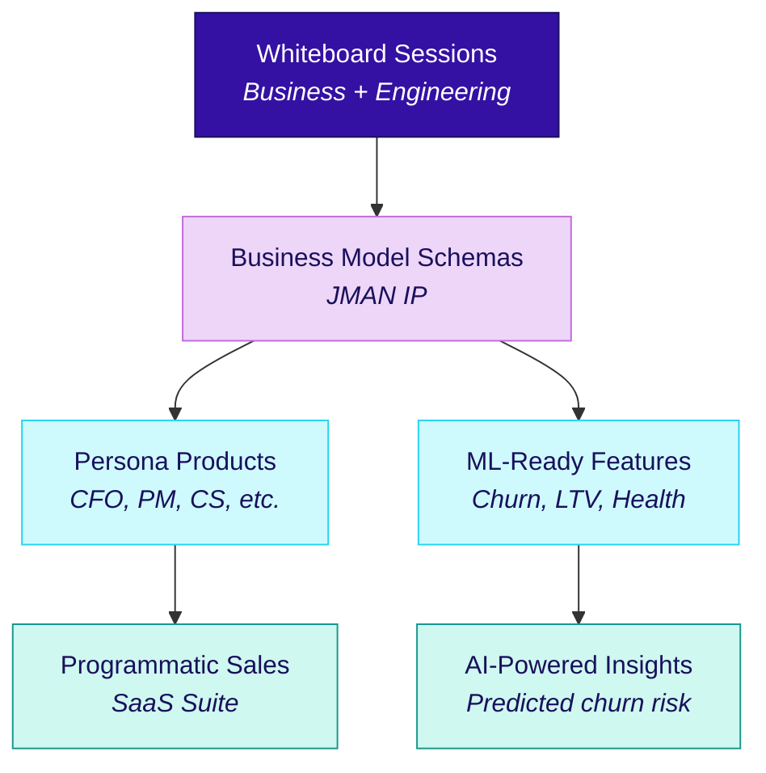

## Collaborative Modelling

### From Data to Impact: The DIKIWI Model

Every data platform captures data. Very few convert it into impact. The **DIKIWI model** describes the journey from raw facts to business outcomes — and collaborative modelling is the engine that drives it.

```mermaid
flowchart LR
    D["<b>Data</b><br/><i>Raw facts<br/>from source systems</i>"]
    I["<b>Information</b><br/><i>Cleaned, structured<br/>contextual records</i>"]
    K["<b>Knowledge</b><br/><i>Patterns, trends<br/>business entities</i>"]
    In["<b>Insight</b><br/><i>Actionable answers<br/>to business questions</i>"]
    W["<b>Wisdom</b><br/><i>Decisions informed<br/>by experience + data</i>"]
    Im["<b>Impact</b><br/><i>Measurable business<br/>outcomes</i>"]

    D --> I --> K --> In --> W --> Im

    style D fill:#f7f4e4,stroke:#A67C52,color:#000
    style I fill:#f2f3f5,stroke:#8B9BAE,color:#000
    style K fill:#f2f3f5,stroke:#8B9BAE,color:#000
    style In fill:#fef3b7,stroke:#D4AF37,color:#000
    style W fill:#fef3b7,stroke:#D4AF37,color:#000
    style Im fill:#CFF8F0,stroke:#18978E,color:#000
```



| Stage | What happens | Data platform layer | Who drives it |
|-------|-------------|-------------------|---------------|
| **Data** | Raw transactions, events, and records land from source systems | Raw | Engineers |
| **Information** | Data is cleaned, typed, deduplicated, and given context | Stage | Engineers |
| **Knowledge** | Business entities are modelled, relationships defined, metrics codified | Core / Mart | Engineers + Consultants |
| **Insight** | Business questions are answered through dashboards, reports, and analytics | Mart / Product | Consultants + Business |
| **Wisdom** | Leaders combine insights with experience to make better decisions | Product / BI | Business |
| **Impact** | Decisions drive measurable outcomes — revenue growth, cost reduction, retention | Business outcomes | Everyone |

<Callout type="info">
**Most data platforms stop at Information.** They clean and store data but never reach Insight. Collaborative modelling is how we bridge the gap — it ensures the data model is designed to answer business questions (Insight), not just mirror source systems (Information).
</Callout>

### The JMAN Approach

#### What Makes Us Different

Most data teams start with source systems: "We have Salesforce and NetSuite, what can we build?" This produces schemas that mirror operational structures — useful, but stuck at the **Information** stage. The data is clean but doesn't answer questions.

JMAN starts with the business model: "This is a Professional Services firm preparing for PE investment. What metrics will drive valuation? What questions will investors ask? What does the board need monthly?" We design for **Insight** and **Impact** from day one.

We work backwards — from outcomes to data, not the other way around:

<div className="not-prose my-6 grid grid-cols-1 sm:grid-cols-2 lg:grid-cols-4 gap-3">
  <div className="rounded-lg border-2 border-emerald-200 dark:border-emerald-800 bg-white dark:bg-slate-900 overflow-hidden">
    <div className="px-3 py-2 border-b border-emerald-200 dark:border-emerald-800 bg-emerald-50 dark:bg-emerald-950/30 flex items-center gap-2">
      <span className="w-5 h-5 rounded-full bg-emerald-500 text-white text-xs font-bold flex items-center justify-center flex-shrink-0">1</span>
      <span className="text-sm font-semibold text-emerald-800 dark:text-emerald-300">Impact</span>
    </div>
    <p className="p-3 text-sm text-slate-600 dark:text-slate-400">What business outcomes are we targeting?</p>
  </div>

  <div className="rounded-lg border-2 border-purple-200 dark:border-purple-800 bg-white dark:bg-slate-900 overflow-hidden">
    <div className="px-3 py-2 border-b border-purple-200 dark:border-purple-800 bg-purple-50 dark:bg-purple-950/30 flex items-center gap-2">
      <span className="w-5 h-5 rounded-full bg-purple-500 text-white text-xs font-bold flex items-center justify-center flex-shrink-0">2</span>
      <span className="text-sm font-semibold text-purple-800 dark:text-purple-300">Insight</span>
    </div>
    <p className="p-3 text-sm text-slate-600 dark:text-slate-400">What questions must the data answer to drive those outcomes?</p>
  </div>

  <div className="rounded-lg border-2 border-indigo-200 dark:border-indigo-800 bg-white dark:bg-slate-900 overflow-hidden">
    <div className="px-3 py-2 border-b border-indigo-200 dark:border-indigo-800 bg-indigo-50 dark:bg-indigo-950/30 flex items-center gap-2">
      <span className="w-5 h-5 rounded-full bg-indigo-500 text-white text-xs font-bold flex items-center justify-center flex-shrink-0">3</span>
      <span className="text-sm font-semibold text-indigo-800 dark:text-indigo-300">Knowledge</span>
    </div>
    <p className="p-3 text-sm text-slate-600 dark:text-slate-400">What metrics, facts, and dimensions encode those answers?</p>
  </div>

  <div className="rounded-lg border-2 border-slate-200 dark:border-slate-700 bg-white dark:bg-slate-900 overflow-hidden">
    <div className="px-3 py-2 border-b border-slate-200 dark:border-slate-700 bg-slate-50 dark:bg-slate-800/50 flex items-center gap-2">
      <span className="w-5 h-5 rounded-full bg-slate-400 text-white text-xs font-bold flex items-center justify-center flex-shrink-0">4</span>
      <span className="text-sm font-semibold text-slate-700 dark:text-slate-300">Information</span>
    </div>
    <p className="p-3 text-sm text-slate-600 dark:text-slate-400">What source data do we need, cleaned and structured?</p>
  </div>
</div>

This approach means our dimensional models directly answer business questions. There's no translation layer between "what the data shows" and "what the business needs."

<div className="not-prose my-4 rounded-lg border-2 border-jman-trypan dark:border-purple-700 bg-white dark:bg-slate-900 p-4">
  <p className="text-xs font-semibold uppercase tracking-wide text-jman-trypan dark:text-purple-400 mb-1.5">The data model is JMAN's IP</p>
  <p className="text-sm text-slate-700 dark:text-slate-300">BI tools come and go. A well-designed dimensional model persists for years, survives tool migrations, and forms the foundation for AI/ML initiatives. <span className="font-medium text-slate-900 dark:text-slate-100">This is what we productise.</span></p>
</div>

#### Business Model Thinking

Different business models have different metric priorities. Understanding this is essential to designing the right dimensional model.

| Business Model | Revenue Pattern | Key Entity | Critical Metrics |
|----------------|-----------------|------------|------------------|
| **SaaS** | Subscription + usage | Subscription | MRR, ARR, Churn, NRR, Feature Adoption |
| **Professional Services** | Time & materials + fixed fee | Fee-Earner | Utilisation, Revenue per FTE, Project Margin |
| **Financial Setvices** | AUM-based fees + transactions | Client Relationship | AUM Growth, Client Retention, Advisor Productivity |
| **Field Services** | Job-based + maintenance contracts | Job / Asset | Job Profitability, First-Time Fix Rate, Technician Utilisation |

A SaaS company cares deeply about expansion revenue and feature adoption. A Professional Services firm obsesses over utilisation and fee-earner retention. The dimensional model must reflect these priorities.

#### Metric Themes

Across all business models, metrics cluster into common themes. The specific KPIs vary, but the themes are consistent:

<div className="not-prose my-4 grid grid-cols-1 sm:grid-cols-2 gap-3">
  {[
    ["Revenue", "How much are we earning, and is it growing?", "MRR, ARR, Gross Revenue"],
    ["Margin Growth", "Are we profitable at customer and product level?", "Gross Margin, Project Margin, EBITDA"],
    ["Customer Analysis", "Who are our customers, are we retaining them, how concentrated is revenue?", "Retention, Concentration, Cohorts"],
    ["Future Revenue & Pipeline", "What's coming, and how confident are we?", "Pipeline Coverage, Weighted ARR"],
    ["Customer Expansion", "Are existing customers buying more?", "NRR, Expansion MRR, Upsell Rate"],
    ["Business-Model Specific", "Metrics unique to the client's operating model", "Utilisation · Usage · AUM"],
  ].map(([theme, question, examples], i) => (
    <div key={i} className="rounded-lg border border-slate-200 dark:border-slate-700 bg-white dark:bg-slate-900 p-3 flex flex-col gap-1.5">
      <span className="text-sm font-semibold text-slate-800 dark:text-slate-200">{theme}</span>
      <span className="text-sm text-slate-500 dark:text-slate-400">{question}</span>
      <div className="flex flex-wrap gap-1 pt-1">
        {examples.split(" · ").flatMap(e => e.split(", ")).map((tag, j) => (
          <span key={j} className="text-xs px-2 py-0.5 rounded-full bg-slate-100 dark:bg-slate-800 text-slate-600 dark:text-slate-400">{tag}</span>
        ))}
      </div>
    </div>
  ))}
</div>

Each theme maps to specific facts, dimensions, and calculations in the dimensional model.

### How we build Data Models

#### The Problem: Column Request Culture

In many organisations — including, historically, at JMAN — data modelling happens like this:

<div className="not-prose my-6 grid grid-cols-1 md:grid-cols-2 gap-4">
  <div className="rounded-lg border border-amber-200 dark:border-amber-800 bg-amber-50 dark:bg-amber-950/20 p-4">
    <p className="text-xs font-semibold uppercase tracking-wide text-amber-700 dark:text-amber-400 mb-3">The doom loop</p>
    <ol className="space-y-2">
      {[
        "Consultant emails: \"Can you add customer industry to the sales table?\"",
        "Engineer adds the column",
        "Consultant realises they also need customer size band",
        "Engineer adds another column",
        "Three months later, nobody remembers why these columns exist",
      ].map((step, i) => (
        <li key={i} className="flex items-start gap-3">
          <span className="flex-shrink-0 w-5 h-5 rounded-full bg-amber-200 dark:bg-amber-800 text-amber-800 dark:text-amber-200 text-xs font-bold flex items-center justify-center mt-0.5">{i + 1}</span>
          <span className="text-sm text-slate-700 dark:text-slate-300">{step}</span>
        </li>
      ))}
    </ol>
  </div>

  <div className="rounded-lg border border-rose-200 dark:border-rose-800 bg-rose-50 dark:bg-rose-950/20 p-4">
    <p className="text-xs font-semibold uppercase tracking-wide text-rose-700 dark:text-rose-400 mb-3">Models this creates</p>
    <ul className="space-y-2">
      {[
        ["Reactive", "Built for individual requests, not business needs"],
        ["Fragmented", "No coherent structure or design intent"],
        ["Poorly understood", "Engineers don't know why; consultants don't know how"],
        ["Limited", "Can only answer today's questions, not tomorrow's"],
      ].map(([title, detail], i) => (
        <li key={i} className="flex items-start gap-2 text-sm text-slate-700 dark:text-slate-300">
          <span className="text-rose-500 mt-0.5 flex-shrink-0">✗</span>
          <span><span className="font-medium text-slate-900 dark:text-slate-100">{title}</span> — {detail}</span>
        </li>
      ))}
    </ul>
    <p className="mt-3 pt-3 border-t border-rose-200 dark:border-rose-800 text-xs text-rose-700 dark:text-rose-400">Root cause: consultants think dashboards, engineers think tables, nobody thinks about the model.</p>
  </div>
</div>

### The JMAN Way: Collaborative Data Modelling

Data modelling is where business and technology come together. It's not a technical task delegated to engineers-it's a shared design exercise that requires both business context and technical understanding.

**The principle:** Bring the right-hand side (dashboards, insights, business questions) and the left-hand side (raw data, source systems, engineers) together at a whiteboard before anyone writes code.



#### The Whiteboard Session

A data modelling session brings together:
- **Engineers** - Who understand source systems, data quality, and technical constraints
- **Consultants** - Who understand business context, stakeholder needs, and analytical questions
- **Optionally: Client stakeholders** - Who validate that we're solving the right problem

**The session structure:**

| Phase | Duration | Focus | Output |
|-------|----------|-------|--------|
| **1. Business Context** | 20 mins | Consultants explain: What decisions will this data support? What questions must we answer? | List of business questions |
| **2. Metrics & Dimensions** | 30 mins | Together: What metrics answer these questions? What do we filter/group by? | Metric list, dimension attributes |
| **3. Source Reality Check** | 20 mins | Engineers explain: Where does this data live? What's the quality? What's missing? | Data availability matrix |
| **4. Model Design** | 30 mins | Together: What facts? What dimensions? What grain? | Whiteboard schema sketch |
| **5. Future-Proofing** | 15 mins | Together: What questions might come next? Does this structure support them? | Design validation |

**Total: ~2 hours for initial model design**

#### What each side learns

The whiteboard approach isn't just about producing a schema. It's about building shared understanding.

**What engineers learn:**

| Without Whiteboard | With Whiteboard |
|--------------------|-----------------|
| "Add customer industry column" | "We need customer industry because the CFO wants to see revenue concentration by vertical-if one industry is >40%, it's a risk flag for investors" |
| No context for design decisions | Clear rationale for every structural choice |
| Builds exactly what's requested | Anticipates related questions ("If they want industry concentration, they'll probably want cohort analysis too") |
| Reactive, ticket-driven work | Proactive, design-driven work |

**What consultants learn:**

| Without Whiteboard | With Whiteboard |
|--------------------|-----------------|
| "The data should just be there" | "Customer industry isn't in the ERP-we'd need to enrich from CRM, and 30% of records are missing" |
| Assumes any question is answerable | Understands what's possible vs. what requires new data collection |
| Treats data model as black box | Understands structure: "I can slice by anything in dim_customer" |
| Requests columns ad-hoc | Thinks in terms of dimensions and facts |

### The Conversation Framework

Use these questions to drive the whiteboard session:

**Starting from the right (Business → Model):**

| Question | Purpose |
|----------|---------|
| "What decision will this data support?" | Grounds the model in business value |
| "If you could see one number tomorrow, what would it be?" | Identifies the priority metric |
| "How will you slice that number?" | Reveals dimension requirements |
| "What would make you drill deeper?" | Uncovers grain requirements |
| "What question will the CEO ask next?" | Future-proofs the design |

**Connecting to the left (Model → Data):**

| Question | Purpose |
|----------|---------|
| "Where does [metric] come from?" | Maps metrics to source systems |
| "Is [attribute] reliably captured?" | Exposes data quality constraints |
| "How often does [entity] change?" | Informs SCD strategy |
| "What's missing that we'd need to collect?" | Identifies data gaps early |
| "Can we get 3 years of history?" | Validates PE-readiness |

### Example: Whiteboard in Action

**Scenario:** Professional Services client wants utilisation reporting.

**Consultant opens with business context:**
> "The Managing Partner wants to see fee-earner utilisation to identify capacity for new projects. They've been using spreadsheets but the numbers are always two weeks old and nobody trusts them."

**Together, we unpack the metrics:**

| Question | Answer | Model Implication |
|----------|--------|-------------------|
| "What is utilisation, exactly?" | Billable hours ÷ available hours | Need both measures in fact table |
| "Available hours for everyone, or just fee-earners?" | Just fee-earners, not admin staff | Need `dim_fee_earner` with role classification |
| "Do we need to see by project?" | Yes, to identify which projects consume capacity | Need `dim_project` and project FK in fact |
| "What about by grade or department?" | Definitely-we want to see senior vs junior utilisation | Need grade and department in `dim_fee_earner` |
| "How granular? Daily? Weekly?" | Daily would be ideal for spotting patterns | Grain: one row per fee-earner per day |

**Engineer reality-checks the data:**
> "Timesheet data is in Mavenlink, daily entries exist but 'available hours' isn't tracked-we'd need to calculate from contract hours minus holiday. HR data is in BambooHR. We'll need to join them."

**The model emerges on the whiteboard:**

```
fct_timesheet (daily grain)
├── fee_earner_key → dim_fee_earner (grade, department, contract_hours)
├── project_key → dim_project (client, service_line)
├── date_key → dim_date (working_day flag)
├── billable_hours
├── non_billable_hours
└── available_hours (calculated: contract_hours × working_day)

Utilisation = SUM(billable_hours) / SUM(available_hours)
```

**Future-proofing check:**
> "If they ask for utilisation by client next month, can we answer that?" → Yes, dim_project has client_key.
> "What about comparing to target utilisation?" → We'd need target_utilisation in dim_fee_earner or a separate target fact.

**Result:** In two hours, we have a validated schema that engineers can build and consultants can explain to the client.

### When to Whiteboard

Not every change needs a full session. Use this guide:

| Change Type | Approach |
|-------------|----------|
| **New domain / major model** | Full whiteboard session (2 hours) |
| **New fact table** | Mini whiteboard (30-60 mins) |
| **New dimension** | Discussion + sketch (30 mins) |
| **New attributes to existing dimension** | Quick sync: "Why do we need this? What question does it answer?" |
| **Bug fix / data quality issue** | No whiteboard needed |

**The minimum bar:** No structural change to the data model without understanding the business question it answers.

### Embedding this in Delivery

To make collaborative modelling the norm, not the exception:

<div className="not-prose my-6 grid grid-cols-1 sm:grid-cols-2 lg:grid-cols-3 gap-3">
  {[
    {
      step: 1,
      title: "Include modelling sessions in project plans",
      items: ["Estimate 2–4 hours of whiteboard time per major domain", "Schedule early — before engineering sprints begin"],
    },
    {
      step: 2,
      title: "Require business context in tickets",
      items: ["Every model change ticket includes: \"Business question this answers\"", "Engineers push back if context is missing"],
    },
    {
      step: 3,
      title: "Rotate engineers into client workshops",
      items: ["Engineers hear business context firsthand", "Breaks down the \"throw it over the wall\" dynamic"],
    },
    {
      step: 4,
      title: "Share the model visually",
      items: ["ERD diagrams in documentation", "Consultants can point to structure when explaining what's possible"],
    },
    {
      step: 5,
      title: "Retrospect on model quality",
      items: ["Did this model answer the questions we expected?", "What questions came up that we couldn't answer?"],
    },
  ].map(({ step, title, items }, i) => (
    <div key={i} className="rounded-lg border border-slate-200 dark:border-slate-800 bg-white dark:bg-slate-900 p-4">
      <div className="flex items-center gap-2 mb-2">
        <span className="w-6 h-6 rounded-full bg-jman-trypan text-white text-xs font-bold flex items-center justify-center flex-shrink-0">{step}</span>
        <p className="text-sm font-semibold text-slate-800 dark:text-slate-200">{title}</p>
      </div>
      <ul className="space-y-1">
        {items.map((item, j) => (
          <li key={j} className="flex items-start gap-2 text-sm text-slate-600 dark:text-slate-400">
            <span className="mt-1.5 w-1 h-1 rounded-full bg-slate-300 dark:bg-slate-600 flex-shrink-0" />{item}
          </li>
        ))}
      </ul>
    </div>
  ))}
</div>

### Why this matters for AI/ML/Data Science

A well-designed dimensional model isn't just for dashboards-it's the foundation for AI/ML use cases. When engineers understand business context, they build models that are inherently ML-ready.

**The connection:**

| Dimensional Modelling Benefit | AI/ML Benefit |
|-------------------------------|---------------|
| **Clear grain** | Features are unambiguous-one row per customer per month means one feature vector per customer per month |
| **Conformed dimensions** | Features are consistent across training and inference-no entity mismatches |
| **Business-aligned metrics** | Target variables are meaningful-predicting "churn" means the same thing everywhere |
| **Historical depth** | Training data exists-3+ years of history enables robust model training |
| **Documented calculations** | Feature engineering is reproducible-no hidden logic in notebooks |

**Example: Churn Prediction**

<div className="not-prose my-6 grid grid-cols-1 md:grid-cols-2 gap-4">
  <div className="rounded-lg border border-rose-200 dark:border-rose-800 bg-white dark:bg-slate-900 overflow-hidden">
    <div className="bg-rose-50 dark:bg-rose-950/30 px-4 py-3 border-b border-rose-200 dark:border-rose-800">
      <p className="text-xs font-semibold uppercase tracking-wide text-rose-700 dark:text-rose-400">Without collaborative modelling</p>
    </div>
    <ul className="p-4 space-y-2">
      {[
        "Data scientist builds features from raw tables",
        "\"Churn\" is defined differently than how business measures it",
        "Model predicts something, but it doesn't match business reality",
        "Results can't be explained to stakeholders",
      ].map((item, i) => (
        <li key={i} className="flex items-start gap-2 text-sm text-slate-700 dark:text-slate-300">
          <span className="text-rose-500 mt-0.5 flex-shrink-0">✗</span>{item}
        </li>
      ))}
    </ul>
  </div>

  <div className="rounded-lg border border-emerald-200 dark:border-emerald-800 bg-white dark:bg-slate-900 overflow-hidden">
    <div className="bg-emerald-50 dark:bg-emerald-950/30 px-4 py-3 border-b border-emerald-200 dark:border-emerald-800">
      <p className="text-xs font-semibold uppercase tracking-wide text-emerald-700 dark:text-emerald-400">With collaborative modelling</p>
    </div>
    <ul className="p-4 space-y-2">
      {[
        ["dim_customer", "already has cohort, segment, and engagement attributes"],
        ["fct_subscription", "already defines churn events (business-validated)"],
        ["Pre-computed features", "days_since_last_login, revenue_trend_3m ready to use"],
        ["Reconcilable results", "Model predicts business-defined churn; output matches dashboards"],
      ].map(([title, detail], i) => (
        <li key={i} className="flex items-start gap-2 text-sm text-slate-700 dark:text-slate-300">
          <span className="text-emerald-500 mt-0.5 flex-shrink-0">✓</span>
          <span><code className="text-xs bg-slate-100 dark:bg-slate-800 px-1 rounded">{title}</code>{title.startsWith("dim") || title.startsWith("fct") ? " " : " — "}{detail}</span>
        </li>
      ))}
    </ul>
  </div>
</div>
**The principle:** If consultants and engineers co-designed the model, data scientists inherit a structure that already encodes business logic. They can focus on modelling, not data wrangling.

**ML-ready design considerations:**

| Consideration | How Whiteboard Sessions Help |
|---------------|------------------------------|
| **Feature availability** | Engineer flags: "We don't have login data before 2023" |
| **Label quality** | Consultant clarifies: "Churn means no revenue for 90 days, not contract cancellation" |
| **Temporal leakage** | Together: "We can't use `lifetime_value` to predict churn-it includes future data" |
| **Entity resolution** | Consultant: "One customer can have multiple subscriptions-predict at subscription level" |

### Enabling Programmatic Selling: The Product Suite Vision

The collaborative modelling approach isn't just good practice-it's the foundation for JMAN's productisation strategy.

**The insight:** Every business model has predictable metrics, predictable dimensions, and predictable questions. If we codify these into reusable data models, we can build **persona-focused products** that work out of the box.



**How collaborative modelling enables this:**

| Without Collaborative Approach | With Collaborative Approach |
|--------------------------------|----------------------------|
| Every engagement starts from scratch | Proven schemas per business model |
| Models reflect one client's quirks | Models reflect industry best practice |
| Hard to generalise learnings | Patterns codified into reusable IP |
| Selling = selling hours | Selling = selling outcomes |

**The flywheel:**

<Flywheel
  centreLabel="JMAN IP"
  centreSubLabel="Flywheel"
  steps={[
    { number: 1, title: "Whiteboard", description: "Capture business context across clients" },
    { number: 2, title: "Patterns Emerge", description: "Every PS firm needs utilisation, every SaaS firm needs NRR" },
    { number: 3, title: "Schemas Codified", description: "JMAN standard models per business type" },
    { number: 4, title: "Products Built", description: "Persona-focused dashboards on the standard model" },
    { number: 5, title: "Programmatic Sales", description: "Sell outcomes, not hours" }
  ]}
/>

### Persona-Focused Products

The data model enables multiple products for different personas within the same client, all consuming the same underlying structure.

**Example: Professional Services Product Suite**

| Persona | Questions They Ask | Product | Data Model Components Used |
|---------|-------------------|---------|---------------------------|
| **Managing Partner** | "Are we on track for the year? Where's our capacity?" | Partner Dashboard | fct_billing, fct_pipeline, dim_fee_earner (aggregate utilisation) |
| **Project Manager** | "Is this project profitable? Are we over-servicing?" | PM Dashboard | fct_timesheet, fct_project_budget, dim_project |
| **Resource Manager** | "Who's available next month? Who's over-utilised?" | Resourcing Tool | fct_timesheet, dim_fee_earner, dim_date (forward-looking) |
| **Finance Director** | "What's our revenue recognition? WIP position?" | Finance View | fct_billing, fct_timesheet, dim_project (WIP calculations) |
| **Fee-Earner** | "How am I tracking? What's my utilisation?" | My Performance | fct_timesheet filtered to individual |

**One data model, five products.** Each persona gets exactly what they need, but the underlying truth is consistent.

**Example: SaaS Product Suite**

| Persona | Questions They Ask | Product | Data Model Components Used |
|---------|-------------------|---------|---------------------------|
| **CFO** | "What's our ARR? NRR? Path to profitability?" | CFO Dashboard | fct_subscription, fct_revenue, margin calculations |
| **VP Sales** | "Pipeline coverage? Conversion rates? Rep performance?" | Sales Ops | fct_pipeline, fct_opportunity, dim_sales_rep |
| **Customer Success** | "Which accounts are at risk? Expansion opportunities?" | CS Health | fct_usage, fct_subscription, health score model |
| **Product** | "Feature adoption? Usage patterns?" | Product Analytics | fct_usage_event, dim_feature, dim_customer |
| **Board** | "Investment narrative? Key metrics?" | Board Pack | Curated metrics from all facts |

### From Consulting to Product: The Commercial Shift

This approach changes how JMAN sells:

| Traditional Consulting | Product-Led Approach |
|------------------------|---------------------|
| "We'll build you a data platform" | "Here's the SaaS Analytics Suite-let us configure it for you" |
| Scope is ambiguous, timelines uncertain | Scope is defined, outcomes are known |
| Every engagement is custom | 80% reusable, 20% configuration |
| Value = hours delivered | Value = outcomes unlocked |
| Hard to scale | Scales with product investment |

**Programmatic selling conversation:**

> "You're a £20M ARR SaaS business preparing for Series B. We know exactly what metrics your investors will ask for-MRR, NRR, logo retention, LTV:CAC, magic number. We've built the data model that calculates these correctly. We've built the CFO dashboard that presents them. We've built the investor data room that packages them. Your job is to connect your Salesforce and Stripe"

This is only possible because:
1. We've done the whiteboard sessions across many SaaS clients
2. We've codified the patterns into a standard schema
3. We've built persona products on top of that schema
4. We can sell outcomes, not hours

### Tying It Together

The collaborative data modelling approach is the **engine** that powers everything downstream:



**The message to the team:**

When you're in a whiteboard session designing a data model, you're not just solving one client's problem. You're contributing to **JMAN's intellectual property**. You're making the next engagement faster. You're building the foundation for products that scale beyond consulting hours.

This is why the collaborative approach matters. This is why engineers need business context. This is why consultants need to understand data structures. 

**The data model is the product.**