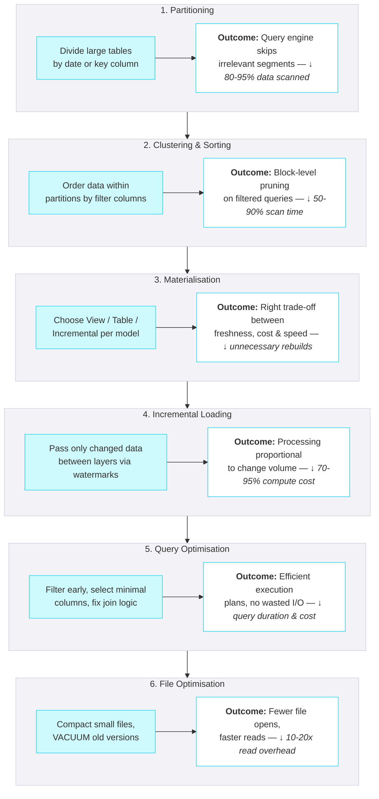

## Performance Optimisation

<Callout type="info">
**Performance is a design decision, not an afterthought.** Partitioning, clustering, and materialisation choices made early in the pipeline determine whether queries take seconds or minutes — and whether compute bills stay manageable.
</Callout>



### Partitioning

Partitioning divides large tables into smaller, physically separate segments so the query engine can skip irrelevant data entirely. This is the single most impactful performance lever for large tables.

#### When to Partition

| Condition | Partition? | Rationale |
|-----------|-----------|-----------|
| Table > 1 billion rows or > 1 TB | **Yes** | Query engines scan less data |
| Queries consistently filter on a date column | **Yes** | Date partitioning enables partition pruning |
| Table < 10 million rows | **No** | Overhead outweighs benefit; clustering alone is sufficient |
| No consistent filter pattern | **No** | Partitioning without pruning adds cost, not speed |

#### Partitioning by Layer

| Layer | Recommended Partition Key | Rationale |
|-------|--------------------------|-----------|
| **Raw** | `__data_loaded_at` (ingestion date) | Queries filter by load batch; supports incremental reads |
| **Stage** | `__data_loaded_at` or source date column | Mirrors Raw for incremental processing |
| **Core** | Business date (e.g., `order_date`, `event_date`) | Queries filter by business periods |
| **Mart** | Business date (e.g., `transaction_date`, `reporting_date`) | BI queries filter by reporting periods |
| **Product** | Business date or `data_as_of` | Consumer queries filter by freshness |

<PlatformTabs>

<PlatformTabsDatabricks>

#### Delta Lake Partitioning

Delta Lake supports Hive-style partitioning and liquid clustering (recommended for new tables).

```sql
-- Hive-style partitioning (legacy — use for very large tables with clear date filters)
CREATE TABLE raw.salesforce.account (
  account_id STRING,
  account_name STRING,
  __data_loaded_at DATE
)
USING DELTA
PARTITIONED BY (__data_loaded_at);

-- Liquid clustering (preferred — adaptive, no manual partition management)
CREATE TABLE core.customer (
  customer_id STRING,
  customer_name STRING,
  region STRING,
  created_date DATE
)
USING DELTA
CLUSTER BY (region, created_date);
```

**Liquid Clustering vs Hive Partitioning:**

| Aspect | Hive Partitioning | Liquid Clustering |
|--------|-------------------|-------------------|
| **Setup** | Must choose partition column upfront | Specify cluster columns; engine optimises layout |
| **Small files** | Risk of too many small partitions | Automatically compacts |
| **Column changes** | Requires table rewrite | Can change cluster columns without rewrite |
| **Best for** | Very large tables with single date filter | Most tables; multi-column filter patterns |

</PlatformTabsDatabricks>

<PlatformTabsSnowflake>

#### Snowflake Micro-Partitioning

Snowflake automatically micro-partitions all tables. You do not choose partition columns — instead, you influence data layout through **clustering keys**.

```sql
-- Define clustering key (Snowflake handles physical layout automatically)
ALTER TABLE core.customer
  CLUSTER BY (region, created_date);

-- Check clustering quality
SELECT SYSTEM$CLUSTERING_INFORMATION('core.customer', '(region, created_date)');
```

**When to Set Clustering Keys:**

| Condition | Action |
|-----------|--------|
| Table < 1 TB and queries are fast | No clustering key needed |
| Table > 1 TB with consistent filter columns | Set clustering key on those columns |
| Poor clustering depth (> 4) | Reclustering needed |

<Callout type="warning">
**Automatic Clustering costs credits.** Snowflake continuously maintains clustering in the background. Monitor `AUTOMATIC_CLUSTERING_HISTORY` to ensure the cost is justified by query performance gains.
</Callout>

</PlatformTabsSnowflake>

<PlatformTabsFabric>

#### Fabric / Delta Lake Partitioning

Fabric Lakehouses use Delta Lake under the hood. Partitioning follows the same Delta Lake patterns.

```sql
-- Spark SQL partitioning
CREATE TABLE raw_salesforce.account (
  account_id STRING,
  account_name STRING,
  __data_loaded_at DATE
)
USING DELTA
PARTITIONED BY (__data_loaded_at);
```

**Fabric-Specific Considerations:**

| Aspect | Guidance |
|--------|----------|
| **Lakehouse tables** | Partition by date for large tables; V-Order optimisation is applied automatically |
| **Warehouse tables** | No manual partitioning — Fabric SQL engine handles distribution |
| **V-Order** | Fabric's built-in columnar optimisation; enabled by default on Lakehouse writes |
| **Partition count** | Keep under 10,000 partitions to avoid metadata overhead |

</PlatformTabsFabric>

</PlatformTabs>

### Clustering & Sorting

Clustering (or sort keys) controls the physical order of data within partitions. Well-clustered data enables the engine to skip irrelevant data blocks during scans.

#### Choosing Cluster Columns

Select columns that appear most frequently in `WHERE` and `JOIN` clauses:

| Priority | Column Type | Example |
|----------|-------------|---------|
| 1st | High-cardinality filter | `customer_id`, `order_id` |
| 2nd | Date/time filter | `order_date`, `created_at` |
| 3rd | Low-cardinality grouping | `region`, `status`, `country` |

**Rules of thumb:**

- Limit to 3-4 cluster columns maximum
- Put the most selective column first
- Date columns are almost always good candidates
- Avoid clustering on columns that are rarely filtered

### Materialisation Strategies

Materialisation determines how dbt (or your transformation tool) builds each model. The right choice balances freshness, cost, and query performance.

| Strategy | How It Works | Best For |
|----------|-------------|----------|
| **View** | SQL runs on query; no storage cost | Small lookups, simple transforms, development |
| **Table** | Full data written to storage | Large tables queried frequently, Mart/Product layers |
| **Incremental** | Only new/changed rows processed | Large fact tables, append-heavy data, Raw → Stage |
| **Ephemeral** | Inlined as CTE; no object created | Reusable logic fragments, intermediate calculations |
| **Snapshot** | SCD-2 history tracking | Slowly changing dimensions |

#### Materialisation by Layer

| Layer | Default Materialisation | Override When |
|-------|------------------------|---------------|
| **Raw** | Not applicable (loaded by ingestion tool) | — |
| **Stage** | Incremental | Full refresh for reference/lookup tables |
| **Core** | Incremental or Table | View for very small reference tables |
| **Mart** | Table | Incremental for very large fact tables |
| **Product** | Table | — |

<Callout type="warning">
**Views in Mart are a performance trap.** A Mart view that joins 5 Core tables looks clean in dbt but forces the query engine to re-execute all joins on every dashboard refresh. Materialise Mart models as tables unless the dataset is trivially small.
</Callout>

### Incremental Layer-to-Layer Loading

One of the highest-impact performance decisions is **how much data moves between layers**. Loading the full table from Raw → Stage → Core → Mart on every run is the number one cause of pipelines that start fast and become unusable within months.

<Callout type="warning">
**Every layer boundary should transfer only changed data.** If your Stage model re-reads the entire Raw table on every run, you are paying full-refresh cost at every layer — compounding the waste.
</Callout>

#### The Pattern: Watermark-Based Incremental Reads

Each layer reads only rows that arrived **since the last successful run**, using a high-watermark column (typically `__data_loaded_at` or a source timestamp).

```sql
-- Stage reading only new rows from Raw (dbt incremental example)
-- The watermark ensures only new data flows downstream

{{
  config(
    materialized='incremental',
    unique_key='order_id',
    incremental_strategy='merge'
  )
}}

SELECT
    order_id,
    customer_id,
    order_date,
    amount,
    __data_loaded_at
FROM {{ source('raw', 'orders') }}


WHERE __data_loaded_at > (SELECT MAX(__data_loaded_at) FROM {{ this }})

```

#### Layer-by-Layer Incremental Strategy

| Transition | Watermark Column | Strategy | Notes |
|------------|-----------------|----------|-------|
| **Ingestion → Raw** | Handled by ingestion tool | Append or merge | Tool (Fivetran, ADF) tracks its own cursor |
| **Raw → Stage** | `__data_loaded_at` | Incremental merge | Only read new load batches |
| **Stage → Core** | `__data_loaded_at` or `updated_at` | Incremental merge | Apply business logic to changed rows only |
| **Core → Mart** | `updated_at` or `__data_loaded_at` | Incremental merge or full rebuild | Full rebuild acceptable for small Mart tables |

<Callout type="question">
**When is full refresh acceptable between layers?**
- Reference/lookup tables (< 100K rows)
- Mart tables under 10M rows where rebuild takes < 5 minutes
- After schema changes or backfill operations
- Core → Mart for small dimension tables
</Callout>

<Callout type="info">
For detailed patterns (watermark, CDC, merge, delete handling) see [Incremental Loading Patterns](/playbook/data-engineering/transformation/engineering-practices/incremental-loading).
</Callout>

### Query Optimisation

#### Common Query Anti-Patterns

| Anti-Pattern | Problem | Fix |
|-------------|---------|-----|
| `SELECT *` | Scans all columns; wastes I/O | Select only needed columns |
| Cross join (accidental) | Cartesian product explodes row count | Always use explicit `JOIN ON` |
| `ORDER BY` without `LIMIT` | Sorts entire dataset | Add `LIMIT` or remove `ORDER BY` |
| Nested subqueries (3+ levels) | Optimiser can't push predicates down | Refactor to CTEs or intermediate models |
| `DISTINCT` as a band-aid | Hides duplicate root cause | Fix the join logic that produces duplicates |
| Functions on filter columns | Prevents partition pruning | Filter on raw column: `WHERE date_col >= '2026-01-01'` not `WHERE YEAR(date_col) = 2026` |

#### Optimisation Checklist

1. **Filter early** — Push `WHERE` clauses as close to source tables as possible
2. **Join small to large** — Place the smaller table on the build side of the join
3. **Avoid repeated scans** — Use CTEs or intermediate models instead of scanning the same large table multiple times
4. **Pre-aggregate** — If multiple consumers need the same aggregation, build it once as a model
5. **Use approximate functions** — `APPROX_COUNT_DISTINCT` instead of `COUNT(DISTINCT)` for large-scale analytics where 2% error is acceptable

### File Optimisation (Delta Lake / Iceberg)

Small files degrade read performance. Ensure regular compaction across all layers.

<PlatformTabs>

<PlatformTabsDatabricks>

#### OPTIMIZE and ZORDER

```sql
-- Compact small files and sort by frequently filtered columns
OPTIMIZE core.customer ZORDER BY (region, created_date);

-- For Delta tables with liquid clustering, just run OPTIMIZE
OPTIMIZE core.orders;
```

**Recommended Schedule:**

| Layer | OPTIMIZE Frequency | VACUUM Frequency |
|-------|-------------------|-----------------|
| **Raw** | Daily (after ingestion) | Weekly (retain 7 days) |
| **Stage** | Daily | Weekly (retain 7 days) |
| **Core** | Daily | Weekly (retain 30 days) |
| **Mart** | After each refresh | Weekly (retain 7 days) |

```sql
-- Remove old file versions (frees storage)
VACUUM core.customer RETAIN 168 HOURS; -- 7 days
```

</PlatformTabsDatabricks>

<PlatformTabsSnowflake>

#### Automatic File Management

Snowflake handles all file compaction, storage layout, and garbage collection automatically. No manual `OPTIMIZE` or `VACUUM` is needed.

**What you can control:**

| Action | Command |
|--------|---------|
| Check clustering health | `SELECT SYSTEM$CLUSTERING_INFORMATION('schema.table')` |
| Force reclustering | `ALTER TABLE schema.table RECLUSTER` |
| Monitor storage | `SELECT * FROM TABLE(INFORMATION_SCHEMA.TABLE_STORAGE_METRICS())` |

</PlatformTabsSnowflake>

<PlatformTabsFabric>

#### Delta Lake Maintenance in Fabric

```sql
-- Compact small files (run in Spark notebook)
from delta.tables import DeltaTable

dt = DeltaTable.forPath(spark, "Tables/core/customer")
dt.optimize().executeCompaction()

-- VACUUM to remove old versions
dt.vacuum(168)  -- retain 7 days
```

**Fabric-Specific Notes:**

- V-Order is applied automatically on Lakehouse writes — no manual action needed
- Run `OPTIMIZE` after large batch loads to compact small files
- Schedule maintenance notebooks via Fabric Data Factory pipelines

</PlatformTabsFabric>

</PlatformTabs>

### Performance Monitoring

Track these metrics to detect degradation before users notice:

| Metric | What to Watch | Action Threshold |
|--------|--------------|-----------------|
| **Query duration (p95)** | 95th percentile of query time for key models | > 2x baseline |
| **Bytes scanned** | Data volume read per query | Increasing trend without data growth |
| **Partition pruning ratio** | % of partitions skipped | < 80% for partitioned tables |
| **Clustering depth** | How well-ordered the data is | > 4 (Snowflake) |
| **Small file count** | Files < 64 MB in Delta tables | > 20% of total files |
| **Spill to disk** | Queries exceeding memory | Any spill on recurring queries |

### Dos and Don'ts

<DosAndDonts
  dos={[
    { text: "Partition large tables (> 1 TB) by the most common filter column" },
    { text: "Use incremental materialisation for large fact tables" },
    { text: "Pass only changed data between layers — use watermark columns at every layer boundary" },
    { text: "Run OPTIMIZE/VACUUM on Delta tables on a regular schedule" },
    { text: "Monitor query performance trends weekly" },
    { text: "Select only the columns you need — avoid SELECT *" },
    { text: "Push filters as early as possible in the query plan" }
  ]}
  donts={[
    { text: "Full-refresh every layer when only the source data changed — it compounds compute waste" },
    { text: "Partition small tables — the metadata overhead exceeds the benefit" },
    { text: "Use views for large Mart models that serve BI dashboards" },
    { text: "Cluster on more than 4 columns — diminishing returns" },
    { text: "Ignore small file accumulation in Delta/Iceberg tables" },
    { text: "Use DISTINCT to hide duplicate join issues" },
    { text: "Apply functions to filter columns — it prevents pruning" }
  ]}
/>

### Anti-Patterns

<AntiPatterns
  patterns={[
    {
      title: "The Full Refresh Forever",
      problem: "Every model is materialised as a full table rebuild regardless of size. A pipeline that took 10 minutes at launch now takes 3 hours because tables have grown 20x.",
      example: "A client's nightly pipeline ran all 120 dbt models as full table refreshes. As data grew, the pipeline exceeded the 6-hour batch window. Weekend runs started failing, blocking Monday dashboards.",
      prevention: "Default to incremental materialisation for any table > 10 million rows. Use full refresh only for small reference tables or one-off backfills."
    },
    {
      title: "The Cascading Full Scan",
      problem: "Each layer reads the entire table from the previous layer even though only new rows were ingested. A 1,000-row daily delta triggers full scans of 500M rows at Raw, Stage, Core, and Mart — four times over.",
      example: "A pipeline ingested 5,000 new Salesforce records daily into Raw (total 200M rows). Stage re-read all 200M rows, Core re-read all of Stage, and Mart re-read all of Core. The pipeline consumed 4x the compute it needed because no layer used a watermark to limit reads. Adding __data_loaded_at watermarks at each layer boundary reduced total runtime from 4 hours to 20 minutes.",
      prevention: "Use a high-watermark column (__data_loaded_at or updated_at) at every layer boundary. Each layer should only read rows newer than its last successful run. This keeps processing proportional to change volume, not total volume."
    },
    {
      title: "The Unpartitioned Monster",
      problem: "A 5 TB fact table has no partitioning or clustering. Every query scans the entire table, consuming maximum compute credits.",
      example: "A Snowflake customer's BI warehouse consumed 40 credits per dashboard refresh because the main fact table (2 billion rows) had no clustering key. Adding a clustering key on transaction_date reduced scans by 90% and credits by 85%.",
      prevention: "Evaluate partitioning and clustering for any table approaching 1 TB. Set clustering keys on the most common filter columns."
    },
    {
      title: "The Small File Swamp",
      problem: "Frequent micro-batch ingestion creates thousands of tiny files in Delta/Iceberg tables. Read performance degrades as the engine opens each file individually.",
      example: "A streaming pipeline wrote one file per minute into a Raw Delta table. After 6 months, the table had 260,000 files averaging 2 MB each. A simple COUNT(*) took 45 seconds. Running OPTIMIZE compacted files to 128 MB targets and reduced the query to 2 seconds.",
      prevention: "Schedule OPTIMIZE after batch loads. For streaming, enable auto-compaction. Run VACUUM weekly to remove orphaned files."
    }
  ]}
/>
