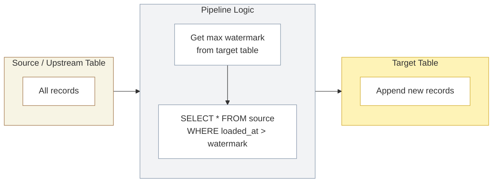
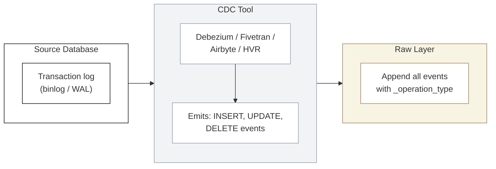
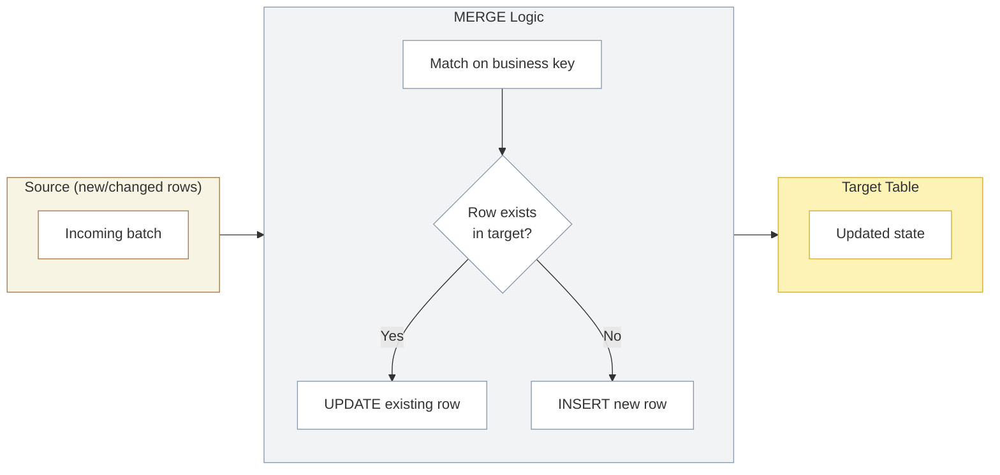
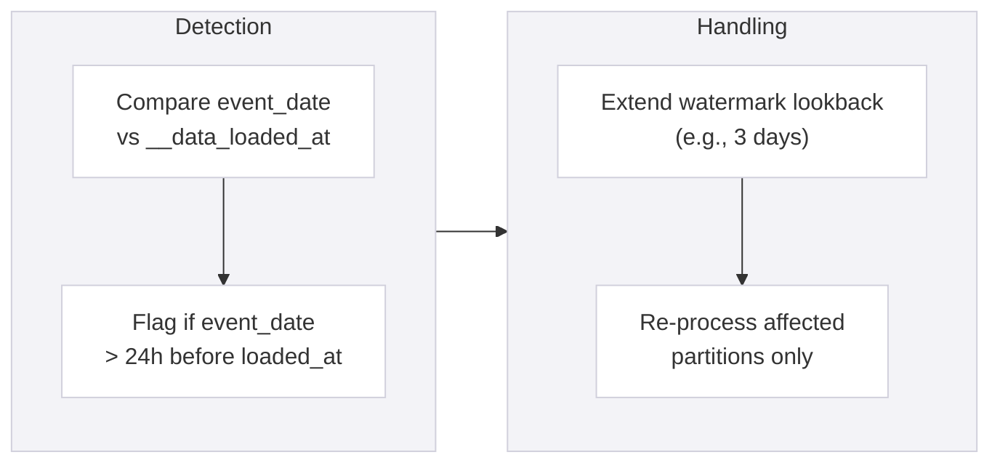

## Incremental Loading Patterns

<Callout type="info">
**Load only what changed.** Incremental loading processes new and modified records instead of reloading entire tables. This is essential for cost control and pipeline performance as data volumes grow.
</Callout>

### Why Incremental?

| Approach | 1M Rows | 10M Rows | 50M Rows | 100M Rows | 1B Rows |
|----------|---------|----------|----------|-----------|---------|
| **Full Refresh** | 2 min | 8 min | 25 min | 45 min | 6+ hours |
| **Incremental** | 2 min | 3 min | 4 min | 5 min | 10 min |
| **Cost Saving** | 0% | ~63% | ~84% | ~89% | ~97% |

Full refresh works at small scale but becomes untenable as data grows. Incremental loading keeps pipeline duration roughly proportional to change volume, not total volume.

#### When to Use Each

| Strategy | Use When |
|----------|----------|
| **Full Refresh** | Table < 10M rows, reference/lookup tables, schema or logic changes require backfill |
| **Incremental** | Table > 10M rows, source provides reliable change indicators, daily/hourly pipelines |

### Pattern 1: Watermark-Based Incremental

The simplest and most common pattern. Use a monotonically increasing column (timestamp or ID) to identify new records since the last run.

#### How It Works



#### Implementation

```sql
-- dbt incremental model (append pattern)
{{
  config(
    materialized='incremental',
    unique_key='record_id',
    incremental_strategy='append'
  )
}}

SELECT
  record_id,
  account_name,
  amount,
  __data_loaded_at
FROM {{ source('raw', 'accounts') }}


  WHERE __data_loaded_at > (SELECT MAX(__data_loaded_at) FROM {{ this }})

```

#### Best Suited For

| Layer Transition | Watermark Column | Notes |
|-----------------|-----------------|-------|
| **Raw → Stage** | `__data_loaded_at` | Most common use case; ingestion timestamp is reliable |
| **Stage → Core** | `__data_loaded_at` or `updated_at` | Use source `updated_at` if available and trustworthy |
| **Core → Mart** (facts) | `transaction_date` or `__data_loaded_at` | Append new time periods |

#### Limitations

- **Cannot detect updates** — if a source record is modified without changing the watermark column, the update is missed
- **Cannot detect deletes** — records removed from source are not captured
- **Requires reliable timestamp** — if the source system backdates records, they slip through

### Pattern 2: CDC-Based Incremental (Change Data Capture)

CDC captures every insert, update, and delete from the source database transaction log. This is the most complete change tracking method.

#### How It Works



#### CDC Event Types

| Operation | `_operation_type` | Action in Raw | Action in Stage/Core |
|-----------|-------------------|---------------|---------------------|
| **Insert** | `I` | Append row | Insert new record |
| **Update** | `U` | Append row (with new values) | Update existing record (or add SCD-2 version) |
| **Delete** | `D` | Append row (with `__is_deleted = TRUE`) | Soft delete (set `__is_deleted = TRUE`) |

#### Implementation

```sql
-- dbt incremental model consuming CDC events
{{
  config(
    materialized='incremental',
    unique_key='customer_id',
    incremental_strategy='merge'
  )
}}

WITH ranked_events AS (
  SELECT
    *,
    ROW_NUMBER() OVER (
      PARTITION BY customer_id
      ORDER BY __data_loaded_at DESC
    ) AS rn
  FROM {{ source('raw', 'cdc_customers') }}
  
    WHERE __data_loaded_at > (SELECT MAX(__data_loaded_at) FROM {{ this }})
  
)

SELECT
  customer_id,
  customer_name,
  email,
  region,
  _operation_type,
  CASE WHEN _operation_type = 'D' THEN TRUE ELSE FALSE END AS __is_deleted,
  __data_loaded_at
FROM ranked_events
WHERE rn = 1
```

#### CDC Tool Comparison

| Tool | Type | Strengths | Considerations |
|------|------|-----------|---------------|
| **Fivetran** | Managed SaaS | Zero config, 200+ connectors, automatic schema handling | Cost per row; less control over CDC format |
| **Airbyte** | Open-source / Cloud | Self-hosted option, growing connector library | Requires more operational overhead |
| **Debezium** | Open-source | Full control, Kafka-native, supports all major databases | Requires Kafka infrastructure and operational expertise |
| **HVR (Fivetran)** | Enterprise | High-volume, real-time, enterprise-grade | Enterprise pricing; complex setup |

### Pattern 3: Merge / Upsert

The merge pattern combines insert and update into a single atomic operation. This is the standard pattern for Stage → Core and Core → Mart transitions where records can be created or modified.

#### How It Works



#### Implementation

<PlatformTabs>

<PlatformTabsDatabricks>

```sql
-- Delta Lake MERGE (native)
MERGE INTO core.customer AS target
USING stage.stg_customer AS source
  ON target.customer_id = source.customer_id
WHEN MATCHED AND source.__is_deleted = TRUE THEN
  UPDATE SET
    target.__is_deleted = TRUE,
    target.__is_active_version = FALSE,
    target.__effective_to = source.__data_loaded_at
WHEN MATCHED THEN
  UPDATE SET
    target.customer_name = source.customer_name,
    target.email = source.email,
    target.region = source.region,
    target.__effective_from = source.__data_loaded_at
WHEN NOT MATCHED THEN
  INSERT (customer_id, customer_name, email, region, __effective_from, __is_active_version, __is_deleted)
  VALUES (source.customer_id, source.customer_name, source.email, source.region, source.__data_loaded_at, TRUE, FALSE);
```

**dbt incremental with merge strategy:**

```sql
{{
  config(
    materialized='incremental',
    unique_key='customer_id',
    incremental_strategy='merge',
    file_format='delta'
  )
}}
```

</PlatformTabsDatabricks>

<PlatformTabsSnowflake>

```sql
-- Snowflake MERGE
MERGE INTO core.customer AS target
USING stage.stg_customer AS source
  ON target.customer_id = source.customer_id
WHEN MATCHED AND source.__is_deleted = TRUE THEN
  UPDATE SET
    target.__is_deleted = TRUE,
    target.__is_active_version = FALSE,
    target.__effective_to = source.__data_loaded_at
WHEN MATCHED THEN
  UPDATE SET
    target.customer_name = source.customer_name,
    target.email = source.email,
    target.region = source.region,
    target.__effective_from = source.__data_loaded_at
WHEN NOT MATCHED THEN
  INSERT (customer_id, customer_name, email, region, __effective_from, __is_active_version, __is_deleted)
  VALUES (source.customer_id, source.customer_name, source.email, source.region, source.__data_loaded_at, TRUE, FALSE);
```

**dbt incremental with merge strategy:**

```sql
{{
  config(
    materialized='incremental',
    unique_key='customer_id',
    incremental_strategy='merge'
  )
}}
```

</PlatformTabsSnowflake>

<PlatformTabsFabric>

```sql
-- Fabric Lakehouse (Spark SQL MERGE)
MERGE INTO core.customer AS target
USING stage.stg_customer AS source
  ON target.customer_id = source.customer_id
WHEN MATCHED AND source.__is_deleted = TRUE THEN
  UPDATE SET
    target.__is_deleted = TRUE,
    target.__is_active_version = FALSE,
    target.__effective_to = source.__data_loaded_at
WHEN MATCHED THEN
  UPDATE SET
    target.customer_name = source.customer_name,
    target.email = source.email,
    target.region = source.region,
    target.__effective_from = source.__data_loaded_at
WHEN NOT MATCHED THEN
  INSERT (customer_id, customer_name, email, region, __effective_from, __is_active_version, __is_deleted)
  VALUES (source.customer_id, source.customer_name, source.email, source.region, source.__data_loaded_at, TRUE, FALSE);
```

**dbt incremental with merge strategy:**

```sql
{{
  config(
    materialized='incremental',
    unique_key='customer_id',
    incremental_strategy='merge',
    file_format='delta'
  )
}}
```

</PlatformTabsFabric>

</PlatformTabs>

### Pattern 4: SCD-2 Incremental (History Tracking)

SCD-2 preserves every version of a record with effective dating. Use this for dimensions where historical attribute values matter (e.g., a customer's region at the time of purchase).

#### How It Works

When a record changes:
1. Close the current version (`__effective_to = change_date`, `__is_active_version = FALSE`)
2. Insert a new version (`__effective_from = change_date`, `__is_active_version = TRUE`)

```sql
-- dbt snapshot (SCD-2)

{{
  config(
    target_schema='stage',
    unique_key='customer_id',
    strategy='timestamp',
    updated_at='updated_at',
    invalidate_hard_deletes=True
  )
}}

SELECT
  customer_id,
  customer_name,
  email,
  region,
  updated_at
FROM {{ source('raw', 'customers') }}


```

#### SCD-2 Output Structure

| customer_id | customer_name | region | __effective_from | __effective_to | __is_active_version |
|-------------|--------------|--------|-----------------|---------------|-------------------|
| C001 | Acme Corp | EMEA | 2025-01-15 | 2025-09-01 | FALSE |
| C001 | Acme Corp | APAC | 2025-09-01 | NULL | TRUE |

**Key columns** (consistent across all layers — see Stage and Core pages):

| Column | Type | Purpose |
|--------|------|---------|
| `__effective_from` | TIMESTAMP | When this version became active |
| `__effective_to` | TIMESTAMP | When this version was superseded (NULL = current) |
| `__is_active_version` | BOOLEAN | TRUE for the current version |

### Pattern Summary by Layer

| Transition | Primary Pattern | Fallback Pattern | Rationale |
|------------|----------------|-----------------|-----------|
| **Ingest → Raw** | Append-only | — | Raw is immutable; never update or delete |
| **Raw → Stage** | Watermark + SCD-2 | Full refresh (small tables) | Track changes while maintaining history |
| **Stage → Core** | Merge (upsert) | — | Build business entities from standardised data |
| **Core → Mart** | Incremental (facts) + SCD-2 (dims) | Full refresh (small dims) | Facts append; dimensions track attribute changes |
| **Mart → Product** | Full materialisation | — | Pre-compute all joins into flat tables |

### Handling Late-Arriving Data

Data sometimes arrives after the batch window has closed. This is common with mobile apps, IoT devices, and cross-timezone sources.

#### Strategy



**Practical approach:**

| Technique | Implementation | Trade-off |
|-----------|---------------|-----------|
| **Extended lookback** | `WHERE __data_loaded_at > watermark - INTERVAL '3 days'` | Reprocesses 3 days of data each run; simple but higher compute |
| **Partition-based reprocessing** | Identify affected date partitions and rebuild only those | More complex logic; lower compute cost |
| **Reconciliation job** | Separate weekly job compares source totals to warehouse totals | Catches all discrepancies; doesn't fix them automatically |

### Idempotency

Every incremental pipeline must be idempotent — running it twice with the same input produces the same output.

#### Rules

1. **Use `MERGE` instead of `INSERT`** — prevents duplicates on re-run
2. **Use deterministic unique keys** — business keys or composite keys, not auto-increment
3. **Include batch metadata** — `__batch_id` enables replay of specific batches
4. **Avoid side effects** — no external API calls or notifications inside transformation logic

<Callout type="warning">
**Test idempotency explicitly.** Run your pipeline twice in UAT with the same input data. If the row count doubles, your pipeline is not idempotent. This is the most common cause of data quality issues in production.
</Callout>

### Dos and Don'ts

<DosAndDonts
  dos={[
    { text: "Default to incremental for tables > 10M rows" },
    { text: "Use watermark columns that are monotonically increasing and not backdated" },
    { text: "Test idempotency by running pipelines twice in UAT" },
    { text: "Use MERGE for upsert patterns to prevent duplicates" },
    { text: "Add a lookback window to handle late-arriving data" },
    { text: "Monitor incremental model performance — if the merge key is not selective, performance degrades" }
  ]}
  donts={[
    { text: "Use full refresh as the default for large tables" },
    { text: "Trust source updated_at columns without validation — some systems don't update them reliably" },
    { text: "Use INSERT without deduplication in incremental models" },
    { text: "Forget to handle deletes — watermark-based incremental misses deletions by design" },
    { text: "Mix incremental strategies within the same model without clear documentation" },
    { text: "Skip the full refresh fallback — every incremental model needs a way to backfill" }
  ]}
/>

### Anti-Patterns

<AntiPatterns
  patterns={[
    {
      title: "The Phantom Duplicate",
      problem: "Incremental pipeline uses INSERT instead of MERGE. When a batch is retried (due to a transient failure), all records are duplicated. Row counts inflate silently.",
      example: "A client's order fact table showed 12% more revenue than the source system. Investigation revealed that 3 failed-and-retried pipeline runs had duplicated ~50,000 orders. Finance had been reporting inflated numbers for 6 weeks.",
      prevention: "Always use MERGE with a deterministic business key. Test idempotency by running the pipeline twice in UAT — row count must not change."
    },
    {
      title: "The Stale Watermark",
      problem: "Watermark column uses a source-system timestamp that is sometimes backdated or NULL. Records with NULL or old timestamps are never picked up by incremental logic.",
      example: "A CRM system allowed manual entry of 'created_date' — users occasionally entered dates months in the past. The incremental pipeline's watermark was based on created_date, so these records were never loaded. Data completeness dropped to 94% before anyone noticed.",
      prevention: "Use the ingestion timestamp (__data_loaded_at) as the primary watermark, not source timestamps. If you must use source timestamps, add a reconciliation job that periodically compares source and target row counts."
    },
    {
      title: "The Infinite Incremental",
      problem: "An incremental model has been running for 2 years without a full refresh. Schema changes, logic updates, and data corrections have accumulated. The table is a patchwork of different transformation versions.",
      example: "A Stage model was updated to apply a new currency conversion rule, but only new records used the new rule. Historical records retained the old conversion, creating a visible discontinuity in financial reports at the change date.",
      prevention: "After any logic change that affects historical data, trigger a full refresh (--full-refresh in dbt). Document this in the model's README. Schedule quarterly full refreshes as a hygiene practice."
    }
  ]}
/>
