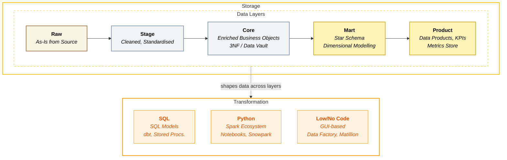

## Brief

### What is Data Transformation?

**Data Transformation** is the process of converting raw, messy data into clean, structured, and meaningful information that the business can actually use. It's where raw numbers and text from source systems get cleaned, combined, enriched, and shaped into tables that answer real business questions - like "What is our monthly revenue by region?" or "Which customers are at risk of churning?"

In simple terms: **transformation answers the question, "How do we turn raw data into useful insights?"**

### The Problem (The "Pain")
> What is the specific pain point or inefficiency we face today?
> (e.g., "Currently, every team builds this from scratch...")

As we scale to a team of \~700, \"individual preference\" is no longer a
sustainable strategy. Currently, the implementation of the
transformation layer is fragmented. The transformation part is the core
that translates raw data into insights to answer business questions
before the data reaches business intelligence tools. It's the
intersection where technologists and consultants meet to ensure our
business logic is correctly codified.

#### Language & Tooling divergence
-   One project uses pure SQL, another relies on PySpark, and a third
    leverages low-code GUIs. This decision is often driven by
    individuals' comfort rather than architectural fit, leading to silos
    that are hard to maintain.
-   Leading to silos and complete dependency on one technology/tool. This leads to indirect denial of 
    modern data solutions to clients.
-   The decision to choose the correct methodology must consider the
    language our global audience can understand, provide feedback to
    meet business requirements, and make necessary edits.

##### Data Flow & modelling debt
We tend to start development from day 1; data modelling must be a
collaborative "white board design" approach between technology and
commercial to answer business questions. We frequently skip the \"White
Board Design\" phase. Engineers often build tables to **satisfy tactical
requests (\"Add column X\") rather than understanding the
business question (\"Why?\").**
-   Uses medallion architecture strictly and naming databases/schemas as
    bronze, silver, gold
-   Using too many layers for short-term/single-use case projects -
    Complicating a simple data modelling use case with too many layers by
    just following the success model from previous projects.
-   Inconsistent data modelling methods - Dimensional modelling in the
    core layer
-   Inconsistent way of managing reference and mapping data

#### The Cost of Inefficiency Design
Without standards, teams often default to the easiest path - such as
running full data refreshes every day rather than designing efficient
incremental loads. While this works for small datasets, it causes cloud
compute costs to spiral out of control as data volumes grow.

#### Naming convention
When team members move between projects, they encounter entirely
different naming conventions (e.g., Staging vs. Prep, Core vs MDM),
which increases ramp-up time and error rates.

### The Solution (The Purpose)
> What are we building, and what does "good" look like?

This framework establishes the \"JMAN Way\" for data transformation. It
is not about restricting creativity; it is about eliminating low-value
decisions so engineers can focus on complex problems. We are
standardising:

-   **Programming language & tooling** - SQL first mindset, using the
    universal language of data for most of the transformation logic.
-   **SQL** is treated as the universal language of data, optimised for
    readability, maintainability, and business transparency. Non-SQL is
    used only when there is a clear technical justification.
-   **Data flow and collaborative modelling** - Mandating that data
    modelling is a joint exercise between Technology and Commercial
    teams to ensure business logic is correctly codified.
-   **Naming convention** - Speak the same language across projects, across
    the company
-   Data loading method from the **landing zone to the last layer**

### Impact on JMAN Delivery (The Value)
-   **Consistency:** The JMAN way across projects
-   **Long-term partnership:** Scalability, quality and JMAN reputation
-   **Efficiency:** Efficiently scaling our clients\' use cases helps our team reduce
    rework.

### Why Now? (The Risk)
> What happens if we do nothing or delay this?

By 2026, we will be \~700 people in business. More than 60% of the
people are new to the company, typically with 0 -2 years of experience.
The number of projects increases, and delivery quality will become an
increasing challenge. Our clients are also evolving. The only way we can
become a Data & Commercial Partner is by consistently delivering high-quality work.

The knowledge sits in individual minds; spreading it and codifying it is
non-negotiable. We will keep growing not just next year, but also
beyond. We must protect and find a way to give ourselves headspace to
keep focusing on expanding our capabilities and staying ahead.

### Open Questions (The Unknowns)
-   Should the data vault be the default for our data modelling for
    multi-site business?
-   How do we handle the metrics store?
-   Do we need to use any data modelling tools?

### Key Aspects

| Capability | Key Aspects |
|------------|-------------|
| **SQL-First Transformation** | • SQL dialect & standard support   • Query performance & optimisation   • Readability & maintainability   • Collaboration across teams   • IDE support, formatting, linting |
| **Non-SQL Processing** | • Python support & libraries   • Spark integration (PySpark, Scala)   • User-defined functions (UDFs)   • Notebook development   • Governance (when to use non-SQL) |
| **[Engineering Practices](/playbook/data-engineering/transformation/engineering-practices)** | • Performance optimisation (partitioning, clustering, materialisation)   • Incremental loading patterns (watermark, CDC, merge)   • Query optimisation & file management   • Cost-efficient pipeline design |
| **Dependency & Lineage Management** | • DAG definition (explicit dependencies)   • Column-level lineage   • Impact analysis   • Refactoring safety   • Auto-generated documentation |
| **Testing & Data Quality** | • Schema tests (not null, unique, accepted values)   • Relationship tests (referential integrity)   • Custom business rule validation   • Freshness checks   • CI/CD integration & alerting |
